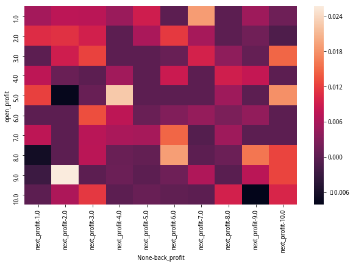
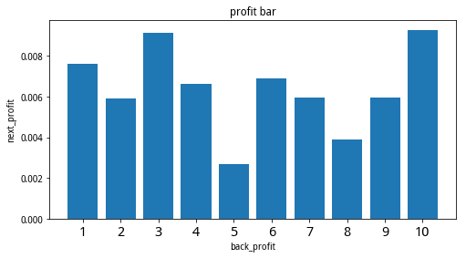

# 聚宽学习周记二二：详解@云帆的“高频因子探索——动量交易”（上）

本周将ETF投资参考日报发布到模拟交易，这样以后就能收到每个交易日之后的ETF还有指数的运行状态了，尽管模拟交易有一定的延时，今天凌晨3点才能拿到前天收盘时候的内容，但这对于ETF定投来说是没有问题的，它本身并不需要频繁的交易，所以是适用的。

上周制定的计划里面已经提到接下来会继续学习聚宽社区2019年的精选文章了。由于我在打算着怎么将当前的学习和之前已有的概念结合起来，所以选择了一篇与交易直接有关的文章，即@云帆的[高频因子探索——动量交易](https://www.joinquant.com/view/community/detail/22472)。这篇文章涉及到的代码量以及代码中所出现的一些知识点相对来说我都不熟悉，所以还是要预备分为多周进行学习。学习先不抢进度，只想一步一个脚印先把一些最基本的东西先搞清楚。当前的大致规划如下：（上篇）里完成大部分代码的阅读和解释；（下篇）里面对这篇文章里面的思路进行总结并尝试提出自己的看法。至于是否需要中篇，得视学习过程中是否衍生其他想法的情况再定。


## 一、代码解释

### 代码片段1：获取交易日列表

```
def get_tradeday_list(start, end, frequency=None, count=None):
    '''
    获取日期列表
    input:
    start:str or datetime,起始时间，与count二选一
    end:str or datetime，终止时间
    frequency:
        str: day,month,quarter,halfyear,默认为day
        int:间隔天数
    count:int,与start二选一，默认使用start
    '''
    if isinstance(frequency, int):
        all_trade_days = get_trade_days(start, end)
        trade_days = all_trade_days[::frequency]
        days = [datetime.datetime.strftime(i, '%Y-%m-%d') for i in trade_days]
        return days

    if count != None:
        df = get_price('000001.XSHG', end_date=end, count=count)
    else:
        df = get_price('000001.XSHG', start_date=start, end_date=end)
    if frequency == None or frequency == 'day':
        days = df.index
    else:
        df['year-month'] = [str(i)[0:7] for i in df.index]
        if frequency == 'month':
            days = df.drop_duplicates('year-month').index
        elif frequency == 'quarter':
            df['month'] = [str(i)[5:7] for i in df.index]
            df = df[(df['month'] == '01') | (df['month'] == '04') | (df['month'] == '07') | (df['month'] == '10')]
            days = df.drop_duplicates('year-month').index
        elif frequency == 'halfyear':
            df['month'] = [str(i)[5:7] for i in df.index]
            df = df[(df['month'] == '01') | (df['month'] == '06')]
            days = df.drop_duplicates('year-month').index
    trade_days = [datetime.datetime.strftime(i, '%Y-%m-%d') for i in days]
    return trade_days
```

这个函数的目的在于按照不同的频率获取日期列表，它同时支持按照数字的形式和按照单词的形式获取：一、按数字的形式，即按间隔x个交易日；二、按单词的形式，即按天、月、季度、半年。

注意这两种形式的异同，它们两者的相同之处都是基于交易日，而不是单纯的天数。但是，按数字的形式虽然看起来更灵活，但是没有办法按照自然月、季度、半年来获取制定日期，这也是两者需要同时存在的地方。

完全理解如上代码需要三个知识点：

**1）聚宽提供的服务函数`get_trade_days`的作用**

这个我在前面最开始的周记里面每次都讲解，这里不重复了。简单来说就是获取交易日列表，但它的粒度是以“单个交易日”为单位，不支持按周、月、季度等多样化的获取方式。

**2）Python时间服务函数库`datetime`的`strftime`方法的作用**

它是用来将一个时间对象转换成字符串的形式，调用方式很简单，只需要直接调用`time`, `date`或者`datetime`对象的方法即可，比如下面的示例：

```
date = dt.date(2008, 2, 8)
print(date) # 结果为：2008-02-08

fmt = '%Y%m%d'
print(date.strftime(fmt)) # 结果为：20080208
```

更多用法可以参考[strftime() and strptime() Behavior](https://docs.python.org/3/library/datetime.html#strftime-and-strptime-behavior)。

**3）Python数据处理函数库`pandas`里二维数据表DataFrame的基础知识**

- 首先需要知道索引(index)的概念。索引其实就类似我们excel里面第一列的那些序号，只不过在DataFrame里面这些索引可以有多种形式。这里使用索引是因为需要获得那些交易日的数据。
- 其次要知道DataFrame的条件选择表达式。条件表达式是用来选择复合要求的那些行的数据，比如`df[(df['month'] == '01')`这句就是以“列名为'month'”的那一列作为选择标准，然后选择出这一列里面“值为‘01’”的所有行。Series类型也支持这种表达式哟~
- 还有`drop_duplicates()`。用来删除重复的记录，这里主要是为了按自然月以上的频度挑选时间时使用，因为要先构建出辅组列，在基于其上进行过滤。


### 代码片段2：获取指定交易日前一个交易日最后一段时间的动量收益

```
def get_profit_minutes_period(stocks,date,n=5,next_n=120):
    '''
    计算date前一天最后一段时间的动量收益
    注意：获取的数据是输入时间前一天的数据
    input:

    stocks:输入股票列表
    date:时间，数据为前一天
    n:开盘收益计算时间长度
    next_n:开盘后收益计算长度

    '''
    price = get_price(stocks,end_date=date,frequency='1m',count=n+next_n,fields=['close'])['close']
    l = len(price.shape)

    if l > 1:
        profit_open = price.pct_change(n-1)
        profit_open = profit_open.iloc[n-1]
        profit_next = price.pct_change(next_n)
        profit_next = profit_next.iloc[-1]
        profit = pd.concat([profit_open,profit_next],axis=1)
        profit.columns = ['open_profit','next_profit']
    else:
        profit_open = price.pct_change(n)
        profit_open = profit_open.iloc[n]
        profit_open = pd.DataFrame([profit_open],index=[stocks])
        profit_next = price.pct_change(next_n - 1)
        profit_next = profit_next.iloc[-1]
        profit_next = pd.DataFrame([profit_next],index=[stocks])
        profit = pd.concat([profit_open,profit_next],axis=1)
        profit.columns = ['open_profit','next_profit']
    return profit
```

动量这个词其实在第十四周和第十五周分析@东南有大树的那篇[用指数战胜指数，ETF二八轮动对冲模型](https://www.joinquant.com/view/community/detail/19490)就了解过了。“动量”是物理学里面的专有名词，我们这里的动量借用来指股价维持趋势的可能性，通过计算股价的涨幅来判断。

之前我们学习到的动量的计算方法是通过`(a - b) / b`这种形式，但今天看了这段代码算是涨知识了，原来pandas里面直接有函数来完成动量的计算：`pct_change()`。这个函数是用来计算行与行之间的数值变动，以百分比表示，默认计算相对于前一行的变化情况。比如：

```
             A   B   C   D
2000-01-02  14   5  20  14
2000-01-09   4   2  20   3
2000-01-16   5  54   7   6
2000-01-23   4   3  21   2
2000-01-30   1   2   8   6
2000-02-06  55  32   5   4

                    A          B         C         D
2000-01-02        NaN        NaN       NaN       NaN
2000-01-09  -0.714286  -0.600000  0.000000 -0.785714
2000-01-16   0.250000  26.000000 -0.650000  1.000000
2000-01-23  -0.200000  -0.944444  2.000000 -0.666667
2000-01-30  -0.750000  -0.333333 -0.619048  2.000000
2000-02-06  54.000000  15.000000 -0.375000 -0.333333
```

代码里面传入的其他数值n/next_n，计算的是每一行数据相对于前面n/next_n行的涨幅。这个函数可以这么解释：

- 首先，获取指定日期前一个交易日最后 n + next_n 分钟的交易数据
- 其次，计算这段交易数据里面前第n分钟相对于第1分钟的涨幅
- 最后，计算这段交易数据里面最后1分钟相对于前next_n分钟的涨幅

代码里面的`l > 1`主要是用来判断当前是否获取的是单只股票还是多只股票，处理上小有差异：计算的单只股票的交易数据是Series类型，需要先基于它创建DataFrame类型，然后才能够使用`concat`进行DataFrame合并。


### 代码片段3：获取指定交易日前一个交易日开盘时的动量收益

```
def get_open_profit_minutes_period(stocks,date,n=5,next_n=120):
    '''
    计算date前一天开盘的动量收益
    注意：获取的数据是输入时间前一天的数据
    input:

    stocks:输入股票列表
    date:时间，数据为前一天
    n:开盘收益计算时间长度
    next_n:开盘后收益计算长度

    '''
    price = get_price(stocks,end_date=date,frequency='1m',count=240,fields=['close'])['close']
    l = len(price.shape)

    if l > 1:
        profit_open = price.pct_change(n)
        profit_open = profit_open.iloc[n]
        profit_next = price.pct_change(next_n)
        profit_next = profit_next.iloc[n+next_n+1]
        profit = pd.concat([profit_open,profit_next],axis=1)
        profit.columns = ['open_profit','next_profit']
    else:
        profit_open = price.pct_change(n)
        profit_open = profit_open.iloc[n]
        profit_next = price.pct_change(next_n)
        profit_next = profit_next.iloc[n+next_n+1]
        profit_open = pd.DataFrame([profit_open],index=[stocks])
        profit_next = pd.DataFrame([profit_next],index=[stocks])
        profit = pd.concat([profit_open,profit_next],axis=1)
        profit.columns = ['open_profit','next_profit']
    return profit
```

在我们详细地理解了前面那个函数之后，这个函数理解起来就简单多了，可以解释如下：

- 首先，获取前一个交易日整天的以分钟为单位的交易数据（240分钟=4小时）
- 其次，计算这段交易数据里面前第n分钟相对于第1分钟的涨幅
- 最后，计算这段交易数据里面最后1分钟相对于前next_n分钟的涨幅

所以正如函数的注释而言，函数`get_profit_minutes_period()`衡量的是前一个交易日收盘那段时间的动量，而函数`get_open_profit_minutes_period()`衡量的是前一个交易日开盘那段时间的动量。


### 代码片段4：按天为单位计算动量

```
def get_day_profit_backward(stocks,end_date,start_date=None,count=3):
    '''
    向前计算收益率，得到的收益率是输入时间end_date向前计算，不包括当天
    input：
    stocks:list or Series,股票代码

    start_date:开始时间
    end_date：结束时间
    count:与start_date二选一，向前取值个数
    pre_num:int,向后计算的天数
    output:
    profit:dataframe,index为日期，columns为股票代码，values为收益率
    '''
    if count == -1:
        price = get_price(stocks,start_date,end_date,fields=['close'])['close']
    else:
        price = get_price(stocks,end_date=end_date,count=count+1,fields=['close'])['close']
    profit = price.pct_change(count-1)
    profit = profit.iloc[-2]
    if isinstance(profit,pd.Series):
        profit = profit.to_frame()
    else:
        profit = pd.DataFrame([profit],index=[stocks])

    profit.columns = ['back_profit']
    return profit
```

前面的函数`get_profit_minutes_period()`和`get_open_profit_minutes_period()`都是计算指定交易日内分钟级别的动量数据，而函数`get_day_profit_backward()`计算的是某个交易日的前一个交易日相对于前几个交易日的动量数据。但是方法都是一样的，都是使用`pct_change`来完成。


### 代码片段5：获取沪深300指数成分股的动量数据

```
def get_open_and_backward_profit(stocks,date_list,n=5,next_n=60,count=3):
    '''
    注意：时间对齐
    '''
    l = len(date_list)

    dic = {}
    for d in range(l - 1):
        date = date_list[d+1]
        open_profit = get_profit_minutes_period(stocks,date,n,next_n)
        date = date_list[d]
        backward_profit = get_day_profit_backward(stocks,date,count)
        profit = pd.merge(open_profit,backward_profit,left_index=True,right_index=True,how='inner')
        dic[date] = profit
    return dic


start_date = '2017-01-01'
end_date = '2019-09-05'
date_list = get_tradeday_list(start=start_date,end=end_date)

dic_res_5_60_3_hs300 = get_open_and_backward_profit(stocks,date_list,n=5,next_n=120,count=3)

with open('movement_5_120_3_afternoon.pkl','wb') as pk_file:
    pickle.dump(dic_res_5_60_3_hs300,pk_file)
with open('movement_5_120_3_afternoon.pkl','rb') as pk_file:
    dic_res = pickle.load(pk_file)    
```

以上这些代码是对前面讲解的获取指定交易日前一个交易日最后分钟级别的动量函数`get_profit_minutes_period`和获取指定交易日相对于前几个交易日的动量函数`get_day_profit_backward`的应用，获取的是沪深300指数所有成分股在指定多个日期的动量数据。包括：

- 调用`get_profit_minutes_period()`传入的n=5, next_n=120，主要获取到的是交易日下午的交易数据，然后计算下午开盘时相对于前5分钟的涨幅（动量`open_profit`），和下午收盘时的相对于上午收盘时的涨幅（动量`next_profit`）。
- 调用`get_day_profit_backward()`出入count=3，获取到的是指定日期相对于前3天的涨幅（动量`back_profit`）。

之后将这三种数据是按照字典形式组织起来的，其中的“键”为日期，“值”为所有300只沪深300指数成分股的三种动量数据，并将其保存到文件中。


### 代码片段6：获取测试数据

```
def combine_data(dic_res,sel_percent):
    '''
    字典数据按时间轴合并
    '''

    keys = list(dic_res.keys())
    data_list = []
    for key in keys:
        data = dic_res[key]
        data_list.append(data)
    all_data = pd.concat(data_list)
    test_data = all_data.dropna()
    new_col = ['back_profit','open_profit','next_profit']
    all_data = all_data[new_col]
    all_data.index = np.arange(len(all_data))
    #删除开盘停牌股票
    sel_data = all_data[all_data['open_profit'] == 0].index
    all_data = all_data.drop(sel_data,axis=0)
    length = len(all_data)

    '''
    #获取训练数据和测试数据
    cut_point = int(train_percent * length)
    print(cut_point)
    train_data = all_data[:cut_point]
    test_data = all_data[cut_point:]
    '''
    #剪切中间部分
    start_point = int(sel_percent[0] * length)
    end_point = int(sel_percent[1] * length)
    sel_data = all_data[start_point:end_point]
    return sel_data

def cut_data(data,n):
    '''
    将数据分层，基于分位数,最后一列作为收益不进行分层
    input:
    data:dataframe or series, 输入数据
    n: 分层数
    '''
    f = 1 / n
    l = []
    for i in range(n):
        l.append(f*(i+1))
    q = data.quantile(l)
    qv = q.values
    shape = qv.shape
    col = data.columns
    for i in range(shape[1] - 1): #最后一层收益不分层
        for j in range(shape[0]):
            data[col[i]][data[col[i]] <= qv[j][i]] = j + 1
    return data.dropna()

train_percent = 0.5
sel_percent = [0.8,0.98]
```

之前我们已经获取到了一段日期内沪深300指数所有成分股的动量数据，但是这些数据并不是全部要被使用到，在这里会按照条件筛选出其中的一小部分内容，这就是函数`combine_data()`完成的内容。它做的工作依次为：

- 之前的数据是按照日期为“键”，动量数据为“值”组成的动量数据，这里第一步就是将它打散，不再考虑日期，直接将所有的动量数据组合在一起。
- 组合在一起的是依然是DataFrame类型的二维数据表，行数为“交易日数量 * 300”，列数依然保持动量数据的3列（'back_profit','open_profit','next_profit'）不变。然后将‘open_profit’列中为“0”的行删除。
- 之后使用切片选择这堆数据里面排列在80%~98%的那些行，作为下一步要处理的数据。

另一个函数`cut_data()`用来对动量数据进行处理，这里如果要明白这个函数的深意我们必须要先再次复习一下获取的那3列动量数据的含义：

- 'back_profit'：指定交易日的“前一个交易日”相对于“前第三个交易日”的动量。
- 'open_profit'：指定交易日下午开盘时相对于前5分钟的动量。
- 'next_profit'：指定交易日下午收盘时相对于前2小时的动量。

之所以要这么安排是因为这篇文章的主题是研究“前面几个交易日对当前交易日的影响”，用来观察是否前面几天连续上涨，那么今天也依然上涨的结论。明白了这个意图之后，我们就能够更加清晰地知道在`cut_data()`这个函数里面的处理工作：

- 保持'next_profit'这列的数据不变，因为它是用来作为“当前交易日的收益基准”的，也就是用来判断动量是否对它有影响。
- 对'back_profit'和'open_profit'两列，分别进行百分位取值。相当于把之前这两列数据的绝对值替换为对应数值在对应列的百分位。

整个上面两个函数对于数据的处理过程这里用获取的3个交易日的数据进行演示，比如我获取了3个交易日所有沪深300成分股的动量数据，此时我们拥有3*300 = 900条数据，每天数据包含3列，每列的含义在前面已经提到了，这里不重复：

```
     back_profit  open_profit  next_profit
0      -0.007840     0.000707     0.003531
1      -0.028249     0.002318    -0.001928
2      -0.032897     0.001713     0.004104
3      -0.015896     0.001435    -0.004298
......
896    -0.007068    -0.000839     0.008150
897    -0.004240     0.003671    -0.001219
898     0.094193     0.002292     0.026742
899     0.033426     0.000000     0.002710

[900 rows x 3 columns]
```

将这些数据‘open_profit’列中数值为“0”的行删出之后，我们还剩下699行：

```
     back_profit  open_profit  next_profit
0      -0.007840     0.000707     0.003531
1      -0.028249     0.002318    -0.001928
2      -0.032897     0.001713     0.004104
3      -0.015896     0.001435    -0.004298
......
895     0.050638     0.000769    -0.003075
896    -0.007068    -0.000839     0.008150
897    -0.004240     0.003671    -0.001219
898     0.094193     0.002292     0.026742

[699 rows x 3 columns]
```

再从其中选择处于80% ~ 98%的那部分数据，共有699 x 18% = 126行。先别问我为啥选择其中80% ~ 98%的数据哈，因为我也不知道呀，作者这么做的，我们先假设其中必有深意:)

```
     back_profit  open_profit  next_profit
714    -0.000833    -0.001561     0.009378
716     0.003175     0.001585     0.007911
718     0.015491     0.001672     0.003339
719     0.024390     0.001698     0.013559
......
876     0.064315    -0.001931    -0.005803
877    -0.024590     0.002786    -0.002778
878     0.025641     0.004367    -0.002899
879     0.047930     0.002008     0.006012

[126 rows x 3 columns]
```

选择好数据之后下一步就是进行处理，就像一今天提到的最后一列“next_profit”保持不动，因为用它来表示当前交易日的业绩基准，将其他两列分别替换为在各自列所处的百分位。如果对于“百分位”还确认下理解，我在[《聚宽学习周记二十：指数基金定投实践的估值调整》](https://www.joinquant.com/view/community/detail/033d0930c64633db7d266dc0c32eff63)有稍微详细的介绍。

```
     back_profit  open_profit  next_profit
714          3.0          2.0     0.009378
716          4.0          7.0     0.007911
718          5.0          7.0     0.003339
719          6.0          7.0     0.013559
......
876         10.0          2.0    -0.005803
877          1.0          9.0    -0.002778
878          6.0         10.0    -0.002899
879          9.0          8.0     0.006012

[126 rows x 3 columns]
```

好了，到了这里就需要下一步进行可视化（也就是画图）来用肉眼看看有没有规律了。*注：原文研究中的`calculate_IC()`没有见到使用的地方，所以这里就没有解释它。*


### 代码片段7：数据可视化

```
def draw_heatmap(data):
    '''
    输入的数据必须是三列，最后一列计算均值，前两列分组
    '''
    col = data.columns

    #group_res = data.groupby([col[0],col[1]]).count()
    group_res = data.groupby([col[0],col[1]]).mean()
    group_res = group_res.unstack(0).fillna(0)
    plt.figure(figsize=(10,6))
    ax = sns.heatmap(group_res)
    plt.show()

def draw_bar(data):
    '''
    输入data: 两列，第一列为factor值，第二列为收益值
    '''
    col = data.columns
    group_data = data.groupby(col[0]).mean()
    y_data = group_data[col[1]].values
    index = np.arange(1,len(group_data)+1)
    plt.figure(figsize=(8,4))
    plt.bar(index,y_data)
    plt.title('profit bar')
    plt.xlabel(col[0])
    plt.ylabel(col[1])
    plt.xticks(index,fontsize=15)
    return group_data

    sel_data = combine_data(dic_res,sel_percent)
    cut_res = cut_data(sel_data,cut_layer)

    draw_heatmap(cut_res)

    d = cut_res[['open_profit','next_profit']]
    draw_bar(d)
    back_next = cut_res[['back_profit','next_profit']]
    t = draw_bar(back_next)
```

这两个画图函数一个是画热力图，另一个是画条形图。两者之间的差别是热力图可以用来体现三维数据之间的关系，条形图只能够表示二维数据之间的关系。

热力图这里有一些比较特别的处理过程，如果对DataFrame数据类型比较熟悉的同学可能觉得简单，否则估计觉得有点难理解。比如我们要对下面这些数据画热力图：

```
     back_profit  open_profit  next_profit
714          3.0          2.0     0.009378
716          4.0          7.0     0.007911
718          5.0          7.0     0.003339
719          6.0          7.0     0.013559
......
876         10.0          2.0    -0.005803
877          1.0          9.0    -0.002778
878          6.0         10.0    -0.002899
879          9.0          8.0     0.006012

[126 rows x 3 columns]
```

那么需要先解决两个问题：

- 其一，我们需要将这三列动量数据形成一个新的DataFrame，这个新的DataFrame数据的index为“back_profit列的值”，column为“open_profit的值”，而value则为“next_profit”。这个过程有点类似[聚宽学习第二周周记：获取多只股票市盈率](https://www.joinquant.com/view/community/detail/3cc22ef4218363686917d718ba90f4f8)提到的数据透视。
- 其二，由于新的DataFrame的index和column都必须保证唯一，但是在前面两列的数据可能是重复的，所以要先解决重复的问题。

上面代码里面的分组操作（`groupby`），以及之后的去堆叠操作（`unstack`）就是为了解决上面两个问题的。之后得到的新的DataFrame数据就可以直接绘制热力图了，如下：



我们看这副热力图其实就是看是否存在随着x轴或者y轴而具有色彩上趋势性的变化，x轴代表的是过去几个交易日的动量，y轴代表的是当前交易日下午开盘时的动量。我这里取的数据少，没有发现明显的规律。原文里面提到有明显的动量现象可能与选择的数据量有关系。当然这里的研究关系存在着不少的变量，比如选取数据量的多少，动量计算时选取的时间长度，这些都是可以进一步优化的地方。

而后面的条形是评估“open_profit vs next_profit”, “back_profit vs next_profit” ，也就是看当前交易日下午开盘价与最终的涨跌、前几天的动量与当前交易日的涨跌关系，确实也看不出来明显的关系。




以上这些就是这周对@云帆的[高频因子探索——动量交易](https://www.joinquant.com/view/community/detail/22472)的理解，还没有理解完，下周会继续。在整个阅读理解的过程中我也第一次接触了热力图，同时有些函数（比如`pct_change()`）都是第一次使用，对于我来说还是有不少收获。


## 下周计划

1. 继续学习@云帆的[高频因子探索——动量交易](https://www.joinquant.com/view/community/detail/22472)。

2. 基于本周学习到的新的动量计算算法，以及前面两周研究指数上面的一些理解，尝试着写作基于ETF的交易策略。
