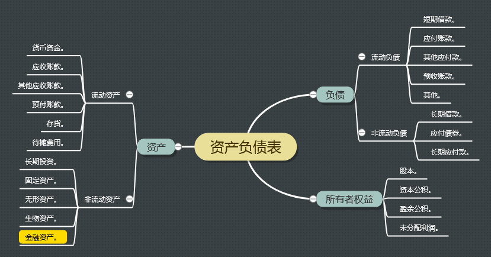
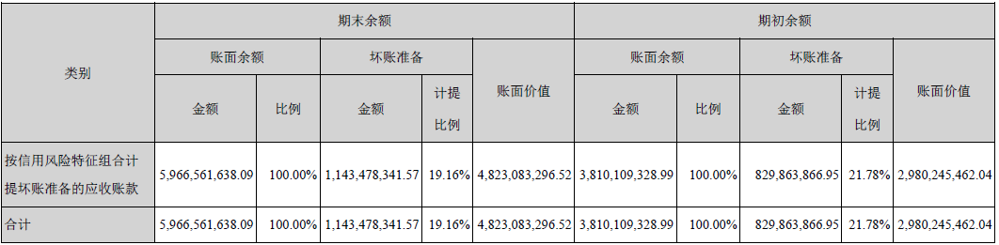

# 一、资产负债表项目

- 资产部分
  - 1-货币资金
  - 2-应收账款
  - 3-其他应收账款
  - 4-预付账款
  - 5-存货
  - 6-待摊费用
  - 7-长期投资
  - 8-固定资产
  - 9-无形资产
  - 10-生物资产
  - 11-金融资产
- 负债部分
  - 1-短期借款
  - 2-应付账款（Accounts Payable）
  - 3-其他应付款（Other Payables）
  - 4-预收账款（Deposit Received）
  - 5-其他
  - 6-长期借款
  - 7-应付债券（Bond Payable）
  - 8-长期应付款（Long-term Payable）
- 所有者权益部分
  - 1-股本（Capital Stock）
  - 2-资本公积（Additional Paid-in Capital）
  - 3-盈余公积（Surplus Zeserve）
  - 4-未分配利润（Retained Earnings）

# 二、脑图

# 三、补充

## 坏账准备的一个误解

最近几天分析分众传媒的年报，其中以为2018年年报里面如下的这幅图代表了当年计提了11.43亿的
坏账准备：

由于经验不足自己并没有感知到11.43亿有什么异常的地方，但躺在床上的时候想到其中有个步骤说
不过去，因为每年的年报里面都有这样的数据，如果今年计提了明年对于今年计提的这部分该如何处
理？是重复再提一次还是怎么做？没想明白。

犹记得之前阅读唐朝和星空有关分众传媒的分析的时候有提到过坏账准备的分析，所以开始去看他们
文章里面的细节。唐朝在《梳理分众传媒（中）》提到“2014~2017年计提的坏账准备分别为2.5亿，
1.7亿，2.4亿，2.5亿”，这与自己当前的想法相差太多了，于是鼓起勇气去公众号上留言，没想到
很快他就回复了，提到我使用的数据是“历年累计的年终余额”，看了一下我的数据确实是逐年以数亿
递增的，确实我的理解有问题。

那么下一个问题来了，唐朝是如何计算当年的坏账计提的？再次阅读年报发现在财报附注的“应收票
据及应收账款”一节是写明了本期计提的坏账准备是多少的。

- [应收账款及坏账准备](http://thxiaobai.com/article/dc76cffa01dbed63)

## 资产负债表分析方法

**唐朝的方法**

- 1.先看钱的来源，再看钱的去处：
  - 1.1 看负债和所有者权益合计，知道公司有多少资产
  - 1.2 看所有者权益合计，知道公司多少钱是自己的，多少钱是借来的
- 2.针对负债，弄明白为何借？向谁借？多久？利息几何？
  - 2.1 理清企业借款的原因及迫切程度
  - 2.2 如果企业借款代价比较高，通常是一种危险信号，尤其货币资金较多的情况仍以较高利率借款
  - 2.3 摸清债务明细后，可以用“有息负债 / 总资产”来计算企业的有息负债率，并且和同行业其他企
  业比较，一般不超过总资产的60%
- 3.弄明白钱的来源后，可以看钱的去处，主要看原来的钱分布有何变化
  - 3.1 主要从结构、历史和同行看四个要点：生产资产/总资产，应收/总资产，货币资金/有息负债，非主业资产/总资产
  - 3.2 结构分析：轻资产公司优于重资产公司
    - 3.2.1 衡量指标 = 生产资产 / 总资产
    - 3.2.2 生产资产包括固定资产、在建工程、工程物资以及无形资产里的土地
    - 3.2.3 指标较大定义为“重资产公司”，较小定义为“轻资产公司”。轻重的标准可用“利润总额/生产
    资产”，如果得出的比率显著高于社会平均资本回报率（按银行贷款标准利率的两倍毛估）则属
    于轻公司。
    - 3.2.4 重资产公司通常需要不断投入资金进行维护、更新或升级，并产生大量折旧。这在以通货膨胀
    为常态的时代，不是股东的好消息
  - 3.3 历史分析：通过财报看透行业
    - 3.3.1 看公司自身生产资产/总资产比例如何变化，然后查找是哪些资产加大，哪些减轻
    - 3.3.2 和行业其他公司对比，思考各个企业所采取的战略相同还是不同，为什么
    - 3.3.3 财报是分析公司的起点，投资者应该深刻认识行业和企业的特性，再结合财报数据，才能做出
    正确的决定。而认识行业和企业，阅读财报是必经之路。大量阅读行业内重要企业的财报，是取
    得投资比较优势的重要途经。
  - 3.4 财务稳健、业务专注的企业值得信赖
    - 3.4.1 看应收/总资产，货币资金/有息负债，非主业资产/总资产的比例
    - 3.4.2 应收款可以使用所有应收款 - 应收票据，占比不超过行业中位数较好
    - 3.4.3 货币资金/有息负债，看公司是否有债务危机，主要和历史比较
    - 3.4.4 非主业资产/总资产，看一个公司是否将注意力放在自己擅长的领域

*投资建议*

一般来说，老唐不建议投资者选择重资产企业。也许少数两三家寡头垄断的重资产行业存在一些值得
投资的公司，那些市场份额分散的重资产行业，几乎不太可能有矿可挖。如果要投重资产公司，只能
在行业高增长的时间进去，在市场饱和前出来。所以：

- 投资者可以将注意力放在那些不需要持续更新资产的企业上。因为不需要投入太多资金更新资产，
企业才有条件让股东分享更多的企业利润。
- 若能确认显而易见的便宜，或处于行业高增长初期，重资产公司一样可以成为优质的投资目标。

## 股东的剩余求偿权

会计恒等式的两种变形：

- 第一种：负债 = 资产 - 股东权益
- 第二种：股东权益 = 资产 - 负债

只有第二种是成立的，它表示企业在偿还了所有债务之后剩下的东西都是股东的，而不是把资产分给
股东之后剩下的是债权人的。

企业偿还了银行的贷款、给供应商付了款、给员工发了工资、给税务局交了税之后，剩下的东西都是
股东的，这叫做股东的“剩余求偿权”。这意味着股东是这家企业的风险和收益的最终承担着。

## 负债和所有者权益的区别

- 各自代表的权益不同

负债代表着“债权人享受收回本金和按约定收回利息的权益”，但没有参与经营的权利，也没有参与企
业收益分配的权利。所有者既具有参与企业管理的权利，也具有参与收益分配的权利。

- 计量上的不同

负债可以直接计量，常由既定数额或既定计量模式确定，主观性小、争论少。所有者权益除了最初投
资外一般不能直接计量，需要通过资产和负债的计量来间接计量。

## 资产、费用以及待摊费用的区别？

资产和费用有一个共同之处就是都得花钱，如果花钱换来的是有用的东西就是资产，花了就没有就是
费用。但有些时候资产和费用的不同体现的时间上，比如固定资产是一项资产，但它由于在使用过程
中会磨损因此需要进行折旧，而折旧就是一种费用（长期待摊、无形资产都有类似的情况），所以今
天的资产也可能是明天的费用。

有些资产随着企业的正常经营会最终变成一笔费用就叫作“待摊费用”，比如预付的房租、广告费用、
办公用品，甚至企业的开办费。

## 市净率的缺陷

公司的资产数值里充满了估计和假设，甚至有些假设与事实相差甚远，如资产折旧或者商誉价值，可
以说净资产是个不太靠得住的会计数字。明白了这一点，可以让我们改变以净资产衡量企业价值的思
维模式，比如说市净率。—— 《手把手教你读财报》P74

## 股东权益

股东是不能够随意撤资的，所以对公司来说，股东权益可以说是一个永远都不需要偿还的项目。一个
公司必须给银行还了债、给供应商付了款、给员工发了工资、给税务局交了税之后，才能把剩下来的
东西分给股东，这叫作股东的“剩余求偿权”。这也意味着股东才是这家公司风险和收益的最终承担者。

盈余公积是法律不让我们分配的利润，而未分配利润是企业自己不想分的利润。

# 参考

- 肖星，《一本书读懂财报》，浙江大学出版社。
- [待摊费用](https://wiki.mbalib.com/wiki/%E5%BE%85%E6%91%8A%E8%B4%B9%E7%94%A8)
- [彻底理解“资本性支出”](https://zhuanlan.zhihu.com/p/24462170)
