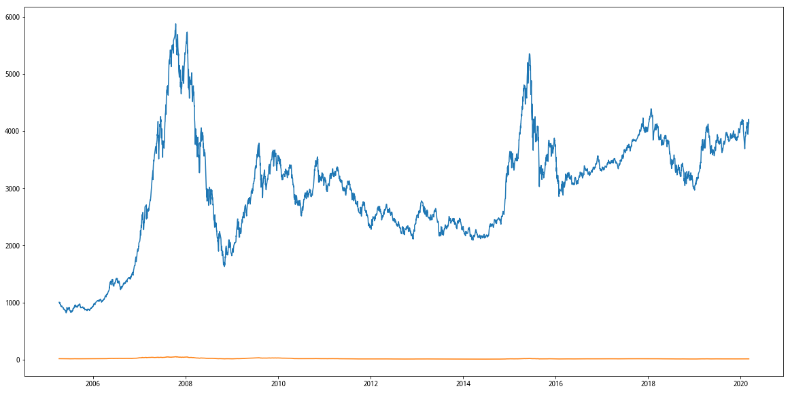
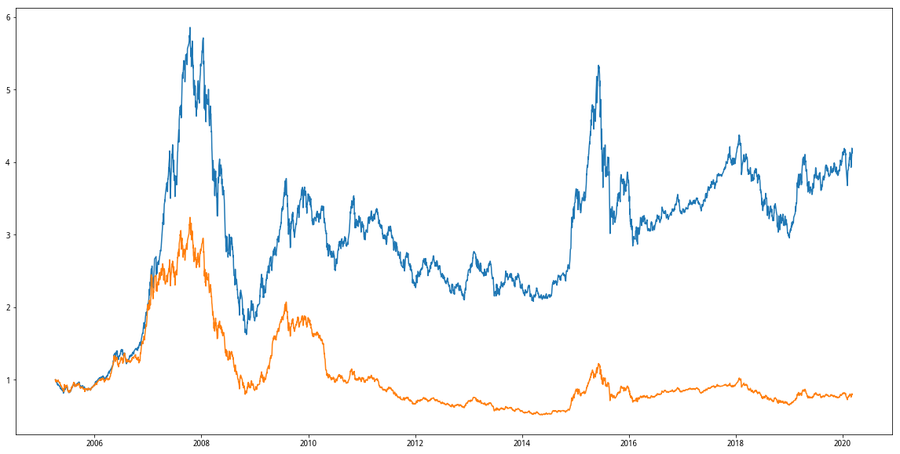
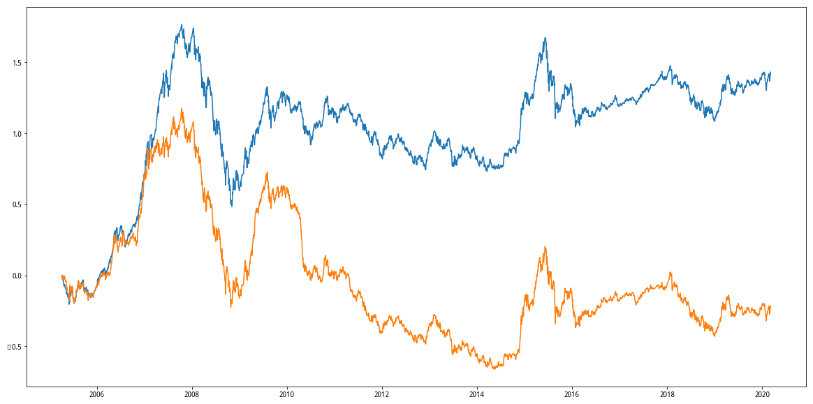

# 聚宽学习周记十：详解@Gyro的“价值低波（中）-- 市盈率研究”

## 一、代码解释

这是[聚宽2019年度评选+精选文章合集](https://www.joinquant.com/view/community/detail/5fea4e17fa8ad5eb32b85201375e2669?type=1)的第一篇，选择的是 @Gyro 编写的[价值低波（中）-- 市盈率研究](https://www.joinquant.com/view/community/detail/328831058b45f5f1080914aaea6e0d09)。

其实@Gyro在这篇文章里面已经将代码拆散再讲解了，但是我这里由于学习需要要先将它合拢再重新拆解开学习。

```
import numpy as np
import pandas as pd
import datetime as dt
import matplotlib

# 取得2005-4-8 ~ 2019-3-30 之间的所有的交易日
index = '000300.XSHG'
start_date = dt.date(2005, 4, 8)
end_date = dt.date(2019, 3, 30)
p = get_price(index, start_date, end_date, 'daily', ['close'])

# 建立市场估值
mp = pd.Series([],[])
for d in p.index:
    # 取得股票池
    stocks = get_index_stocks(index, date=d)

    # 基本面过滤
    df = get_fundamentals(query(
        valuation.code,
        valuation.market_cap,
        (valuation.market_cap/valuation.pe_ratio).label('value'),        
    ).filter(
        valuation.code.in_(list(stocks)),
    ), date=d).dropna()
    market_value = df.market_cap.sum()/df.value.sum()
    mp[d]= market_value

# 把估值数据加入表格
p['pv_ratio'] = mp

# 归一化
p['n_price'] = p.close/p.close[0]
p['n_pv_ratio'] = p.pv_ratio/p.pv_ratio[0]

# 对数化
p['ln_price'] = np.log(p.n_price)
p['ln_pv_ratio'] = np.log(p.n_pv_ratio)

from jqdata import finance
q = query(finance.STK_EXCHANGE_TRADE_INFO.exchange_name, \
        finance.STK_EXCHANGE_TRADE_INFO.pe_average,\
        finance.STK_EXCHANGE_TRADE_INFO.date)\
        .filter(finance.STK_EXCHANGE_TRADE_INFO.date=='2019-04-12')

f = finance.run_query(q)
```


**代码片段一：**

```
import numpy as np
import pandas as pd
import datetime as dt
import matplotlib
```

最前面的这几行是Python里面的`import`语句，如果你要使用某些非内建的变量或者函数，那么需要使用该语句将对应的模块导入进来。也就是说，导入/import模块是使用该模块里面变量或者函数的前提。这里面导入的四个模块为:

- numpy: Numberical Python的简称，是Python科学计算的基础模块，提供快速的数组处理能力。代码中会使用到`log()`数学处理函数。
- pandas：基于numpy之上构建，除了具有NumPy高性能的数组计算功能，还具有便捷地处理结构化数据如电子表格、关系型数据库数据的功能。代码里面要使用pandas里面的`Series`类型的数据。
- datetime：Python用来处理日期和时间的专用模块。代码里面需要使用其中的时间序列类型。
- matplotlib：专门用于绘制数据图表的Python库。支持绘图。

这里的`import`和`import...as...`的区别在于后者为导入的模块取了一个更加简易的名字，方便在后面代码中使用。


**代码片段二：**

```
# 取得2005-4-8 ~ 2019-3-30 之间的所有的交易日
index = '000300.XSHG'
start_date = dt.date(2005, 4, 8)
end_date = dt.date(2019, 3, 30)
p = get_price(index, start_date, end_date, 'daily', ['close'])
```

这段代码是调用聚宽提供的服务函数`get_price()`获取沪深300指数在2005-04-08到2019-03-30期间的所有交易日的收盘价。这里的起始时间为`2015-04-08`是因为沪深300指数（000300.XSHG）是在2015年4月8日发布的，而结束时间则和@Gyro写作这篇笔记的具体日期有关。


**代码片段三：**

```
# 建立市场估值
mp = pd.Series([],[])
for d in p.index:
    # 取得股票池
    stocks = get_index_stocks(index, date=d)

    # 基本面过滤
    df = get_fundamentals(query(
        valuation.code,
        valuation.market_cap,
        (valuation.market_cap/valuation.pe_ratio).label('value'),        
    ).filter(
        valuation.code.in_(list(stocks)),
    ), date=d).dropna()
    market_value = df.market_cap.sum()/df.value.sum()
    mp[d]= market_value

# 把估值数据加入表格
p['pv_ratio'] = mp    
```

这段代码是以沪深300样本股为参考对象建立指定日期内（以交易日为单位）的市场估值，市场的估值的算法是计算“以300只样本股为一个整体的市盈率数据”。这段代码的主要逻辑包括如下三部分：

- 获取沪深300指数对应的300只样本股各自的市值（market_cap）和市盈率（pe_ratio），然后用市值/市盈率来做为该样本股的价值指标，相当于估算该企业在某天的财务收益。
- 再将沪深300指数所有样本股在“当天对应的市值总和/财务收益总和”作为对于沪深300指数的估值数据。
- 以天为单位循环指定的日期区间，并将每个交易日市场的估值按照日期作为索引保存在定义的Series类型里。由于日期跨度差不多15年，所以这段代码的运行时间有点长。

对于第二步创建市场估值数据的时候我有个数学的问题没有想明白，因为我无法将“直接使用样本股的市盈率均值作为市场估值”和“将样本股总市值除于总收益得到的整个市场的市盈率均值作为市场估值”两者的细微差别在什么地方，两者的数字有所差别是肯定的，而我稍微可以理解的差异在于前者是以“个股”为单位获取的均值，后者是以“整个300只股”为单位获取的均值，但后者一定比前者更有参考意义吗？


**代码片段四：**

```
# 归一化
p['n_price'] = p.close/p.close[0]
p['n_pv_ratio'] = p.pv_ratio/p.pv_ratio[0]
```

将上面计算出来的每天的市场估值保存到前面已经创建的DataFrame里，然后分别对已经保存的沪深300的指数在指定日期段的收盘价，以及刚刚保存的指定日期段的市场估值两列数据分别进行归一化处理。

“归一化”是个专业术语，搜索之后发现它是一种针对数据的处理方式，在当前的应用里相当于把所有的数据进行同步缩小，比如 ①将所有日期的收盘价同时除于指定日期段首日的收盘价；② 将所有日期的市场估值同时除于指定日期段首日的市场估值，这样就将之前在量级1000左右的收盘价数据和量级在10左右的市场估值数据都同步缩小到量级为1左右的数值了。

我们可以通过将归一化前后的数据绘图出来看待它们之间的变化，比如下面这幅图是归一化之前的效果：



从中可以看到归一化之前由于收盘价在1000的量级，而估值在10的量级，我们根本无法看清楚市场估值的变动趋势。这个时候我们有两种办法可以解决这个问题：办法一，给两条曲线使用不同的参考坐标；办法二，使用归一化。办法一对于2个量级数据的展示是没有问题的， 但2个以上量级的数据就显得捉襟见肘了。下面是将我们归一化后的展示：




**代码片段五：**

```
# 对数化
p['ln_price'] = np.log(p.n_price)
p['ln_pv_ratio'] = np.log(p.n_pv_ratio)
```

在上面已经将沪深300指数和“收盘价”和“市场价值（市盈率）”进行了归一化处理，在这里进一步将它们进行对数化处理。写作周报的过程中简单的了解了“对数化”的含义，大意是对标的数据变换了一个审视视角，缩小数据集中个别数据带来的极端差异，以便于发现这些数据的基本趋势或者规律。对数化后的图示如下：



我想，这也是@Gyro在文中说“在对数图上，不但高点没规律，低点也没有。市场疯狂无可计算，市场的悲观也难以阻止。我们还是看一下统计数据吧：...”他的意思是即便从对数化之后的数据上也很难发现其中的规律，比如你看上图的那根黄线看不出来什么规律，那么只能够借助于单纯的统计数据，从统计数据比如中位数/均值上去制定策略了。

当然，不管是“对数化”还是“归一化”都是我这次刚接触到的新知识，我对它们也没有完全的理解，还会找资料进一步学习。

- [在设计计量经济学模型时，怎么判断是否应该对变量取对数？](https://www.zhihu.com/question/27588499/answer/588450047)
- [在统计学中为什么要对变量取对数？](https://www.zhihu.com/question/22012482/answer/21402245)
- [处理金融数据为什么要对数化？](https://www.zhihu.com/question/20064721/answer/72054867)
- [如何理解「对数」？](https://www.zhihu.com/question/26097157/answer/265975884)

**代码片段六：**

```
from jqdata import finance
q = query(finance.STK_EXCHANGE_TRADE_INFO.exchange_name, \
        finance.STK_EXCHANGE_TRADE_INFO.pe_average,\
        finance.STK_EXCHANGE_TRADE_INFO.date)\
        .filter(finance.STK_EXCHANGE_TRADE_INFO.date=='2019-04-12')

f = finance.run_query(q)
```

最后这段代码是查看国内证券市场在某日（代码里是2019年4月12日）的市盈率数据，可以在[沪深市场每日成交概况](https://www.joinquant.com/help/api/help?name=Stock#%E6%B2%AA%E6%B7%B1%E5%B8%82%E5%9C%BA%E6%AF%8F%E6%97%A5%E6%88%90%E4%BA%A4%E6%A6%82%E5%86%B5)了解更多的细节。我在里面发现了“上海市场市盈率计算方法：市盈率＝∑(收盘价×发行数量)/∑(每股收益×发行数量)”，这也是@Gyro计算沪深300指数所使用的算法。

## 二、上周计划任务

上周任务仅仅布置了@Gyro 编写的[价值低波（中）-- 市盈率研究](https://www.joinquant.com/view/community/detail/328831058b45f5f1080914aaea6e0d09)的学习，目前基本算看明白了文章的内容，但还有两部分内容需要学习，因此将这两部分内容即为下周的学习内容（见周记末尾）。

## 三、本周新学内容

这周的新学内容其实很简单，即是获取最近一段时间段内新上市的股票名单，代码如下：

```
df = get_all_securities()
df = df[df['start_date'] > dt.date(2020, 2, 1)]
print(df)
```

我的目的其实是想调查一下最近上市的股票的涨停天数具体是怎么样的，我当时通过这样获取到名单之后就手动的去数数，但发现两个问题：

- 手动数数太慢了。
- 这些股票名单没有对市场进行区分，比如主板、创业板和科创板，毕竟不同板上市的数据会不一样。

所以也在想着抽空是否可以写个函数帮忙进行统计。

## 四、下周学习任务

### 1.查找资料学习有关归一化和对数化的概念。

### 2.根据@Gyro的这篇文章写作一个简单的策略。
