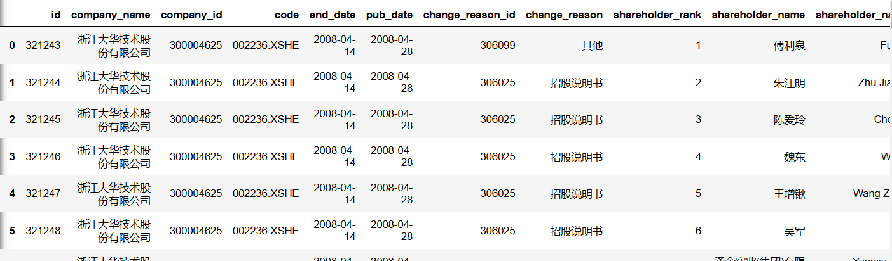

## 股票信息

获取单支股票的信息使用`get_security_info(code)`，这个`code`可以是单个股票的代码，也可以是基金的代码。返回值是一个类型为`jqdata.models.security.Security`的对象，包含了如下属性：

```
display_name # 中文名称
name # 缩写简称
start_date # 上市日期, [datetime.date] 类型
end_date # 退市日期， [datetime.date] 类型, 如果没有退市则为2200-01-01
type # 类型，stock(股票)，index(指数)，etf(ETF基金)，fja（分级A），fjb（分级B）
parent # 分级基金的母基金代码
```

如果要查看市场上所有股票的信息，那么需要使用`get_all_securities(types=['stock'], date=None)`，这个时候返回的是一个`DataFrame`类型，包含多只股票的数据。当然，也可以传入不同的`types`来确认是股票还是基金数据。

## 十大股东

`jqdata`的`finance`模块提供了十大股东的信息，查询出来的结果是按照日期排列的：

```
from jqdata import finance

finance.run_query(
    query(
        finance.STK_SHAREHOLDER_TOP10
    ).filter(
        finance.STK_SHAREHOLDER_TOP10.code==code
    ).limit(n))
```

比如使用上面这段代码查询大华股份的前100条记录：



为此，我们需要对这些信息进行裁剪，过滤出自身需要的那些信息。首先，把列数变少一点，有些列并不是当前需要的。上面的代码是从finance.STK_SHAREHOLDER_TOP10这张表中查询上市公司前十大股东的持股情况，可以按`query(库名.表名.字段名1，库名.表名.字段名2）`的格式指定所要查询的字段名。那么我们可以将query里面的条件更改为如下多个字段：

```
finance.STK_SHAREHOLDER_TOP10.company_name,
finance.STK_SHAREHOLDER_TOP10.code,
finance.STK_SHAREHOLDER_TOP10.end_date,
finance.STK_SHAREHOLDER_TOP10.shareholder_rank,
finance.STK_SHAREHOLDER_TOP10.shareholder_name,
finance.STK_SHAREHOLDER_TOP10.share_number,
finance.STK_SHAREHOLDER_TOP10.share_ratio
```