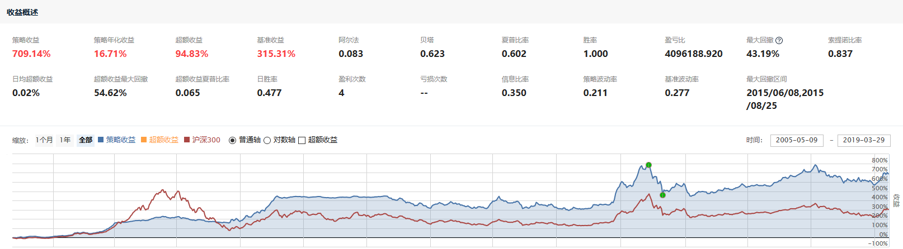
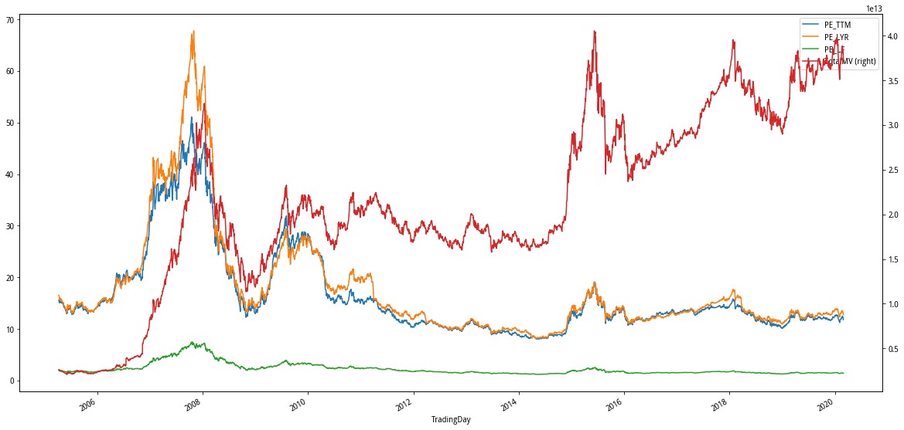
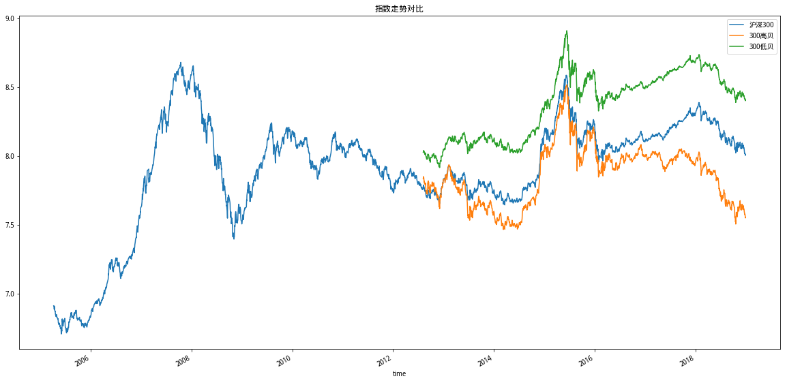
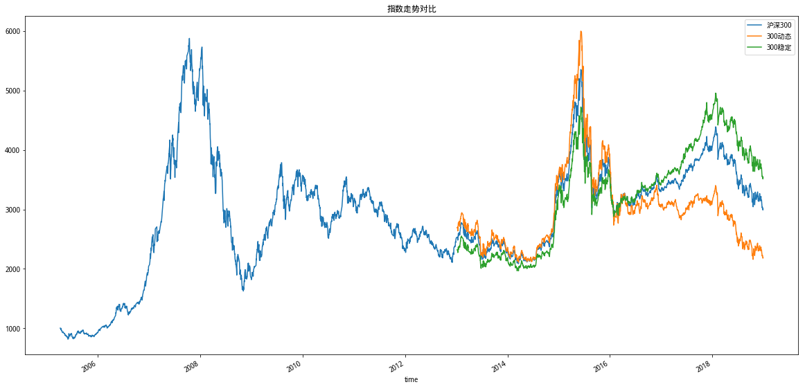
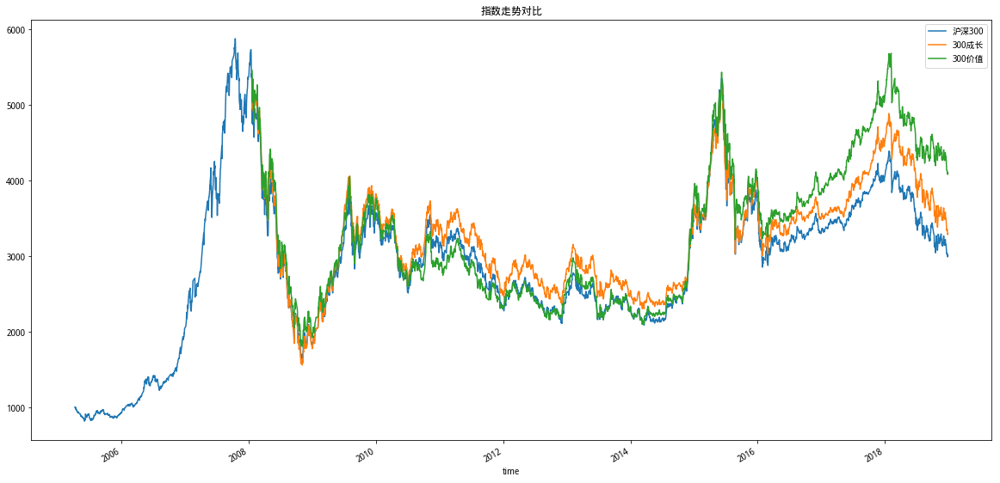
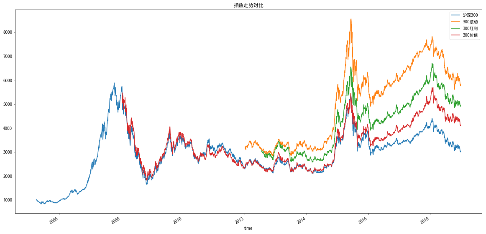
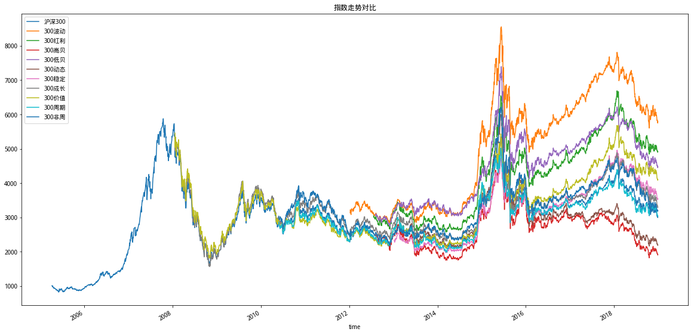
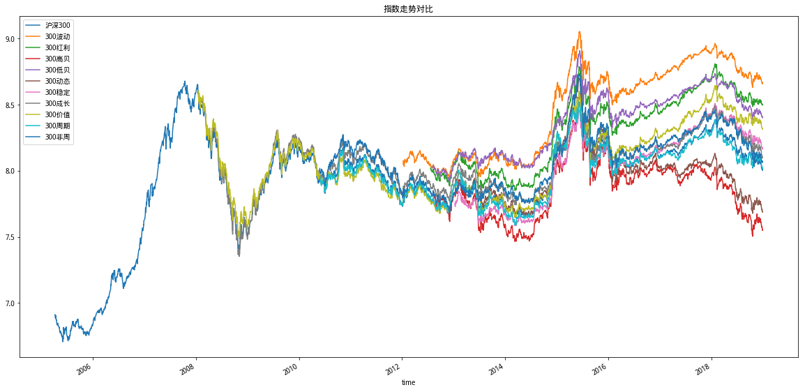

# 聚宽学习周记十一：沪深300相关指数与一个简单的策略

本周的学习是上周的接续篇，上周是研究@Gyro写作的[价值低波（中）-- 市盈率研究](https://www.joinquant.com/view/community/detail/328831058b45f5f1080914aaea6e0d09)，而本周是在理解原作者的基础之上写作自己的学习策略，同时也阅读了@Gyro的[价值低波（上）--因子加强](https://www.joinquant.com/view/community/detail/3b813a684c2360b412883737dba665d2?type=1)，收获良多。

越来越觉得一种极为有效的学习方法是从模仿开始，不仅仅是模仿其形还要模仿其神，即要完全理解模仿的对象，尽力做到神形合一。再进一步进行再创作对习得的理论、概念进行复习、加深理解。最后再将它们分享出去接收他人的批评和议论，且从中再次梳理自己的理解，这样就差不多了。其实上学时候是从教材里开始模仿，离开学校之后除了书籍之外还要其他各式各样的媒介。这里面一个显见的不同是那个时候是被动的，这个时候是主动的，后者强于前者。

本周笔记包括两部分：

- 基于@Gyro[价值低波（中）-- 市盈率研究](https://www.joinquant.com/view/community/detail/328831058b45f5f1080914aaea6e0d09)里面的策略写了一个自己的练习策略，对我自己写的这个练习策略进行解释。
- 阅读@Gyro的[价值低波（上）--因子加强](https://www.joinquant.com/view/community/detail/3b813a684c2360b412883737dba665d2?type=1)之后对于沪深300指数相关概念的理解。

## 一、代码解释

本文后面附带了该策略，源码如下：

```
from jqdata import *


def initialize(context):
    set_benchmark('000300.XSHG')
    set_option('use_real_price', True)

    set_order_cost(OrderCost(close_tax=0.001, open_commission=0.0003, close_commission=0.0003, min_commission=5), type='stock')
    run_monthly(before_market_open, monthday=1, time='before_open', reference_security='000300.XSHG')
    run_monthly(market_open, monthday=1, time='open', reference_security='000300.XSHG')

    g.underestimate_model = {'510050.XSHG' : 1.0} # 50ETF
    g.overestimate_model  = {'000012.XSHG' : 0.8, '510050.XSHG' : 0.2} # 国债ETF + 50ETF
    g.model = {}

def before_market_open(context):
    log.info('函数运行时间(before_market_open)：'+str(context.current_dt))

    # 计算前一个交易日沪深300指数对应的估值（市盈率）
    stocks = get_index_stocks('000300.XSHG')
    df = get_fundamentals(query(
        valuation.code,
        valuation.market_cap,
        valuation.pe_ratio,
        (valuation.market_cap/valuation.pe_ratio).label('value'),
    ).filter(
        valuation.code.in_(list(stocks)),
    )).dropna()

    g.market_value = df.market_cap.sum()/df.value.sum()
    if g.market_value > 30:
        g.model = g.overestimate_model
    elif g.market_value < 15:
        g.model = g.underestimate_model

    log.info('沪深300指数市盈率 = '+str(g.market_value))


def market_open(context):
    log.info('函数运行时间(market_open):'+str(context.current_dt))

    sell_list = set(context.portfolio.positions.keys()) - set(g.model.keys())
    for stock in sell_list:
        order_target_value(stock, 0)

    # 跟最着账户的总市值执行再平衡策略。
    for stock in g.model.keys():
        # 计算“最新模型建议的持有市值”
        position = g.model[stock] * context.portfolio.total_value
        # 如果“当前持有该证券的市值” = 0，直接执行买入
        if not context.portfolio.positions.has_key(stock):
            order_target_value(stock, position)
        # 如果“当前持有该证券的市值”与“模型里面建议持有的市值”不匹配，那么执行再平衡。
        elif abs(context.portfolio.positions[stock].value - position) > 0.2*context.portfolio.total_value:
            order_target_value(stock, position)
```

这个策略的效果如下：



看起来还算不错，但实际上这个策略有两个不足的地方：一、代码里面潜藏着问题；二、策略本身的立意上有不足的地方。这两个硬伤放在后面详细介绍，先按照老习惯把代码部分解释一下。

**代码片段一：**

```
def initialize(context):
    set_benchmark('000300.XSHG')
    set_option('use_real_price', True)

    set_order_cost(OrderCost(close_tax=0.001, open_commission=0.0003, close_commission=0.0003, min_commission=5), type='stock')
    run_monthly(before_market_open, monthday=1, time='before_open', reference_security='000300.XSHG')
    run_monthly(market_open, monthday=1, time='open', reference_security='000300.XSHG')

    g.underestimate_model = {'510050.XSHG' : 1.0} # 50ETF
    g.overestimate_model  = {'000012.XSHG' : 0.8, '510050.XSHG' : 0.2} # 国债ETF + 50ETF
    g.model = {}
```

`initialize()`这个函数是每个策略必须要有的，它是用来执行策略的初始化工作，在里面要配置策略的基础配置项，比如：

- set_benchmark()：设定策略的对比基准，也就是用来衡量你写作策略的业绩对比对象。
- set_option()：开启动态复权价格。
- set_order_cost()：设定交易手续费。
- run_monthly()：设定策略里面交易函数的运行时间为按月执行。

上面这几个函数都是聚宽提供的服务函数，通常说来都是必须的。后面的全局变量是我自己加的，因为在策略里面会使用到。这里相当于使用了“股债平衡”型策略，当市场低估时100%持有股票，当市场高估时20%持有股票，80%持有国债。至于如何判断市场是高估还是低估，继续往下看。

**代码片段二：**

```
def before_market_open(context):
    log.info('函数运行时间(before_market_open)：'+str(context.current_dt))

    # 计算前一个交易日沪深300指数对应的估值（市盈率）
    stocks = get_index_stocks('000300.XSHG')
    df = get_fundamentals(query(
        valuation.code,
        valuation.market_cap,
        valuation.pe_ratio,
        (valuation.market_cap/valuation.pe_ratio).label('value'),
    ).filter(
        valuation.code.in_(list(stocks)),
    )).dropna()

    g.market_value = df.market_cap.sum()/df.value.sum()
    if g.market_value > 30:
        g.model = g.overestimate_model
    elif g.market_value < 15:
        g.model = g.underestimate_model

    log.info('沪深300指数市盈率 = '+str(g.market_value))
```

`before_market_open()`这个函数是我们在策略初始化函数`initialize()`里面调用`run_monthly()`配置过的函数，它在每个月的第一个交易日开盘前会被调用。这个函数的名称我们可以随便取。

这个函数里面完成的工作其实就一件事：根据沪深300指数的市盈率来判断当前市场是除于低估还是高估：当市盈率>30那么判断为高估状态，策略模型选择“20%股票80%债券”；当市盈率<15那么判断为低估状态，策略模型选择“100%股票”。（*这里有不足*）

上面代码里面的`get_fundamentals()`以及`query()对象`我在前面周报里面已经多次解释过了，就不再说了哟。

**代码片段三：**

```
def market_open(context):
    log.info('函数运行时间(market_open):'+str(context.current_dt))

    sell_list = set(context.portfolio.positions.keys()) - set(g.model.keys())
    for stock in sell_list:
        order_target_value(stock, 0)

    # 跟最着账户的总市值执行再平衡策略。
    for stock in g.model.keys():
        # 计算“最新模型建议的持有市值”
        position = g.model[stock] * context.portfolio.total_value
        # 如果“当前持有该证券的市值” = 0，直接执行买入
        if not context.portfolio.positions.has_key(stock):
            order_target_value(stock, position)
        # 如果“当前持有该证券的市值”与“模型里面建议持有的市值”不匹配，那么执行再平衡。
        elif abs(context.portfolio.positions[stock].value - position) > 0.2*context.portfolio.total_value:
            order_target_value(stock, position)
```

`market_open()`这个函数和上面的`before_market_open()`一样都是通过`run_monthly()`在策略初始化的时候配置的，不同的是这个函数是在每个月第一个交易日开盘后执行，它的名字也可以任意取。

这个函数的工作是根据开盘前已经更新的策略模型来进行具体的交易，主要逻辑（*这里也有个bug*）包括：

- `context.portfolio.positions`保存了当前的持仓情况，而`g.model`则是基于最新的市场估值制定的持仓建议。所以第一步是看要将哪些当前持有的证券删除（这里的`set()`是Python里面的数据结构，两者相减就可以达到这个目的），然后调用`order_target_value()`将找到的证券删除。
- 解析来就是针对持仓建议的每只证券进行操作：
  - 如果这是一只新的证券，那么直接买入。
  - 如果这是一直已持有的证券，那么根据建议策略里面比例进行调整。

这些就是策略的大致过程，介绍得比较简略。下面重点看这个策略里面的不足之处

**不足之处一**

策略里面根据沪深300指数的估值（市盈率）来进行交易，但当将沪深300指数极其市盈率的历史走势画出来之后可以发现除了在2008年左右它的市盈率超过30外，仅十年来都是在20以下的，这也就意味着你的持仓可能意味十多年甚至更长，我想这对于大多数人来说还是有些难度的。所以这是一个理想化的策略。




**不足之处二**

交易部分的代码有缺陷，主要是从“100%持股”转换到“20%持股80%持债”的时候可能由于现金不足而失败，根据调试日志发现这可能发生在如下两种情况：

- 100%持股->20%持股80%持债，当循环中的第一只证券是债的时候，由于当前仓位没有多于现金会导致针对债券的买入失败。
- 20%持股80%持债->100%持股，当循环中的第一只证券是股票的时候，也由于债券没有提前卖出会导致现金不足而使交易失败。

所以需要在进行交易的时候还需要进一步考虑这上面的逻辑缺陷。


## 二、上周计划任务

### 1.查找资料学习有关归一化和对数化的概念。

**归一化**

归一化（英文`Normalization`），意思是将一些事物变得更加正常化或者常规化。但这是一个很宽泛的概念，它在不同的领域有不同的更加细致的含义，常见的应用领域包括科学、数学和统计、计算机科学与技术。我们这里使用到的，或者更具体些，上周学习的@Gyro在[价值低波（中）-- 市盈率研究](https://www.joinquant.com/view/community/detail/328831058b45f5f1080914aaea6e0d09)提到的“归一化”使用的是统计学中的归一化。

归一化是将数据集映射到指定的范围，通常是[0,1]和[-1,1]，用于除去不同维度数据的量纲。最常见的是“Min-Max 归一化”，公式为：(X - Xmin)/(Xmax - Xmin)。@Gyro里面应该就是类似这个思路，之所以说“类似”是因为里面归一化的时候仅仅是取了数据集中第一个记录来作为归一化的分母，但消除量纲的目的还是可以达到的。

参考：

- [Normalization](https://en.wikipedia.org/wiki/Normalization)
- [ML 入门：归一化、标准化和正则化](https://www.davex.pw/2017/10/07/Normalization-and-Regularization/)
- [归一化与标准化](https://ssjcoding.github.io/2019/03/27/normalization-and-standardization/)
- [数据特征的标准化和归一化你了解多少？](http://www.raincent.com/content-10-12066-1.html)

**对数化**

对数化（英文`Logarithm Transformation`），是数据转换众多方式中的一种，而数据转换的目的是为了将数据转换成一种更容易理解的形式以便于进一步的分析。总的来说，对数化的主要作用是它能够大幅缩小数据的绝对值，但是不会改变数据之间的相互关系，所以数据能够更加平稳。这样我们肉眼看看着比较方便，更重要的做得专业点是可以对这些平稳的数据进行回归的，回归就是找到数据的函数，也就是规律了。

如果这样理解，我们在上周周记里面提到的肉眼去看对数化之后的走势发现没有规律还不够严谨，更严谨的做法是尝试对那些对数化之后的数据尝试进行回归看是否找得到回归函数，但这目前超过了我的学习范围，先放放。

- [Data transformation (statistics)](https://en.wikipedia.org/wiki/Data_transformation_(statistics))
- [数据取对数的意义](https://www.cnblogs.com/zztt/p/3409675.html)


### 2.根据@Gyro的[价值低波（中）-- 市盈率研究](https://www.joinquant.com/view/community/detail/328831058b45f5f1080914aaea6e0d09)写作一个简单的策略。

已完成，见代码解释部分。


## 三、本周新学内容

上周解读了@Gyro的[价值低波（中）-- 市盈率研究](https://www.joinquant.com/view/community/detail/328831058b45f5f1080914aaea6e0d09)，这周顺便看了下上篇：[价值低波（上）--因子加强](https://www.joinquant.com/view/community/detail/3b813a684c2360b412883737dba665d2?type=1)，里面提到了“价值因子、红利因子和低波因子”，对于“因子”这个专业术语本来预定第3周开始学习，但一来觉得这个术语听起来有点高级怕花费太多的时间，二来有在聚宽里学习碰到的其他一些更加低级的问题，所以一直拖到现在，这次算是和“因子”的正面交锋。

但我这次还是先不管它，因为在@Gyro文章里我发现对于沪深300相关指数的认识不够清楚，对于300能源、300材料、300工业等等按照行业来划分的指数我能够理解，但是下面这几个什么“波动”、“高贝”、“非周期”的到底怎么来制定的我感到很好奇。搜索之后发现这些指数都是中证系列的指数，从中可以找到它们的编制方案和成分股数据：

- [000300.XSHG/沪深300](http://www.csindex.com.cn/zh-CN/indices/index-detail/000300)：沪深300指数由上海和深圳证券市场中市值大、流动性好的300只股票组成，综合反映中国A股市场上市股票价格的整体表现。
- [000803.XSHG/300波动](http://www.csindex.com.cn/zh-CN/indices/index-detail/000803)：沪深300波动率加权指数以沪深300指数样本股中历史波动率最小的100只股票为成分股，采用历史波动率的倒数作为权重分配依据，以降低整个指数组合的波动率(风险)。
- [000821.XSHG/300红利](http://www.csindex.com.cn/zh-CN/indices/index-detail/000821)：沪深300红利指数以沪深300指数样本股中股息率最高的50只股票为成分股，采用股息率作为权重分配依据，以反映沪深300指数中高股息率股票的整体表现。
- [000828.XSHG/300高贝](http://www.csindex.com.cn/zh-CN/indices/index-detail/000828)：沪深300高贝塔指数以沪深300指数为样本空间，根据股票过去一年的贝塔值进行从高到低排名，选取排名靠前的股票作为样本股，并以样本股的贝塔值进行加权。高、低贝塔指数系列可以表征与全市场不同贝塔属性的股票价格变化。
- [000829.XSHG/300低贝](http://www.csindex.com.cn/zh-CN/indices/index-detail/000829)：沪深300低贝塔指数以沪深300指数样本股中贝塔值排名靠后的100只股票为成分股，采用贝塔值的倒数作为权重分配依据。
- [000843.XSHG/300动态](http://www.csindex.com.cn/zh-CN/indices/index-detail/000843)：沪深300动态指数以沪深300指数所有样本股为样本空间，通过波动率因子和质量因子计算敏感性评分，选取对宏观环境和经济周期变动具有较高风险敞口的150只股票构成。
- [000844.XSHG/300稳定](http://www.csindex.com.cn/zh-CN/indices/index-detail/000844)：沪深300稳定指数以沪深300指数所有样本股为样本空间，通过波动率因子和质量因子计算敏感性评分，选取对宏观环境和经济周期变动具有较低风险敞口的150只股票构成。
- [000918.XSHG/300成长](http://www.csindex.com.cn/zh-CN/indices/index-detail/000918)：沪深300成长指数以沪深300指数为样本空间，从中选取成长因子评分最高的100只股票作为样本股。
- [000919.XSHG/300价值](http://www.csindex.com.cn/zh-CN/indices/index-detail/000919)：沪深300价值指数以沪深300指数样本股中价值因子评分最高的100只股票为成分股，采用价值因子数值作为权重分配依据。
- [000968.XSHG/300周期](http://www.csindex.com.cn/zh-CN/indices/index-detail/000968)：沪深300周期行业指数以沪深300指数样本股为样本空间，选取归属金融保险、采掘、交通运输仓储、金属非金属、房地产等5个具有较强周期性特征行业的股票构成样本股。
- [000969.XSHG/300非周](http://www.csindex.com.cn/zh-CN/indices/index-detail/000969)：沪深300非周期行业指数以沪深300指数样本股为样本空间，选取金融保险、采掘、交通运输仓储、金属非金属、房地产以外行业的股票组成样本股。

在上面这些系列指数的解释中可以发现编制这些指数的时候也提到了各自专业术语，比如“贝塔值”、“波动率因子”、“质量因子”、“成长因子”等等，看来“因子”这个专业术语今天是绕不过去了。不过今天不扩展了解，就把上面这些指数里面出现的几个专业术语尝试着弄明白。

**1.波动率**

按照[中证波动率加权指数系列编制方案](http://www.csindex.com.cn/uploads/indices/detail/files/zh_CN/148_000803_Index_Methodology_cn.pdf)中描述，这里的波动率是计算的最近一年日收益率的标准差。标准差是数学上的一个专业术语，上学的时候学习过，但现在已经不记得了。在查找资料的过程中发现“[马同学高等数学](https://www.matongxue.com/)”课程讲解得不错，特意花了99元去买了其中的《概率与统计》课程来重新学习。对于这里标准差的解释大致如下：

- 标准差和方差是一对孪生兄弟，它们是用来评估随机变量的指标。比如，对于一些随机变量我们通常会想知道它的均值（也就是数学期望），有些时候我们还想知道它的大概范围（方差/标准差）。
- 最开始是使用方差来衡量随机变量的分布范围，但由于方差的计算中有平方的计算导致它的结果的单位是平方不便于比较。比如某班级里面学生的平均升高是1.62米，计算出来的方差是0.003平方米，我们就不好说`这个班级里学生的身高范围在1.62米正负0.003平方米的范围区间`。这个时候在方差基础上引入了标准差，直接对方差开平方让单位保持一致，0.003平方米开方的结果为0.054米，那么这个时候我们可以说`这个班级里学生的身高范围在1.62米正负0.054米的范围区间`。当然，我还没有明白为什么方差的定义要采用二阶矩的形式使得非要引入标准差进行修正。
- 标准差和方差尽管是一个数学概念，但同时在很多行业里面使用。比如抽象的数据集，方差/标准差大意味着数据的比较离散；概率论中方差大意味着概率质量函数的分布比较分散，随机性高；金融领域中方差大意味着波动大，风险高。

**2.贝塔值**

其实贝塔值在之前学习编写第一个策略时理解策略回测后的衡量指标的[聚宽学习第五周周记：中证指数共享函数使用更新与策略指标的理解](https://www.joinquant.com/view/community/detail/99a6ea4179cfa056552d3567b3387bc6)里就已经提到过了。这里引用过来：

> Beta用来描述投资过程中蕴含的系统风险。在量化里反映了策略收益对大盘变化的敏感性，也就是Beta反映了你的投资策略相对于整个市场的那部分相对收益。

贝塔值的计算公式为：COV(Ri,Rm) / (Sm)^2，其中Ri为样本股i的日收益率，Rm为相应基准指数的日收益率，COV(Ri,Rm)为样本股收益率和基准指数收益率的协方差。Sm为标准差，这里平方之后的(Sm)^2实际上就是方差。

那么协方差又是什么？前面提到的标准差和方差衡量的是单个变量的波动情况，而协方差是用来衡量两个变量之间的相关性。和上面的方差一样，协方差计算出来的结果也是有单位，并且由于有两个变量，所以它带上了两个变量的单位，这就不利于进行相关性比较了。比如我们想比较班级里面学生的“年龄vs体重”和“身高vs体重”相关性的大小，COV(年龄，体重)结果的单位是岁·千克，COV(身高，体重)结果的单位是米·千克，不好比较。继而引入了“协方差系数”，公式为 COV(X,Y)/Sm(X)Sm(Y)，这样计算出来的结果是不带单位的，便于比较。

而贝塔值的计算类似于协方差系数，但是分母里是Sm(Y)Sm(Y)，即Y的方差，而不是Sm(X)Sm(Y)。这里的原因有两个：一、抵消协方差产生的单位；二、贝塔值的用意是与基准进行对比，方差本身代表了波动，所以用变量X与Y的相关性除上基准Y本身的波动得到的系数可以用来表征与基准之间的波动。不知道这种理解是否正确。（参考：[CNN 入门讲解：什么是标准化(Normalization)？](https://zhuanlan.zhihu.com/p/35597976)）

那么“300高贝”和“300低贝”就分别表示沪深300指数样本股里面按照贝塔值排序的最高100名和最低100名的股票，详细定义可以见[中证高、低贝塔指数系列编制方案](http://www.csindex.com.cn/uploads/indices/detail/files/zh_CN/172_000828_Index_Methodology_cn.pdf?t=1583841038)。我这里把沪深300指数以及300高贝、300低贝的走势画了出来，看得出来高贝太菜啦。



**3.波动率因子和质量因子**

[沪深300动态指数和稳定指数编制方案](http://www.csindex.com.cn/uploads/indices/detail/files/zh_CN/187_000843_Index_Methodology_cn.pdf?t=1583842872)有关300动态和300稳定指数的定义为：沪深300动态和稳定指数分别以各自母指数为样本空间，根据波动率因子和质量因子计算敏感性评分，选取对宏观环境和经济周期变动具有较高风险敞口的股票构成动态指数，选取具有较低风险敞口的股票构成稳定指数。

波动率因子和质量因子就是编制这两个指数的主要参考因子，它们分别有如下的定义：

- 波动率因子：根据52周波动率和36月波动率进行计算。
- 质量因子：根据债务权益比、总资产/净利润、盈利可变性和现金流可变性进行计算。

从这里可以知道波动率因子与上面谈到的波动率有关，但是是不一样的指标。但是中证方案上没有给出具体的计算算法，我也不知道这两个因子的具体公式是什么。我们来看下根据这两个因子指定的“300动态”和“300稳定”的表现，从图中可以看出“300动态”在市场行情好的时候具有较好的表现，但行情一般的时候表现较差。




**4.成长因子和价值因子**

这两个因子在[沪深300风格指数系列编制方案](http://www.csindex.com.cn/uploads/indices/detail/files/zh_CN/211_000918_Index_Methodology_cn.pdf?t=1583845495)有描述：

- 成长因子包含三个指标：主营业务收入增长率、净利润增长率和内部增长率。
- 价值因子包含四个指标：股息收益率、每股净资产与价格比率、每股净现金流与价格比率和每股收益与价格比率。




注：@Gyro文中的“300低波”我并没有在聚宽的指数名单中找到，但当我把相关指数的趋势图画出来时，肉眼观察觉得文中的“300低波”就是中证指数的“300波动”指数。然而这里的一个疑问是“300波动”指数的编制方案是“将股票按照波动率指标由高到低进行排名，选择排名前100名的股票构成对应指数样本股，然后指数计算时的的权重分配与其历史波动率的倒数成正比。”也就是说“300波动”选择的是沪深300指数中按照波动率排名前100位的样本股，但“300低波”听起来像是选择波动率较低的样本股。（*已和@Gyro确认，确实是300波动指数。*）



最后搞个大综合：



上周刚学了对数化，这里也尝试对它们进行对数化看看效果。




## 四、下周学习任务

这周接触到不少概念花了不少时间，下周搞轻松点休息一下。

### 1.修改如上策略里面的代码缺陷

### 2.思考如何统计股票的涨停天数

上周想调查一下最近上市的股票的涨停天数具体是怎么样的，我当时的方案是获取最近一段时间上市的股票然后打开交易软件去数有几个涨停，但这样效率很低，并且不同板上市的数据会不一样。所以想着是否可以写个函数帮忙进行统计。

```
df = get_all_securities()
df = df[df['start_date'] > dt.date(2020, 2, 1)]
print(df)
```
