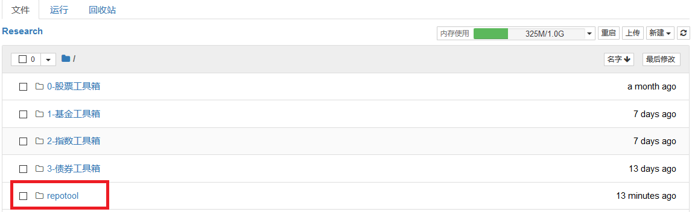
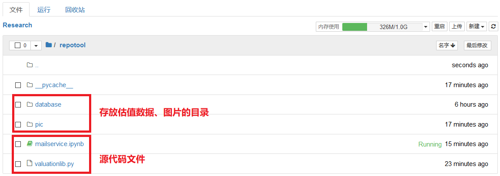
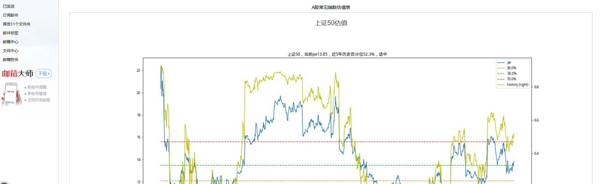
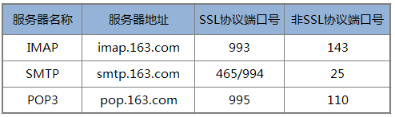

# 聚宽学习周记十七：详解@东南有大树的“指数估值自动报表系统”（中）

本周开始改写@东南有大树[指数估值自动报表系统——源代码](https://www.joinquant.com/view/community/detail/20497)里面的自动报表系统，没想到在邮件发送上面花了不少时间，到周末才改写完成一半，不得不将原打算在本周结束的关于这篇文章的学习延展到下一周。原来计划直接发布《详解@东南有大树的“指数估值自动报表系统”（下）》，现在只能硬生生插个中篇。

## 一、代码解释

这周“代码解释”部分不再进行详细的代码解释了，因为上周已经解释过，这里直接说下当前改写的报表系统。目前改写的情况如下：

- 创建新的目录来存放自动报表的所有文件，文件夹名称“repotool”。
- 将原来[指数估值自动报表系统——源代码](https://www.joinquant.com/view/community/detail/20497)附件里的index_valuation.py一分为二：
  - 第一部分：专门计算指数估值的部分，文件名称“valuationlib.py”。
  - 第二部分：邮件服务部分，文件名称“mailservice.ipynb”（当前还没有正式发布到策略里面，因此研究后缀名依然为ipynb）。
- 创建用来存放生成数据的文件夹：
  - 1.存放估值数据的文件夹，名称“database”。
  - 2.存放估值图标的文件夹，名称“pic”。

所以，在策略研究根目录我们可以看到新的"repotool"目录：



在"repotool"目录能够看到源代码文件和创建用来存放数据的目录：



这是当前实验的状态，如果像大树兄那么发布，只需要新建策略，并将“mailservice.ipynb”里面的内容拷贝到新建的.py文件并且在策略里面使用它提供的`send_email()`函数即可。在策略里面测试的结果如下



**valuationlib.py源代码**

```
import pandas as pd
from jqdata import *


database_path = './database/'


def H_V_H(arr):   
    ''' historic_valuation_height: 计算历史估值高度

    参数
    ====
    arr : ndarry类型，此时是一维的估值数据

    返回值
    ======
    返回“小于最后一天估值数据的天数”占“总的天数”的百分比
    '''
    low = arr[arr < arr[-1]]
    return(low.shape[0] / arr.shape[0])   


def get_valuation_status(quantile):
    ''' 获取估值状态

    参数
    ====
    quantile : 估值所处的百分位

    返回值
    ======
    assessment : 估值状态
    '''
    assessment = ''
    if 0 <= quantile < 0.1:
        assessment = '超低估'
    elif 0.1 < quantile < 0.3:
        assessment = '低估'
    elif 0.3 < quantile < 0.4:
        assessment = '适中偏低'
    elif 0.4 < quantile < 0.6:
        assessment = '适中'
    elif 0.6 < quantile < 0.7:
        assessment = '适中偏高'   
    elif 0.7 < quantile < 0.9:
        assessment = '高估'   
    elif 0.9 < quantile <= 1:
        assessment = '超高估'   

    return assessment


def calc_index_valuation(index_code, start_date, end_date=datetime.datetime.now().date()):
    '''计算指数的估值数据。

    参数
    ====
    index_code: 指数代码
    start_date：起始日期
    end_date  : 结束日期（默认为今天）

    返回值
    ======
    df: DataFrame，包含了指定日期区间每天的pe, pb数据
    '''
    print('\t计算{}自{}到{}的估值数据...'.format(index_code, start_date, end_date))
    def iter_pe_pb(): # 这是一个生成器函数
        trade_date = get_trade_days(start_date=start_date, end_date=end_date)   

        for date in trade_date:
            stocks = get_index_stocks(index_code, date)
            q = query(valuation.pe_ratio,
                      valuation.pb_ratio
                     ).filter(
                              valuation.pe_ratio != None,
                              valuation.pb_ratio != None,
                              valuation.code.in_(stocks))
            df = get_fundamentals(q, date)            
            quantile = df.quantile([0.25, 0.75])            
            df_pe = df.pe_ratio[(df.pe_ratio > quantile.pe_ratio.values[0]) &\
                                (df.pe_ratio < quantile.pe_ratio.values[1])]
            df_pb = df.pb_ratio[(df.pb_ratio > quantile.pb_ratio.values[0]) &\
                                (df.pb_ratio < quantile.pb_ratio.values[1])]            
            yield date, df_pe.median(), df_pb.median()

    dict_result = [{'date': value[0], 'pe': value[1], 'pb':value[2]} for value in iter_pe_pb()]    
    df = pd.DataFrame(dict_result)        
    df.set_index('date', inplace=True)
    print('\t计算完成。')
    return df


def load_local_db(index_code):
    '''从本地导入之前保存在./database目录中的估值数据。

    参数
    ====
    index_code: 指数代码

    返回值
    ======
    df : DataFrame，从本地保存的csv里面导入的估值数据
    '''
    file_name = database_path + get_security_info(index_code).display_name + '_pe_pb.csv'
    if os.path.exists(file_name):
        df_loc_pe_pb = pd.read_csv(file_name, index_col='date', parse_dates=True)
        return df_loc_pe_pb
    else:
        return pd.DataFrame()


def save_to_db(index_code, new, old=pd.DataFrame()):
    '''将计算得到的估值数据保存到./database目录中的估值数据，提高数据查询效率。

    参数
    ====
    index_code: 指数代码
    new       : 计算得到的最新一段时间的估值数据
    old       : 获取之前保存在本地的估值数据
    '''
    file_name = database_path + get_security_info(index_code).display_name + '_pe_pb.csv'
    if len(old) <= 0:
        new.to_csv(file_name)
    else:
        df = old.append(new)
        df.to_csv(file_name)


def get_pe_pb(index_code, start_date):
    '''获取从某个日期开始的估值pe/pb。

    参数
    ====
    index_code: 指数代码
    start_date: 起始日期    
    '''
    print('开始获取{}的估值数据:'.format(index_code))
    df_old = load_local_db(index_code)
    if len(df_old) <= 0:
        start_date = start_date # 本地没有保存估值数据，从指定的日期开始获取
        print('\t本地无缓存，需要计算从{}开始的估值数据。'.format(start_date))
    else:
        start_date = df_old.index[-1] # 否则，将本地存储估值数据的最后一个日期做为新的起始日期
        print('\t本地有缓存从{}至{}的数据，需要计算从{}开始的数据。'.format(df_old.index[0], df_old.index[-1], start_date))
    df_new = calc_index_valuation(index_code, start_date=start_date)
    save_to_db(index_code, new=df_new, old=df_old)
    return load_local_db(index_code)
```

**mailservice.ipynb源代码**

```
import smtplib
from email.message import EmailMessage
from email.mime.text import MIMEText
from valuationlib import *


picture_path = './pic/'


html_head = """
<!DOCTYPE html>
<html lang="en">

<head>
    <meta charset="UTF-8">
    <meta name="viewport" content="width=device-width, initial-scale=1.0">

    <meta http-equiv="X-UA-Compatible" content="ie=edge">
    <title>Document</title>
    <p>A股常见指数估值表</p>
</head>
<style>
    * {
        list-style: none;
        padding: 0;
        margin: 0;
    }

    .title {
        font-size: 20px;

    }

    .text {
        font-size: 15px;
        color: rgb(77, 74, 74);
        margin:10px 0px ;
    }

    .item {
        border: 1px solid #ccc;
        margin: 4px;
        margin-bottom: 20px;
        padding: 15px 2%;
        color: rgb(77, 74, 74);
    }

    .box {
        /* border: 1px solid #ccc;  */
        padding: 0 1%;
        margin-bottom: 20px;
    }

    .img {
        width: 100%;
    }
    table{
        width: 100%;

    }
    table {
        border: 1px solid #ccc;
    }
    thead {
        border: 1px solid #ccc;

    }
    thead th{
        width: 25%;
    }

    tbody tr {
        width: 25%;
        border: 1px solid #ccc;
        text-align: center;
        color:#fff;
    }

    .super_high{
        background: rgb(128,128,128);
    }
    .high{
        background: rgb(220,20,60);
    }
    .high_miden{
        background: rgb(255,165,0);
    }
    .miden{
        background: rgb(255,215,0);
    }
    .low_miden{
        background: rgb(240,230,140)
    }
    .low{
        background: rgb(144,238,144);
    }
    .super_low{
        background: rgb(60,179,113);
    }

    .describe{
        padding-top: 15px;
        display: flex;
        border: 1px solid #ccc;
    }
    p {
        text-align: center;
    }
</style>

<body>
<div class="box">
"""


html_foot = """
</div>
<div>
<p>
免责声明：
</p>
<p>
本邮件发送者对内容的准确性、完整性、及时性或用途的适用性不作担保。
本内容不构成任何投资建议，用户查看或依据这些内容进行的任何行为造成的风险和结果需用户自行承担责任。
</p>
</div>
</body>
</html>
"""


def get_index_pe(index=None):
    '''获取指数的pe数据。

    参数
    ====
    index: 指数代码，支持多支指数    

    返回值
    ======
    dict: dict，由{指数代码：指数多天pe/pb的DataFrame}组成的字典。
    '''
    if index == None:
        index = ['000016.XSHG', '000300.XSHG', '399905.XSHE'] # 默认获取上证50，沪深300，中证500三支指数
    index_pe = {item : get_pe_pb(item, get_security_info(item).start_date) for item in index}

    return index_pe


def draw_quantile_diagram(index, indicator, years, valuation):
    '''绘制基于pe的百分位估值图

    参数
    ====
    index     : 指数代码，支持单支指数
    indicator : 百分位参考指标
    years     : 最近多少年度的数据
    valuation : 估值数据

    返回值
    ======
    dict: dict，由{指数代码：指数多天pe/pb的DataFrame}组成的字典。
    '''
    df = valuation.copy()
    df.index.name = None

    # 一、计算估值百分位
    #     1. 选取近 years 年的估值数据
    #     2. 再分别计算出30%，50%，70%的估值百分位
    i_df = pd.DataFrame()
    i_df[indicator] = df[indicator]
    i_df = i_df.iloc[-years * 244:] # 244代表每年的交易日
    for coe in [3, 5, 7]:
        i_df[str(coe / 10 * 100)+'%'] = i_df[indicator].quantile(coe / 10.0)

    # 二、计算历史百分位高度，用于在图形中展示基于百分位的历史估值趋势
    #     1. “历史百分位高度”是“某个交易日的估值”相对于“历史某段日期所有估值”的大致位置
    #        比如100个交易日当中有2个交易日的估值（pe）小于10，那么10对应的高度就是2%
    #     2. 算法如下：
    #        a, 使用滑动窗口计算函数rolling计算历史上每天在前years年中对应的百分位高度
    #        b, 取最近的years年的数据赋值给保存近years年的i_df    
    i_df['history'] = df[indicator].rolling(years * 244).apply(lambda x: H_V_H(x), raw=True)[-years*244:]

    # 三、计算当前（最近一个交易日）的近years年的百分位高度，用于估值
    quantile_now = H_V_H(i_df[indicator])    
    assessment = get_valuation_status(quantile_now)
    title = '{}，当前{}{}，近{}年历史百分位{}，{}'.format(get_security_info(index).display_name,
                                              indicator, round(i_df[indicator][-1], 2), years,
                                              str(round(quantile_now * 100, 2)) + '%', assessment)

    i_df.plot(secondary_y=['history'], figsize=(20, 10), style=['-', '--', '--', '--', 'y-'], title=title)
    picture_name = get_security_info(index).display_name + '.png'
    picture_id = get_security_info(index).name
    plt.savefig(picture_path + picture_name)

    return picture_id


def get_base(indexes):
    dic = get_index_pe(indexes)
    index_info = '<div>'
    for index, data in dic.items():
        picture_id = draw_quantile_diagram(index, 'pe', 5, data)
        index_info += """
        <li class="item">
            <p class="title">
                {}估值
            </p>
            
        </li>
        """.format(get_security_info(index).display_name, picture_id)
    index_info += '</div>'
    return index_info


def send_email(receiver, indexes, title):
    msg = EmailMessage()
    sender = '发件人邮箱'

    # 填充邮件头部
    msg['Subject'] = title
    msg['From'] = sender
    msg['To'] = receiver

    # 填充邮件正文
    html = html_head + get_base(indexes) + html_foot    
    msg.add_attachment(html, subtype='html')

    for index in indexes:
        picture_name = get_security_info(index).display_name + '.png'
        picture_id = get_security_info(index).name
        with open(picture_path + picture_name, 'rb') as f:
            msg.add_attachment(f.read(), maintype='image', subtype='png', cid=picture_id)

    # 发送邮件
    try:
        mail_server = smtplib.SMTP_SSL('smtp.163.com',port=465)
        mail_server.login(sender, '你邮箱的smtp服务授权码')
        mail_server.send_message(msg)
    except smtplib.SMTPException as ex:
        print("Error: send failure = ", ex)


receiver = '收件人邮箱'
indexes = ['000016.XSHG', '000300.XSHG', '399905.XSHE']
send_email(receiver, indexes, 'A股指数估值表')    
```


## 二、上周计划任务


### 1. 进一步学习[指数估值自动报表系统——源代码](https://www.joinquant.com/view/community/detail/20497)里面自己不熟悉的知识点，并仿照原有代码改写自动报表系统。

学习到一半。

### 2. 在理解函数`send_message()`的时候发现聚宽本身定义了这个函数用来发送微信消息，当前自己在进行ETF定投，都是使用聚源数据提供的指数估值来进行决策，受这篇文章的启发其实可以尝试手动计算当前指数的估值，这样每天就可以实时掌握指数的估值状态了。

没来得及做。


## 三、本周新学内容

### 1.使用Python进行邮件发送

#### 在邮件服务端设置SMTP服务

Python函数库`smtplib`专门用来支持邮件的发送，这个库是基于SMTP（Simple Mail Transfer Protocol，简单邮件传输协议）的封装，发送邮件的过程我们需要创建对应的[SMTP的对象](https://docs.python.org/3/library/smtplib.html#module-smtplib)，用来创建SMTP对象的类定义有如下两种：

```
class smtplib.SMTP(host='', port=0, local_hostname=None, [timeout, ]source_address=None)

# 与SMTP行为一样，但支持SSL访问
class smtplib.SMTP_SSL(host='', port=0, local_hostname=None, keyfile=None, certfile=None, [timeout, ]context=None, source_address=None)

```

在创建该对象的时候我们需要明确要使用SMTP服务，也就是我们要使用哪里的邮件服务器来发送邮件，比如我现在要使用我已经注册的163邮箱来发送邮件，那么我们这里要先找到163提供了哪些邮件服务，这可以通过在邮箱设置里面查看得到。比如我登录自己邮箱之后可以在【设置】选项里面找到[什么是POP3、SMTP和IMAP?](https://help.mail.163.com/faqDetail.do?code=d7a5dc8471cd0c0e8b4b8f4f8e49998b374173cfe9171305fa1ce630d7f67ac22dc0e9af8168582a)，里面包含了163提供的邮件服务：



上面就提供了“SMTP服务器地址”，“SSL协议端口号”和“非SSL协议端口号”，我们这个时候想使用支持SSL协议的SMTP服务，那么就可以创建下面的SMTP对象：

```
import smtplib

mail_server = smtplib.SMTP_SSL('smtp.163.com',port=465)
```

#### 邮件内容构建

在创建好这个对象之后，我们就可以使用SMTP的`sendmail`函数来进行邮件的发送，该函数声明为`SMTP.sendmail(from_addr, to_addrs, msg, mail_options=(), rcpt_options=())`。但在此之前我们要先准备好对应的参数信息：

- from_addr: 发送者邮件地址。我们使用163邮件服务，所以这里填写自己的邮箱账号。
- to_addrs：接收者邮件地址。可以支持多个。
- msg：要发送的消息。

邮件的消息`msg`这个时候是难点，我们无法直接发送字符串，而是需要使用SMTP协议里面定义好的邮件格式。比如我尝试如下这样来发送"hello"字符串，尽管邮件可以发送出去，但是你收到的邮件标题和内容都是空白的：

```
import smtplib

mail_server = smtplib.SMTP_SSL('smtp.163.com',port=465)
mail_server.login('你的163邮箱账号', '你的SMTP授权码')
mail_server.sendmail('你的163邮箱地址', '接收者邮箱地址', "hello")
```

这个原因就是前面提到的"hello"仅仅是一个纯字符串，没有遵循SMTP协议里面定义的邮件格式。这些格式有哪些呢，那就是MIME模块定义的那些消息格式([email.mime](https://docs.python.org/3/library/email.mime.html?highlight=mimetext#email.mime.text.MIMEText))，用来支持不同的邮件格式。比如我们这里选择支持文本类型的`MIMEText`重新编写如上代码：

```
import smtplib
from email.mime.text import MIMEText

msg = MIMEText('Can you see me?', 'plain', 'utf-8')
msg['Subject'] = 'Hello world'

mail_server = smtplib.SMTP_SSL('smtp.163.com',port=465)
mail_server.login('你的163邮箱账号', '你的SMTP授权码')
mail_server.sendmail('你的163邮箱地址', '接收者邮箱地址', msg.as_string())
```

这样你就能够接收到标题为“Hello world”，邮件内容为“Can you see me?”的邮件啦。在这里我们需要理解一封邮件的内容是有特定的格式的，这些格式是与协议里面定义的。比如我们可以从[email.message: Representing an email message](https://docs.python.org/3/library/email.message.html#module-email.message)里面知道邮件内容的组成可以分为“头部”和“载荷（内容）”两部分，前者用来存储邮件相关属性，比如发送者、接收者之类，后者就是邮件的正文。邮件的正文又可以分为不同的格式，略做草图如下：


所以，从上面这个例子里面我们创建了一个`MIMEText`对象，这个对象对应的就是上图中的第一种，也就是载荷部分携带的是纯文本。但从上面的`email.mime`链接里面其实可以知道用来在邮件里面添加更加多样化的内容，包括：

- MIMEImage：创建`image`类型的对象，传送图片
- MIMEAudio：创建`audio`类型的对象，传送音频
- MIMEApplication：创建`application`类型的对象，传送应用

如果我们需要在载荷里面携带多种类型的数据，那么就必须创建`MIMEMultipart`对象，使用它的`attach()`函数将多种类型的数据组装到这个对象，再统一发出。比如@江南有大树的代码就是这么办的：

```
# 构建message
msg = MIMEMultipart()
# 添加邮件内容
content = MIMEText(html, _subtype='html', _charset='utf8')
msg.attach(content)
# 构建并添加图像对象
for id, pic in picture.items():
    img = MIMEImage(open(pic, 'rb').read(), _subtype='octet-stream')
    img.add_header('Content-ID', id)
    msg.attach(img)
```

#### 更便捷的方法

由于Python的生态在不断演进，所以很多以前的功能会推陈出新。比如发送邮件的函数除了上面使用的`send_email()`现在有了个[send_message()](https://docs.python.org/3/library/smtplib.html#smtplib.SMTP.send_message)，这个函数其实是对sendmail的封装，但你只需要在使用的时候传入一个msg参数就可以了，使用起来更加方便。

只不过我们使用`send_message()`这个新函数需要传入新的msg的类型：[EmailMessage](https://docs.python.org/3/library/email.message.html#email.message.EmailMessage)。那这个`EmailMessage`又是什么呢？其实这个对象提供了一些函数可以直接添加多种类型的内容，而不用先创建`MIMEText`, `MIMEImage`或者其他的对象。比如下面是一个发送邮件正文为纯文本的例子：

```
import smtplib
from email.message import EmailMessage

msg = EmailMessage()
msg['From'] = '你的163邮箱地址'
msg['To'] = '接收者邮箱地址'
msg['Subject'] = 'Hello world'
msg.set_content("There you are!")

mail_server = smtplib.SMTP_SSL('smtp.163.com',port=465)
mail_server.login('你的163邮箱账号', '你的SMTP授权码')
mail_server.send_message(msg)
```

测试成功之后我决定尝试着发送html网页，于是我先创建了一个最简单的html网页，名称为`display.html`，然后尝试将它的内容读出来再调用`set_content`填充到msg里面，最后发送出去。

```
import smtplib
from email.message import EmailMessage

msg = EmailMessage()
msg['From'] = '你的163邮箱地址'
msg['To'] = '接收者邮箱地址'
msg['Subject'] = 'Hello world'
msg.set_content("There you are!")

mail_server = smtplib.SMTP_SSL('smtp.163.com',port=465)
mail_server.login('你的163邮箱账号', '你的SMTP授权码')
with open("display.html") as f:
    msg.set_content(f.read())
mail_server.send_message(msg)
```

然后打开邮件看了一下，吓了一跳，我看到的内容并不是展示出来的html内容，而全是代码。问题出在哪里？在网络上进行查找对比之后是因为在`set_context()`的时候没有设置内容格式因此默认当作纯文本格式了，只需要设置`msg.set_content(f.read(), 'html')`就可以。在官方文档[email: Examples](https://docs.python.org/3/library/email.examples.html)的一个例子里面，使用`msg.add_attachment(f.read(), subtype='html')`也是可以成功的。


#### 发送图片

我们提到新版本的Python（3.6）引入了[EmailMessage](https://docs.python.org/3/library/email.message.html#email.message.EmailMessage)，以便通过统一接口来操作各种MIME type类似，前面我们仅仅提到了发送文本的做法，那么发送图片如何处理呢？

在之前的版本，比如大树兄的版本里面发送图片需要手动创建`MIMEMultipart`做为邮件的主体对象，然后分别创建`MIMEText`和`MIMEImage`分别将文本对象和图片对象组合到主体对象中。如果直接使用`EmailMessage`就不需要这么麻烦了，直接调用`add_attachment()`进行添加即可。

```
msg = MIMEMultipart()
content = MIMEText(html, _subtype='html', _charset='utf8')
msg.attach(content)
for id, pic in picture.items():
    img = MIMEImage(open(pic, 'rb').read(), _subtype='octet-stream')
    img.add_header('Content-ID', id)
    msg.attach(img)

msg = EmailMessage()
msg.add_attachment(html, subtype='html')
for id, pic in picture.items():
    msg.add_attachment(open(pic, 'rb').read(), maintype='image', subtype='png',cid=id)
```

另外一个知识点，从廖雪峰的[SMTP发送邮件](https://www.liaoxuefeng.com/wiki/1016959663602400/1017790702398272#0)才搞明白`add_alternative()`实际上添加的是一个备选项，比如下面这段代码的意思是先用`set_content()`将邮件正文设置为“text里面的内容”，这种是纯文本；同时也用`add_alternative()`添加一种备选的html格式的正文，如果接收者的邮箱支持html那么默认按照html格式展示html_content，如果不支持那么以纯文本展示text包含的纯文本内容。也就是这添加的两种内容仅仅只会展示一种。

```
msg = EmailMessage()
msg.set_content(text)
msg.add_alternative(html_content, subtype='html')
```

参考：

- [Python SMTP发送邮件](https://www.runoob.com/python/python-email.html)
- [email — An email and MIME handling package](https://docs.python.org/3/library/email.html)
- [email: Examples](https://docs.python.org/3/library/email.examples.html)
- [Python smtplib模块详解：发送邮件](https://naoketang.com/p/dlr7326xqpog)
- [SMTP发送邮件](https://www.liaoxuefeng.com/wiki/1016959663602400/1017790702398272#0)
- [Multipurpose Internet Mail Extensions (MIME) Part One: Format of Internet Message Bodies](https://tools.ietf.org/html/rfc2045.html#page-10)
- [Multipurpose Internet Mail Extensions (MIME) Part Two: Media Types](https://tools.ietf.org/html/rfc2046#page-17)


## 四、下周学习任务

### 1. 继续完善[指数估值自动报表系统——源代码](https://www.joinquant.com/view/community/detail/20497)里自动报表系统的改写，功能完成之后看是否能够在布局上做得更美观一点。

### 2. 在理解函数`send_message()`的时候发现聚宽本身定义了这个函数用来发送微信消息，当前自己在进行ETF定投，都是使用聚源数据提供的指数估值来进行决策，受这篇文章的启发其实可以尝试手动计算当前指数的估值，这样每天就可以实时掌握指数的估值状态了。
