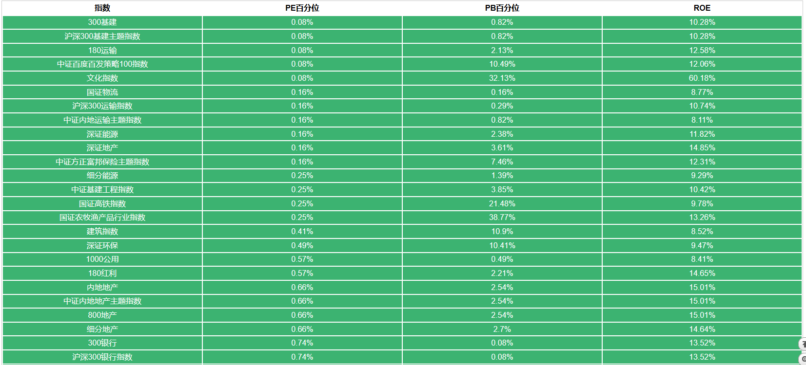
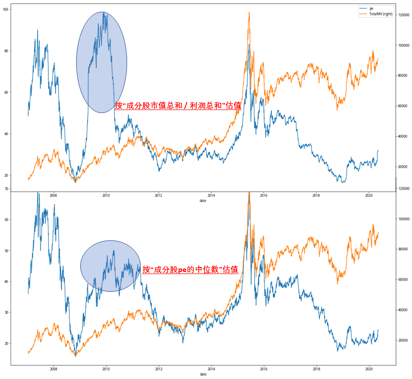

# 聚宽学习周记十九：计算A股市场所有指数的估值市盈率

本周基于@江南有大树的[指数估值自动报表系统——源代码](https://www.joinquant.com/view/community/detail/20497)进行了改写，让它可以支持对A股市场所有股票指数的估值计算。这篇周记会附上改写后的源代码文件和研究文件，可以按照原来文章那样发布成自动估值报表，即每天给人发送邮件传送所有股票指数的估值。

## 一、修改方案

由于前面三周已经解释过@江南有大树提供的源代码文件，所以我们可以知道源代码当中各个部分的功能是什么。这次修改主要是在合适的地方添加一些修改，主要有下面几个方面。

**修改点一：在get_valuation_table()获取所有指数**

之前的估值表仅仅获取`index_list`包括的20个指数，现在为了支持所有的指数我们需要调用`get_all_securities`获取当前国内市场上所有的指数数据。另外，在处理所有指数的估值数据的时候可能有些指数没有估值数据（*这个原因我还没有找到*），因此也要进行排除。

```
def get_valuation_table():
    valuation_dict = get_index_pe(index_list)
    quantile_dict = dict()
    for ind, val in valuation_dict.items():
    ...

def get_valuation_table():
    all_index = list(get_all_securities(['index']).index.values)  # 修改点1
    valuation_dict = get_index_pe(all_index)
    quantile_dict = dict()
    for ind, val in valuation_dict.items():    
        if (len(val.index) != 0): # 修改点2：过滤空的DataFrame  
            pe, pe_quantile = get_latest_quantile(ind, 'pe', 5, val)
            pb, pb_quantile = get_latest_quantile(ind, 'pb', 5, val)
    ...
```

**修改点二：在get_index_pe()进一步过滤**

在函数`get_index_pe()`里会循环遍历`index`里的所有指数，同时获取对应的估值市盈率/pe，然而我们传入的指数里面并不是所有的都是股票指数，有些可能是债券的，因此我们需要添加“股票指数”的过滤条件。

```
def get_index_pe(index=None):    
    if index == None:
        index = ['000016.XSHG', '000300.XSHG', '399905.XSHE'] # 默认获取上证50，沪深300，中证500三支指数
    index_pe = {item : get_pe_pb(item, get_security_info(item).start_date) for item in index if is_only_stock(item) == True} # 修改点      

    return index_pe

def is_only_stock(index):  # 新增函数判断指数是否为股票指数
    securities = get_index_stocks(index)
    if (len(securities) > 0):    
        info = get_security_info(securities[0])        
        return (info.type == 'stock')
    return False    
```

**修改点三：在calc_index_valuation()添加异常处理流程**

我们经过前面两步修改之后基本可以满足要求，但个别的股票指数由于已经停止更新了，所以对于有些日期里面调用`get_fundamentals()`获取估值数据的时候会为空，如果没有异常处理那么程序执行的时候就会崩溃。比如“000976.XSHG（新华金牛）”只有2014-02-18到2017-04-27的记录，如果后去2017-04-27之后的估值数据就有问题了。

```
def calc_index_valuation(index_code, start_date, end_date=datetime.datetime.now().date() - datetime.timedelta(days=1)):

    def iter_pe_pb(): # 这是一个生成器函数
        trade_date = get_trade_days(start_date=start_date, end_date=end_date)        

        for date in trade_date:
            stocks = get_index_stocks(index_code, date)
            q = query(valuation.pe_ratio,
                      valuation.pb_ratio
                     ).filter(
                              valuation.pe_ratio != None,
                              valuation.pb_ratio != None,
                              valuation.code.in_(stocks))
            df = get_fundamentals(q, date)            
            if (len(df.index) == 0): # 异常处理，如果为空进行处理
                return pd.DataFrame()# 可以用continue替代
            ...
```

这样修改之后收到的邮件里面估值表就比较长了，如下只截取了最前面的一屏：



需要说明的是@江南有大树在源代码里面使用的指数估值方法，计算的是指数对应成分股市盈率的中位数。我在[聚宽学习周记十：详解“价值低波（中）-- 市盈率研究”](https://www.joinquant.com/view/community/detail/4f9db6cbc7075f4577229e1b21d70661)分析@Gyro的一篇笔记时看到他对指数估值的计算方法是用指数对应成分股的“总市值/总利润”进行的。这两种估值方法大部分时间趋势一致，但少部分时间会有一些差别，如下图所示：



我们知道了估值的公式，了解它们的原理，这样就能够更好地去分析了。所以这里要特别点名一下它们的异同。


## 二、上周计划任务

### 1. 尝试完成上周布置的两个任务。

A. 继续完善[指数估值自动报表系统——源代码](https://www.joinquant.com/view/community/detail/20497)里自动报表系统的改写，功能完成之后看是否能够在布局上做得更美观一点。

目前已经在跑模拟，每天发邮件了。但目前没有动力去优化布局，看来这种锦上添花的工作不应该设置为主要任务，因为没有一定的压力和兴趣很难将注意力转移到这上面，特别是在时间本身比较紧张的情况下。因此，下周先取消这个布局优化的任务，尝试其他任务。

B. 在理解函数`send_message()`的时候发现聚宽本身定义了这个函数用来发送微信消息，当前自己在进行ETF定投，都是使用聚源数据提供的指数估值来进行决策，受这篇文章的启发其实可以尝试手动计算当前指数的估值，这样每天就可以实时掌握指数的估值状态了。

未做。

### 2. 另外一个想法是扩大指数估值的统计范围，从当前支持的20只指数扩展到所有指数，然后取前50位。

目前已经实现了所有指数的扩展，是否取50位目前感觉不到有什么吸引力。接下来可以做的工作是如何将这些数据应用到实践中，比如构建更大概率盈利的策略等等。


## 三、本周新学内容

### 1. 模拟交易的运行规则

将策略发布到模拟交易之后周三下午一直等着邮件发送过来（因为设定的是按日，每天14：30运行），结果等了半天到晚上一直没有收到邮件。今天早上再次确认才发现这个模拟交易的运行不是实时的，而是延迟了差不多12个小时。我也总算明白了模拟交易界面上的“延时运行”意味着什么。

这让我不由得想起上周从“策略研究”模块到“模拟交易”模块的切换的调试经验，很多知识点其实在文档里面已经写明了，但因为没有采用更有效的学习方法而主动尝试，结果反倒花了不少时间，也弄得自己差点崩溃。尽管多花点时间记忆深刻，但是如果崩溃了没有信心，学习进程说不定就止步于此了。意识到这点后，我便在聚宽“帮助”文档下面的“常见问题”进行搜索，果然找到了[模拟交易](https://www.joinquant.com/help/api/help?name=faq#%E6%A8%A1%E6%8B%9F%E4%BA%A4%E6%98%93)相关的一系列问题，第一个回答便有：

```
普通用户时限为永久的模拟交易，统一在收盘后延时运行（2019-12-01起）。 延时运行的模拟交易，交易数据统一在第二天开盘前更新，并且无法开启微信通知，分钟级、Tick级模拟交易不展示当日收益。运行时间的变更将会在模拟交易下一次运行时生效。如果您想在交易时间实时运行模拟交易，可以

1，使用积分兑换限时模拟交易位，限时模拟交易位到期后将会关闭，无法再次开启，请注意及时续费

2，成为VIP或SVIP，不仅可以实时运行模拟交易，还可以在高峰排队时优先运行，VIP/SVIP到期后将会恢复原先的运行时间
```

### 2. 数据存取专用函数

这周花时间重新读了下聚宽API提供的数据存取服务函数，因为上周不知道那几个专用函数，特别是研究环境和模拟环境的，我尝试了好几个小时去进行debug，做了不少无用功。

- 研究环境中可以直接使用python的文件读写函数
- 但回测环境中必须使用聚宽提供的write_file/read_file进行文件的读写

参考：

- [JoinQuant 心得——数据存取](https://www.joinquant.com/view/community/detail/1856fb977f1306b847882a138837d7d2)
- [【有用功】在回测及模拟交易中读取/写入研究中不同格式的文件](https://www.joinquant.com/view/community/detail/b048a3e848d190ad810c3930fb07a4dc)


## 四、下周学习任务

A. 借着对这一波指数市盈率估值的理解调整当前etf定投的估值参考标准。

B. 在理解函数`send_message()`的时候发现聚宽本身定义了这个函数用来发送微信消息，当前自己在进行ETF定投，都是使用聚源数据提供的指数估值来进行决策，受这篇文章的启发其实可以尝试手动计算当前指数的估值，这样每天就可以实时掌握指数的估值状态了。
