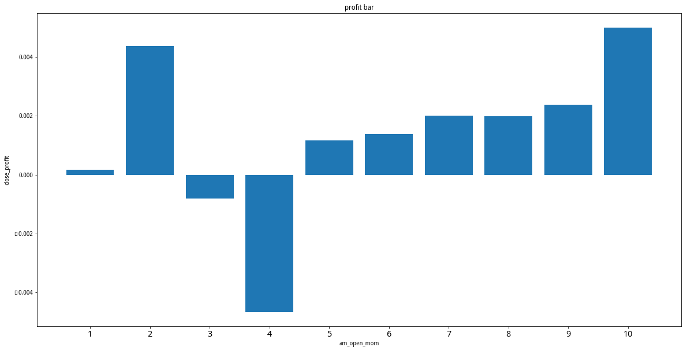
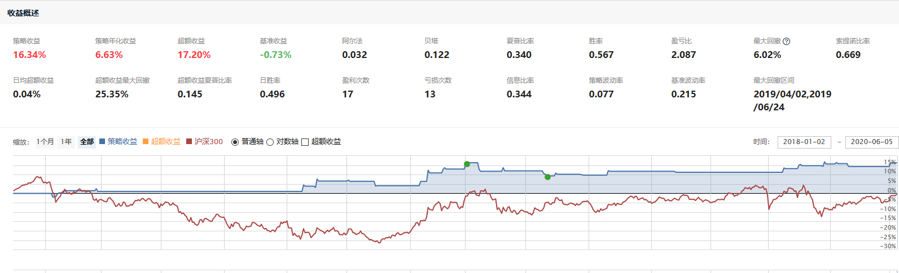

# 聚宽学习周记二四：简单动量策略的一次尝试

本周按照前两周对@云帆的[高频因子探索——动量交易](https://www.joinquant.com/view/community/detail/22472)学习后的理解尝试着写了一个很简单的策略。基本思路是每个交易日开盘第6分钟计算开盘时的动量，如果动量超过0.01（也即开盘后第6分钟的涨幅为1%），那么执行买入交易；收盘后进行卖出。由于当前A股市场不支持T+0交易，当日买进的无法卖出，因此只能在第二天开盘时进行卖出操作。

尝试的基本结论是该简单的策略在市场震荡的时候能够保持正向还算不错的收益，但是在市场行情好的时候则表现不佳。本文后面附上的是相关的研究文件和策略回测。本周的笔记主要是解释研究文件中的代码，在这之前先回顾一下@云帆在[高频因子探索——动量交易](https://www.joinquant.com/view/community/detail/22472)使用到的基本思路。


## 一、动量知识回顾

在按照自己的思路来进行动量分析的时候，发现并没有完全理解[高频因子探索——动量交易](https://www.joinquant.com/view/community/detail/22472)里面的内容，也就是说我在[]()里面对于“收益率计算”的那部分讲解其实不够细致。这里先将上周动量研究的思路复习一下，实际上里面有两条线，第一条线是接用动量来研究可能的规律；第二条线是根据假设来对动量的研究结论进行收益率试算。

1. 规律的探寻

首先，获取一段日期内每一天沪深300指数所有成分股的动量数据，并保存为字典类型的数据，字典以日期为“键”，以对应日期所有300只样本股的动量数据为“值”。

```
2019-01-02

             open_profit  next_profit  back_profit
000001.XSHE     0.002165    -0.010057    -0.011388
000002.XSHE    -0.001455    -0.006557    -0.031524
000063.XSHE     0.009498    -0.008480    -0.012597
……

2019-01-03

             open_profit  next_profit  back_profit
000001.XSHE     0.002216     0.002972    -0.019108
000002.XSHE     0.002251    -0.002992    -0.047088
000063.XSHE     0.001596     0.014887    -0.018002
……
```

然后，将所有这些数据进行按行合并，并且将index由样本股代码更改为数字序号。并从中抽取一部分数据来进行分析，主要是通过画热力图和条形图来看是否有明显的规律。

```
合并动量数据：
             open_profit   back_profit   next_profit
1               0.002165     -0.011388     -0.010057
2              -0.001455     -0.031524     -0.006557
3               0.009498     -0.012597     -0.008480
……
4               0.002216     -0.019108      0.002972
5               0.002251     -0.047088     -0.002992
6               0.001596     -0.018002      0.014887

截取部分数据：
             open_profit   back_profit   next_profit
3               0.009498     -0.012597     -0.008480
……
4               0.002216     -0.019108      0.002972
```

之后，对截取的这部分数据进行分层处理，也就是将`open_profit`, `back_profit`两列使用对应列百分比来替代。这些数据就是画图时候的最终输入数据了。

```
             open_profit   back_profit   next_profit
3                    2.0           7.0     -0.008480
……
4                    5.0           1.0      0.002972
```

2. 计算收益率

收益率计算的处理过程和上面是不一样的，它的输入数据并不是上面最终的“从所有动量数据里面截取的部分，并进行分层处理后的数据”，而是上面第一步里面获取到的“按照日期和对应日期里所有样本股动量数据组成的字典数据”。它是如何通过这些动量数据来进行收益率计算的？

我们已经拥有了每天的沪深300股成分股的数据，并且根据“规律的探寻”已经知道了“开盘时的动量可能对收盘价有一定的影响”，所以我们就需要评估并且选择这种影响，于是有：

- 对每一天的300只样本股的开盘动量进行分层，共分10层。这里面每层实际上代表着“1只或者多只样本股”。
- 选择特定的层来计算收益，这里面的意思包括：
  - 选择特定的层相当于在指定期限内每个交易日都选择特定的层；
  - 这里“特定的层”就相当于“300只股票里面开盘动量处于特定层的那些股票”；
  - 这样，其实就相当于每个交易日都在不停地买进/卖出不同的股票集合。
- 最后计算每天的累计收益，然后与沪深300指数的基准收益进行对比。

对于收益率的计算上周笔记里我觉得应该讲清楚了，这里就不再说啦。


## 二、代码解释

如下研究文件里面的代码主要是想按照前两周学习到的思路来重新验证下交易日内的动量效果。如果能够确定交易日开盘价和收盘价之间的大致关系，那么就可以写作策略来进行验证了。比如下面这张图里面是沪深300指数2020-01-01到2020-06-06开盘价和收盘价之间的基本关系：



从中大致可以看到当开盘价处在分位数10的时候收盘价的平均涨幅最高，但分位数意味着什么呢？它在这里不是一个绝对值，而是会根据选定的交易日区间的不同而不同。总的来说可以简单概括为“如果开盘的时候涨得好，那么收盘的时候大概率都会涨得好”。

但是，尽管得出了这个结论，在制定策略的时候你必须要经过自己的调试来解决“开盘的时候动量超过什么值时”才执行买入交易这样具体的问题。我在策略里面是指定了“1%”，也就是当开盘第6分钟的价格相对于开盘时上涨超过1%的时候就执行买入，然后第二天卖出，以此来测验。

闲话不多说了，先看看下面这部分的研究代码：

```
class DailyMomentum(object):
    def __init__(self, index, start, end):
        self._half_day_minutes = 120        
        self._index = index
        self._start_date = start
        self._end_date = end
        self._df = pd.DataFrame()

    def calculate_momentum(self, date, steps):
        # 获取指定交易日内240分钟的行情数据
        date += datetime.timedelta(days=1)
        df = get_price(self._index, count=240, end_date=date, frequency='minute', fields=['close'])        

        # 按照步长steps计算上午、下午开盘时的动量
        open_mom = df.pct_change(steps)
        am_open_mom = open_mom.iloc[steps]    
        pm_open_mom = open_mom.iloc[self._half_day_minutes + steps]    

        # 计算上午、下午收盘时的动量，用来表示上午、下午相对于开盘时的收益
        close_mom = df.pct_change(self._half_day_minutes - 1)
        am_close_mom = close_mom.iloc[self._half_day_minutes - 1]    
        pm_close_mom = close_mom.iloc[2*self._half_day_minutes - 1]
        close_profit = (df.iloc[239] - df.iloc[0]) / df.iloc[0]

        # 将动量和收益拼接为新的dataframe，并返回
        new_column = [am_open_mom, pm_open_mom, am_close_mom, pm_close_mom, close_profit]
        new_index = ['am_open_mom', 'pm_open_mom', 'am_close_profit', 'pm_close_profit', 'close_profit']
        mom_df = pd.DataFrame(new_column, index=new_index)

        return (mom_df.T)


    def collect_momentums(self):                
        trade_days = get_trade_days(self._start_date, self._end_date)

        # 将多天的动量数据拼接在同一个DataFrame里，并且重写index为日期
        mom = [self.calculate_momentum(date, 5) for date in trade_days]
        df = pd.concat(mom)
        df.index = trade_days

        self._df = df        


    def replace_column_with_quantile(self, data, column, layer):    
        flags = [n/layer for n in range(1, layer + 1)]    
        quantiles = data[column].quantile(flags)        

        for n in range(len(quantiles)):        
            data[column][data[column] <= quantiles.values[n]] = n + 1            


    def draw_bar(self, data):    
        group_data = data.groupby(data.columns[0]).mean()
        index = np.arange(1, len(group_data) + 1)

        plt.figure(figsize=(20,10))
        plt.bar(index,group_data[data.columns[1]].values)
        plt.title('profit bar')
        plt.xlabel(data.columns[0])
        plt.ylabel(data.columns[1])
        plt.xticks(index,fontsize=15)    

    def calc_base_profit(self):
        base_price = get_price(self._index, self._start_date, self._end_date, fields=['close'])['close']        
        base_profit = base_price.pct_change().dropna()
        base_profit_cump = (base_profit + 1).cumprod()

        return (base_profit_cump[-1] - 1)


    def analyze(self):        
        self.collect_momentums()

        data = self._df.copy()
        am = data[['am_open_mom', 'close_profit']]
        self.replace_column_with_quantile(am, 'am_open_mom', 10)        
        self.draw_bar(am)

        for layer in range(1, 11):
            layer_profit = am[am['am_open_mom'] == layer]
            layer_profit['cum_profit'] = (layer_profit['close_profit'] + 1).cumprod()
            profit = layer_profit['cum_profit'][-1] - 1
            print("选择层 %d 的收益 = %f" % (layer, profit))

        print("指数 %s 的基准收益 = %f" % (self._index, self.calc_base_profit()))

        #pm = data[['pm_open_mom', 'pm_close_profit']]
        #self.replace_column_with_quantile(pm, 'pm_open_mom', 10)
        #self.draw_bar(pm)


a = DailyMomentum('000300.XSHG', '2020-01-01', '2020-06-06')
a.analyze()
```

之所以将多个函数写到一个类里面的原因是方便数据的共享，比如日期、运算过程中的中间变量等。这里面共包含了`__init__()`, `calculate_momentum()`, `collect_momentums()`, `replace_column_with_quantile()`, `draw_bar()`, `calc_base_profit()`和`analyze()`共7个函数，分别解释如下。

**函数 __init__()**

这个函数是class的初始化函数，用来在创建对象的时候执行一些变量的初始化。比如我们在使用这个类的时候必须要创建对象：

```
a = DailyMomentum('000300.XSHG', '2020-01-01', '2020-06-06')
a.analyze()
```

在创建的时候就会用我们传入了证券代码、起始日期和结束日期三个参数来执行初始化操作。

**函数 analyze()**

这个函数相当于是使用这个类提供服务的入口函数，专业点可以用“接口”、“API”来描述。这个函数里面会调用其他子函数来完成特定的功能。

比如这里面它先后执行了如下步骤：

- 调用`collect_momentums()`来获取制定多个交易日的动量数据，包括了上午和下午的动量数据。
- 选取上午的动量数据，然后调用`replace_column_with_quantile()`来完成对这部分动量数据的分层处理过程，即用百分位取代开盘时的动量。
- 调用`draw_bar()`来绘制开盘时的动量与收盘时涨幅的柱状图。
- 最后分别打印出选择不同的层所对应的整个指定的交易日区间的总收益。

**函数 collect_momentums()和calculate_momentum()**

函数`collect_momentums()`会收集多个交易日的动量数据，然后将它们拼接在一起。主要的计算过程是在函数`calculate_momentum()`里面，包括如下步骤：

- 首先，获取指定交易日所有240分钟的收盘价数据。
- 然后，调用`pct_change()`函数来进行涨幅的计算，比如指定了`steps = 5`，那么会依次计算当前分钟相对于前5分钟的涨幅，分别获取到上午开盘后/下午开盘后第steps + 1分钟的动量数据。
- 之后，再次调用`pct_change()`函数计算上午收盘相对上午开盘时和下午收盘相对于下午开盘时的动量数据，也即“收益”。由于我们需要衡量，上午开盘相对于整天的收益影响，因此我们也计算了整天收盘相对开盘时的收益`close_profit`。
- 最后将这些数据组合成一个DataFrame类型的数据。

**`replace_column_with_quantile()`**

这个函数完成分层处理的操作，“分层处理”提了很多遍了哈，无非是根据动量数据来排个名，只不过排名参考的是百分位。在研究里面主要是对开盘时的动量数据进行分层处理，之后方便观察不同层的动量对收益的可能影响。

**`draw_bar()`**

这个函数是负责画图的，横坐标轴的数据为“层”，众坐标的为“收益”。通过图示我们能够更便捷地看到两者之间的关系。而在开头提到的开盘时较高的动量能够对应较高的收益也便是从图里面得出的。

由于图示实际上受数据集的限制，且历史数据无法代表未来。我们是无法确保这样的结论是否可靠的，但这算是给了一些基本的线索，让我们可以继续玩。

**`calc_base_profit()`**

这个函数是用来计算基准收益的，这里面的计算过程我在上周的笔记[聚宽学习周记二三：详解@云帆“高频因子探索—动量交易”（下）](https://www.joinquant.com/view/community/detail/b4b0f20fd76b228c921b687af5e6db3c)里面已经详细的叙述过了，主要是要理解`base_profit_cump = (base_profit + 1).cumprod()`。这里不再重复了哟


最后按照如上的研究写了一个简单的策略，测试了从2018年至今交易中证500ETF的收益，还算可以。单纯回测2018年的也还行，但是回测2019年的呢收益就逊色很多啦。所以我前面才提到这种策略对于震荡行情下还是有一些用处。当然，这仅仅是实验，思路和实现上都比较粗陋。




## 三、上周计划

1. 理解了这篇文章之后觉得有两个作业要做完来加深理解，其一为重新实现文中的函数，并且按照上面自己提到的以半天计算动量的方式来进行探索；其二为基于探索的结果写作简单的策略来观察执行效果。

完成。见本篇笔记后面附带的研究和策略。

2. 上周遗留作业：基于本周学习到的新的动量计算算法，以及前面两周研究指数上面的一些理解，尝试着写作基于ETF的交易策略。

未做。


## 四、下周计划

在第15周的时候已经学习了“波动”、“指数市盈率”、“大中小盘股”、“指数ETF轮动”、“动量”等概念，因此决定趁热打铁，挑选围绕着这些新接触的概念相关的如下笔记来学习：

- [相信波动率还是相信基本面？波动与估值因子A股驱动力测试](https://www.joinquant.com/view/community/detail/17255)
- [小盘价值股策略2.01，年化131%，回撤8.8%](https://www.joinquant.com/view/community/detail/16755)
- ~~[高频因子探索——动量交易](https://www.joinquant.com/view/community/detail/22472)~~
- ~~[指数估值自动报表系统——源代码](https://www.joinquant.com/view/community/detail/20497)~~
- [波动率因子在A股市场探索](https://www.joinquant.com/view/community/detail/2c6ae14a9e675394762eb24061e6207c)

结果这两个月来才学习了其中的两篇。下周学习[波动率因子在A股市场探索](https://www.joinquant.com/view/community/detail/2c6ae14a9e675394762eb24061e6207c)的内容。


@洪武 推荐了一个基金参考策略：[](https://bigquant.com/community/t/topic/181963)，说可以实现下。
