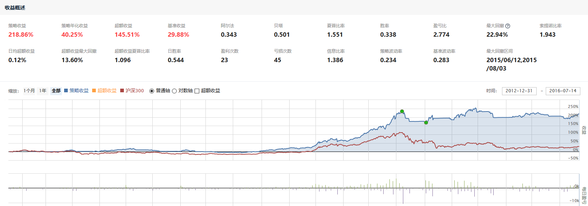
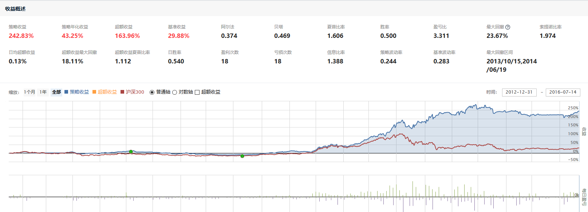
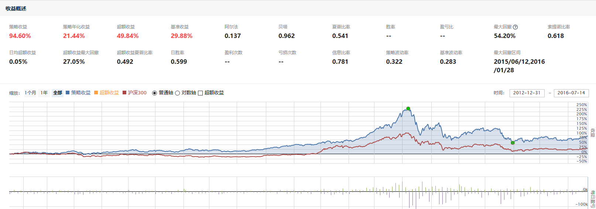
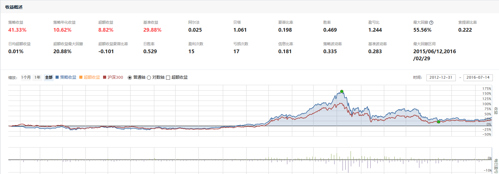
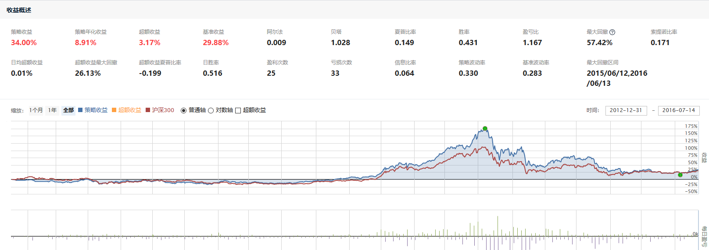
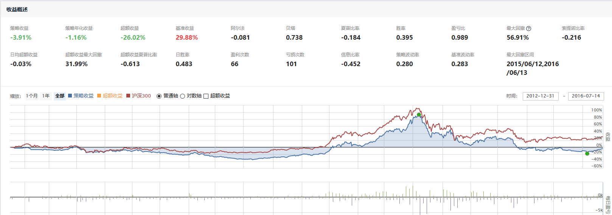
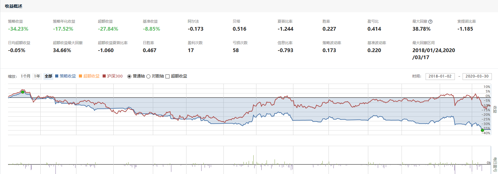

# 聚宽学习周记十四：详解@东南有大树的“ETF二八轮动对冲模型”（中）

## 一、代码解释

本来觉得这一周可以分析[用指数战胜指数，ETF二八轮动对冲模型](https://www.joinquant.com/view/community/detail/19490)里面的策略了，然而并木有。因为我发现要看完文中的研究内容并理解就要花不少时间了，研究中的思路不难懂，难点在于如何使用Python来进行想法的验证和实现。所以，决定这周先将研究部分的代码进行讲解。

**一、计算指数动量**

```
import numpy as np
import pandas as pd
import datetime
import seaborn as sns
from jqdata import *

sns.set(font='serif')
plt.rcParams['axes.unicode_minus'] = False

trade_date = get_trade_days(end_date=datetime.datetime.now(), count=50)
index_codes = ['000300.XSHG', '000905.XSHG']  # 沪深300，上证500
start_date = '2013-03-15'
end_date = trade_date[-2]

'''计算指数的平均市场与市盈率'''
def func(index):
    q = query(valuation.code,
              valuation.market_cap,
              valuation.pe_ratio).filter(valuation.code.in_(get_index_stocks(index)))

    df = get_fundamentals(q, end_date)
    return {'market_cap':df['market_cap'].mean(),'pe_ratio':df['pe_ratio'].mean()}

dict_index = {get_security_info(index).display_name: func(index) for index in index_codes}
pd.DataFrame(dict_index).T

'''指数的历史价格趋势'''
dict_close = {get_security_info(code).display_name:\
              get_price(code, start_date, end_date)['close']\
              for code in index_codes}
pd.DataFrame(dict_close).plot()
```

这一节的演示尽管标题为“一、计算指数动量”，但实际上并没有开始计算动量，而是对比了沪深300和中证500指数在市值、市盈率和走势上的不同，这里的市值和市盈率计算的是指数对应的样本股的平均市值和平均市盈率。最后给出了指数因为市值不同在走势上的差异性，也就是“大盘股和小盘股进行轮动”的基本背景。

1. `import`部分

开头的import语句我讲了十来次了，估计再讲就有点过了。这里需要提一下`import seaborn as sns`，这个函数库是用来绘图的。在可视化功能上，Pandas的Series和DataFrame均支持绘图功能，另外还有专门的绘图函数库matplotlib以及以下几种更加强大的专用模块：

- [Altair](https://altair-viz.github.io/)：基于Vega, Vega-Lite的统计可视化Python库。
- [Bokeh](https://docs.bokeh.org/en/latest/)：为现代浏览器而设的交互式可视化Python库。
- [seaborn](https://seaborn.pydata.org/)：基于matplotlib的数据可视化Python库。

理解了这个`seaborn`之后，就知道后面的`sns.set(font='serif')`用来设置显示的字体。

后面的`plt.rcParams['axes.unicode_minus'] = False`是用来配置Python默认的绘图函数库Matplot的参数的，这句代码的作用是在绘制的图形上正常显示出负号（`-`）。

参考：

- [plt.rcParams[]](https://www.cnblogs.com/pacino12134/p/9776882.html)
- [Matplotlib中plt.rcParams用法（设置图像细节）](https://www.cnblogs.com/douzujun/p/10327963.html)

2. 指数成分股的平均市值和市盈率计算

代码中定义的函数`func()`是计算给定指数对应样本股的平均市值和平均市盈率，首先是调用聚宽服务函数`get_fundamentals()`获取指定日期的指数样本股的市值和市盈率，然后再将平均市值和平均市盈率存储为字典类型返回。注意这个函数一定要使用`query对象`，如果忘记了query对象是什么可以回顾[聚宽学习第二周周记：获取多只股票市盈率](https://www.joinquant.com/view/community/detail/3cc22ef4218363686917d718ba90f4f8)，里面有介绍它的概念。

后面的`dict_index = {get_security_info(index).display_name: func(index) for index in index_codes}`是获取多只指数的平均市值和平均市盈率数据，然后存储为字典类型。理解这句代码的要点有两个：一个是字典数据类型；另一个是“解析表达式”，常见的是“列表解析”，而这里使用的是“字典解析”，这种表达式能够很方便地从一个列表来创建一个新的列表（字典解析式）或者新字典（字典解析式）。

3. 指数的走势

这里再一次使用了“字典解析式”，循环遍历存储有不同指数的列表`index_codes`，然后对于里面每个元素都分别调用聚宽服务函数`get_security_info()`和`get_price()`分别映射为字典元素的健和值。

比如，下面是针对字典解析式和非字典解析式的比较，可以看出应用解析式是非常间接的。我想，这也是很多人说python简洁的原因之一，代码末尾不用添加标点符号，一句代码又顶其他语言的N句。爽歪歪~

```
# 字典解析式代码
dict_close = {get_security_info(code).display_name:\
              get_price(code, start_date, end_date)['close']\
              for code in index_codes}

# 非字典解析式代码
dict = {}
for code in index_codes:
  name = get_security_info(code).display_name
  price = get_price(code, start_date, end_date)['close']
  dict[name] = price
dict_close = dict              
```

**二、计算大小盘指数的动量**

```
'''指数20日前的价格与昨日价格获取'''
price = {get_security_info(index).display_name:\
         get_price(index, end_date=trade_date[-2], count=50)['close'].values[[-20, -1]]\
         for index in index_codes}

'''计算前20日动量'''
ratio = {key: {'ratio':(value[1] - value[0]) / value[0]} for key, value in price.items()}

'''相关ETF的价格趋势'''
etf_list = ['510300.XSHG', '510500.XSHG']
dict_close = {get_security_info(code).display_name:\
              get_price(code, start_date, end_date)['close']\
              for code in etf_list}

pd.DataFrame(dict_close).plot()
plt.show()
```

在上面理解了字典解析式之后上面这段动量计算的代码就更容易看懂了，不然你看到通篇都是这个“大括号+for循环”可能容易晕菜。

`price = {get_security_info(index).display_name: get_price(index, end_date=trade_date[-2], count=50)['close'].values[[-20, -1]] for index in index_codes}`这句代码里面的字典解析式是为了获取多只指数的数据：键是指数的中文名称，值是指数前1和前20交易日的收盘价。在这里获取收盘价的时候使用了`dataframe['close'].value[[-20,-1]]]`这样堆叠在一起的代码当然是Pandas强大的灵活性所赐，这里面包含有这么几个步骤：

- 首先，`dataframe['close']`是从DataFrame类型的二位数据表里获取`close`这一列数据，它的类型是Series类型。
- 其次，`dataframe['close'].value[]`是从Series类型里面获取指定的值，要记得Series类型的数据尽管是一维数据类型，但它本身是有索引（index）和值（value)两个属性的。
- 最后，`dataframe['close'].value[[-20, -1]]`是从Series里面获取倒数第1和倒数第20个数据，-1和-20这里都是值的索引。

得到的price是字典类型，类似“{'沪深300': array([4138.51, 3734.53]), '中证500': array([5763.86, 5147.2])}”，然后基于price再计算动量，也就是前1个交易日相比前20个交易日的涨幅数据，然后依然保存为字典类型，结果类似“{'沪深300': {'动量': -0.09761484205668224}, '中证500': {'动量': -0.1069873314063839}}”。

最后这两句查看沪深300ETF和中证500ETF的走势与前面查看沪深300和中证500指数走势的用法一样。

**三、验证ETF与指数的跟踪误差值**


```
'''数据相关程度计算'''
a=[0.6557,0.0357,0.8491,0.9340,0.6787];
b=[0.7315,0.1100,0.8884,0.9995,0.6959];
print('计算一\n',mean(multiply((a-mean(a)),(b-mean(b))))/(std(b)*std(a)))
print('计算二\n', corrcoef(a,b))

'''计算指数之间的相关程度'''
stock_base = '000300.XSHG'
index_list = get_all_securities(types=['fund'], date=end_date).index
func = lambda index_a, index_b: np.corrcoef(get_price(index_a, start_date, end_date)['close'].values,
                                            get_price(index_b, start_date, end_date)['close'].values
                                           )[0, 1]
df_corr = pd.DataFrame({index : {'name':get_security_info(index).display_name,\
                                 'corrcoef': func(stock_base, index)}\
                        for index in index_list}).T.dropna()
df_corr = df_corr.sort_values(by=['corrcoef'], ascending=True).head()
df_corr

'''正当关指数与ETF趋势对比'''
compare_codes = (stock_base, df_corr.index[0])
df_test = pd.DataFrame()
for index in compare_codes:
    df_test[get_security_info(index).display_name] = get_price(index, start_date, end_date)['close']

df_test.plot(subplots=True)
plt.show()

'''找出与ETF负相关程度最高的ETF'''
def func(code):
    etfs = get_all_securities(types=['fund'], date=end_date).index
    func = lambda index_a, index_b: np.corrcoef(get_price(index_a, start_date, end_date)['close'].values, get_price(index_b, start_date, end_date)['close'].values)[0, 1]
    df_corr = pd.DataFrame({etf : {'corrcoef': func(code, etf)}\
                            for etf in etfs}).T.dropna()
    df_corr = df_corr.sort_values(by=['corrcoef'], ascending=True).head()
    return df_corr.index[0], df_corr.values[0]
eft_list = map(func, etf_list)
result = list(eft_list)
result
```

1. 数据相关性

衡量数据之间的相关性一个常用的数学名词就是“协方差系数”，这个名词在[聚宽学习周记十一：沪深300相关指数与一个简单的策略](https://www.joinquant.com/view/community/detail/6f4ec5802b1710be8e39248afec64a64)介绍“贝塔值”的时候已经提到过了，摘录解释如下：

> 那么协方差又是什么？前面提到的标准差和方差衡量的是单个变量的波动情况，而协方差是用来衡量两个变量之间的相关性。和上面的方差一样，协方差计算出来的结果也是有单位，并且由于有两个变量，所以它带上了两个变量的单位，这就不利于进行相关性比较了。比如我们想比较班级里面学生的“年龄vs体重”和“身高vs体重”相关性的大小，COV(年龄，体重)结果的单位是岁·千克，COV(身高，体重)结果的单位是米·千克，不好比较。继而引入了“协方差系数”，公式为 COV(X,Y)/Sm(X)Sm(Y)，这样计算出来的结果是不带单位的，便于比较。

所以第一段代码里的`mean(multiply((a-mean(a)),(b-mean(b))))/(std(b)*std(a))`就是手动计算两组变量a和b的相关性（协方差系数），而`corrcoef`函数是使用Python库中的函数来计算协方差矩阵，两者的结果是一样的，只不过后者呈现的数据更丰富，比如它也包含了a与a之间，b与b之间，b与a之间的相关性。

参考：

- [Python 数据相关性分析](https://www.jianshu.com/p/c83dd487df09)

2. 找出与ETF正相关程度最高的ET

其实这里不是像原版代码里面注释的那样计算指数之间的相关程度，而是计算“国内证券所有基金(fund)”的收盘价与沪深300指数的相关性系数，从中找到与沪深300走势最相关的基金。得到了如下结果，也就是可以看到300ETF（基金代码510300）与沪深300指数的走势相关性最好，相关性系数为 0.991915。

```
             corrcoef    name
510300.XSHG  0.991915  300ETF
159919.XSHE  0.990833  300ETF
160706.XSHE   0.98869   嘉实300
510180.XSHG  0.987206  180ETF
160807.XSHE  0.986034   长盛300
```

这里面的计算过程包括：

- 首先，获取所有基金代码，即`get_all_securities(types=['fund'], date=end_date).index`。
- 然后，定义一个匿名函数（lambda表达式），这个函数被用来计算相关性系数。
- 之后，又轮到了“字典解析式”上场，循环计算每个基金与沪深300指数的相关性系数。
- 最后，根据保存有所有相关性系数的字典创建DataFrame，然后排序选择最前面的几个基金。

需要注意的是上面代码中排序时候的`ascending`应该设置为`False`才能得出正相关性最大的基金列表，代码里面设置为`True`实际上得到的是负相关性最大的基金列表。所以大树兄研究里面的那幅图也是负相关对比。

3. 找出与ETF负相关程度最高的ETF

如果是从ETF里面找到和沪深300指数负相关程度最高的ETF，那么这段代码里面调用`get_all_securities`时传入的type应该是`ETF`。另外其实这段代码实现的功能在前面一段里面已经实现了，结果如下：

```
             corrcoef    name
150051.XSHE  -0.77903  沪深300A
165513.XSHE -0.761222    信诚商品
162411.XSHE -0.758347    华宝油气
161815.XSHE -0.748106    银华通胀
150022.XSHE -0.499745    深成指A
```

也就是沪深300A基金（证券代码150051）与沪深300相关性最低（负相关性最高，为-0.77903），但这是个分级基金。我们将代码中调用`get_all_securities`时的type从`fund`修改为`etf`，可以得到如下结果：

```
             corrcoef   name
159918.XSHE  0.592209  中创400
510410.XSHG  0.596138  资源ETF
159915.XSHE  0.651815    创业板
159920.XSHE  0.692733  恒生ETF
510170.XSHG  0.733464  商品ETF
```


**四、加入国债指数**

由于本周没有查看[用指数战胜指数，ETF二八轮动对冲模型](https://www.joinquant.com/view/community/detail/19490)里面的策略，所以我使用了自己基于上周学习的“蛋卷二八轮动”里面的策略进行对比：

负动量时空仓执行的回测结果如下：


负动量时买入国债指数的回测结果如下：



策略里面指数下跌的时候购买的是国债指数`000012.XSHG`，但看2013年1月1日——2016年7月14日这段时间的回测结果它的表现也没有强多少。

**五、使用负相关标的做“对冲”**

上面已经计算过与沪深300指数负相关最大的是沪深300A基金（证券代码150051），所以在负动量出现时购买沪深300A基金，得到的回测结果如下：



收益确实有所提升。


## 二、上周计划任务

### 1.按照[【量化课堂】斗牛蛋卷二八轮动原版策略实现](https://www.joinquant.com/view/community/detail/9434c4a9c9482c7d1071be947dd3558a?type=1)提到的思路对例子中的策略进行优化和对比。

**① 沪深300和中证500的对比**

首先是对比沪深300指数和中证500指数在走势上面的差异，可以写个简单策略来看它们之间的走势，比如我们设定“沪深300”为基准，那么只需要在开盘的时候直接买入“中证500指数”就可以了（聚宽当前支持指数交易），然后编译运行策略或者执行策略就可以看到这两个指数的走势图：



按照以前的经验，小市值的股票尽管盈利不稳定但是发展潜力大，所以波动较大市值股票更大。从走势图也可以看到代表着小市值企业的中证500指数相比代表大中市值企业的沪深300指数波动更大：行情走高的时候中证500涨幅更大，行情走低的时候中证500跌幅也更大。针对这种走势上的差异于是提出了优化策略—按周级别的简易二八轮动策略。

**② 按周交易的简易二八轮动策略**

每周五(或者本周的最后一个交易日)临近收盘时，计算沪深300指数和中证500指数在前1个交易日相比前20个交易日的涨幅。哪个涨幅大，那么就在收盘前买入对应的ETF持有一周，直至下一次的切换。



通过回测2013年1月1日——2016年7月14日的数据发现，以周为单位进行轮动获取到的收益实际上比单纯的中证500指数的收益还要低。可以说，这个策略是比较糟糕的。其中可能的原因包括：

- 按周进行交易无法捕捉到行情的快速变换，比如可能在5天之内已经下跌了很多；
- 同时如果中证500在5天之内快速上涨，那么由于按周交易当时持有沪深300就会错过快速的上涨。

所以在这简单的二八轮动策略上将按周交易改为按日交易。

**③ 按日交易的简易二八轮动策略**

将如上的策略从按周执行修改为按日执行之后发现回测的收益更低了，如下：



怎么回事？这是因为尽管从按周更改为按日执行后对于趋势的抓取更为敏感，所以它能够在抓取更大的涨幅。然而，在整个市场开始下跌的时候，由于仅仅在ETF300和ETF500之间轮动，因此并没有很好的止损，所以依然避免不了整体收益大幅折损的结果。

所以，我们要进一步优化：添加止损策略。

**④ 按日交易的简易二八轮动策略(带止损)**

止损策略的设计为：计算沪深300指数和中证500指数在前1个交易日相比前20个交易日的涨幅，如果检测到持仓证券对应的指数涨幅小于0的时候那么清空所持有的证券。直到检测到指数回升的时候再买入。



回测结果让人大跌眼镜：基准收益盈利29.88%，策略收益亏损3.91%。为什么？因为证券轮换得太过频繁了。

**⑤ 按日交易的简易二八轮动策略(带止损，降低频率)**

我们基于如上策略基础之上再做一次优化：

- 计算沪深300指数和中证500指数在前1个交易日相比前20个交易日的涨幅，如果检测到持仓证券对应的指数涨幅小于0的时候，清空所持有的证券。
- 计算沪深300指数和中证500指数在前1个交易日相比前20个交易日的涨幅，如果检测到持仓证券对应的指数涨幅大于0的时候，购买涨幅较大的那个指数对应的证券。
- 其他情况择持有证券不动。
  - 沪深300指数和中证500指数涨幅均小于0，说明处于下跌通道。
  - 已经持仓证券，也持有不动，直到对应证券涨幅小于0卖出。

执行的回测结果如下：


这也是我们上周“代码解释”部分详解的策略，也就是[【量化课堂】斗牛蛋卷二八轮动原版策略实现](https://www.joinquant.com/view/community/detail/9434c4a9c9482c7d1071be947dd3558a?type=1)后面附带的策略。

**⑥ 按日交易的简易二八轮动策略(带止损，降低频率，国债)**

我们在上面的基础之上再进行优化，也就是当沪深300和中证500指数均下跌的时候不是保持空仓，而是购买“国债”，这也就是[【量化课堂】斗牛蛋卷二八轮动原版策略实现](https://www.joinquant.com/view/community/detail/9434c4a9c9482c7d1071be947dd3558a?type=1)里面描述的“蛋卷二八轮动策略”的思路。


策略里面指数下跌的时候购买的是国债指数`000012.XSHG`，但看2013年1月1日——2016年7月14日这段时间的回测结果它的表现也没有强多少。

不过当前按日级别交易的策略即便在2013年1月1日——2016年7月14日这段时间的回测可以获取到200%多的收益，但是在2018年1月1日——2020年3月30日的回测结果却是-30%左右的收益，大大低于沪深300指数。



其他的优化可以通过调整参数，比如将“指数收益率涨幅小于0”修改为“指数收益率涨幅小于5%”来进行交易的判断等方式可以优化回测的结果。但是，其实我们是很难保证这种优化是否能够适应于未来的行情变化。所以，针对[【量化课堂】斗牛蛋卷二八轮动原版策略实现](https://www.joinquant.com/view/community/detail/9434c4a9c9482c7d1071be947dd3558a?type=1)里面描述的“蛋卷二八轮动策略”的理解和练习就先到这里了。


### 2.理解[用指数战胜指数，ETF二八轮动对冲模型](https://www.joinquant.com/view/community/detail/19490)中讲解的内容。

上面是我在阅读[【量化课堂】斗牛蛋卷二八轮动原版策略实现](https://www.joinquant.com/view/community/detail/9434c4a9c9482c7d1071be947dd3558a?type=1)时候所做的一些理解和尝试，最终差不多理解了整体的思路，但觉得该策略依然具有不稳定性。

于是回过头去阅读@江南有大树的这篇[用指数战胜指数，ETF二八轮动对冲模型](https://www.joinquant.com/view/community/detail/19490)的时候，当时觉得挺难理解的内容，现在一下子清晰了许多。大树的目的其实也是看到了“蛋卷二八轮动”在熊市时具有的较大波动，提出了一种新的思路，即通过找到另外与沪深300/中证500走势相反的指数ETF来进行对冲。


### 3.偶然在[银行股的配对交易策略研究](https://www.joinquant.com/view/community/detail/b80e9e60d6f39fa6c8e3b4cb3af4a07f?page=1#90895)的评论中发现银行股的波动小，那么如何选择出证券市场波动最大和最小的行业呢？


## 三、本周新学内容

无。

## 四、下周学习任务

### 1.完成对[用指数战胜指数，ETF二八轮动对冲模型](https://www.joinquant.com/view/community/detail/19490)里面的策略的解析。
### 2.偶然在[银行股的配对交易策略研究](https://www.joinquant.com/view/community/detail/b80e9e60d6f39fa6c8e3b4cb3af4a07f?page=1#90895)的评论中发现银行股的波动小，那么如何选择出证券市场波动最大和最小的行业呢？
