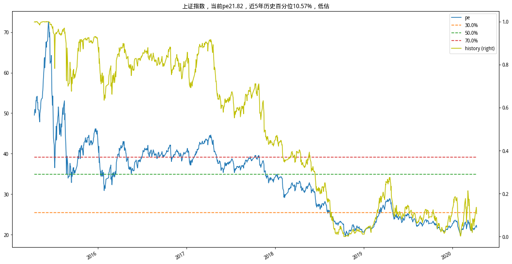

# 聚宽学习周记十六：详解@东南有大树的“指数估值自动报表系统”（上）

本周选择了@东南有大树的[指数估值自动报表系统——源代码](https://www.joinquant.com/view/community/detail/20497)来学习，原因是它的这篇研究拓宽了我对于聚宽服务的使用认识，想想可以将平时的研究学以致用，并且能够通过邮件定时提醒，还是很激动的。

不得不说大树兄的Python用得挺骚的，前面学习的他的一篇[用指数战胜指数，ETF二八轮动对冲模型](https://www.joinquant.com/view/community/detail/19490)里面的Python知识都让自己学习了好几天，这篇又出现了更多新的知识点，自然也花了不少时间，但还没有理解透彻。所以对大树兄这篇研究的学习要分成两部分，先把估值部分的主要代码结构弄清楚，再通过改写自动报表系统进一步理解其中的内容。


## 一、研究部分代码解释

```
def get_pe_pb(index_code, start_date, end_date=datetime.datetime.now().date()):
    '''获取PE/PB'''
    def iter_pe_pb():
        '''一个获取PE/PB的生成器'''
        trade_date = get_trade_days(start_date=start_date, end_date=end_date)   

        for date in trade_date:
            stocks = get_index_stocks(index_code, date)
            q = query(valuation.pe_ratio,
                      valuation.pb_ratio
                     ).filter(valuation.pe_ratio != None,
                              valuation.pb_ratio != None,
                              valuation.code.in_(stocks))
            df = get_fundamentals(q, date)
            quantile = df.quantile([0.25, 0.75])
            df_pe = df.pe_ratio[(df.pe_ratio > quantile.pe_ratio.values[0]) &\
                                (df.pe_ratio < quantile.pe_ratio.values[1])]
            df_pb = df.pb_ratio[(df.pb_ratio > quantile.pb_ratio.values[0]) &\
                                (df.pb_ratio < quantile.pb_ratio.values[1])]
            yield date, df_pe.median(), df_pb.median()

    dict_result = [{'date': value[0], 'pe': value[1], 'pb':value[2]} for value in iter_pe_pb()]
    df_result = pd.DataFrame(dict_result)
    df_result.set_index('date', inplace=True)
    return df_result


def loc_pe_pb(index_code):
    '''获取保存在本地的PE/PB数据'''
    file_name = get_security_info(index_code).display_name +'_pe_pb.csv'
    if os.path.exists(file_name):
        df_loc_pe_pb = pd.read_csv(file_name, index_col='date', parse_dates=True)

        return df_loc_pe_pb
    else:
        return pd.DataFrame()


def save_pe_pb(index_code, df_new, df_old=pd.DataFrame()):
    '''将数据保存或更新到本地，避免重复生成计算'''
    file_name = get_security_info(index_code).display_name +'_pe_pb.csv'
    if len(df_old) <= 0:
        df_new.to_csv(file_name)

    else:
        df = df_old.append(df_new)
        df.to_csv(file_name)


def GetPePb(index_code, start_date):
    df_old = loc_pe_pb(index_code)  # 判断本地是否有历史数据
    if len(df_old) <= 0:
        start_date = start_date  # 给定一个默认的起始时间
    else:

        start_date = df_old.index[-1]
    df_new = get_pe_pb(index_code,start_date=start_date)
    save_pe_pb(index_code, df_new=df_new, df_old=df_old)
    return loc_pe_pb(index_code)


def show_quantile(index_code, p, n, data):
    '''
    展示估值图
    '''
    _df = pd.DataFrame()
    df = data.copy()
    df.index.name = None

    # 一、计算当前百分位高度
    _df[p] = df[p]
    _df = _df.iloc[-n * 244:]
    p_high = [_df[p].quantile(i / 10.0) for i in [3, 5, 7]]
    for p_h, i in zip(p_high, [3, 5, 7]):
        _df[str(i / 10 * 100)+'%'] = p_h

    # 二、计算历史百分位高度
    def _func(c):
        low_p = c[c < c[-1]]
        value = low_p.shape[0] / c.shape[0]
        return value
    _df['history'] = df[p].rolling(n * 244).apply(lambda x: _func(x), raw=True)[-n*244:]

    # 三、计算评估语句
    low_p = _df[_df[p] < _df[p].iloc[-1]]
    quantile_now = low_p.shape[0] / _df.shape[0]  # 当前百分位值
    last_p = _df[p][-1]
    assessment = ''
    if 0 <= quantile_now < 0.1:
        assessment = '超低估'
    elif 0.1 < quantile_now < 0.3:
        assessment = '低估'
    elif 0.3 < quantile_now < 0.4:
        assessment = '适中偏低'
    elif 0.4 < quantile_now < 0.6:
        assessment = '适中'
    elif 0.6 < quantile_now < 0.7:
        assessment = '适中偏高'   
    elif 0.7 < quantile_now < 0.9:
        assessment = '高估'   
    elif 0.9 < quantile_now <= 1:
        assessment = '超高估'   

    title = '{}，当前{}{}，近{}年历史百分位{}，{}'.format(get_security_info(index_code).display_name,
                                              p, round(last_p, 2), n,
                                              str(round(quantile_now * 100, 2)) + '%', assessment)

    _df.plot(secondary_y=['history'], figsize=(18, 10), style=['-', '--', '--', '--', 'y-'], title=title)


def show_quantile2(index_code, p, data):
    '''
    展示估值图
    '''
    fig, _ax = plt.subplots(figsize=(18, 4), ncols=3, nrows=1)

    for n, ax in zip([3, 5, 7], _ax):
        _df = pd.DataFrame()
        df = data.copy()
        df.index.name = None

        # 一、计算当前百分位高度
        _df[p] = df[p]
        _df = _df.iloc[-n * 244:]
        p_high = [_df[p].quantile(i / 10.0) for i in [3, 5, 7]]
        for p_h, i in zip(p_high, [3, 5, 7]):
            _df[str(i / 10 * 100)+'%'] = p_h

        # 二、计算历史百分位高度
        def _func(c):
            low_p = c[c < c[-1]]
            value = low_p.shape[0] / c.shape[0]
            return value
        _df['history'] = df[p].rolling(n * 244).apply(lambda x: _func(x), raw=True)[-n*244:]

        # 三、计算评估语句
        low_p = _df[_df[p] < _df[p].iloc[-1]]
        quantile_now = low_p.shape[0] / _df.shape[0]  # 当前百分位值
        last_p = _df[p][-1]
        assessment = ''
        if 0 <= quantile_now < 0.1:
            assessment = '超低估'
        elif 0.1 < quantile_now < 0.3:
            assessment = '低估'
        elif 0.3 < quantile_now < 0.4:
            assessment = '适中偏低'
        elif 0.4 < quantile_now < 0.6:
            assessment = '适中'
        elif 0.6 < quantile_now < 0.7:
            assessment = '适中偏高'   
        elif 0.7 < quantile_now < 0.9:
            assessment = '高估'   
        elif 0.9 < quantile_now <= 1:
            assessment = '超高估'   

        title = '{}，当前{}{}，近{}年历史百分位{}，{}'.format(get_security_info(index_code).display_name,
                                                  p, round(last_p, 2), n,
                                                  str(round(quantile_now * 100, 2)) + '%', assessment)

        _df.plot(secondary_y=['history'],  
                 style=['-', '--', '--', '--', 'y-'],
                 title=title,
                 ax=ax,
                 legend=False)
    _ax[0].legend(loc='best')


def init(index_base=None):
    '''
    初始化数据缓存
    '''
    if index_base == None:

        index_base = ['000016.XSHG', '000300.XSHG', '399905.XSHE']  # 上证50，沪深300，中证500
    dict_index_base = dict()

    '''加载pe/pb'''
    for index in index_base:
        index_info = get_security_info(index) # 获取指数相关信息
        start_date = index_info.start_date  # 上市日期
        dict_index_base[index] = (GetPePb(index, start_date))  # 加载或重新计算pe/pb
    return dict_index_base


dic = init(['000001.XSHG'])
for index, data in dic.items():
    show_quantile(index, 'pe', 5, data)
```


### 代码片段一：函数`get_pe_pb()`

```
def get_pe_pb(index_code, start_date, end_date=datetime.datetime.now().date()):
    '''获取PE/PB'''
    def iter_pe_pb():
        '''一个获取PE/PB的生成器'''
        trade_date = get_trade_days(start_date=start_date, end_date=end_date)   

        for date in trade_date:
            stocks = get_index_stocks(index_code, date)
            q = query(valuation.pe_ratio,
                      valuation.pb_ratio
                     ).filter(valuation.pe_ratio != None,
                              valuation.pb_ratio != None,
                              valuation.code.in_(stocks))
            df = get_fundamentals(q, date)
            quantile = df.quantile([0.25, 0.75])
            df_pe = df.pe_ratio[(df.pe_ratio > quantile.pe_ratio.values[0]) &\
                                (df.pe_ratio < quantile.pe_ratio.values[1])]
            df_pb = df.pb_ratio[(df.pb_ratio > quantile.pb_ratio.values[0]) &\
                                (df.pb_ratio < quantile.pb_ratio.values[1])]
            yield date, df_pe.median(), df_pb.median()

    dict_result = [{'date': value[0], 'pe': value[1], 'pb':value[2]} for value in iter_pe_pb()]
    df_result = pd.DataFrame(dict_result)
    df_result.set_index('date', inplace=True)
    return df_result
```

该函数的功能是获取指定指数在特定日期范围的市盈率（PE）和市净率（PB）数据，其中使用到了两个对我来说是新的知识点，先将它们解释如下：

1. pandas中的`quantile()`

这个函数是用来求取分位数的，分位数是依照概率将样本数据分隔开的那个点，它的输入是一个百分比的概率，输出是和样本数据相同量级的值。比如我们常见的中位数，即是一个二分位数：一个数据集合中的中位数相当于有一半的数比它大，另一半的数比它小。

再举个例子，有10位同学在学期末取得的英语成绩分别为{60, 70, 87, 56, 35, 64, 28, 84, 89, 65}，我们想找到一个数值A，使得有20%的同学得分小于A，其余80%的同学得分大于A，那么A便是针对20%的分位数。

参考：

- [Python解释数学系列——分位数Quantile](https://www.cnblogs.com/brightyuxl/p/9815780.html)
- [如何通俗地理解分位数？](https://www.zhihu.com/question/67763556/answer/394626078)
- [四分位数](https://zh.wikipedia.org/wiki/%E5%9B%9B%E5%88%86%E4%BD%8D%E6%95%B0)

2. 生成器和`yield`

看到这段代码的时候吓了一跳，怎么搞的还能在函数里面定义函数？这是第一次见。

查找一些资料进行学习后，才知道`yield`的作用就是把一个函数变成一个generator（生成器），带有`yield`的函数不再是一个普通函数，Python 解释器会将其视为一个生成器，在调用生成器函数时会返回一个iterable对象，再次调用时会继续往下遍历。简单来说调用生成器函数实际的结果是会返回一个列表。

那么在这段代码里面生成器函数`iter_pe_pb()`的结果是一个保存了对应指数在一段日期内每天的日期、市盈率均值和市净率均值。

参考：

- [Python yield 使用浅析](https://www.runoob.com/w3cnote/python-yield-used-analysis.html)

理解了上面的分位数函数和生成器函数后，可以将函数`get_pe_pb()`的详细算法解释如下：

- 首先，定义一个生成器函数`iter_pe_pb()`用来获得一段日期内指数每天的市盈率均值和市净率均值，其中包括：
  - 调用`get_trade_days()`获取指定日期的所有交易日。
  - 循环遍历所有交易日，对于每个交易日，分别有如下操作：
    - 获取指数对应的所有成分股。
    - 获取所有成分股的市盈率和市净率数据。
    - 按照25%，75%过滤市盈率和市净率数据。
    - 返回（日期，市盈率均值，市净率均值）组成的元组。
- 其次，将由如上生成器获得的所有元组组合成列表，列表中的元素是集合，集合中的元素又是字典。
- 最后，用这个列表生成DataFrame类型的二维数据。


### 函数`loc_pe_pb()`和`save_pe_pb`

```
def loc_pe_pb(index_code):
    '''获取保存在本地的PE/PB数据'''
    file_name = get_security_info(index_code).display_name +'_pe_pb.csv'
    if os.path.exists(file_name):
        df_loc_pe_pb = pd.read_csv(file_name, index_col='date', parse_dates=True)

        return df_loc_pe_pb
    else:
        return pd.DataFrame()


def save_pe_pb(index_code, df_new, df_old=pd.DataFrame()):
    '''将数据保存或更新到本地，避免重复生成计算'''
    file_name = get_security_info(index_code).display_name +'_pe_pb.csv'
    if len(df_old) <= 0:
        df_new.to_csv(file_name)

    else:
        df = df_old.append(df_new)
        df.to_csv(file_name)
```

如上这两个函数用来实现估值数据的本地化和取用，主要目的是实现更快的数据获取，以及避免重复从聚宽服务器去查询数据。

- `loc_pe_pb()`：获取本地的数据
  - 先用`指数中文名称` + `_pe_pb.csv`来拼接出要搜寻的文件名称。
  - 调用`os.path`搜索本地文件。
  - 如果搜索到了，使用`read_csv()`读取文件中的内容，并返回。
  - 如果没有找到，那么返回一个空的DataFrame。
- `save_pe_pb()`：存储数据到本地
  - 同样的，先拼接出要存储的文件名称。
  - 判断这个文件当中是否已有数据，如果没有那么直接使用`to_csv()`写入该文件。
  - 如果已有数据，那么则调用`append()`将已有文件内容和新的数据合并到一起，再调用`to_csv()`写入所有内容到老的文件中。


### 函数`GetPePb()`

```
def GetPePb(index_code, start_date):
    df_old = loc_pe_pb(index_code)  # 判断本地是否有历史数据
    if len(df_old) <= 0:
        start_date = start_date  # 给定一个默认的起始时间
    else:

        start_date = df_old.index[-1]
    df_new = get_pe_pb(index_code,start_date=start_date)
    save_pe_pb(index_code, df_new=df_new, df_old=df_old)
    return loc_pe_pb(index_code)
```

这个函数是对前面的`get_pe_pb()`，`loc_pe_pb()`，`save_pe_pb()`的综合应用，它完成的功能是完成对指定指数的pe/pb的查询，有如下过程：

- 先装载本地用来存储指数pe/pb的数据文件，并将其中保存数据的最后一个日期做为新的查询日期
- 调用`get_pe_pb()`查询最新的一段数据
- 将查询的新数据保存到本地，然后再装载本地的所有数据


### 函数`init()`

需要注意的是init()函数在研究模块里面有两个，我对比了一下，两者的差别只在最后一句`return`语句，根据上下文推断后面一个是正确的，返回保存的估值pe/pb数据，所以我在引用的时候保留了最后的那个init()函数，删除了前面的那个。

```
def init(index_base=None):
    '''
    初始化数据缓存
    '''
    if index_base == None:
        index_base = ['000016.XSHG', '000300.XSHG', '399905.XSHE']  # 上证50，沪深300，中证500
    dict_index_base = dict()

    '''加载pe/pb'''
    for index in index_base:
        index_info = get_security_info(index) # 获取指数相关信息
        start_date = index_info.start_date  # 上市日期
        dict_index_base[index] = (GetPePb(index, start_date))  # 加载或重新计算pe/pb
    return dict_index_base
```

这个函数是数据获取的入口函数，你可以通过调用这个函数来获取指定指数的pe/pb数据，如果不指定任何指数那么它默认获取上证50、沪深300和中证500三个指数自从上市以来每天的pe/pb数据并返回给该函数的调用者。其实从这里就可以知道为什么我们需要`loc_pe_pb()`/`save_pe_pb()`来进行本地化的操作了，因为每次获取数据是"每年的交易日个数 x 年度个数 x 指数个数"量级，还需要考虑聚宽服务本身需要的时间以及调用Python数据运算函数的执行时间，如果不将一些可以重用的数据存储到本地，每次重新去获取效率是比较低的。


### 函数`show_quantile()`和`show_quantile2()`

如上获取到多个年度每天的pe/pb数据之后我们需要做什么呢？那就是把它传入到`show_quantile()`/`show_quantile2()`里面进行估值运算。这两个函数的差异是`show_quantile2()`直接提供了近3年、近5年和近7年的估值状况，而`show_quantile()`则需要调用者自己指定最近几年的估值状况。两个函数的功能大体是一样的，这里挑`show_quantile()`进行解释。

```
def show_quantile(index_code, p, n, data):
    '''
    展示估值图
    '''
    _df = pd.DataFrame()
    df = data.copy()
    df.index.name = None

    # 一、计算当前百分位高度
    _df[p] = df[p]
    _df = _df.iloc[-n * 244:]
    p_high = [_df[p].quantile(i / 10.0) for i in [3, 5, 7]]
    for p_h, i in zip(p_high, [3, 5, 7]):
        _df[str(i / 10 * 100)+'%'] = p_h

    # 二、计算历史百分位高度
    def _func(c):
        low_p = c[c < c[-1]]
        value = low_p.shape[0] / c.shape[0]
        return value
    _df['history'] = df[p].rolling(n * 244).apply(lambda x: _func(x), raw=True)[-n*244:]

    # 三、计算评估语句
    low_p = _df[_df[p] < _df[p].iloc[-1]]
    quantile_now = low_p.shape[0] / _df.shape[0]  # 当前百分位值
    last_p = _df[p][-1]
    assessment = ''
    if 0 <= quantile_now < 0.1:
        assessment = '超低估'
    elif 0.1 < quantile_now < 0.3:
        assessment = '低估'
    elif 0.3 < quantile_now < 0.4:
        assessment = '适中偏低'
    elif 0.4 < quantile_now < 0.6:
        assessment = '适中'
    elif 0.6 < quantile_now < 0.7:
        assessment = '适中偏高'   
    elif 0.7 < quantile_now < 0.9:
        assessment = '高估'   
    elif 0.9 < quantile_now <= 1:
        assessment = '超高估'   

    title = '{}，当前{}{}，近{}年历史百分位{}，{}'.format(get_security_info(index_code).display_name,
                                              p, round(last_p, 2), n,
                                              str(round(quantile_now * 100, 2)) + '%', assessment)

    _df.plot(secondary_y=['history'], figsize=(18, 10), style=['-', '--', '--', '--', 'y-'], title=title)
```

这个函数是用来给指数估值用的，估值的思路是看当前的市盈率与整个历史区间的市盈率进行对比，看分位数处在什么位置，最后使用图形将它们展示出来。步骤包括：

- 获取指数的pe/pb，然后创建DataFrame并取出近n年的pe数据，并计算出30%，50%和70%的分位数。
- 使用滑动窗口计算历史行情的历史百分位高度。
  - 这里计算历史百分比高度是通过函数`_func()`来完成的，这个函数实际上传入的是一个保存有pe数据的Series，然后查看过去n年的pe数据小于最近一天的天数所占的比例就是`历史百分位`。
  - 然后调用pandas.rolling()为计算出相对于每天的近n年的历史百分位数据。
- 按照上一步相同的计算方法评估前一天指数处在近n年的百分位，并且给予估值标记。
- 最后一步画出图示。

比如上证指数近5年的估值图示如下：




## 二、`index_valuation.py`代码解释

@东南有大树的[指数估值自动报表系统——源代码](https://www.joinquant.com/view/community/detail/20497)里面提供的附件index_valuation.py包括两部分：第一部分也就是前面解释的获取估值数据的内容，还有一部分是构建html内容并发送给用户的流程代码，主要包括：

### 函数`send_message()`和`send_email()`

```
def send_message():

    html = html_head + get_base() + get_table() + html_foot
    send_email(html,
           picture_dict,
           recieve_list=receive_list,
           title='估值报表 ' + str(datetime.datetime.now().date()))

def send_email(html, picture, recieve_list=None, title=None):
   if recieve_list == None:
       receivers = ['你的收件邮箱']  # xxx.163.com
   else:
       receivers = recieve_list

   # 第三方 SMTP 服务
   mail_host = "smtp.163.com" # SMTP服务器
   mail_user = "用户名"   # 用户名，也可以是发件箱名称
   mail_pass = "*******"  # 授权密码，非登录密码

   sender = '发件邮箱' # 发件人邮箱，xxx.163.com

   # 构建message
   msg = MIMEMultipart()
   # 添加邮件内容
   content = MIMEText(html, _subtype='html', _charset='utf8')
   msg.attach(content)
   # 构建并添加图像对象
   for id, pic in picture.items():
       img = MIMEImage(open(pic, 'rb').read(), _subtype='octet-stream')
       img.add_header('Content-ID', id)
       msg.attach(img)

   # 格式
   msg['From'] = sender
   msg['To'] = ';'.join(receivers)
   msg['Subject'] = title

   try:
       # 发送
       server = smtplib.SMTP_SSL(mail_host,port=465)
       server.login(mail_user, mail_pass)
       server.sendmail(mail_user, receivers, msg.as_string())
       print('邮件发送成功')
   except smtplib.SMTPException as ex:
       print ("Error: 无法发送邮件", ex)
```

这两个函数是用来完成发送服务的，这里需要把`send_message()`和聚宽提供的专门用来发送自定义消息的`send_message()`区别开来。聚宽提供的这个消息发送函数只能够用来发送微信消息，这里用来发送邮箱的同名函数仅仅刚好同名。

在`send_email()`里面所调用的用来操作邮件相关的Python函数库我这次是第一次接触，目前还不是很熟悉，所以先不能很详细的叙述它们的用法。但这个函数里面的主要内容却是可以从代码里面看得到的：

- 首先，在`send_message()`里面组装好一个html文件，其中包括了四部分：html头、指数的估值、估值表和html尾：
  - html头：内容放在变量`html_head`里面，包含的是纯html代码，是html格式文件开头部分必须的，同时包含了CSS部分，即为各个元素定义不同的样式。
  - 指数的估值：在函数`get_base()`里面实现，这里面获取了3只主要指数的估值数据。
  - 估值表：在函数`get_table()`里面实现，这个表格里面衡量了20只指数的估值状态。
  - html尾：内容放在变量`html_foot`里面，包含的是纯html代码，是html格式文件结束部分必须的。
- 然后，配置邮件发送的服务，并且把估值时候计算得到的指数的估值图形附加上去。
- 最后，发送邮件

### 数据获取函数`get_base()`和`get_table()`

```
def get_base():
   dic = init()
   picture_dict = dict()
   index_info = '<div>'
   for index, data in dic.items():
       content = show_quantile(index, 'pe', 5, data)
       index_info += """
       <li class="item">
           <p class="title">
               {}估值
           </p>
           <p class="text">
               {}
           </p>
           
       </li>
       """.format(get_security_info(index).display_name,
                  content,
                  get_security_info(index).name,
                  get_security_info(index).name)
   index_info += '</div>'
   return index_info
```

`get_base()`用来获取三只指数（包括'000016.XSHG', '000300.XSHG', '399905.XSHE'即上证50，沪深300，中证500）当前的估值情况，内容包括当前所处在的百分位以及近5年的pe、百分位走势图形，这些数据是调用在前面已经解释过的`show_quantile()`来完成的。这个时候由于要将这些内容在html文件里面展示出来，所以将获取到的数据和一些html元素组合在一起。

```
def get_table():
   dic = init(index_code_list)
   value_dict = dict()
   for ind, data in dic.items():
       pe, qe = get_quantile(ind, 'pe', 5, data)
       pb, qb = get_quantile(ind, 'pb', 5, data)
       value_dict[ind] = {'pe': pe, 'qe': qe, 'pb': pb, 'qb': qb}
   df = pd.DataFrame(value_dict).T

   table = """
   <div>
   <table>
   <thead>
       <tr>
           <th>指数</th>
           <th>PE百分位</th>
           <th>PB百分位</th>
           <th>ROE</th>
       </tr>
   </thead>
   <tbody>
   """

   df = df.sort_values(by=['qe', 'qb'])
   for i in range(df.shape[0]):
       pe = df.pe[i]
       pb = df.pb[i]
       qe = df.qe[i]
       qb = df.qb[i]
       roe = pb / pe
       t_class = ''
       if 0 <= qe < 0.1:
           t_class = 'super_low'
       elif 0.1 < qe < 0.3:
           t_class = 'low'
       elif 0.3 < qe < 0.4:
           t_class = 'low_miden'
       elif 0.4 < qe < 0.6:
           t_class = 'miden'
       elif 0.6 < qe < 0.7:
           t_class = 'high_miden'   
       elif 0.7 < qe < 0.9:
           t_class = 'high'   
       elif 0.9 < qe <= 1:
           t_class = 'super_high'

       table += """
       <tr  class="{}">
           <td>{}</td>
           <td>{}</td>
           <td>{}</td>
           <td>{}</td>
       </tr>
       """.format(t_class,
                  get_security_info(df.index[i]).display_name,
                  str(round(qe * 100, 2)) + '%',
                  str(round(qb * 100, 2)) + '%',
                  str(round(roe * 100, 2)) + '%')

   table += """          
   </tbody>
   </table>
   </div>
   """

   describe = """
   <div class="describe">
       <table>
           <thead>
               <tr>
                   <th>说明</th>
               </tr>
           </thead>
           <tbody>
               <tr  class="super_low">
                   <td>超低估</td>
               </tr>
               <tr class="low">
                   <td>低估</td>
               </tr>
               <tr class="low_miden">
                   <td>适中偏低</td>
               </tr>
               <tr class="miden">
                   <td>适中</td>
               </tr>
               <tr class="high_miden">
                   <td>适中偏高</td>
               </tr>
               <tr class="high">
                   <td>高估</td>
               </tr>
               <tr class="super_high">
                   <td>超高估</td>
               </tr>
           </tbody>
       </table>
   </div>
   """

   return table + describe
```

`get_table()`完成的内容是将更多只指数的估值状态以表格的形式展出出来，总共20支指数，如下：

```
['399673.XSHE','399372.XSHE','399373.XSHE','000015.XSHG','000300.XSHG','000010.XSHG', '000016.XSHG','399346.XSHE','399001.XSHE','399016.XSHE','399324.XSHE','399348.XSHE', '399376.XSHE','399377.XSHE','399550.XSHE','399364.XSHE','399374.XSHE','399375.XSHE', '000905.XSHG', '399006.XSHE']
```


## 三、上周计划任务

开始学习第3篇精选文章：[指数估值自动报表系统——源代码](https://www.joinquant.com/view/community/detail/20497)。

目前基本上已经看懂了大致的内容，但还没有完全理解，特别是邮件发送服务的使用和Python与html代码的混合操作。


## 四、本周新学内容

### 1.历史百分位

自己目前在坚持ETF定投，为此还专门在聚宽上按照自己想到的算法来获取当前处于低位的ETF，代码见[价值研究笔记之获取处于历史地位TOP10的ETF基金](https://www.joinquant.com/view/community/detail/b7f2d084d39662b0b21295fe4db25211)，其中的大致思路是计算当前基金累计净值占过去几年最高值的百分比。

我原本以为这个指标就是“历史百分位”，心想怎么这么巧合。但仔细了解之后，发现并不是这样。“历史百分位”指的是按照整个历史日期区间所处的时间长短，比如20%的分位数是56，那么说明指定的日期区间内有20%的时间收盘价是小于56的；如果60%的分位数是89，那么指定的日期区间内有60%的时间收盘价是小于89的。这里的56和89就是相对于20%和60%的分位数。

### 2.在Python里构建html

这是第一次这么近距离地接触网页编程，也是第一次学习在python里面构建html页面。尽管上学的时候学习过html的网页设计课程，但基本没有编写过成熟的页面。所以刚看到这些代码的时候发现好繁琐，要添加不同的标签来编写网页。

目前这些html代码还没有完全理解，估计在下周自己尝试依照这篇文章来改写自动报表系统的时候会慢慢熟悉，毕竟动动手有助于理解。

参考：

- [HTML <style> Tag](https://www.w3schools.com/tags/tag_style.asp)
- [Creating and sending HTML e-mails with python](https://www.spritecloud.com/creating-and-sending-html-e-mails-with-python/)
- [Python: Flask – Generating a Static HTML Page](https://dzone.com/articles/python-flask-generating-a-static-html-page)
- [Creating and Viewing HTML Files with Python](https://programminghistorian.org/en/lessons/creating-and-viewing-html-files-with-python)


## 五、下周学习任务


### 1. 进一步学习[指数估值自动报表系统——源代码](https://www.joinquant.com/view/community/detail/20497)里面自己不熟悉的知识点，并仿照原有代码改写自动报表系统。


### 2. 在理解函数`send_message()`的时候发现聚宽本身定义了这个函数用来发送微信消息，当前自己在进行ETF定投，都是使用聚源数据提供的指数估值来进行决策，受这篇文章的启发其实可以尝试手动计算当前指数的估值，这样每天就可以实时掌握指数的估值状态了。
