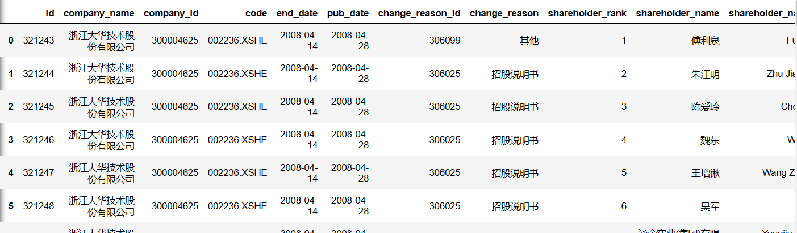

## 股票信息

获取单只股票的基本信息可以使用`get_security_info(code)`，但在这之前必须解决该只股票对应的`code`是什么的问题。


获取单支股票的信息使用`get_security_info(code)`，这个`code`可以是单个股票的代码，也可以是基金的代码。返回值是一个类型为`jqdata.models.security.Security`的对象，包含了如下属性：

```
display_name # 中文名称
name # 缩写简称
start_date # 上市日期, [datetime.date] 类型
end_date # 退市日期， [datetime.date] 类型, 如果没有退市则为2200-01-01
type # 类型，stock(股票)，index(指数)，etf(ETF基金)，fja（分级A），fjb（分级B）
parent # 分级基金的母基金代码
```

如果要查看市场上所有股票的信息，那么需要使用`get_all_securities(types=['stock'], date=None)`，这个时候返回的是一个`DataFrame`类型，包含多只股票的数据。当然，也可以传入不同的`types`来确认是股票还是基金数据。


## 获取股票名称对应的证券代码

先使用`get_all_securities()`获取聚宽平台支持的所有的股票，ETF基金信息。

```
参数

  types：默认为stock，这里请在使用时注意防止未来函数。
  date: 日期, 一个字符串或者 [datetime.datetime]/[datetime.date] 对象, 用于获取某日期还在上市的股票信息. 默认值为 None, 表示获取所有日期的股票信息

返回

  display_name # 中文名称
  name # 缩写简称
  start_date # 上市日期
  end_date # 退市日期，如果没有退市则为2200-01-01
  type # 类型，stock(股票)

结果

  display_name 	name 	start_date 	end_date 	type
  000001.XSHE 	平安银行 	PAYH 	1991-04-03 	2200-01-01 	stock
  000002.XSHE 	万科A 	WKA 	1991-01-29 	2200-01-01 	stock
  000004.XSHE 	国农科技 	GNKJ 	1990-12-01 	2200-01-01 	stock
  000005.XSHE 	世纪星源 	SJXY 	1990-12-10 	2200-01-01 	stock
          ... 	 ... 	... 	... 	... 	...
  688101.XSHG 	三达膜 	SDM 	2019-11-15 	2200-01-01 	stock
  688108.XSHG 	赛诺医疗 	SNYL 	2019-10-30 	2200-01-01 	stock
  688111.XSHG 	金山办公 	JSBG 	2019-11-18 	2200-01-01 	stock
  688116.XSHG 	天奈科技 	TNKJ 	2019-09-25 	2200-01-01 	stock
            ... 	 ... 	... 	... 	... 	...
```

再从中查询某只股票对应的股票代码：

```
stock_name = '洋河股份'
stocks_df = get_all_securities()
stock_code = stocks_df[stocks_df['display_name'] == stock_name].index.item()
```

## 十大股东

`jqdata`的`finance`模块提供了十大股东的信息，查询出来的结果是按照日期排列的：

```
from jqdata import finance

finance.run_query(
    query(
        finance.STK_SHAREHOLDER_TOP10
    ).filter(
        finance.STK_SHAREHOLDER_TOP10.code==code
    ).limit(n))
```

比如使用上面这段代码查询大华股份的前100条记录：



为此，我们需要对这些信息进行裁剪，过滤出自身需要的那些信息。首先，把列数变少一点，有些列并不是当前需要的。上面的代码是从finance.STK_SHAREHOLDER_TOP10这张表中查询上市公司前十大股东的持股情况，可以按`query(库名.表名.字段名1，库名.表名.字段名2）`的格式指定所要查询的字段名。那么我们可以将query里面的条件更改为如下多个字段：

```
finance.STK_SHAREHOLDER_TOP10.company_name,
finance.STK_SHAREHOLDER_TOP10.code,
finance.STK_SHAREHOLDER_TOP10.end_date,
finance.STK_SHAREHOLDER_TOP10.shareholder_rank,
finance.STK_SHAREHOLDER_TOP10.shareholder_name,
finance.STK_SHAREHOLDER_TOP10.share_number,
finance.STK_SHAREHOLDER_TOP10.share_ratio
```


## 历史行情

使用`get_price()`来获取历史数据，可查询多个标的多个数据字段，返回数据格式为 DataFrame。

```
get_price(security, start_date=None, end_date=None, frequency='daily', fields=None, skip_paused=False, fq='pre', count=None, panel=True)


参数

  security: 一支股票代码或者一个股票代码的list

  count: 与 start_date 二选一，不可同时使用. 数量, 返回的结果集的行数, 即表示获取 end_date 之前几个 frequency 的数据

  start_date: 与 count 二选一，不可同时使用. 字符串或者 datetime.datetime/datetime.date 对象, 开始时间.

  end_date: 格式同上, 结束时间, 默认是'2015-12-31', 包含此日期. 注意: 当取分钟数据时, 如果 end_date 只有日期, 则日内时间等同于 00:00:00, 所以返回的数据是不包括 end_date 这一天的.

  frequency: 单位时间长度, 几天或者几分钟, 现在支持'Xd','Xm', 'daily'(等同于'1d'), 'minute'(等同于'1m'), X是一个正整数, 分别表示X天和X分钟(不论是按天还是按分钟回测都能拿到这两种单位的数据), 注意, 当X > 1时, fields只支持['open', 'close', 'high', 'low', 'volume', 'money']这几个标准字段,合成数据的逻辑见下文. 默认值是daily

  fields: 字符串list, 选择要获取的行情数据字段, 默认是None(表示['open', 'close', 'high', 'low', 'volume', 'money']这几个标准字段), 支持SecurityUnitData里面的所有基本属性,，包含：['open', 'close', 'low', 'high', 'volume', 'money', 'factor', 'high_limit','low_limit', 'avg', 'pre_close', 'paused'],其中paused为1表示停牌。

  skip_paused: 是否跳过不交易日期

  fq: 复权选项: ‘pre’, 'None', 'post'，默认为前复权

  panel：在pandas 0.25版后，panel被彻底移除。获取多标的数据时建议设置panel为False，返回等效的dataframe

示例

  df = get_price('510300.XSHG', start_date='2014-01-01', end_date='2015-01-31', frequency='daily', fields=['open','close'])
```

191216：昨日将研究代码发布在论坛上，没有想到jqz1226回复提到了两个优化点，非常有用：

- 在获取多只股票的股价的时候，可以传入一个list，而不用循环每只股票。此时需要注意调用返回的结果：
  - pandas0.25之前执行 `h=get_price(stock_list, start_date, end_date, 'daily', 'close', panel=True)`返回的是Pannel类型，因此可以直接使用`h[close]`来绘图。
  - pandas0.25之后返回的结果为dataframe，但多个股票的结果会顺序排列。
- 通过`list(stocks_df[stocks_df['display_name'].isin(stock_list)].index)`来替代循环获取股票名称到股票代码的转换列表。

191218：使用`get_price()`获取股价发现会默认跳过非交易日，skip_paused表示是否跳过不交易日期(包括停牌, 未上市或者退市后的日期)，而不是严格的非交易日。

参考：

- [1](https://www.joinquant.com/help/api/help?name=Stock#%E8%8E%B7%E5%8F%96%E8%A1%8C%E6%83%85%E6%95%B0%E6%8D%AE)
- [2](https://www.joinquant.com/help/api/help?name=api#%E6%95%B0%E6%8D%AE%E8%8E%B7%E5%8F%96%E5%87%BD%E6%95%B0)


## 获取市盈率

聚宽以查询数据库的方式提供了财务数据接口, 提供了四类财务数据 分别存放到如下四个表中: 市值表, 利润表, 现金表, 负债表。

这些财务数据的查询需要调用 get_fundamentals(), 该函数接收Query对象作为参数，Query对象保存了你预先设定的查询条件。其他四个表分别以如下对象表示：

- valuation，市值表
- income，利润表
- balance，负债表
- cash_flow，现金流表

查询步骤1：创建Query对象，里面指定要查询的整个表，或者特定在字段，比如`market_cap`, `pe_ratio`, `pb_ratio`等。

```
q = query(
    valuation
).filter(
    valuation.code == '000001.XSHE'
)
```

查询步骤2：调用get_fundamentals()

```
df = get_fundamentals(q, '2015-10-15')


方法
  get_fundamentals(query_object, date=None, statDate=None)

  date和statDate参数只能传入一个:
  - 传入date时, 查询指定日期date所能看到的最近(对市值表来说, 最近一天, 对其他表来说,
    最近一个季度)的数据, 我们会查找上市公司在这个日期之前(包括此日期)发布的数据, 不会有
    未来函数.
  - 传入statDate时, 查询statDate指定的季度或者年份的财务数据.

参数

  query_object: 一个sqlalchemy.orm.query.Query对象, 可以通过全局的query函数获取Query
  对象。
  date: 查询日期, 一个字符串(格式类似’2015-10-15’)或者[datetime.date]/[datetime.datetime]
  对象, 可以是None, 使用默认日期. 这个默认日期在回测和研究模块上有点差别  
  statDate: 财报统计的季度或者年份, 一个字符串, 有两种格式:
  - 季度: 格式是: 年 + ‘q’ + 季度序号, 例如: ‘2015q1’, ‘2013q4’.
  - 年份: 格式就是年份的数字, 例如: ‘2015’, ‘2016’.
```

本来想通过指定`statDate = 2018`获取一个季度或者一个年度所有交易日的财务数据，发现这是不可能的，因为其解释是获取季报或者年报的财务数据，实际上对应的也是某天截止的数据。


参考：

- [市值数据](https://www.joinquant.com/help/api/help#Stock:%E5%B8%82%E5%80%BC%E6%95%B0%E6%8D%AE)

