## Chapter 9. Mathmatical Tools

本章介绍在金融领域几款实用的数学工具，但不会详细介绍它们的背景，而只是针对它们的应用做些
描述，主要包括：

- Approximation: 金融领域里面应用最多的回归和插值处理。
- Convex optimization: 许多金融训练所需要的凸面优化。
- Integration: 金融资产（衍生品）评估常使用的评估积分。
- Symbolic mathematics: Python提供强有力的工具库SysPy来完成公式所涉及的数学符号运算。

### Approximation

#### 1 Regression / 回归

函数近似值的模拟通常采用多项式来模拟，即所谓的Regression（回归），其公式如下：

![minimization_problem_equation.png]

1) Monomials as basis functions / 将单项式作为基础函数

NumPy的内建函数polyfit用来决定最优化参数，polyval用来对一些输入值进行近似估值。比如通过
polyfit可以获取最优系数集合p， 然后通过polyval(p, x)可以求取相当于x坐标值的回归值（对应
y坐标的值）。

```
def f(x):
    return np.sin(x) + 0.5*x

x = np.linspace(-2*np.pi, 2*np.pi, 50)

# 获取函数 f(x) 的最优系数，这个系数对整个函数通用。
# 由于此时指定了 degree = 1，那么也即是说多项式只有2项，对应系数为2。
reg = np.polyfit(x, f(x), deg=1)

# 根据最有系数，使用不同的x值进行回归计算。
ry = np.polyval(reg, x)

#plt.rc('grid', linestyle="--", color='black')
plt.plot(x, f(x), 'b', label='f(x)')
plt.plot(x, ry, 'r.', label='regression')
```

如上这段代码采用 degree = 1估值的效果如下，degree = 1为线性回归，所以可以看到它无法：

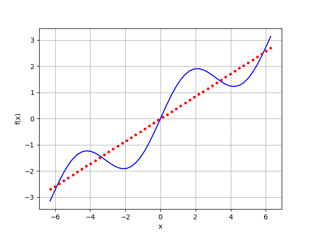

当我们将 degree 调整为5，便可以看到明显的变化：

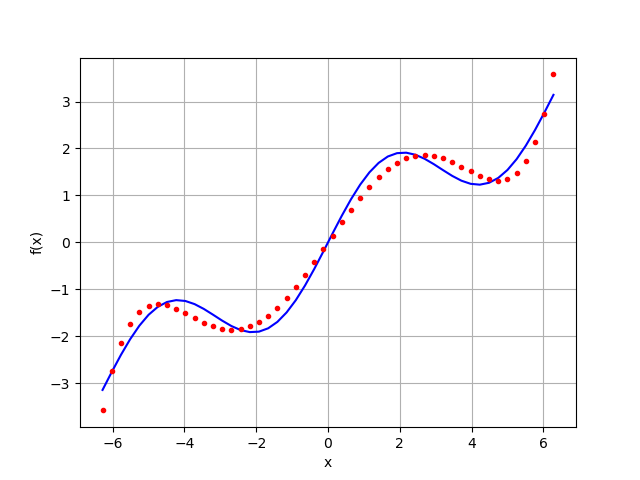

当我们将 degree 调整为7，基本可以看到完美的拟合了。不过当我们通过`np.allclose(f(x), ry)`
去判断两者是否相等时可以发现它们之间依然存在有较大的误差（大于1e-05）。求取两者的均方误差
为0.00177，并不是太大。（注：均方误差体现的是数据序列与真实值之间的关系，公式为`np.sum((f(x) - ry) ** 2) / len(x)`）

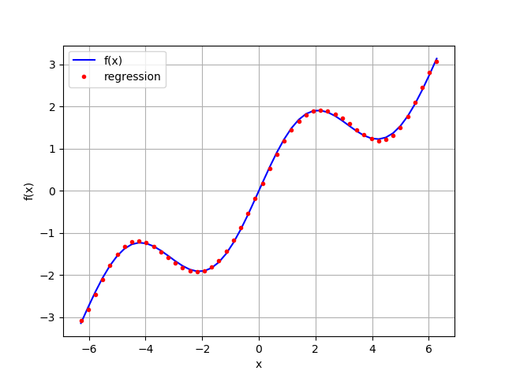


参考：

- [](https://zhuanlan.zhihu.com/p/34000100)

2) Individual basis functions / 独立基础函数

另一种改善regression结果的方法是使用独立的基础函数，这种情况下需要使用到矩阵。比如以幂高
为3创建一个矩阵：

```
matrix = np.zeros((3 + 1, len(x)))
matrix[3, :] = x ** 3
matrix[2, :] = x ** 2
matrix[1, :] = x
matrix[0, :] = 1
```

再通过`np.linalg.lstsq`获取最佳二乘法的解，再用`np.dot(a, b)`求取点积，绘制图形如下：

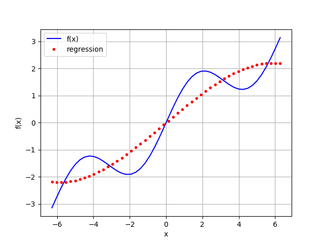

由于看起来差别较大，因此我们尝试将其基本函数替换为包含sin(x)，便能达到更加理想的效果。

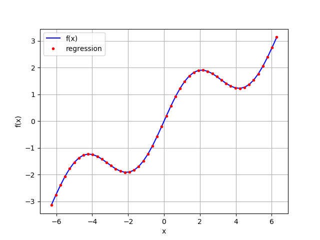

3) Noisy data

回归能够很好地应对噪声，噪声通常来自是模拟数据或者不理想的测量数据。如下的测试里面分别为
原始的x坐标值和y坐标值均添加了噪声，可以看到噪声数据与原始数据相比存在有一定的失真，但回
归得到值更加接近原始数据。

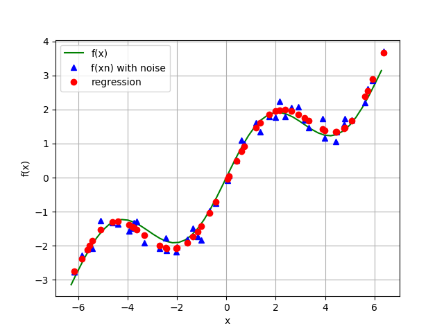

4) Unsorted data

回归也能够很好地处理无序数据。

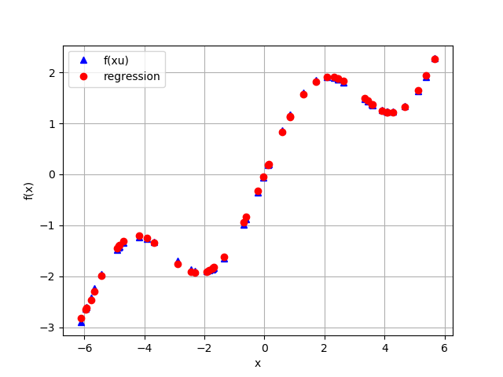

5) Multiple dimensions

最小二乘法回归不需要经过太多修改就能够满足的多元函数的回归。

发现这个例子里面有错误，比如代码里` fig.colorbar(surf, shrink=0.5, aspect=5)`根本没有
定义surf。

最小二乘法回归模型有着多方面的应用，包括求取简单函数最佳函数匹配，以及基于噪声和无序数据
的最佳匹配函数。这些模型可以方便地应用在单维和多维数据上。

#### 2 Interpolation / 插值

插值相比回归更频繁地应用在数学当中，但它也同样只用来解决低维的问题。插值的基本思想是在两
个相邻的数据点找到最为理想化的新点使之能够很好地进行回归。高连续性的插值需要更为高阶的插
值函数。

如下是基于如上例子进行的样条插值，也有不错的效果：

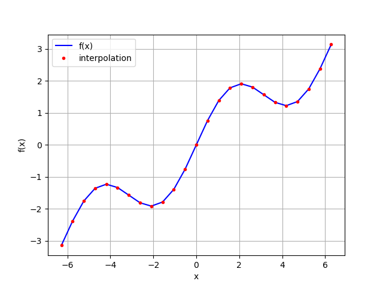

样条插值通常在金融里用来对新的观测点进行预估。如果我们将观测值的间隔缩小，再进行插值处理，
我们能够看到新的插值不能够做到足够连续，这是线性插值的一个缺点。

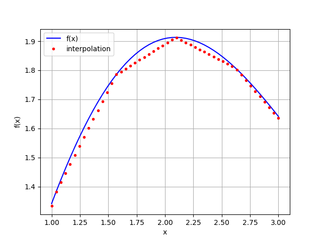

我们将其修改为立方插值，则有更好的效果：

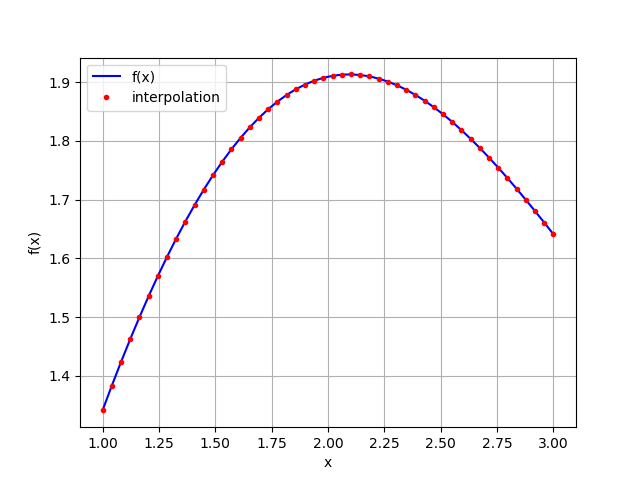

插值拥有比最小二乘法回归更好的结果，但只能够对有序的，并且无噪声的数据进行插值，并且插值
也只适合低维的数据。

#### 3 Convex Optimization / 凸规划

凸规划在金融和经济领域有着极其重要的作用，比如根据市场数据来对期权定价模型进行校准。如下
是一个二元二次函数生成的例子，从图形里面可以看到多个最小值：

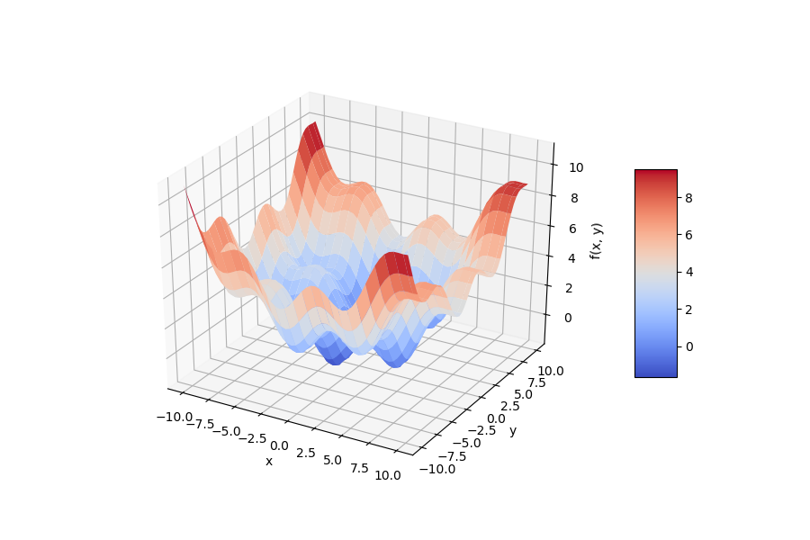

接下来我们需要找到global和local的最小值求法。

1) GLOBAL OPTIMIZATION

求取全局的最小值需要使用`brute`函数。

2) LOCAL OPTIMIZATION

对于大多数凸规划问题，通常在进行local规划之前先应进行global规划。

3) CONSTRAINED OPTIMIZATION

到当前我们讨论的均是没有约束的优化问题。然而，大部分的金融或者经济问题都与多个约束相关，
这些约束能够用等式或者不等式进行表达。

例如，考虑如下一个有关投资的最大效用问题：投资者能够投资两种风险证券，成本价分别为qa,qb。
对于情况u，一年之后它们能够分别获取15美元和5美元的回报。对于情况d，它们分别对应5美元和12
美元的回报。如上两种情况概率相同。用一个(ra, rb)的向量来表示两种证券的回报率。

投资者拥有100美元的预算，可以通过函数u(w) = sqrt(w)来推算未来收益，其中w是可用的资金，
那么下面的公式对应一个最大值问题，其中a和b表示投资者购买的两种证券的份额。

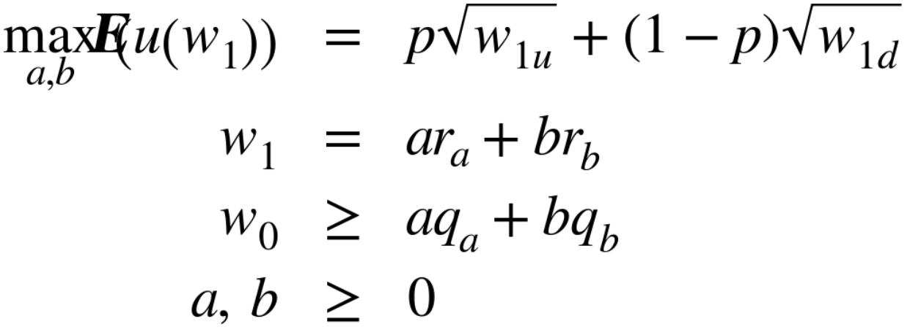

这个公式我是这样理解的：

- W0是初始时的资金。
- W1是投资的资金情况，W1u表示情况u时的投资额，W1d表示情况d时的投资额。
- p是u情况发生的概率，(1-p)是d情况发生的概率。

因此整个公式是计算该投资的期望值，其问题也是求解最大的期望值。由于a和b的概率相等，所以上
面的式子可以变为最小值问题：

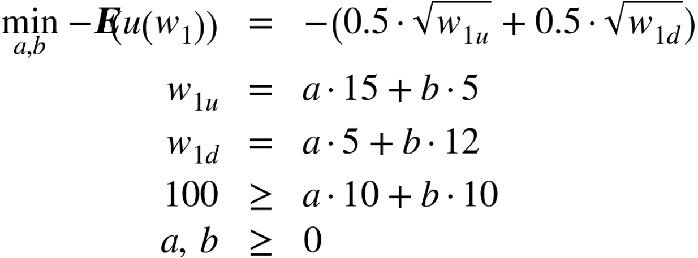

之后通过调用`minimize`来获取最小值，得到投资者购买8单位的a证券和2单位的b证券可以获得最大
值9.7。（代码尚未调试通过）

#### 4 Integration / 积分

Integration在估值和期权定价上非常有用。比如我们要对函数 sin(x) + 0.5*x 在区间[0.5, 9.5]
进行积分:

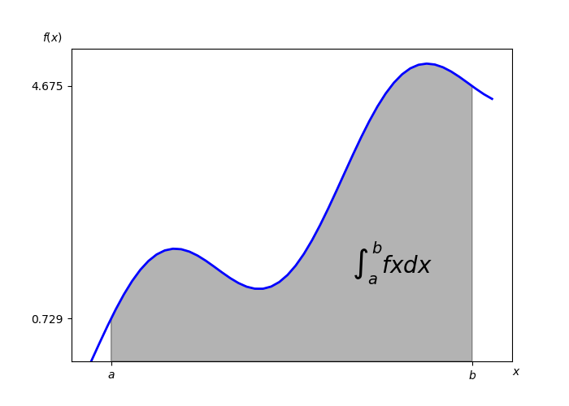

1) Numerical Integration

integrate 模块提供了专门的数值积分函数，比如quad 来负责自适应正交积分，romberg 负责龙贝
积分。

2) Integration by Simulation

对期权和衍生品的蒙特卡罗模拟展示了通过模拟来进行积分的可能性。

#### 5 Symbolic Computation / 符号计算

前面的章节都在讨论数值计算，这一章节是为符号计算准备的，SymPy是专门为符号计算设立的函数
库。

1) BASICS

sympy引入了一些列对象，最基本的就是Symbol。SymPy提供了基于LaTex, Unicode和ASCII针对数
学表达式的渲染，LaTex在IPython Notebook能够得到很好的渲染。下面是一个基于ASCII的例子：

```
sy.init_printing(pretty_print=False, use_unicode=False)
print(sy.pretty(sy.sqrt(x) + 0.5))
```

结果为：

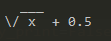

2) EQUATIONS

SymPy的一大优势在于解方程，比如它假设你想求取传入表达式等于0的解。比如`sy.solve(x**2-1)`
的值为`[-1, 1]`，但它不能保证一定能够求取到解。

3) INTEGRATION

SymPy的另一大优势是积分和微分。比如参照以前面数值积分的例子，
