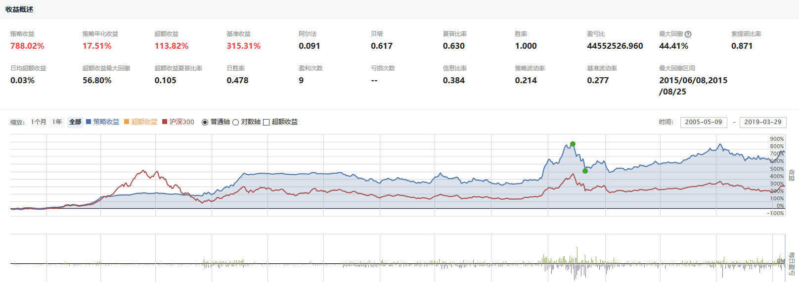

# 聚宽学习周记十二：统计新股上市涨停板与市盈率策略更新

本周的学习任务相对来说比较简单，有两个：

- 编写新股上市后涨停板统计的代码，之所以有这个想法是考虑到股票打新之后的卖出时间。之前手动统计过但觉得比较耗时，尽管后来发现新股中签之后的卖出点与涨停板的个数没有必然联系，而是和换手率、成交量联系更密切，但还是把它写出来了。
- 在[聚宽学习周记十一：沪深300相关指数与一个简单的策略](https://www.joinquant.com/view/community/detail/6f4ec5802b1710be8e39248afec64a64)里面曾经提高过当时策略里面的两个问题：一是沪深300市盈率趋势的周期性小；二是策略的实现里面有个错误。对于第一个问题就留给大家自己去找更好的估值标的，第二个问题我把它修改好了。

对于这两个任务的源代码都附在本周周记后面，望不吝赐教。

## 一、代码解释

代码解释部分选择的是自己统计涨停板的代码。

```
import datetime as dt


def count_high_limit(stock, start_date):
    end_date = datetime.date.today() + dt.timedelta(days=-1)    

    price = get_price(stock, start_date, end_date, 'daily', ['open', 'close'], skip_paused=False)
    close = price['close'].tolist()
    last_day_close = [np.NaN] + close[:-1]
    price['last_day_close'] = last_day_close
    price['reach_high_limit'] = (price['close']-price['last_day_close']) / price['last_day_close'] > 0.095

    return((price['reach_high_limit'] == True).sum())


def select_stocks(market, start_date):
    df = get_all_securities(types=['stock'])    
    df = df[(df['start_date'] > start_date) & (df['start_date'] < dt.date.today())]    

    if (market == "主板"):
        code = [code for code in df.index.tolist() if (code[0]=='6' and code[1]!='8') or (code[0]=='0' and code[2]!='2')]        
    elif (market == "中小板"):
        code = [code for code in df.index.tolist() if code[0]=='0' and code[2]=='2']
    elif (market == "创业板"):
        code = [code for code in df.index.tolist() if code[0]=='3']
    else:
        print("不支持%s" % market)

    return df.loc[code, ['display_name','start_date']]

code_list = select_stocks("主板", dt.date(2020, 1, 1))
high_limit_count = [count_high_limit(stock, code_list.loc[stock]['start_date']) for stock in code_list.index]
code_list['涨停板个数'] = high_limit_count
print(code_list)
```

如上代码输出如下：

```
# 统计2020年1月1日在沪深主板上市的新股的涨停板个数

               display_name  start_date  涨停板个数
601696.XSHG         中银证券  2020-02-26     12
601816.XSHG         京沪高铁  2020-01-16      1
603195.XSHG         公牛集团  2020-02-06      8
603290.XSHG         斯达半导  2020-02-04     23
603551.XSHG         奥普家居  2020-01-15      1
603719.XSHG         良品铺子  2020-02-24     14
603893.XSHG          瑞芯微  2020-02-07     18
603948.XSHG         建业股份  2020-03-02      6
603949.XSHG         雪龙集团  2020-03-10      6
```

上面代码部分由最上面模块导入语句`import`、两个函数、以及最后部分使用函数来获取我们需要的数据这三部分组成。导入部分有关`import`语句的使用在之前的十一次周记里面每次都讲，这次我就不讲了，不然你们耳朵都听大了到时候找我麻烦。

**代码片段一：**

```
def count_high_limit(stock, start_date):
    end_date = datetime.date.today() + dt.timedelta(days=-1)    

    price = get_price(stock, start_date, end_date, 'daily', ['open', 'close'], skip_paused=False)
    close = price['close'].tolist()
    last_day_close = [np.NaN] + close[:-1]
    price['last_day_close'] = last_day_close
    price['reach_high_limit'] = (price['close']-price['last_day_close']) / price['last_day_close'] > 0.095

    return((price['reach_high_limit'] == True).sum())
```

这里定义了一个名称为`count_high_limit`的函数，它实现的功能是统计指定股票从某个日期开始到昨天的涨停板个数。这里面的算法是这样的：

- 调用`get_price()`获取这只股票从start_date到昨天的所有交易数据；
- 然后对于每个交易日的数据，通过计算当日的收盘价和前一天的收盘价的涨幅来计算当日涨幅，并使用新的一列数据（名称为`reach_high_limit`）来标记对应交易日是否为涨停：
  - 如果涨幅 > 9.5%，为涨停，标记为True。
  - 否则，不为涨停，标记为False。
- 最后，我们统计`reach_high_limit`列里面值为True的个数，就是涨停板的个数。

其实这里面有个不够精确的问题，因为我这样实现实际上统计了从某个日期开始该股票的所有涨停板个数，而不是从某个日期开始连续的涨停板个数。不过好在这两个数据之间的差别不大，并且当前仅仅是为了练习写的代码，就没有考虑所有的异常场景，在这里要郑重提及一下。

**代码片段二：**

```
def select_stocks(market, start_date):
    df = get_all_securities(types=['stock'])    
    df = df[(df['start_date'] > start_date) & (df['start_date'] < dt.date.today())]    

    if (market == "主板"):
        code = [code for code in df.index.tolist() if (code[0]=='6' and code[1]!='8') or (code[0]=='0' and code[2]!='2')]        
    elif (market == "中小板"):
        code = [code for code in df.index.tolist() if code[0]=='0' and code[2]=='2']
    elif (market == "创业板"):
        code = [code for code in df.index.tolist() if code[0]=='3']
    else:
        print("不支持%s" % market)

    return df.loc[code, ['display_name','start_date']]
```

这里定义了另外一个函数`select_stocks`，这个函数用来选择股票，因为当前国内证券市场划分为不同的板块，各个板块均有其特色。详细点说，国内的证券场内市场主要划分为主板、中小板、创业板和科创板，如果我们按照交易所来细分这些板块那么可以分为：

一、上海证券交易所板块

- 主板：1990年设立。主板上市企业为大型成熟企业，具有稳定的盈利能力。上交所主板企业股票代码以60开头。
- 科创板：2019年设立，实行注册制。上市企业为科技类、创新类和成长型的中小企业，注重企业的创新能力，对企业的盈利要求没有创业板严格。比如互联网创新企业在初创时期盈利往往是亏损的。股票代码以688开头。

二、深圳证券交易所板块

- 主板：1990年设立。上市企业为大型成熟企业，具有稳定的盈利能力。深交所主板企业股票代码以000开头。
- 中小板：2004年设立。上市企业为中型稳定发展但未达到主板挂牌要求的企业，是深交所独有的板块。股票代码以002开头。
- 创业板：2012年设立。上市企业为科技类、创新类和成长型的中小企业，也是深交所的板块。股票代码以300开头。

所以，各自的创业板有各自的特色，将其分开一方面是考虑到这个特点，另外一方面是因为科创板的涨跌幅限制不同于其他板块因此有需要将其排除。最终的算法是这样：

- 先获取国内市场所有的证券，然后按照上市时间`start_date`进行过滤，选择从我们指定的某个时间上市的股票。
- 然后从这些过滤出的股票里面进一步按照下面的规则获取指定的板块里面的股票：
  - 1. 上交所主板企业股票代码以60开头
  - 2. 上交所科创板股票代码以688开头（不适合统计涨停板，剔除掉）
  - 3. 深交所主板企业股票代码以000开头
  - 4. 深交所中小板板企业股票代码以002开头
  - 5. 深交所创业板企业股票代码以300开头
- 最后就得到了一个股票列表

**代码片段三：**

```
code_list = select_stocks("主板", dt.date(2020, 1, 1))
high_limit_count = [count_high_limit(stock, code_list.loc[stock]['start_date']) for stock in code_list.index]
code_list['涨停板个数'] = high_limit_count
print(code_list)
```

完成上面两个函数之后我们的功能组件相当于就完成了，最后就是使用它们来完成我们预定的任务。首先，我们使用`select_stocks("主板", dt.date(2020, 1, 1))`来获得主板从2020年1月1日上市的所有股票。其次，使用`[count_high_limit(stock, code_list.loc[stock]['start_date']) for stock in code_list.index]`来获取每只股票对应的涨停板个数，这个语句里面使用了Python里面的列表表达式，它完成的工作是多次调用count_high_limit函数，然后生成一个包含有所有股票对应的涨停板个数的列表。最后将这个列表添加到保存股票的dataframe中，再打印出来。


## 二、上周计划任务

### 1.修改如上策略里面的代码缺陷

先回顾一下[聚宽学习周记十一：沪深300相关指数与一个简单的策略](https://www.joinquant.com/view/community/detail/6f4ec5802b1710be8e39248afec64a64)里面讲述的策略对应的代码缺陷，这个缺陷是在策略的交易部分可能由于现金不足导致再平衡失败，根据调试日志发现这可能发生在如下两种情况：

- 100%持股->20%持股80%持债，当循环中的第一只证券是债的时候，由于当前仓位没有多余现金会导致针对债券的买入失败。
- 20%持股80%持债->100%持股，当循环中的第一只证券是股票的时候，也由于债券没有提前卖出会导致现金不足而使交易失败。

要解决这个问题比较简单，也就是先要找到再平衡时需要缩仓的证券先进行缩仓，这样就能够把现金富裕出来，去买入那些需要增仓的证券。这部分代码可以在下面的注释里面一栏究竟：

```
# 1. 卖出当前有持仓但推荐策略里面无持仓的证券。
   sell_list = set(context.portfolio.positions.keys()) - set(g.model.keys())
   for stock in sell_list:
       order_target_value(stock, 0)

# 2. 先调整已有持仓的证券，且按照“高仓位->低仓位”优先进行。
post_stocks = []
for stock in context.portfolio.positions.keys():
   position_ratio = context.portfolio.positions[stock].value / context.portfolio.total_value
   log.info('position ratio = %s, suggested position ratio = %s' % (position_ratio, g.model[stock]))
   # 当前仓位比建议仓位多5%，优先缩仓
   if (position_ratio - g.model[stock]) > 0.05:
       suggested_position = g.model[stock] * context.portfolio.total_value
       order_target_value(stock, suggested_position)
   # 当前仓位比建议仓位少5%，保存下来，等到所有占比高的仓位缩仓之后再处理
   elif (g.model[stock] - position_ratio > 0.05):
       post_stocks.append(stock)
   # 当前仓位和建议仓位相差不大，保持不变
   else:
       pass # 不调仓

# 3. 再调整“低仓位->高仓位”的证券。
for stock in post_stocks:
   suggested_position = g.model[stock] * context.portfolio.total_value
   order_target_value(stock, suggested_position)

# 4. 最后买入推荐策略建议的新证券。
new_stocks = set(g.model.keys()) - set(context.portfolio.positions.keys())
for stock in new_stocks:
   suggested_position = g.model[stock] * context.portfolio.total_value
   order_target_value(stock, suggested_position)
```

策略从2005年开始的回测结果如下，完成的策略我已经附在后面，请注意这只是个实验策略。



### 2.思考如何统计股票的涨停天数

见第一部分“代码解释”。

## 三、本周新学内容

无。

## 四、下周学习任务

开始从[聚宽2019年度评选+精选文章合集](https://www.joinquant.com/view/community/detail/5fea4e17fa8ad5eb32b85201375e2669?type=1)选择第2篇文章来学习，这次选择@东南有大树写的[用指数战胜指数，ETF二八轮动对冲模型](https://www.joinquant.com/view/community/detail/19490)。
