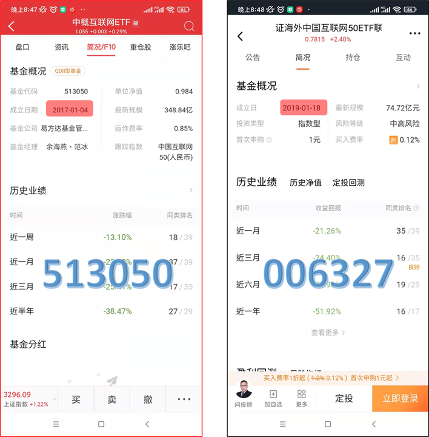

有的投资者分不清中概互联ETF（513050）和中概互联LOF（006327），这两只基金的经理都是余海燕和范冰，并且都是用来投资中概互联的企业。然而，它们确确实实是两只不同的基金，有以下两个方面的不同：

首先，成立时间不同。513050是2017年1月4日成立的：但006327是2019年1月18日成立的：

其次，513050是ETF，只能在场内买卖，简单理解是可以在券商账户里进行买卖，包括一级市场申购赎回和二级市场交易两种投资方式。006327是用来投资513050的ETF联接基金，简单来说是为了方便更多没有券商账户的用户也能够投资513050而专门设置的场外基金。

你会不会奇怪为什么相同的基金经理先搞了一个ETF，然后再搞一个投资于这个ETF的ETF联接基金？一个最直白的原因是可以赚更多手续费。因为ETF联接基金可以让更多人（没有证券账户也可以买买买）参与到ETF投资，同时有更高的手续费。
