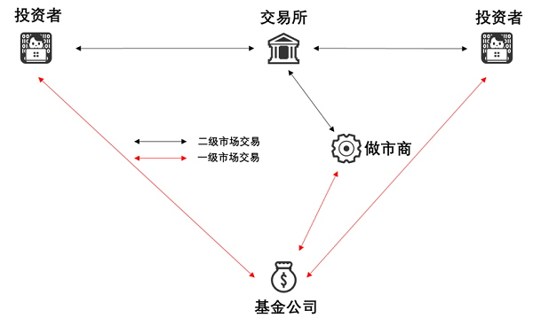
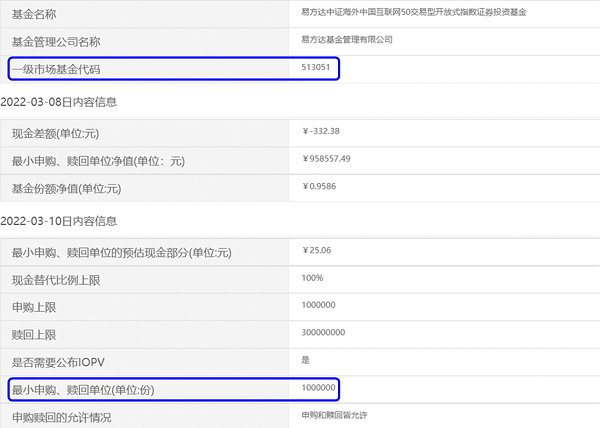
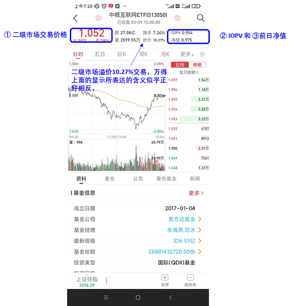
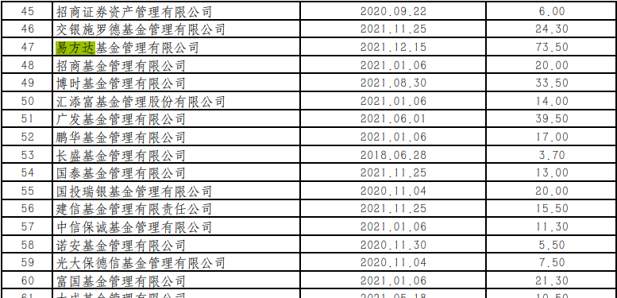
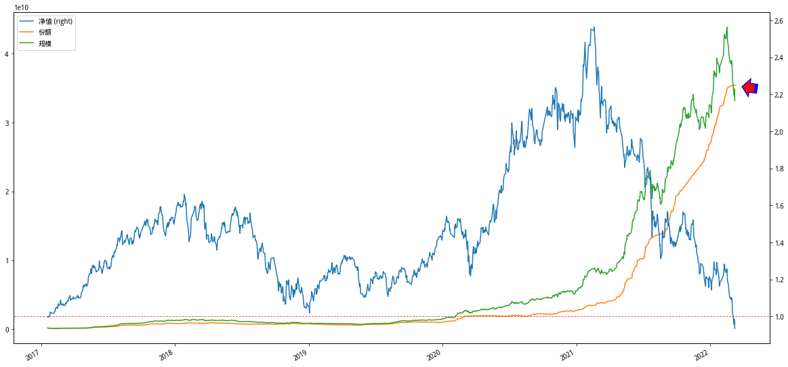

## 中概互联的高溢价问题

开始买中概互联都已经将近两个月了，现在才关注到它的溢价问题。可见身入股市六年有余，但所具有的投资基础理论实在不足。好在意识到这个问题之后，想着尽快把这个问题弄清楚。以下就是我这几天的一些学习笔记。

要弄清楚ETF溢价交易的问题，必须要搞清楚ETF背后的运转机制，不过这第一步却是我在学习过程中花时间最多的一步，因为国内网络文章很少对此有清晰详尽的介绍，在国内外网站上看了一通，才慢慢发现并不是所有证券市场的ETF都是以相同方式在运作。这种最基本的差异性很容易让初学者犯迷糊。

比如，境外其他证券市场讲解ETF必然会介绍AP（特许经营商）和Market Maker（做市商），但国内市场的ETF却没有AP，同时对于做市商的概念也比较淡化。为了让这篇笔记更简单，尤其让初入市场的投资者更容易理解，这里仅从国内ETF运转机制的角度来谈论中概互联的溢价问题。

## ETF的运转市场

ETF的运行涉及到两级市场：一级市场（primary market）和二级市场（secondary market），两者的区别大致如下：

- 一级市场，直接与ETF发行方（基金公司）打交道的地方，投资者可以基金公司申购或者赎回ETF份额，申购或者赎回份额有最基本的资格要求。比如最低申购份额为1000000，这也意味着每次交易的量级在百万级别，所以一级市场主要参与者是一些投资大户、机构和做市商。
- 二级市场，普通投资者执行ETF买卖的交易所，在这里投资者买入或者卖出已有的ETF份额，买入或者卖出的价格和股票买卖一样，价格会实时变化。二级市场的参与者主要是投资者，但因为保证ETF的交易具有一定的流动性，当前场内的ETF交易引入了做市商的机制，所以二级市场的玩家还有做市商。

做市商的概念简单来讲就是一些获得了做市商资格的券商为了保证二级市场ETF交易的流动性，跑到二级市场来一起参与买卖。做市商参与ETF的交易已经很普遍，《2020 年度上交所基金做市商发展报告》里面提到2020年底，上交所共有260只ETF，其中做市商参与其中的208只，占比达80%。

ETF的交易因为涉及到两个不同的市场，会涉及到价格的同步问题。比如，一级市场的申购和赎回每天的报价只有一次，但二级市场的交易价格是实时变动的。当两个市场的交易价格相差较大时就会触发套利，这种套利会反过来将两个市场的价格保持一定的平衡。而本篇笔记要讨论中概互联的溢价问题就是中概互联在二级市场的交易价格比一级市场净值更高的问题。

在继续谈论ETF运转机制之前，先总结一下ETF运转市场的两个基本概念：要点一，ETF的运作涉及到一级市场和二级市场两个市场，每个市场都有各自的交易价格。要点二，我们在打开券商APP交易的时候应该知道自己买卖的对方除了其他普通的散户之外还有做市商。

## ETF的运转机制

了解了一级市场和二级市场概念之后，我们可以进一步来看看ETF在交易过程中的一些行为。在查阅了一些资料并结合自己的理解，画了一幅图。当然，毕竟不是老鸟，不保证理解百分百OK。

结合上面这幅图捋一捋ETF的交易过程：

- ETF在募集之初，会和股票一样有个认购过程，投资者可以在网上和网下参与认购，这里的“网”指的是“交易所”，网上认购只能在上交所的交易时段进行认购。
- ETF在发行之后，交易的主场在二级市场，也就是ETF投资者之间的买卖活动。ETF二级市场的交易引入了做市商，也就是你的每次买入要么是从其他普通投资者手里要么是从做市商（具有做市资格券商）手里买过来。卖出也是同样。
- 不同于一家上市公司的股票份额在特定时间内是固定不变的情况，ETF的份额可以随着需求的增加而增加，随着需求的减少而减少。这个二级市场需求的变化会传到到一级市场，源动力就是两个市场之间不同价格形成的套利机制。

举个例子。某个交易日ETF在一级市场的报价（资产净值）为100元，但是在二级市场的交易价格却一直处在高于100元的位置（溢价交易），那么就会有投资者在一级市场从ETF发行人那里用100元申购新的ETF份额，然后去二级市场以高于100元的价格卖出来获利。这个“大批量卖出”的操作会促使二级市场高于100元的交易价格向100元靠齐，直到没有价差利润可赚为止。

同理，某个交易日ETF在一级市场的报价（资产净值）为100元，但是在二级市场的交易价格却一直处在低于100元的位置（折价交易），那么就会有投资者将二级市场低于100元买来的ETF份额，以100元每份的价格卖给一级市场的ETF发行方来获利（ETF份额赎回）。这个在二级市场“大批量买入”的操作会促使二级市场低于100元的交易价格向100元回升。

怎样在二级市场买卖大家都很熟悉了，那怎样在一级市场申购和赎回呢？我打开华泰证券app截了一副图，标注如下：

在一级市场和二级市场交易的时候对应的ETF代码是不一样的，比如对于中概互联来说在二级市场的基金代码为513050，而在一级市场的申购赎回代码为513051。是不是有点想摩拳擦掌去实战一番了？且慢，因为一级市场的交易门槛比较高。交易所每天都会给公布ETF公告申购赎回清单，在其中会指定基本要求，比如最小申购、赎回单位为1000000份，也就是每次申购和赎回至少在百万元级别：

所以，想要套利也不是那么容易。当然，套利真正不容易在交易门槛上是一方面，还有其他方面的原因。咱们继续。

## 净值、基金份额参考净值和交易价格

既然ETF的交易涉及到两个市场，那么同样一份ETF的价格就不止一个，实际上是有三个：净值、基金份额参考净值和交易价格。

一级市场的价格是每个交易日收盘后会根据ETF对应的一揽子股票去计算一次，这个价格就是所谓的“资产净值”。

二级市场的价格是每个交易日投资者在交易时段内用真金白银努力拼搏奋斗的结果，就像你买卖股票时那样，就是每隔几秒就会跳动的“交易价格”。

二级市场的交易需要参考一级市场的净值，但一级市场的净值是每天收盘后才更新一次的。为了让二级市场的交易能够参考到ETF在当前的实际情况，交易所根据基金管理人提供的计算方法和证券组合清单，以盘中最新对应证券的成交价格实时计算并公布（每15秒更新一次），这个价格就是“基金份额参考净值（IOPV，Indicative Optimized Portfolio Value）”。这个IOPV可以简单用下面这个公式来计算：

  基金份额参考净值 = 昨天净值 + 今天成分股的整体涨跌幅

所以，这个IOPV最接近当前ETF份额的最新净值。二级市场上的溢价或折价交易就是根据“交易价格”和“基金份额参考净值”来计算的。当“交易价格”大于“基金份额参考净值”时处于溢价交易状态，反之则处于折价交易状态。我下面截取的3月9日收盘后中概互联的行情图：

从图里面可以看到中概互联在当天的溢价率高达10.27%，上交所还为此发布了风险提示公告。当然万得app上面对于“折价”、“溢价”的展示方式和我们常规的理解刚好相反，不知道什么原因。

那为什么中概互联会有这么高的溢价？笔记最开始的时候我们讲了ETF的一级市场、二级市场，也讲了套利机制如何平衡这两个市场之间的价格差。按理论上讲，既然有套利机制存在，就不应该存在这么高的溢价率，难道哪些手握重金的投资者都傻了？

## 中概互联的高溢价的形成

1）难以准确估值促成了常规溢价

第一个原因在于中概互联是一只投资于国际市场的ETF，查看它跟踪的中概互联50指数可以知道它对应的股票分别是在港股和美股市场上市公司发行的股票，而中概互联ETF的交易却是在A股市场。三个市场在交易时间上不同，给中概互联ETF的IOPV计算也造成了麻烦，比如A股、港股开市的时候美股是闭市的，这个时候IOPV的计算无法使用在美股上市公司的股票价格。理论上IPOV可以使用在A股交易时段内港股的那部分成分股来计算，不过我在万得上盯了半天发现它竟然没有实时更新。

没有了IOPV，就没有了实时的参考价格基点，在二级市场的交易上就会带来更大的波动。比如有的投资者会看好隔夜美股市场的股票表现那么就会出更高的价格去买，当买入需求增加的时候也就让交易形势走向了溢价。当然，这个溢价不会很夸张。

2）外汇额度不够导致套利机制失灵

然而，当前中概互联10点左右的溢价率主要的原因在于外汇额度的限制，我们可以在外管局网站上找到各个基金公司的外汇额度。比如管理中概互联ETF（513050)的易方达基金管理有限公司去年末的外汇额度是73.5亿美元，差不多470亿人民币。

470亿人民币是公司总的外汇额度，我虽然不知道中概互联ETF占用了易方达基金公司具体多少的外汇额度，但从当前近400亿的净值规模去推算，其实已经很多了。另外，我们可以看到中概互联尽管最近一周下跌很多，但份额的增长却将近停止：

为啥？是因为投资者不喜欢了。不是的，二级市场以高达10个点左右的溢价进行交易清晰的告诉我们份额停止增长不是因为买入需求减少所导致，而是因为外汇额度受限。这个过程是这样的：当二级市场出现高溢价时，理论上高溢价会触发套利机制，专业投资者会从一级市场申购更多的ETF份额来平衡溢价。但因为基金公司的外汇额度紧张，无法申购得到新的ETF份额，所以投资者只能够在二级市场内以高价去买另外一些投资者手里已有的份额（就和股票交易那样一步一步拉高了交易价格）。

## 投资者的选择

弄清楚中概互联当前的高溢价之后，投资者首先应该意识到这其中可能存在的风险。也就是就如股票一样，由预期建立起来的溢价也可能因为预期不成立而迅速消失。

如果一定看好中概互联，那么有两种方法以更低的成本参与其中：第一、自己去购买成分股，当然也会有外汇额度的问题；第二、去买其他公司发行的中概互联ETF，毕竟易方达的外汇额度快用完了，其他基金公司的未必。第三、可以购买投资于中概互联ETF的联接基金，也会有限额的情况。

或者先等着，此处不留爷自有留爷处。

## 参考

- [Understanding Exchange Traded Funds Premiums and Discounts](https://www.mackenzieinvestments.com/content/dam/final/corporate/mackenzie/docs/etfs/mm-premiums-discounts-en.pdf)
- [Understanding Premiums And Discounts](https://www.etf.com/etf-education-center/etf-basics/understanding-premiums-and-discounts)
- [中概互联场内基金的折溢价问题](https://zhuanlan.zhihu.com/p/411877945)
- [中概互联溢价 8％，买了就是被割韭菜？](https://new.qq.com/omn/20211208/20211208A016BW00.html)
- [中概互联究竟能不能套利](https://xueqiu.com/9896517675/200050583)
- [ETF公告申购赎回清单](http://www.sse.com.cn/disclosure/fund/etflist/)
- [易方达中证海外中国互联网 50 交易型开放式指数证券投资基金溢价风险提示公告](http://www.sse.com.cn//disclosure/fund/announcement/c/new/2022-03-10/513050_20220310_1_8xi0AYSf.pdf)
- [关于中概互联，你想知道的一切](https://www.anewsday.com/post/209614.html)
- [合格境内机构投资者（QDII）投资额度审批情况表](http://www.safe.gov.cn/safe/2018/0425/16849.html)
