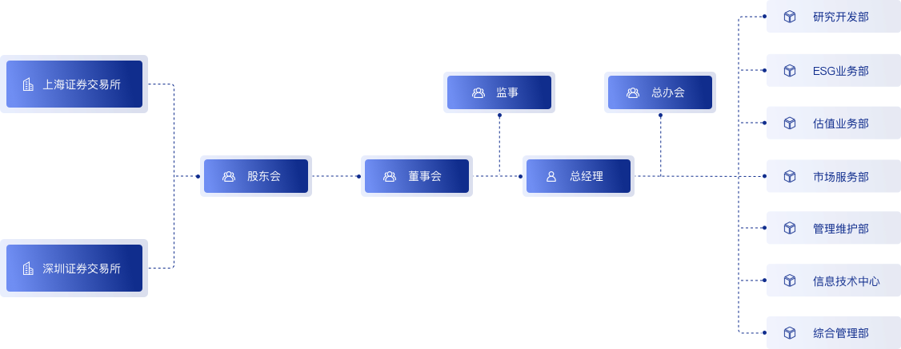
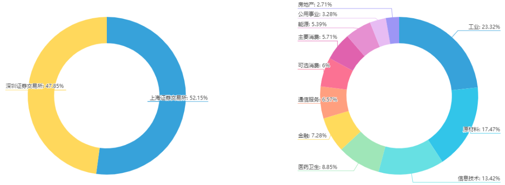
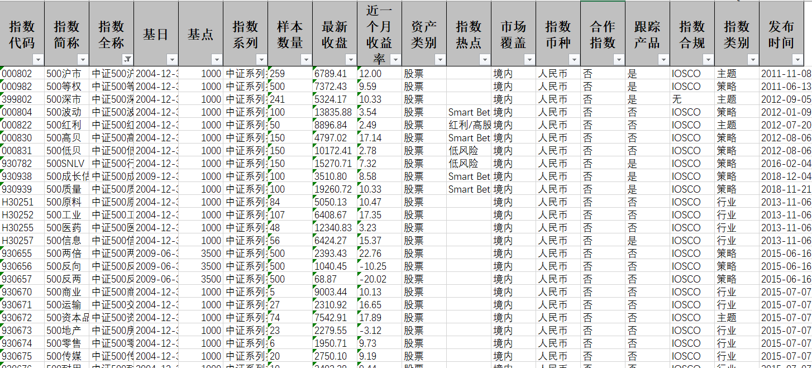
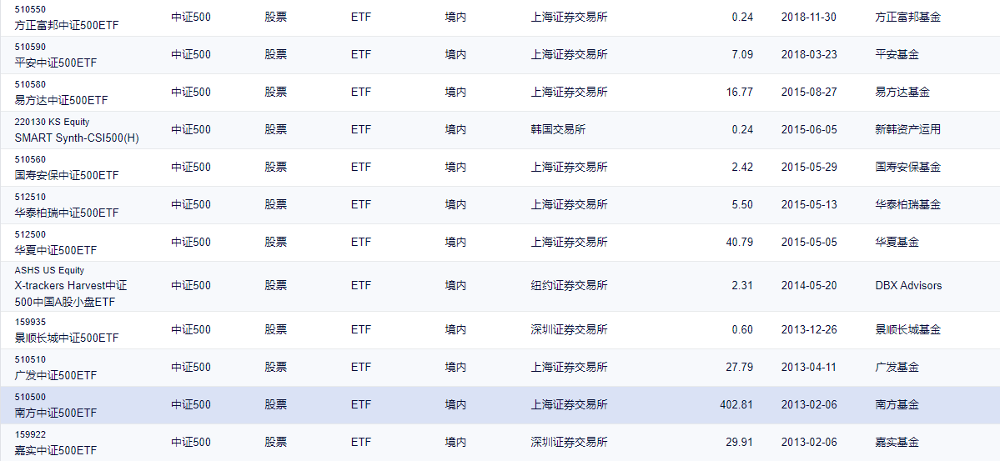

## 中证500是什么？

平常我们提到“中证500”，其实并不是一个很标准的用词。因为它缺乏特定的语境，“中证500”可能指的是“中证500指数”，也可能指的是“中证500ETF”。“中证500ETF”是跟踪“中证500指数”的开放式交易基金，大多时候它们的走势相差不大，不过它们指代的是两个不同的东西。当我们开始接触到一些500相关的指数或者ETF的时候，很容易弄不清它们之间的联系和区别。

这边笔记，便是尝试认清“中证500”。

## 中证500指数

先从“中证500指数”开始。首先我们把这个名词拆成两半：“中证” + “500指数”。

“中证”是什么？它指的是“中证指数有限公司”，简称“中证指数公司”。这家公司成立于2005年8月，是由沪深证券交易所共同出资成立的金融市场指数提供商。是的，它就是一家公司，公司的主要业务就是编制和维护金融市场指数，从官方网站上可以找到它们的组织结构图。

那么，“中证500指数”就可以理解为是中证指数有限公司编制的“500指数”。那这个“500指数”又是啥？

实际上，这个“500指数”全称为“小盘500指数”，由中证指数公司在2007年1月15日发布。编制规则如下：

- 1）在样本空间中剔除沪深 300 指数样本以及过去一年日均总市值排名前 300 的证券；
- 2）对样本空间内剩余证券按照过去一年日均成交金额由高到低排名，剔除排名后 20%的证券；
- 3）将剩余证券按照过去一年日均总市值由高到低进行排名，选取排名前500 的证券作为指数样本。

简单理解，中证500指数测量的是沪深两市里面除去排名靠前300只大盘股之后后面比较活跃的500家企业的市值表现。

## 其他500指数

中证500指数是一只宽基指数，也就是这只指数的样本股选择仅仅是看市值的排名，并不区分行业、概念等属性。我们可以看下这500家公司在交易所和行业上的分布：

有些人比较聪明，就想：这500家公司是很优秀，但是我还想它更优秀一点，比如你能不能：

- 把这500家只在上交所上市的那部分公司挑出来搞一个指数？
- 把这500家里面那些盈利能力最强、现金流最好的100家挑出来搞一个指数？
- 把这500家里面只属于医药行业的单独挑出来搞一个指数？
- ...

当然可以。上面这些需求可以按照主题、策略、行业、风格来进行划分，然后制定不同的指数。从中证指数公司网站上可以找到所有相关的指数信息，当前共有71只500相关的指数：

数量太多，没有办法截图截完。但从上图中你可以看到500沪市、500红利、500高贝、500质量等等。下次如果看到这样的名词，起码心里应该对它们有一个最基本的概念，知道它们是基于中证500指数再次添加条件选择出来的部分公司编制成的新指数。

## 中证500ETF

前面已经提到，中证500ETF是用来跟踪中证500指数的开放式交易基金（ETF）。需要注意的是，尽管中证500指数只有一个，跟踪它的中证500ETF可能并不只有一只。这里面的道理很简单，中证500指数是公开的，那么基金公司A可以做一款跟踪它的ETF，基金公司B同样可以做一款跟踪它的ETF。所以，跟踪中证500指数的ETF就有数十种，还不包含其他跟踪其他500系列指数的ETF。

我们平常见得最多的一般是南方中证500ETF（编号510500)，也是成交量最为活跃的跟踪中证500指数的ETF。

总结一下，中证500具体是什么要看具体的语境，它可以是中证500指数，也可以是跟踪中证500指数的宽基ETF。同样的，如果我们看到500质量、500高贝也要知道指代的可能是跟踪500质量、500高贝的指数（这些指数是基于500指数基础上添加了条件编制的新指数），也可能是对应的ETF。

## 参考

- [中证小盘500指数](https://www.csindex.com.cn/#/indices/family/detail?indexCode=000905)
