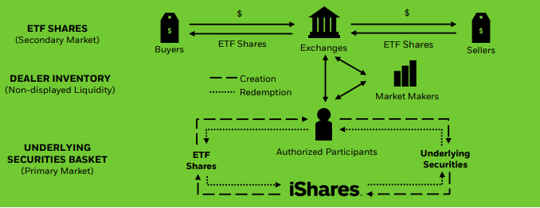

> 很多人都知道“ETF”，但往往不一定知根知底。比如说，ETF和普通的基金差别在什么地方？和所谓的共同基金差别在什么地方？ETF的价格波动到底是怎样得来的，是和集合竞价相关还是和指数波动有关？

### 释义

ETF的全称是“Exchange-Trade Fund”，中文名“交易所交易基金”。顾名思义，它的最大特色是作为一种基金，它可以在交易所像股票一样交易。但为了更好的认识它，还是要更详细的介绍下ETF、共同基金和股票三者之间的关系。

简单来说，ETF在投资形式上和共同基金是相同的，它也是集合类型的投资，和共同基金一样将很多人将资金集合起来去购买比如股票、债券、房地产和商品等资产。但是，ETF在交易方式上却有着和股票一样的特色，共同基金的买卖价格是投资资产的净值，是每个交易日更新一次，但ETF的交易价格并不是对应的资产净值，而是和股票交易价格一样，因为投资者相互之间的竞价每时每刻都在更新。

### 历史

全球上第一个ETF是美国道富公司在1993年1月22日创建的SPDR S&P 500 ETF (SPY)，它跟踪S&P500指数，在2020年底的时候全球共有8607只ETF，资产规模近8.0万亿美元（50多亿元）。而ETF类型也从最初跟踪标普指数进化成各种类型：

- 债券ETF
- 股票ETF
- 行业ETF
- 商品ETF
- 货币ETF
- 做空ETF
- 做多ETF

国内首支ETF是华夏基金管理有限公司于2004年12月30日成立的华夏上证50ETF，到2020年底国内共366只ETF，规模破万亿元。

### 运行模式

ETF的运行涉及到两级市场：一级市场（primary market）和二级市场（secondary market），不同市场有不同的玩家，两者的区别大致如下：

- 一级市场，直接与ETF发行人直接打交道的地方，在这里专业结构（特许经营商，英文AP，Authorised Participants）根据市场需求从ETF发行人那里申购或者赎回ETF份额，申购或者赎回份额时的价格通常由发行方按照收盘价和一些费用计算得到并每天发布，这个价格也就是所说的“净值”。一级市场的参与者主要有ETF发行人、AP。
- 二级市场，也就是投资者执行ETF买卖的交易所，在这里投资者买入或者卖出已有的ETF份额，买入或者卖出的价格和股票买卖一样，价格会实时变化。二级市场的参与者主要是投资者、做市商、AP。

我从黑石网站上扒了一幅图过来，可以更清晰的认识ETF运行时的参与者和总体过程。简单来说，每只ETF的交易大致都会涉及如下过程：

- ETF在发行之初，会指定特许经营商(AP)来管理ETF的流通份额。也就是AP获得了直接和发行人直接交易的资格。
- ETF在法行之后，交易的主场在二级市场，也就是ETF投资者之间的买卖活动。不同于A股上的股票交易的个人对个人的实时竞价交易，ETF二级市场的交易引入了做市商，也就是普通投资者是直接和做市商之间交易。
- ETF的交易因为涉及到两个不同的市场，会涉及到价格的同步问题。比如，一级市场的申购和赎回每天的报价只有一次，但二级市场的交易价格是实时变动的。当两个市场的交易价格相差较大时就会触发套利，而这种套利会尽可能将两个市场的价格保持一定的平衡。

这个过程里最重要的就是套利空间来保证价格的同步。当ETF在二级市场折价交易时，AP会大量买入二级市场上的ETF份额，然后从ETF发行人手里赎回这些份额来套利，从而让二级市场的交易价格回升。比如，某个交易日ETF对应股票的净值为100元，但是ETF的交易价格为99元，那么AP就会从二级市场以99元的价格批量买入然后以100元的价格卖给ETF发行人来赚取收益，这个“大批量买入”的操作会促使二级市场99元的交易价格回升向100元回升。

同理，当ETF在二级市场溢价交易时，AP会大量买入ETF对应的多只股票，然后从ETF发行人手里申购更多份额来卖给投资者以便套利，从而让二级市场的交易价格降低。比如，某个交易日ETF对应股票的净值为100元，但是ETF的交易价格为101元，那么AP就会买入多只股票（折合净值为100元）从ETF发行人那里申购对应的ETF份额，然后以101元的价格卖给投资者。这个“大批量卖出”的操作会促使二级市场101元的交易价格向100元靠齐。

当然，AP和ETF在发行方的交易形式有多种，并不一定在申购ETF份额的时候一定要使用一揽子股票。简单说来，ETF的交易价格的波动同样是由需求来推动，当来自投资者的买入增加时价格会上涨，反之价格会降低。但不管是价格的上涨或者降低，因为套利机制的存在，ETF的交易价格会始终趋近于ETF所对应股票的实际净值。

### 做市商和特许经营商的区别

特许经营上的角色前面已经介绍了。而做市商角色的主要目的为二级市场的交易提供流动性。这两种角色根据具体情况可能由相同的机构或者不同的机构担任。

在国内市场上，特许经营商和做市商通常都是券商。

2020年底，上交所共有260只ETF，其中做市商参与其中的208只，占比达80%。

国内外ETF申赎机制的不同：国内由基金公司办理申购赎回，国外通常由AP代办申赎。国内ETF的PCF（英文Portfolio Composition File，中文名叫申购赎回清单）强制每日披露的，而在披露PCF之后，由于投资者会严格按照PCF进行申赎，基金的实际持仓与PCF之间的差异会比国外的情况更小。

### 交易

前面介绍释义的时候提到了ETF的价格是实时更新的，你购买ETF就如购买股票一样，都是在券商APP里直接购买。不过，股票购买时会涉及到竞价的问题，也就是你购买股票的价格是多人共同出价的结果。购买ETF是不是也遵守同样的规则呢？

在管理方式上ETF支持主动型和被动型两种，前者需要管理者主动进行投资，后者通常直接跟踪对应的市场指数。我们平常在谈到的ETF基本上指的都是这种被动式跟踪某种市场指数的ETF。ETF的交易费用通常比股票更便宜，而被动型ETF比主动型ETF更便宜。

参考：

- [Exchange-Traded Fund (ETF)](https://www.investopedia.com/terms/e/etf.asp)
- [Pooled Funds](https://www.investopedia.com/terms/p/pooledfunds.asp)
- [Pooled Investment Vehicles: Definition and Types](https://smartasset.com/investing/pooled-investment-vehicle)
- [全球 ETF 行业发展年度报告（2020）](https://www.szse.cn/aboutus/research/research/report/P020210210499227370235.pdf)
- [什麼是造市商(造市者)？為什麼需要造市？做市商如何盈利？](https://rich01.com/what-is-market-maker/)
- [ETF投资指南：ETF的结构和买卖机制（专）](https://zhuanlan.zhihu.com/p/23214834)
- [How ETFs work](https://www.vanguard.com.hk/documents/etf-how-etfs-work-en.pdf)
- [2020 年度上交所基金做市商发展报告](http://etf.sse.com.cn/fundtrends/a/20210210/346f51d77d2df4e87f2869d94e387a07.pdf)
- [首批增强型ETF获批...](http://finance.ce.cn/jjpd/jjpdgd/202111/16/t20211116_37089015.shtml)
- [今天说点专业的，讲讲什么是PCF](https://xueqiu.com/1006959826/129769213)
