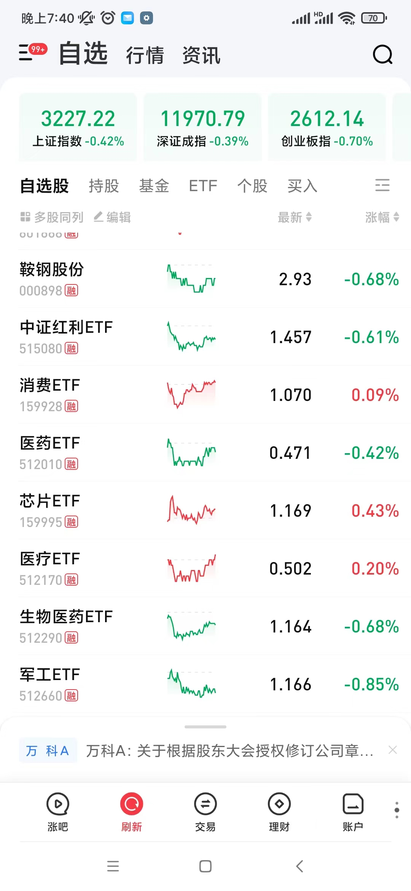
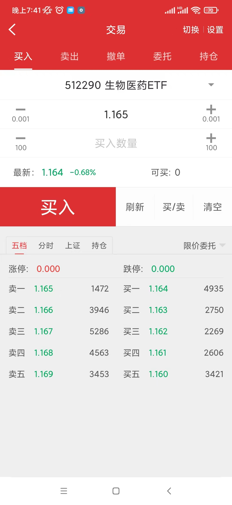
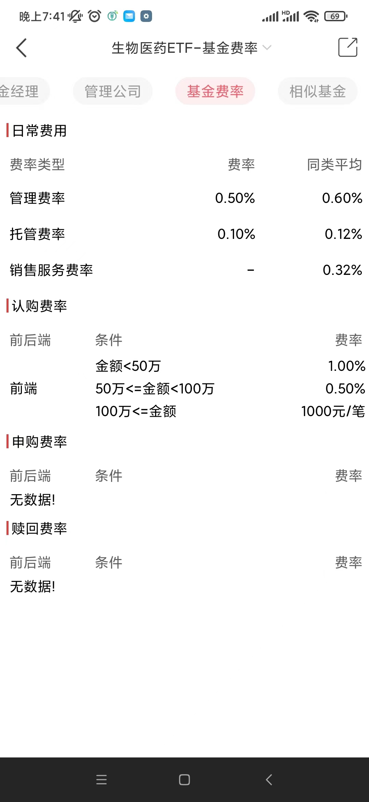
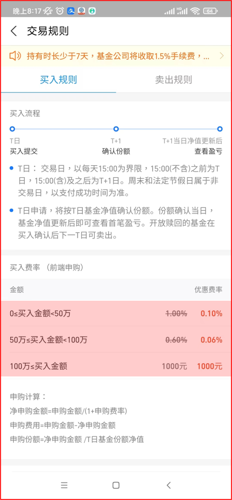

## ETF简介与交易

ETF的全称是“Exchange-Trade Fund”，中文名“交易所交易基金”。顾名思义，它的最大特色是作为一种基金，可以在交易所像股票一样进行交易。ETF基金大多数为指数基金。

ETF、共同基金这对名词都是舶来品。共同基金是将多人的资金集合起来去购买比如股票、债券、房地产和商品等资产。共同基金不同于一般的慈善基金、养老基金等更为广泛的基金定义，它是一种证券投资类型的基金。

共同基金是在国外的称呼，在国内指的就是证券市场的“基金”。而ETF是这些“基金”中比较特别的一种。

哪里特别了？最主要的特别在于买ETF就和买股票一样，因为ETF也有和股票一样在实时变动的交易价格。但一般基金的买卖价格是投资资产的净值，每个交易日才更新一次，并不是实时更新的。

还有，ETF目前主要用来跟踪市场上的指数。如果我们想购买整个市场、或者特别的行业、或者按照其他策略组建的一揽子股票，那么非ETF莫属。

### 历史

全球第一个ETF是美国道富公司在1993年1月22日创建的SPDR S&P 500 ETF (SPY)，它跟踪S&P500指数。到2020年底的时候全球共有8607只ETF，资产规模近8.0万亿美元（50多亿元），而ETF类型也从最初跟踪标普指数进化成各种类型：

- 债券ETF
- 股票ETF
- 行业ETF
- 商品ETF
- 货币ETF
- 做空ETF
- 做多ETF

不过到目前国内市场的ETF大多还是股票类ETF。国内首支ETF是华夏基金管理有限公司于2004年12月30日成立的华夏上证50ETF，到2020年底国内共366只ETF，规模破万亿元。

### 交易

ETF的交易方式很简单，就和股票一样。比如，下面是我的自选股列表，其中既包括了股票，也包括了ETF。在搜索ETF的时候也和普通股票一样可以使用名称搜索，也可以使用编号。

进入下单页面，就能够像买卖普通股那样进行买入或者卖出了：

## 费用

通常券商APP都给出了该基金的基本信息，包括基本资料、基金经理以及基金费率等：

普通投资者只会参与二级市场的交易，所以只需要关心上图中包括管理费和托管费的“日常费用”，除此之外还有一项费用，那就是在券商APP里面交易时候的手续费，前几年大多券商都是万分之三，现在估计大部分是万分之一点五。

场内交易ETF相比场外交易相同的基金而言主要优势就在这里：手续费低。

比如，我在支付宝上面找到了生物医药ETF（512290）的ETF联接基金：国泰中证生物医药ETF联接A（006756）。它的交易手续费是这样的：

注：ETF联接基金可以简单理解为没有开通券商账户的投资者可以在场外购买ETF。（“场”指代“交易所”，所以基金平台、银行、支付宝等不输于交易所的平台都是“场外”）

生物医药ETF、生物医药ETF联接A，都是投向相同的股票，由相同的基金经理管理。基金的管理费和托管费相同，但是，这个交易的手续费就要高很多：场内购买50万以下的金额顶多是交易金额的万分之三，但支付宝上购买却是千分之一。相差好几倍。

总结一下：ETF是可以在场内买卖的证券类投资基金，相比场内它具有低手续费的优势。如果有证券账户，又想同时购买多只股票，那么尝试去找找有没有对应的ETF，会是不错的选择。

参考：

- [场内ETF买卖，也要承担管理费和托管费吗？](https://www.zhihu.com/question/59660135)
