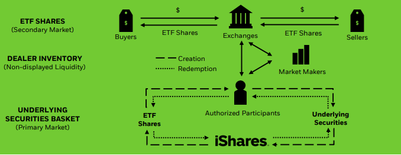

ETF的全称是“Exchange-Trade Fund”，中文名“交易所交易基金”。有的也称呼它为“交易型开放式指数基金”，但这种称呼并非ETF直译的名字，而是叫出了它的特点，即：

- 可以场内交易，就是可以在交易所交易，简单点就是如果在某家券商开通了账户，那么你不仅可以交易股票，还可以直接交易ETF。
- 开放式的管理方式，就是它本身的份额不是固定的，而是能够动态增加和减少。

ETF的份额如何变化，以及它的价格机制是怎样的，我们下面继续聊。

## 运行模式

要想知道ETF份额的变化原理，那么就必须了解ETF的运行模式。

ETF的运行涉及到两级市场：一级市场（primary market）和二级市场（secondary market），不同市场有不同的玩家，两者的区别大致如下：

1. 一级市场

直接与ETF发行人直接打交道的地方，在这里专业结构根据市场需求从ETF发行人那里申购或者赎回ETF份额，申购或者赎回份额时的价格通常由发行方按照收盘价和一些费用计算得到并每天发布，这个价格也就是所说的“净值”。

在境外证券市场，一级市场的参与者主要有ETF发行人、AP（特许经营商，英文AP，Authorised Participants）。而在境内市场，一级市场并没有AP，主要参与者是一些投资大户、机构和做市商。

2. 二级市场

也就是投资者执行ETF买卖的交易所，在这里投资者买入或者卖出已有的ETF份额。买卖方式和股票买卖一样，价格会实时变化。二级市场的参与者主要是投资者、做市商、AP（境内市场AP的角色由做市商担任）。

我从黑石网站上扒了一幅图过来，可以更清晰的认识ETF运行时的参与者和总体过程（注意，这是境外ETF的运行机制）。简单来说，每只ETF的交易大致都会涉及如下过程：

1. ETF在发行之初，会指定特许经营商(AP)来管理ETF的流通份额。也就是AP获得了直接和发行人直接交易的资格（境内市场没有AP，直接由ETF发行人管理申购和赎回流程）。
2. ETF在发行之后，交易的主场在二级市场，也就是ETF投资者之间的买卖活动。ETF二级市场的交易引入了做市商，所以你在买卖ETF的时候购买的ETF份额可能来自普通投资者，也可能来自做市商。
3. ETF的交易因为涉及到两个不同的市场，会涉及到价格的同步问题。比如，一级市场的申购和赎回每天的报价只有一次，但二级市场的交易价格是实时变动的。当两个市场的交易价格相差较大时就会触发套利，而这种套利会尽可能将两个市场的价格保持一定的平衡。

这个过程里最重要的就是套利空间来保证价格的同步，为了便于叙述，我们直接以国内ETF的运行机制来说。当ETF在二级市场折价交易时，做市商、投资机构或大户大量买入二级市场上的ETF份额，然后从ETF发行人手里赎回这些份额来套利，从而让二级市场的交易价格回升。

举个栗子：某个交易日ETF对应股票的净值为100元，但是ETF的交易价格为99元，那些有钱的人们就会从二级市场以99元的价格批量买入然后以100元的价格卖给ETF发行人来赚取收益（赎回），这个“大批量买入”的操作会促使二级市场99元的交易价格回升向100元回升。

同理，当ETF在二级市场溢价交易时，做市商、投资机构或大户会大量买入ETF对应的多只股票，然后从ETF发行人手里申购更多份额来卖给投资者以便套利，从而让二级市场的交易价格降低。

举个栗子：某个交易日ETF对应股票的净值为100元，但是ETF的交易价格为101元，那些有钱的人们就会买入多只股票（折合净值为100元）从ETF发行人那里申购对应的ETF份额，然后以101元的价格卖给投资者。这个“大批量卖出”的操作会促使二级市场101元的交易价格向100元靠齐。

简单说来，ETF的交易价格的波动同样是由需求来推动，当来自投资者的买入增加时价格会上涨，反之价格会降低。但不管是价格的上涨或者降低，因为套利机制的存在，ETF的交易价格会始终趋近于ETF所对应股票的实际净值。

除了一、二级市场参与者的略微区别，境内外ETF运行机制的不同之处还具体体现在一级市场申赎机制的不同：国内由基金公司办理申购赎回，国外通常由AP代办申赎。国内ETF申购和赎回的PCF（英文Portfolio Composition File，中文名叫申购赎回清单）强制每日披露，披露PCF之后，投资者会严格按照PCF进行申赎，所以基金的实际持仓与PCF之间的差异会比国外的情况更小。

## 三个价格

前面已经提到了ETF的价格是实时更新的，你购买ETF就如购买股票一样，都是在券商APP里直接购买。股票购买时会涉及到竞价的问题，也就是你购买股票的价格是多人共同出价的结果。而购买ETF的时候也是一样，你购买的价格也是多人共同竞价的结果。

因为ETF的交易涉及到两个市场，所以尽管买卖ETF时会涉及到交易价格，但实际上与它相关的价格实际上有三个：交易价格、基金净值、基金份额参考净值。

1. 交易价格

二级市场的价格是每个交易日投资者在交易时段内用真金白银努力拼搏奋斗的结果，就像你买卖股票时那样，就是每隔几秒就会跳动的“交易价格”。

2. 基金净值

一级市场的价格是每个交易日收盘后会根据ETF对应的一揽子股票去计算一次，这个价格就是所谓的“资产净值”。

3. 基金份额参考净值

二级市场的交易需要参考一级市场的净值，但一级市场的净值是每天收盘后才更新一次的。为了让二级市场的交易能够参考到ETF在当前的实际情况，交易所根据基金管理人提供的计算方法和证券组合清单，以盘中最新对应证券的成交价格实时计算并公布（每15秒更新一次），这个价格就是“基金份额参考净值（IOPV，Indicative Optimized Portfolio Value）”。这个IOPV可以简单用下面这个公式来计算：

  基金份额参考净值 = 昨天净值 + 今天成分股的整体涨跌幅

所以，这个IOPV最接近当前ETF份额的最新净值。二级市场上的溢价或折价交易就是根据“交易价格”和“基金份额参考净值”来计算的。当“交易价格”大于“基金份额参考净值”时处于溢价交易状态，反之则处于折价交易状态。

最后总结一下：ETF全称为“Exchange-Trade Fund”，中文名“交易所交易基金”，它具有一级和二级两个交易市场，普通投资者通常只会参与二级市场的交易，即在券商终端像股票一样买卖它们。ETF多数为指数基金，你能够以较低的手续费买入一揽子的股票。

参考：

- [Exchange-Traded Fund (ETF)](https://www.investopedia.com/terms/e/etf.asp)
- [Pooled Funds](https://www.investopedia.com/terms/p/pooledfunds.asp)
- [Pooled Investment Vehicles: Definition and Types](https://smartasset.com/investing/pooled-investment-vehicle)
- [全球 ETF 行业发展年度报告（2020）](https://www.szse.cn/aboutus/research/research/report/P020210210499227370235.pdf)
- [什麼是造市商(造市者)？為什麼需要造市？做市商如何盈利？](https://rich01.com/what-is-market-maker/)
- [ETF投资指南：ETF的结构和买卖机制（专）](https://zhuanlan.zhihu.com/p/23214834)
- [How ETFs work](https://www.vanguard.com.hk/documents/etf-how-etfs-work-en.pdf)
- [2020 年度上交所基金做市商发展报告](http://etf.sse.com.cn/fundtrends/a/20210210/346f51d77d2df4e87f2869d94e387a07.pdf)
- [首批增强型ETF获批...](http://finance.ce.cn/jjpd/jjpdgd/202111/16/t20211116_37089015.shtml)
- [今天说点专业的，讲讲什么是PCF](https://xueqiu.com/1006959826/129769213)
- [ETF和共同基金有什麼差異？有什麼優缺點、適合什麼人投資？](https://rich01.com/diff-etf-and-mutual-fund/)
