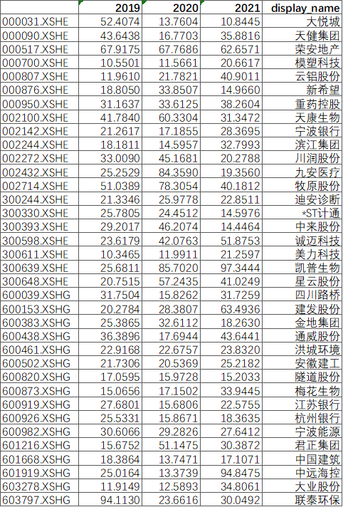

## 戴维斯双击

什么是“戴维斯双击” ？

单纯从字面意思上说，它描述的当某次投资出现了令人满意回报时候的结果。比如说，你在2022年最后一个交易日以每股8元（对应市盈率为4.0，每股净利润2.0元）的价格买入了100股浦发银行的股票，到明年第一个季度结束时，它的股价为每股16元（对应市盈率为5.0，每股净利润3.2元）。

我们就可以说，浦发银行在2023年第一个季度出现了“戴维斯双击”。

所以，当提到戴维斯双击的时候首先一定是股价/市值出现了较大幅度的增长，并且这里面的增长来自于两个方面：① 市场估值的提升；② 企业经营净利润的提升。

## 理解它

为了更好的理解戴维斯双击，我们需要先理解“市盈率”这个不管你在证券市场混还是浪，都必须要了解并掌握的最简单的估值指标。按照市盈率的定义：

    市盈率 = 股价 / 每股收益（EPS）

该公式也等价于“公司市值 / 公司净利润”。那么我们将“股价”换到等号左边，有：

    股价 = 市盈率 x 每股收益（EPS）

可以看到，我们每天看到的时刻在跳跃的市值，是由市盈率和每股收益这两个变量来确定的。而市场投资者对于这两个变量的关注又分别对应两种不同的投资体系：

1）第一种：关注市盈率。

想要抓住的是市场对于公司估值的心理变化，说白了就是找风口。股价上涨更多的原因来自于“情绪改善”，投资者越乐观，越愿意出高价，这个时候在公司经营数据没有改善的情况下，随着股价升高的只有市盈率的抬升。

2）第二种：关注公司经营利润。

寻找那些每股收益能够持续增长的公司，从而分享企业成长。股价上涨更多的原因来自于“经营向好”。

有人说，我两个都要。当然可以，老戴维斯就是这么干的。那我怎样才能够整几次这种“双击”呢？

## 大道至简 

戴维斯的思路很简单，就是寻找10倍以下市盈率、经营业绩年增长能达到10%~15%的企业，享受其业绩增长和市盈率增长对股价的倍增效应。

很简单对不？但大道至简，戴维斯凭借这一简单的投资理念取得了让人羡慕的投资成绩。

戴维斯双击是美国戴维斯家族的投资哲学。老戴维斯1947年以5万美元开始投资，至1994年去世时，拥有9亿美元财富，47年增值1.8万倍（复合年收益率23% ），跻身世界级投资大师行列。

当然，戴维斯的这个策略是在上个世纪美国证券市场做的，已经不可同日而语。你也完全可以发掘出你自己的方式去寻找那些趴在地下，但有一天能够迎来市盈率和经营利润双双增长的“双击”标的。

## 满足条件的股票

我仿照老戴维斯的这种方法，去找了下2019、2020和2021年营收增长超过10%，但是当前市盈率小于10的公司，有36家：

刚看到这个名单，我发现了一个很奇怪的地方，那就是为什么筛选出来的标的里面有“*ST计通”，通常是经营不下去的公司财务数据太差才有这个标记。为啥我选择出来的都是财务数据不错的公司。

是的，原因就在于财务数据上。证监会发现华虹计通的财务数据有问题，目前停牌待查，而`*ST`是上市公司股票被实施退市风险警示的标志。

## 参考

- [《手把手教你读财报》]()
- [关于新增上市开放式基金上市首日相关特殊标识的通知](http://www.sse.com.cn/lawandrules/guide/jyznlc/jyzn/c/c_20221202_5713415.shtml)