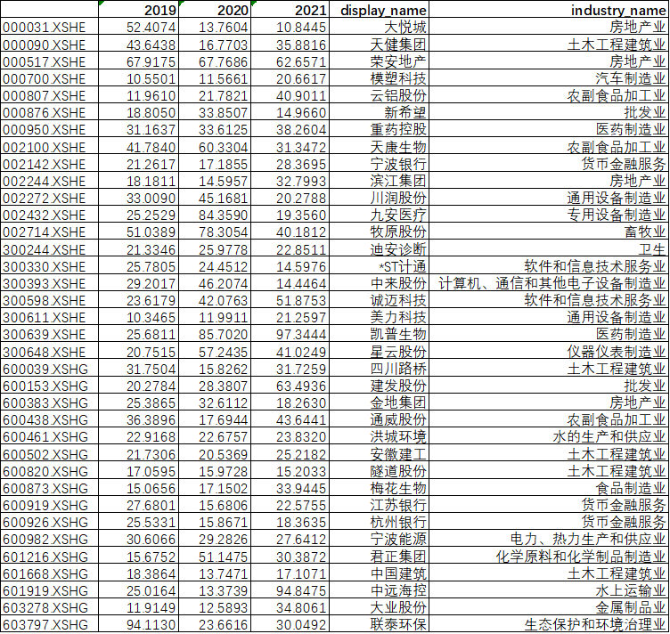

## 戴维斯双击

什么是“戴维斯双击” ？

它描述的当一次股票投资获得了令人满意的回报，并且这种回报来自于公司利润和市场情绪的双重作用。

打个比方：你在2022年最后一个交易日以每股8元（对应市盈率为4.0，每股净利润2.0元）的价格买入了100股浦发银行的股票，到2023年最后一个交易日，它的股价涨到了每股16元（对应市盈率为5.0，每股净利润3.2元）。

股价一年翻倍，而该高收益来自于两方面：① 公司的净利润从每股2.0元涨到3.2元，涨了60%，是公司经营能力的提升；② 公司市盈率的增长，从4倍涨到了5倍，涨了25%，相当于情绪面的改善，更被市场看好。

这个时候我们就可以说，浦发银行在2023年出现了“戴维斯双击”。所以，当提到戴维斯双击的时候首先一定是股价涨了，并且还涨得不少，让你挺高兴。同时上涨的原来来自于公司经营和市场估值的双双提升。

## 理解它

为了更好的理解戴维斯双击，我们需要先理解“市盈率”这个无论你在证券市场属于哪门哪派，都必须要了解并掌握的最简单的估值指标。按照市盈率的定义：

    市盈率 = 股价 / 每股收益（EPS）

该公式也等价于“公司市值 / 公司净利润”。那么我们将“股价”换到等号左边，有：

    股价 = 市盈率 x 每股收益（EPS）

可以看到，我们每天看到的时刻在跳跃的市值，是由市盈率和每股收益这两个变量来确定的：前者反映“情绪面”，后者反映“基本面”。有的投资者喜欢关注市场的情绪，有的则更在乎公司本身的经营，这又分别对应了两种不同的投资体系：

1）第一种：关注市盈率

投资者想要抓住的是市场对于公司估值的心理变化，说白了就是追概念、找风口。股价上涨更多的原因来自于“情绪改善”，投资者越乐观，越愿意出高价，即便这个时候公司经营能力没有改善。

2）第二种：关注经营利润

寻找那些每股收益能够持续增长的公司，从而分享公司成长。股价上涨更多的原因来自于“经营向好”。

有人说，我可不可以两个都要？当然可以，只不过会有点难度。因为你能够很快的发现，市场上如果一家公司净利润很漂亮，那它的市盈率也会比较高。反之，如果一家公司经营不行，不受市场待见，市盈率通常会比较低。（市盈率也有失真的时候，比如为负数或者值非常大）

即便有难度，但仔细留意，市场上确实还真有这样的机会。戴维斯就是这么干的，我们看看戴维斯是怎样整出令他举世闻名的“双击”的。

## 大道至简 

戴维斯的思路很简单，就是寻找10倍以下市盈率、经营业绩年增长能达到10%~15%的公司，买入，然后等待并享受公司业绩增长和市盈率增长对股价的倍增效应。

其实，口诀就一个：寻找那些偶尔因为什么原因被冷落的白马股（经营业绩不错，但是不被市场看好）。

很简单对不？但大道至简，戴维斯凭借这一简单的投资理念取得了让人羡慕的投资成绩。

戴维斯1947年以5万美元开始投资（那时他38岁），至1994年去世时，拥有9亿美元财富，47年增值1.8万倍（复合年收益率23% ），跻身世界级投资大师行列。

任何人的成功都离不开时代背景的加持。戴维斯的这个策略是在上个世纪美国的证券市场做的，如今已不可同日而语。然而，你也完全可以发掘出你自己的方式去寻找那些趴在地下，但有一天能够迎来市盈率和经营利润双双增长的“戴维斯双击”的股票。

## 满足条件的股票

我还真想试试看。

于是我仿照戴维斯的这种方法，去找了下2019、2020和2021年营收增长超过10%，但是当前市盈率小于10的公司，竟然有36家：

我大致过了一遍这些公司，竟然在筛选出来的标的里赫然发现“*ST计通”，要知道`*ST`是上市公司股票被实施退市风险警示的标志。我选择出来的都是财务数据很不错不错的公司，既没有亏损，而且还每年营收都在增长。

其实，原因就在于财务数据上。这是因为证监会发现华虹计通的财务数据有问题，于是将其停牌检查，顺便打了一个标签在这里，就是告诉投资者这家公司有点问题，先不要靠近。

继续回到剩下的35家公司，这里除了中国建筑这一家公司我读过财报有所了解之外，其他的都不了解。不妨供大家参考，说不定你也可以在里面挑选出未来“戴维斯双击”的公司。

记住，戴维斯用市盈率和营收增长的标准筛选出公司只是第一步，他的买入决策一定是建立在他对选出来的这些公司有细致了解的基础之上作出的。公子，你不要直接下手，到时候亏了来找我哭诉我可不安慰啊。

## 参考

- [《手把手教你读财报》]()
- [关于新增上市开放式基金上市首日相关特殊标识的通知](http://www.sse.com.cn/lawandrules/guide/jyznlc/jyzn/c/c_20221202_5713415.shtml)
- [什么是戴维斯双击？](https://zhuanlan.zhihu.com/p/306607550)