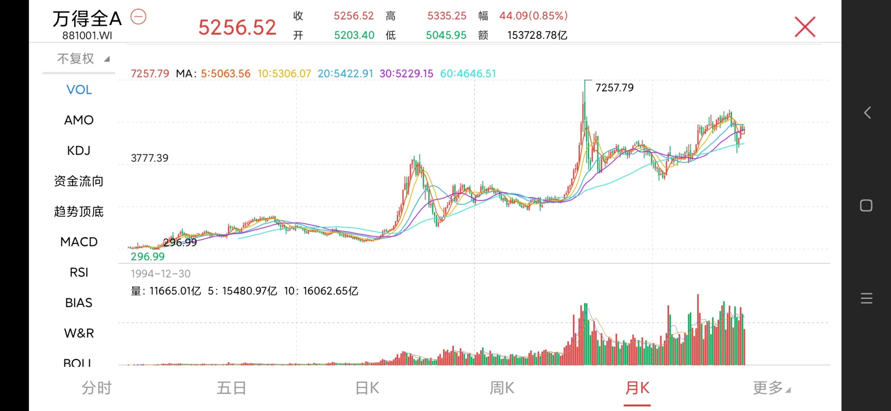
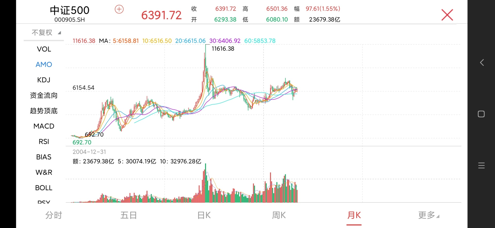

## 如何看待社保基金21年赚1.8万亿？

这个问题听起来会让人觉得提问者脸上似乎有两个大大的“不服”，不服之一：社保基金竟然能够赚取这么多的钱？1.8万亿？！不服之二：竟然能够超过专业投资即构？！

但如果我们把注意力放到年化8.30%的投资收益，会觉得这是再正常不过的事情。为什么？我们用代表整个A股市场的万得全A指数计算下过去21年的收益：

2000年底的点数为1571.39，2021年底的点数为5919.40，21年间涨幅为3.77倍，折合年化收益差不多6.5%，如果再加上每年企业分红的收益，已经和8.30%的收益相差无己了。

如果我们以代表A股中小板企业的中证500指数来估算，2004年底1000点，2021年底为7359.40，涨幅为7.35倍，折合年化收益率12.5%。

所以，8.30%的收益率，不能说高，只能说中规中矩。但这样中规中矩是有原因的，因为社保基金的目标就是稳定的投资收益，所以投资策略上不会为了高的收益去冒更大的风险。

社保基金的投资，要比一般的专业机构更专业。为什么这么说？

首先，社保基金会有常设的规划研究部、基金财务部、证券投资部、股权投资部、风险管理部等多个部门在搞投资研究，同时还有投资决策委员会、风险管理委员会、内部控制委员会和专家评审委员会把关投资决策。这排场，不输于一般的专业机构吧？

所以，看到“社保基金”不要想当然觉得是“傻傻可爱的有钱白富美富婆一枚”，人家也是专业机构，并且是“不一般”的专业即构。

其次，社保基金的目标有两个：一、确保基金安全（类似于巴菲特说的投资首先要保证不要亏钱），二、实现保值增值。这就决定了社保基金会采用更为稳妥的投资理念，这方面必定是侧重在长期投资、价值投资上。

所以，社保基金不会和大多散户一样“炒炒更健康”，那是拿全国人民的钱去赌博。而是真正践行投资优秀企业、与优秀企业共成长的投资之道。

我还是打心里希望社保基金能够有稳定的、不错的投资收益。毕竟它是国家社会保障储备基金，是要保障人口老龄化高峰时期的养老保险等社会保障支出的，事关民生福利。

- [全国社会保障基金理事会社保基金年度报告(2021年度)](http://www.ssf.gov.cn/portal/xxgk/fdzdgknr/cwbg/sbjjndbg/webinfo/2022/08/1662381965418407.htm)
