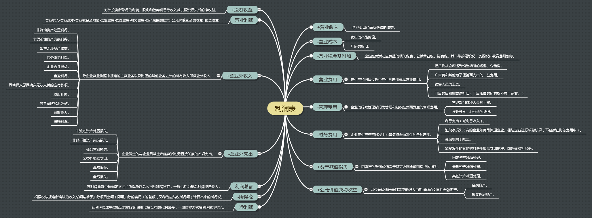

# 一、利润表项目

- [营业收入 +](./1-营业收入.md)
- [营业成本 -](./2-营业成本.md)
- [税金项目 -](./3-税金项目.md)
- [费用项目 -](./4-费用项目.md)
- [资产减值损失 -](./5-资产减值损失.md)
- [公允价值变动收益 +](./6-公允价值变动收益.md)
- [投资收益 +](./7-投资收益.md)
- [营业利润]
- [营业外收入 +](./8-营业外收支.md)
- [营业外支出 -](./8-营业外收支.md)
- [利润总额]
- [所得税费用 -](./9-所得税费用.md)
- [净利润]

如上项目中的利润项目包括：

- 营业利润：企业利润的主要来源，主要由营业收入、营业成本、期间费用、资产减值损失、公允价值变动净收益、投资净收益构成。
- 利润总额：企业在一定时间内到底赚到了多少钱。营业利润+营业外的收入-营业外的支出+补贴收入+汇兑损益（视该企业是否有外贸业务而定）。
- 净利润：利润总额按规定交纳了所得税以后公司的利润留存，一般也称为税后利润或净收入。

《公司理财》里面提到：“经营性利润扣除利息支出和税收就得到净利润。”那么这里的“经营性利润”相当于国内的“利润总额” + “利息支出”。

# 二、脑图

# 三、补充

## 总资产报酬率/净资产报酬率

总资产报酬率=(利润总额+利息支出)/平均总资产×100%。资产收益率指企业利用每1元所创造的收益，假设所有的资金都属于资产（没有负债），那么资产收益率是很恰当的。从广义的角度来看，如果非金融公司的资本收益率能始终达到7%，它就有可能在竞争中傲视群雄。

净利润/净资产平均总额×100%。不考虑负债部分，体现了企业对股东资金的使用效率，即单位股东权益所创造的利润。该指标的缺陷是企业可以在盈利能力没有提高的情况下通过举债提高股东权益回报率，因此需要把股东权益回报率和企业的负债规模同时考虑。根据总体经验判断，可以把15%作为衡量竞争能力的临界值。

## 投资资本回报率

投资资本回报率的分母是投资资本，分子是税后营业净利润。

- 投资资本

投资资本是总资本去处了不需要企业付出成本的那部分投入，相比总资产少了一些负债，比如应付账款、应付工资、应交税金之类不需要向债权人支付利息的负债。

- 税后营业净利润

由于投资资本包含了股东和债权人的投资总和，但是净利润都是股东的，所以引入了“税后营业净利润”来表示不扣除利息的净利润。

投资资本回报率的及格线是企业使用这些资本的成本，因为企业筹集和使用的资金不管是短期还是长期的必须要付出成本。这种成本通常使用加权平均资本成本（Weighted Average Cost of Capital）来表示。

## 企业利润的三个因素

企业利润高低由三个因素决定，即毛利率高低、周转率快慢或经营杠杆大小，唐朝称其为“茅台模式”、“沃尔玛模式”和“银行模式”：

- “茅台模式”代表产品竞争力强弱，需要注意产品口碑、竞品替代的可能。
- “沃尔玛模式”代表管理层运营能力的高低，需要注意管理层变化。
- “银行模式”代表企业承担的风险大小，需要关注宏观货币政策。

## 每股收益和稀释每股收益

每股收益是按照现有股本进行计算，稀释每股收益是在现有股本加上潜在股本基础上计算得到的，比如发行在外的认股权证、股份期权、可转债等工具可能增加的公司股本。

## 利润表透露的信息

利润表告诉企业它是否赚了钱、在哪里赚的这两个信息。此外，利润表将可持续的营业利润与不可持续的营业外收支和补贴收入分别展示，可以帮助企业推断出自己在未来一段时间内的收益。

## 息税前利润 / EBIT

也称为“经营性净利润”，指在扣除异常项目、非延续性经营活动或是特殊项目前所得的利润。计算EBIT时只需用“经营活动总收入扣减经营活动总成本”即可得到。分析师都青睐EBIT，因为它可以排除资本结构（利息支出）和税收的影响，而单独提取盈余的差异部分。

*这里需要注意一下中美报表格式的差异：美国的EBIT可以直接通过总收入-总成本得到，但我国的利息支出是计入总成本的，因此国内报表的EBIT = 总收入 - 总成本 + 利息支出。*

## 息税及折旧和摊销前的利润 / EBITDA

EBITDA = EBIT + 折旧和摊销。

摊销指的是类似折旧的非现金性支出，不过与折旧相比，它应用于无形资产（如一项专利），而不是有形资产（如一台机器）。分析师喜欢应用EBITDA指标，因为它将两项非现金项目加回到EBIT中，因此是税前经营性现金流的更加指标。

## 表外资产（off Balance Sheet Asset）

有一些资产，比如广告创造的品牌价值、企业自我研发成功的技术，尽管确实存在并且有价值，但很难在报表上体现，也难以评估，这就使得这些资产成了“表外资产”。

>一般是按会计准则（GAAP）容许的会计技巧，企业将旗下一些资产，包括子公司、贷款、衍生工具等置于此项，以降低公司债务与资本比率；表外资产无须列于资产负债表内，但要在财务报告以注释形式列明。研发投入、组织建设、品牌渠道等都属于表外资产。

会计准则虽然对研究支出规定了唯一的记录方式，但企业却能够通过设计不同的组织结构，来实现不同的会计结果。

有些公司的研发部门是独立的法人，为了获得技术，它必须向自己的研发部门购买技术。这个时候，这项技术在这家公司就变成了外购的技术，也就可以被记录在无形资产当中了。所以，由此可以发现，明明是企业自己研究出来的技术，研究支出却被记在无形资产当中了。

## 非经常性损益

## 参考

- 肖星，《一本书读懂财报》，浙江大学出版社。
- 斯蒂芬 A.罗斯，《公司理财》。
- 帕特·多尔西，《巴菲特的护城河》。
- [非经常性损益](https://baike.baidu.com/item/%E9%9D%9E%E7%BB%8F%E5%B8%B8%E6%80%A7%E6%8D%9F%E7%9B%8A/4471529)
- [更好读懂财报重要指标详解——非经常性损益](https://zhuanlan.zhihu.com/p/92454578)
- [非经常性损益](https://xueqiu.com/2747360062/80815307)
