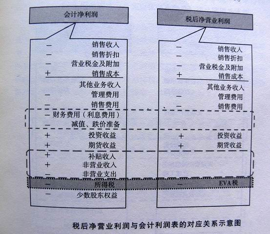

## 会计等式与其变形式

### 1 恒等式变形式

- 资产 = 负债 + 所有者权益
- 负债 = 资产 - 所有者权益 （不成立）
- 所有者权益 = 资产 - 负债

### 2 资产类变形式

- 流动资产 + 非流动资产 = 负债 + 所有者权益
- 流动资产 + 长期资产 = 负债 + 所有者权益

>*长期资产 = 非流动资产。*

### 3 资本类变形式

- 流动资产 + 长期资产 = 流动负债 + 非流动负债 + 所有者权益
- 流动资产 + 长期资产 = 流动负债 + 长期资本
- 流动资产 - 流动负债 = 长期资本 - 长期资产
- 营运资本 = 长期资本 - 长期资产

>*营运资本 = 流动资产 - 流动负债。*

## 资本性支出

### 1 定义

资本性支出（Capital Expenditures, CapEx），指的是那些通过它取得的财产或劳务的效益，可
以给予多个会计期间确认的支出。资本性支出的处理是先计入资产类科目，再分期转入费用类科目。
比如，企业在某年度对于固定资产、无形资产和递延资产的开支，会先在首年度转为资产（记将这部
分支出资本化），然后在各年度通过折旧或者摊销的形式转为费用。*资本性支出通常用于针对长期资
产的投资。*

与资本性支出相对的是“成本性支出”或“收益性支出”，它们均在产生的当年作为费用扣减收入。之所
以区分资本性支出和成本性支出是为了更准确地反映资产的价值和计算各年损益。

### 2 计算

资本性支出的现金流量是固定资产、无形资产和递延资产（长期资产）的流入减流出。

> 资本性支出 = 构建长期资产的支出 - 处置长期资产的收入

同时，它也等价于：

> 资本性支出 = 净经营长期资产增加量 + 折旧/摊销 (净经营资产增加量 = 年末长期资产净额 - 年初长期资产净额)

### 3 分析
财务报表都会单独列出企业当年的资本性支出，拿到这个数字后通常可以从两个方面去分析：

- 与当期的折旧数字相比较，判断企业是否是在持续成长。折旧会减少企业现有的固定资产，资本性
支出会增加企业的固定资产。如果折旧大于资本性支出，可以大致判断企业的投资不足，发展没有多
大后劲；如果资本性支出大于折旧，可以大致判断企业在发展扩张，前景看好。
- 计算资本性支出占当年收入的比例，进行横向和纵向比较。横向对比主要是进行行业内企业的对比
分析，如福特和通用；纵向对比是和一家企业前几年数据的比较，可以看出企业是否是在加大还是缩
减固定资产的投入。如果是缩减，可能表明行业在萎缩，企业投资趋于谨慎。

## 营运资本

### 1 定义

营运资本的基本定义是“流动资产 - 流动负债”，简单看，营运资本越大越说明企业有很强的短期偿
债能力、短期财务风险低。实际上，营运资本并不是越大越好。比如，企业仓库里面有巨量的存货，
没有多少的流动负债，那企业的营运资本其实也相当高的，但此时存货占用了企业大量现金。

### 2 计算

流动资产中的应收款项、预付款项和存货有一个共同点：让企业预先付出资金，或者延期收到资金。
因此，这部分资金越多企业能够自由运用的资金越少。

*注：这部分按照自己的理解可以称为“经营性流动资产，与后文“以利润间接计算经营现金流”里的对
应。*

流动负债中的预收款项、应付款项的共同点：让企业预先支出，或者延期支付资金。因此这部分资金
越多企业能够自由运用的资金越多。

*注：这部分按照自己的理解可以称为“经营性流动负债，与后文“以利润间接计算经营现金流”里的对
应。*

|项目|特点|
|-|-|
|流动资产相关项：应收款项、预付款项及存货|企业预先付出资金，或者延期收回资金|
|流动负债相关项：预收款项及应付款项|企业预先支出资金，或者延期支付资金|

在企业自由现金流计算中有一项“营运资本增加量”，即是这里的“流动资产相关项增加量 - 流动负债
相关项的增加量”。

## 自由现金流贴现模型

### 1 自由现金流与现金流的关系

会计报表中的现金流量表说明了现金及其等价物是如何发生变动的，包括了经营、投资和融资三部分，
而自由现金流则是从财务的角度来讨论企业产生现金流量的能力。

|现金流量表|自由现金流表|
|-|-|
|经营现金流|自由现金流|
|投资现金流|非经营性现金流|
|融资现金流|资本现金流|
|净现金流|净现金流|

如上是从《财务分析与估值》里选取的一张对比关系表，其中：

- 左边的“净现金流” = 右边的“净现金流”。
- 左边的“融资现金流” = 右边的“资本现金流”。
- 左边的“投资现金流”划分为两类：A，与经营相关的投资现金流；B，与经营无关的投资现金流。
  - B = 右边的“非经营性现金流”。
  - A - 左边的“经营现金流” = 右边的“自由现金流”。

自由现金流相比经营现金流的差别在于自由现金流是在经营现金流的基础之上减去企业为了维持自身
规模的一些资本性支出（固定资产和无形资产的投资）。在自由现金流的视角下，相当于是将经营现
金流和投资现金流进行了重组，具体的是将投资现金流分成了两部分：一部分是“与维持企业经营的那
部分投资”；另一部分是“与经营活动没关系的其他投资”。

*190416 注：前天阅读《价值投资实战》第二章老唐有关自由现金流的估算说明之后才理会到上面这
段话，即“投资现金流”中的支出并不能全部计算自由现金流，需要刨除与“维持”企业经营无关的那部
分现金支出。*

### 2 自由现金流的计算

#### 算法一：直接法

按照如上的解释：

> 自由现金流 = 经营现金流 - 与经营相关的投资现金流

所以最直接的方法是将现金流量表里的“经营活动产生的现金流量净额”减去投资于长期资产部分的经
营性支出，即“购建固定资产、无形资产和其他长期资产所支付的现金 -  处置固定资产、无形资产
和其他长期资产所收回的现金”这部分差额。

#### 算法二：间接法，从净利润推算自由现金流

> 自由现金流 = 息税前利润*（1-所得税率）+ 折旧摊销 - 营运资本增加量 - 资本支出

> ==> 自由现金流 = 息税前利润*（1-所得税率）- 营运资本增加量 - 经营长期资产增加量

#### 算法三：间接法，从税后营业净利润推算现金流

这种方法来自肖星的课程《财务分析与估值》，觉得这种更合理。

Step 1: 计算税后营业净利润（Net Operating Profit After Tax, NOPAT）

|营业收入|净利润|
|-|-|
|-营业成本|+资产减值损失|
|-营业税金及附加|-公允价值变动收益|
|-营业费用|-投资收益|
|-管理费用|-营业外收支（还可能包括其他收益）|
|=不含利息的税前净利润|+少数股东权益|  
|-税收|+税后利息费用|
|=NOPAT|= NOPAT|

这里的税后营业净利润类似于张新民教授在《企业财务报表分析》里面提到的“核心利润”，不过依然
有几点不同。核心利润的定义为“营业利润 - 公允价值变动收益 - 投资收益 - 其他收益”，那么NOPAT
基于核心利润的计算则如下：

> NOPAT = 核心利润 + 资产减值损失 + 税后利息费用 - 税收

其实核心利润可以通过“营业总收入 - 营业总成本”进行简便计算，因此可得：

> NOPAT = 营业总收入 - 营业总成本 +资产减值损失 + 税后利息费用 - 税收

比如，如下我们从利润表从营业收入开始正向计算大华股份2017年度的NOPAT：

|项目|本期发生额|
|-|-|
|营业总收入(万元)|1884446|
|营业总成本(万元)|1691917|
|资产减值损失(万元)|24551|
|财务费用(万元)|16743|
|所得税费用(万元)|26542|
|NOPAT|207281|

如果我们从净利润反向计算则为：

|项目|本期发生额|
|-|-|
|净利润|2376786346.10|
|加：资产减值准备|245506915.74|
|公允价值变动损失（收益以“－”号填列）|0.00|
|投资损失（收益以“－”号填列）|29510653.15|
|营业外收入（收益以“－”号填列）|-22,631,016.54|
|营业外支出|12,688,370.45|
|财务费用|167,431,921.69|
|其他收益（收益以“－”号填列）|-735,716,476.52|
|资产处置收益（收益以“－”号填列）|-774,332.50|
|NOPAT|2072802381.57|

*注：此处使用的单位精确到“元”而非上一种计算精确到“万元”的原因在于这里使用的是原始利润表，
而上一种计算方式使用的利润表来自于网易，其中有些项目缺失，比如多达7亿的“其他收益”项。而
之所以网易提供的报表不包含此项在“29、重要会计政策和会计估计变更”有说明：公司在2017年依照
财政部文件对报表格式进行修订，将原来“营业外收入”中的与公司日常活动相关的政府补助部分提出
单列于“其他收益”。*）

Step 2：将税后营业净利润（NOPAT）变为自由现金流

|NOPAT|
|-|
|+折旧|
|+递延所得税增加|
|-经营性流动资产增加|
|-存货增加|
|+经营性流动负债增加|
|-资本性支出（固定资产 + 折旧）|
|-商誉投资（商誉增加 + 摊销）|
|=FCF|

如上的过程即是“NOPAT + 非现金支出 - 营运资本增加量 - 资本性支出”的展开，如下计算大华股
份2017的自由现金流为`-17076万元`。

|项目|本期发生额|
|-|-|
|NOPAT|207281|
|固定资产折旧、油气资产折耗、生产性物资折旧(万元)|13449|
|无形资产摊销(万元)|2777|
|递延所得税资产减少(万元)|-6009|
|递延所得税负债增加(万元)|2176|
|存货的减少(万元)|-64032|
|经营性应收项目的减少(万元)|-411027|
|经营性应付项目的增加(万元)|266835|
|经营活动现金净额|11450|
|购建固定资产、无形资产和其他长期资产所支付的现金(万元)|28781|
| 处置固定资产、无形资产和其他长期资产所收回的现金净额(万元)|255|
|资本性支出|28526|
|自由现金流|-17076|

*注：简便起见，这里的资本性支出直接通过"长期资产投资净额"来替代。*

#### 理解“与经营相关的投资现金流 + 经营现金流 = 自由现金流”

“与经营相关的投资现金流 + 经营现金流 = 自由现金流”这个公式是在上面，也即是《财务分析与估
值》里面提到的，“与经营相关的投资现金流”对应“资本性支出”，因此这个公式可以变形为：

> 经营现金流 = 自由现金流 + 资本性支出 = 税后净营业利润 + 非现金支出 - 营运资本增加量

|项目|本期发生额|
|-|-|
|营业总收入(万元)|1884446|
|营业总成本(万元)|1691917|
|财务费用(万元)|16743|
|资产减值损失(万元)|24551|
|所得税费用(万元)|26542|
|NOPAT|207281|
|固定资产折旧、油气资产折耗、生产性物资折旧(万元)|13449|
|无形资产摊销(万元)|2777|
|递延所得税资产减少(万元)|-6009|
|递延所得税负债增加(万元)|2176|
|存货的减少(万元)|-64032|
|经营性应收项目的减少(万元)|-411027|
|经营性应付项目的增加(万元)|266835|
|经营活动现金净额|11450|

通过这种方式计算出来的“经营活动现金净额”为 11450万元，与现金利润表中的91423万元差别较大，
相差 79973万元。之后核对“58、现金流量表补充资料”发现原因在于“税后营业净利润”里面是不包括
“营业外收支”以及“其他收益”类项目的，而刚好这部分收益多达7亿。这也是税后经营业利润和会计净
利润的差异：

#### 结论

通过如上对自由现金流的演算，一种简便的计算方式为：

> FCF = 经营现金流量净额 - 其他类收益 - 资本性支出

其中的“资本性支出”可以通过针对长期资产的投资简单计算。

## 参考

- [彻底理解“资本性支出”](https://zhuanlan.zhihu.com/p/24462170)
- [彻底理解“营运资本”](https://zhuanlan.zhihu.com/p/24358925)
- [资本性支出](https://wiki.mbalib.com/wiki/%E8%B5%84%E6%9C%AC%E6%80%A7%E6%94%AF%E5%87%BA)
- [资本支出为什么包括折旧摊销](https://www.zhihu.com/question/26100145)
- 斯蒂芬 A.罗斯，《公司理财》，机械工业出版社
- [肖星，《财务分析与估值》](https://www.youtube.com/playlist?list=PLQ6rDC61XVwVkDZWF3fa7KHLFR1jlqCdN)
- [税后净营业利润](https://wiki.mbalib.com/wiki/%E7%A8%8E%E5%90%8E%E5%87%80%E8%90%A5%E4%B8%9A%E5%88%A9%E6%B6%A6)
