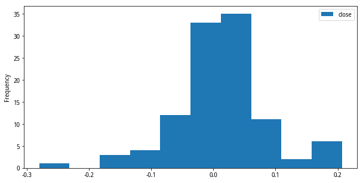

## 使用直方图

直方图通常用来展示数据的分布情况，通过直方图能够对整个数据集合有一个感性的认识。下面是一个简单的直方图：

直方图会将要展示的数据按照数值的范围切割为多个“段”，这些“段”的专业名词称作`bin`(中文名称"箱")，然后会统计出处在各个数据段中的数据个数。

## 使用pandas的hist函数

Python强大的能力一方面来自于它具有强大的生态。我们现在使用Python来画直方图，首先需要认识两个新的Python函数库（也可以叫函数模块）：

- pandas：基于numpy之上构建，除了具有NumPy高性能的数组计算功能，还具有便捷地处理结构化数据如电子表格、关系型数据库数据的功能。
- matplotlib：专门用于绘制数据图表的Python库，支持绘制不同的图形，不管是2D、3D，所以里面还细分了一些子模块，其中的`pyplot`子模块专门用来绘制2D图形。

要画出直方图可以使用pandas里的`hist()`函数，但我们经常可以看到一些相似的接口，比如[pandas.DataFrame.hist](https://pandas.pydata.org/docs/reference/api/pandas.DataFrame.hist.html)，[pandas.DataFrame.plot.hist](https://pandas.pydata.org/pandas-docs/stable/reference/api/pandas.DataFrame.plot.hist.html)和[matplotlib.pyplot.hist()](https://matplotlib.org/3.5.1/api/_as_gen/matplotlib.pyplot.hist.html)。

它们之间的区别在于`pandas.DataFrame.plot.hist`将整个dataframe的数据展示在一幅图上，而`pandas.DataFrame.hist`会调用`pandas.DataFrame.plot.hist`将dataframe的数据按照不同的列分别展现在不同的图形上。然而，`pandas.DataFrame.plot.hist`本身调用的是`matplotlib.pyplot.hist()`。简单点说，pandas里面相关的hist函数都是基于matplotlib里面的pyplot所做的封装。

前面展示的直方图只需要通过一条语句：`df.plot.hist()`，df是一个有数据的dataframe对象。

## 自定义bin

在[Pandas Histogram | pd.DataFrame.hist()](https://www.youtube.com/watch?v=zNvxJNQhmRs)这个视频里面可以学习到可以创建自定义的bin，比如`df.hist(column='Test1', bins=[0,.5,.75,1])`就可以创建3个bin。

## 创建多个group

`df.hist(column='Test1', by='Major')`会分别针对不同的`Major`创建多个图形。

## 参考

- [pandas.DataFrame.plot.hist](https://pandas.pydata.org/pandas-docs/stable/reference/api/pandas.DataFrame.plot.hist.html)
- [Pandas Histogram | pd.DataFrame.hist()](https://www.youtube.com/watch?v=zNvxJNQhmRs)
- [Creating Histograms using Pandas](https://mode.com/example-gallery/python_histogram/)
- [What is pyplot?](https://www.educative.io/edpresso/what-is-pyplot-in-python)
- [Pandas.DataFrame.hist() function in Python](https://www.geeksforgeeks.org/pandas-dataframe-hist-function-in-python/)
