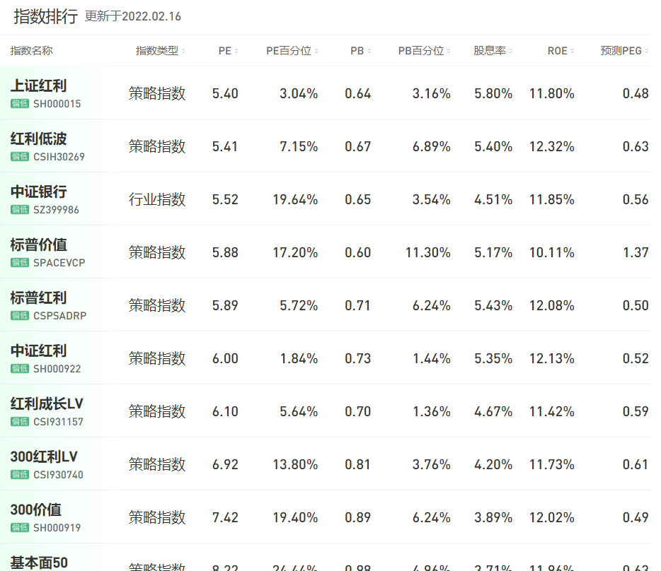
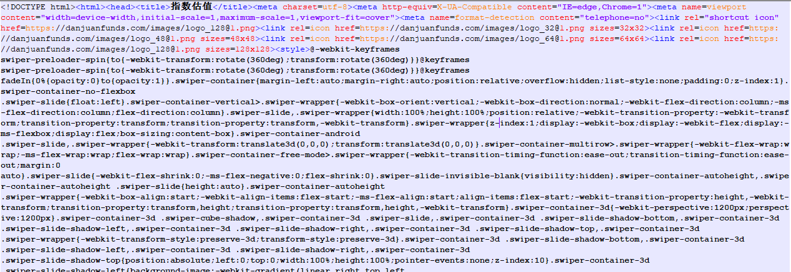

## 简单网络爬虫：从蛋卷基金爬取指数估值数据（一）

> 简单网络爬虫的学习笔记内容包括两部分：上）学习如何从蛋卷基金爬取估值数据；下）将爬取的数据保存为本地可以查看的csv格式的数据，并将其部署为定时邮件任务，每天自动发送。

先说下需求。

有一天我在逛蛋卷基金的时候看到了上面的“指数估值模块”，链接在这里：https://danjuanfunds.com/djmodule/value-center?channel=1300100141。打开对应的网页是下面这样：



我的想法很简单，就是把上面的这张数据表下载到本地，保存为方便查看的格式（比如csv），然后最好能够做成自动邮件发送的形式让我每天都可以收到估值邮件。

## 使用`requests`来爬取网页

先进行第一步：数据获取。首先，从网络上了解到用来爬取网页内容的常用工具是Python语言李的`requests`模块。于是就边学边用，爬取某个网页非常方便，只需要调用`requests.get()`方法，然后传入对应的URL即可。

```
r = requests.get('https://danjuanfunds.com/djmodule/value-center?channel=1300100141')
print(r.status_code ) # 403
```

让我感到奇怪的是，上面的调用返回的结果是一个错误码：403，这个错误码在[HTTP 状态码](https://www.runoob.com/http/http-status-codes.html)描述，它的意思是“Forbidden：服务器理解请求客户端的请求，但是拒绝执行此请求”。

这有点出人意料，本想搞个大计划，怎么第一步都没有迈出去。明明我手动在浏览器里面键入该URL可以访问但使用`requests.get()`却被拒绝呢？在按照该错误在网络上搜索一阵之后弄明白了，这是因为对方的服务器会对接收到的请求进行一些区分处理，对于那些能够很明白识别出的是爬虫或者一些软件程序发送的请求服务器会拒绝应答该请求。毕竟网站都是更喜欢真实人的访问，而非机器的访问来占用服务器的资源。

解决方案也简单，你需要自己构造HTTP请求的header，这样可以绕过服务器的检测，认为当前的访问请求来自于真实的浏览器。在构造的header里面需要在`host`字段指定访问的域名：

```
headers = {
'Accept': '*/*',
'Accept-Encoding': 'gzip, deflate, br',
'Accept-Language': 'zh-CN,zh;q=0.8,zh-TW;q=0.7,zh-HK;q=0.5,en-US;q=0.3,en;q=0.2',
'Connection': 'keep-alive',
'host': 'danjuanfunds.com',
'User-agent': 'Mozilla/5.0 (Windows NT 10.0; WOW 64) AppleWebKit/537.36 (KHTML, like Gecko) Chrome/55.0.2883.87 Safari/537.36 QIHU 360SE'
}

r = requests.get('https://danjuanfunds.com/djmodule/value-center?channel=1300100141', headers=headers)
```

然后就可以正常访问了。那下一步我们就需要理解`requests.get()`的返回结果，只有理解了返回结果的内容我们也才知道怎么去解析它。

`requests.get()`的返回结果是一个`Response`对象，我们可以通过这个对象来读取请求结果，比如其中的`text`以文本形式来解析结果，我们可以使用`r.text`打印出结果看看长什么样：



上图仅仅是截取了一部分，实际上该结果的内容有点多，我的这次测试返回的内容共有587KB。


## 使用`BeautifulSoup`来解析网页（行不通）

从前面已经看到通过`request`爬取下来的网页是整个html页面的所有元素，这些内容看起来确实有点让人眼花缭乱。正是因为这样，才有了另外一个Python模块`BeautifulSoup`专门用来解析HTTP的返回结果。

> Beautiful Soup 是一个可以从HTML或XML文件中提取数据的Python库.它能够通过你喜欢的转换器实现惯用的文档导航,查找,修改文档的方式.Beautiful Soup会帮你节省数小时甚至数天的工作时间.

从BeautifulSoup官方网站的文档上面可以看到它的定义，它是专门用来解析html/xml文件的。我们知道单独的html文件（就像前面的那张截图）其实也是可以直接进行分析的，因为你可以看到html组成的各个元素，而BeautifulSoup所做的类似于给html文件内容创建了按照标签组织的索引，这样你就更容易访问其中的数据了，比如你可以通过`get_text()`直接获取某个html页面所有的文本内容，通过`find_all('a')`来找到所有的超链接。

不过遗憾的是这里用不到它。因为我把获取到的网页内容保存下来之后去搜索，并没有发现自己期望的那些估值数据。

那为什么在浏览器访问的时候能够看到估值数据，但是爬取的网页里面却没有呢？


## 处理Javascript


原来是因为现在的网页通常都包含了Javascript脚本语言，网页里面的内容通常会进行延迟加载，很多还和用户访问的行为有关。这也是在使用爬虫时候碰到的最常见的问题，而网络上也已经有了成熟的解决方案，常见的包括三种：

1. 使用`selenium`模块
2. 使用`phantomJS`模块
3. 直接调用对应的API去获取数据

前面两种就先不多说了，我们这里就用第三种，思路很简单，就是直接找到Javascript脚本所要加载数据的源地址，从源地址那里去取过来就好了。怎么找呢？按F12进入调试页面，然后从Network里面去找：


从中可以看到加载请求页面时候发送的所有HTTP请求以及结果，从中我们可以找到Name为“dj”的就是针对估值数据的请求，请求的URL为`https://danjuanfunds.com/djapi/index_eva/dj`，该请求对应的Respond就是网页上面展示的估值数据。

所以我们下一步就很简单，因为我当前需要获取的是这些估值数据，所以只需要将之前整个网页的URL替换为估值数据所在的URL即可：

```
# 修改前
r = requests.get('https://danjuanfunds.com/djmodule/value-center?channel=1300100141', headers=headers)

# 修改后
r = requests.get('https://danjuanfunds.com/djapi/index_eva/dj', headers=headers)
```

我们这时可以看到针对估值链接的回复的请求内容为：


参考：

- [Requests: 让 HTTP 服务人类](https://docs.python-requests.org/zh_CN/latest/)
- [HTTP 状态码](https://www.runoob.com/http/http-status-codes.html)
- [Python Requests.get访问网页403错误](https://zhuanlan.zhihu.com/p/35853860)
- [定制请求头](https://docs.python-requests.org/zh_CN/latest/user/quickstart.html#id6)
- [HTTP Headers](https://developer.mozilla.org/zh-CN/docs/Web/HTTP/Headers)
- [Beautiful Soup 4.4.0 文档](https://beautifulsoup.readthedocs.io/zh_CN/v4.4.0/)
