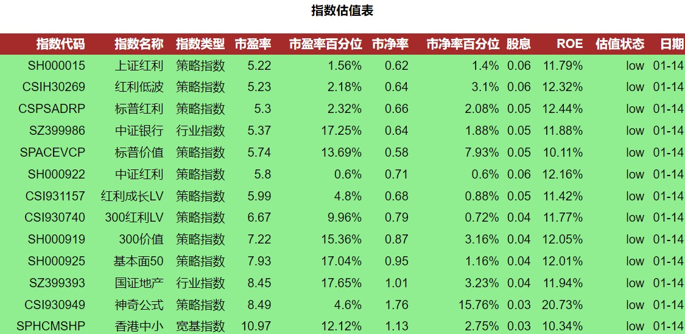

## 简单网络爬虫：从蛋卷基金爬取指数估值数据（下）

> 简单网络爬虫的学习笔记内容简介：1）学习如何从蛋卷基金爬取估值数据；2）将爬取的数据保存为本地可以查看的csv格式的数据，并将其部署为定时邮件任务，每天自动发送。

上篇笔记里面已经介绍了如何从蛋卷基金上爬取估值数据，通过几行代码我们可以得到如下格式的数据：


上面的数据是按照jason格式来组织的。JSON全称为“JavsScript Object Notation”，它是一种在网络开发中普遍使用的轻量级的数据交换格式。这种格式是通过大括号`{}`和冒号`:`来定义数据格式，见多了就熟悉了。


## 使用`pandas`处理JSON数据

按照自己的需求，我是想将这些JSON格式的数据转化为CSV格式的数据保存下来的。为什么要转成CSV格式的数据？因为方便使用电子表格软件打开查看。

将JSON格式转化为CSV格式，可以使用另外一个数据分析里常见的Python模块`pandas`。我们前面获取到的JSON格式是下面这样的：

```
{
   "data":{
      "items":[
         {
            "id":432423,
            "index_code":"SH000015",
            "name":"上证红利",
            "ttype":"2",
            "pe":5.4058,
            "pb":0.6378,
            "pe_percentile":0.0308,
            "pb_percentile":0.032,
            "roe":0.118,
            "yeild":0.058,
            "ts":1645027200000,
            "eva_type":"low",
            "eva_type_int":0,
            "url":"",
            "bond_yeild":0.05,
            "begin_at":1320249600000,
            "created_at":1645147418761,
            "updated_at":1645147418761,
            "peg":0.4859,
            "pb_flag":false,
            "pb_over_history":0.968,
            "pe_over_history":0.9692,
            "date":"02-17"
         },
         {
            "id":432395,
            "index_code":"CSIH30269",
            "name":"红利低波",
            "ttype":"2",
            "pe":5.416,
            "pb":0.6674,
            "pe_percentile":0.0734,
            "pb_percentile":0.0699,
            "roe":0.1232,
            "yeild":0.054,
            "ts":1645027200000,
            "eva_type":"low",
            "eva_type_int":0,
            "url":"https://danjuanfunds.com/funding/005279?channel=1800100001&source=guzhi__web_20171001",
            "bond_yeild":0.05,
            "begin_at":1387382400000,
            "created_at":1645147418761,
            "updated_at":1645147418761,
            "peg":0.635,
            "pb_flag":false,
            "pb_over_history":0.9301,
            "pe_over_history":0.9266,
            "date":"02-17"
         },
         ...
```

实际上，我只需要其中的`items`对应的某些值，所以直接用这些JSON数据来初始化`DataFrame`对象，然后调用它的`to_csv()`方法保存为CSV的格式就行了。到现在这个简单的爬虫只用了几行代码就完成了数据的获取功能：

```
response = requests.get('https://danjuanfunds.com/djapi/index_eva/dj', headers=headers)

df = pd.DataFrame(response.json()['data']['items'], columns=['index_code', 'name', 'ttype', 'pe', 'pe_percentile', 'pb', 'pb_percentile', 'yeild', 'roe', 'eva_type', 'date'])
df.to_csv("index_evaluation.csv", encoding='utf_8_sig')
```


## 生成邮件报告

为了把这些估值数据以邮件形式定时发送，还有两件事情要做：

- 使用Python去编写邮件，然后在其中引用已经爬下来的估值数据
- 将最终的脚本部署到服务器上，并且添加定时任务


1）编写邮件

编写邮件的过程中，需要使用到一些Python库，比如用来完成邮件发送的`smtplib`，组装邮件结构的`email`。这些内容这里就不介绍了，网络上内容很多。我这个练习的源代码也放在`https://github.com/tcfh2016/index-evaluation`，感兴趣的可以直接下载。最后的邮件就像下面这样：



当然，定制邮件还可以涉及到不同邮件终端对于HTML的支持（主要是CSS等特性）不同这样的小问题，但整体上还是比较容易。


2）部署到服务器

有了上面的脚本之后，其实不一定要部署到服务器上，你放在电脑里，想要看的时候运行下脚本就行了。不过要是这样，还不如直接打开蛋卷基金的网页看呢。况且，为了多尝试一些看起来比较cool的事情可以将其放在服务器上，然后设定定时服务，这样每天就能够定时接收到邮件了。

比如，我花了38元在腾讯云上购买了一年的云服务器，只需要登录上去，使用`crontab`简单配置一下即可：

```
```

总体上来说，这次简单爬虫的练习看起来确实很简单，爬取数据只用了少数几行代码。但其中涉及到了一些WEB相关的概念以及Python库，对于新人来说，就需要花些时间学习，整个下来还是要捣鼓一两天的时间的。


参考：

- [JSON](https://zh.wikipedia.org/wiki/JSON)
- [脚本源代码](https://github.com/tcfh2016/index-evaluation)
