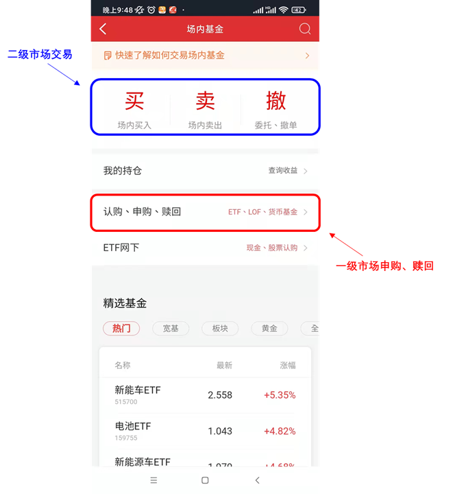
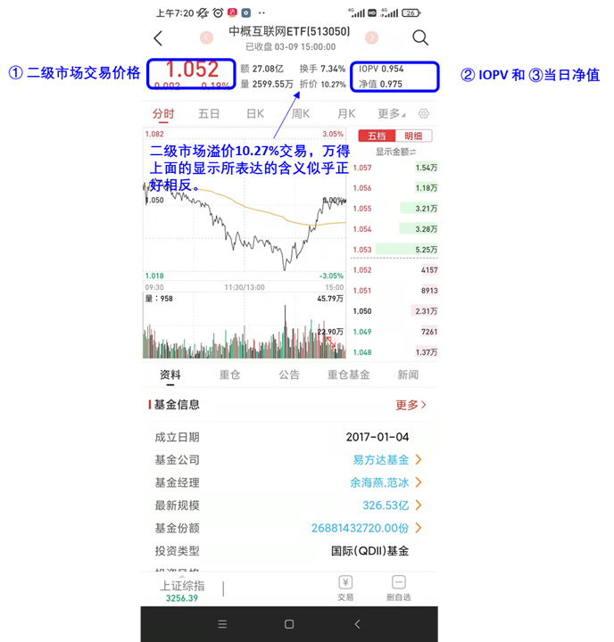
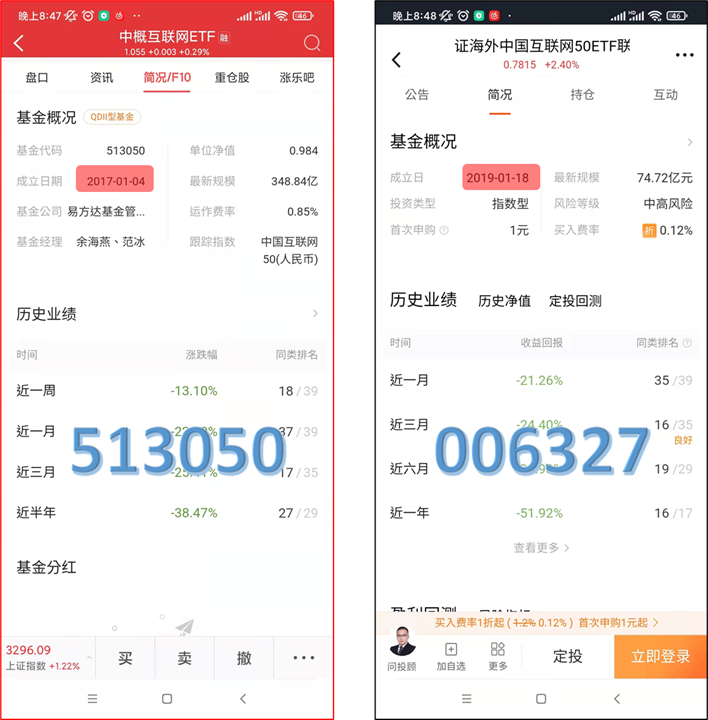

## 中概互联的溢价问题

我总是这么后知后觉，开始买中概互联都已经一个多月了，现在才关注到它的溢价问题。可见自身所具有的投资基础理论的不足，还好再意识到这个问题之后，也想着去把这个问题弄清楚。以下就是我这几天的一些笔记。

## 理解ETF的运转机制

第一步，要搞清楚ETF背后的交易机制。为此，先从网络上了解资料。发现了国内外在ETF上的差异性，而这种差异性容易让人迷糊，而网络上的文章对此能够区分得清楚的文章并不多。为了不让本文过于复杂，在这里仅重点叙述国内的ETF交易机制。

首先要理解ETF交易的本质，购买某只ETF实际上等同于一次性购买了多只股票。这里面能够很容易看出买卖ETF有一个交易费用上的优势，因为如果你要一次性购买多只股票那么你需要分别为每次交易付手续费，但是通过ETF来购买只需要付一次手续费。但是，有一个容易被忽略的潜在问题，那就是谁去购买ETF对应的一揽子股票？

答案是AP（authorized participants），也就是那些能够进行大批量交易的专业投资者。由他们来进行ETF份额的创建和赎回。这个过程如下：

- 当有投资者需要购买新的ETF份额时，AP先去购买ETF对应的一揽子股票，然后兑换为ETF份额，然后再将这些份额卖给保荐人。

注意，这里是购买新的ETF份额，不是旧的份额。旧的份额可以从其他投资者手里交易？

假设某只ETF在闭市时的交易价格是101元，但从ETF对应的一揽子股票来计算它的价值只有100元，那么当前处于溢价交易。这样AP就有动力去搞这种可以赚钱的转手买卖，也就是从市场里面去买股票，然后以高价卖出。这就是使得这种差价慢慢消失。也使得整体ETF的份额逐步增加。

相反，AP也可以买入ETF份额并将其出售给ETF保荐人，然后可以在市场上把对应的一揽子股票卖出。这样，ETF的份额就会相应的减少。这个过程成为赎回。这种情况多发生在ETF折价交易时，比如一揽子股票对应的价值为100元，但实际上在ETF份额交易是按照99元的价格交易，那么AP可以买入ETF份额换成股票并在市场上售出，这样也可以赚取差价。

两个机构：authorised participants（APs）和market makers（做市商）。

ETF投资者并不直接和ETF发行方打交道。对于已有的ETF份额来说，像股票投资一样投资者之间相互交易。

特许经营上的角色前面已经介绍了。而做市商角色的主要目的为二级市场的交易提供流动性。这两种角色根据具体情况可能由相同的机构或者不同的机构担任。

在国内市场上，特许经营商和做市商通常都是券商。

2020年底，上交所共有260只ETF，其中做市商参与其中的208只，占比达80%。

国内外ETF申赎机制的不同：国内由基金公司办理申购赎回，国外通常由AP代办申赎。国内ETF的PCF（英文Portfolio Composition File，中文名叫申购赎回清单）强制每日披露的，而在披露PCF之后，由于投资者会严格按照PCF进行申赎，基金的实际持仓与PCF之间的差异会比国外的情况更小。

基金代码：513050；申购赎回代码：513051

## 净值、基金份额参考净值和交易价格

ETF在交易方式上却有着和股票一样的特色，共同基金的买卖价格是投资资产的净值，是每个交易日更新一次，但ETF的交易价格并不是对应的资产净值，而是和股票交易价格一样，因为投资者相互之间的竞价每时每刻都在更新。

溢价和折价交易

## 投资者的选择

普通投资者购买买ETF的场外联接可以规避折溢价的问题。但如果场外限购，将限制你的购买量。这可能反过来催生场内交易的需求，进一步提高场内的溢价。

有的投资者分不清中概互联ETF（513050）和中概互联LOF（006327），这两只基金的经理都是余海燕和范冰，并且都是用来投资中概互联的企业。然而，它们确确实实是两只不同的基金，有以下两个方面的不同：

首先，成立时间不同。513050是2017年1月4日成立的：但006327是2019年1月18日成立的：

其次，513050是ETF，只能在场内买卖，简单理解是可以在券商账户里进行买卖，包括一级市场申购赎回和二级市场交易两种投资方式。006327是用来投资513050的ETF联接基金，简单来说是为了方便更多没有券商账户的用户也能够投资513050而专门设置的场外基金。

你会不会奇怪为什么相同的基金经理先搞了一个ETF，然后再搞一个投资于这个ETF的ETF联接基金？一个最直白的原因是可以赚更多手续费。因为ETF联接基金可以让更多人（没有证券账户也可以买买买）参与到ETF投资，同时有更高的手续费。

## 参考

- [Understanding Exchange Traded Funds Premiums and Discounts](https://www.mackenzieinvestments.com/content/dam/final/corporate/mackenzie/docs/etfs/mm-premiums-discounts-en.pdf)
- [Understanding Premiums And Discounts](https://www.etf.com/etf-education-center/etf-basics/understanding-premiums-and-discounts)
- [中概互联场内基金的折溢价问题](https://zhuanlan.zhihu.com/p/411877945)
- [中概互联溢价 8％，买了就是被割韭菜？](https://new.qq.com/omn/20211208/20211208A016BW00.html)
- [中概互联究竟能不能套利](https://xueqiu.com/9896517675/200050583)
