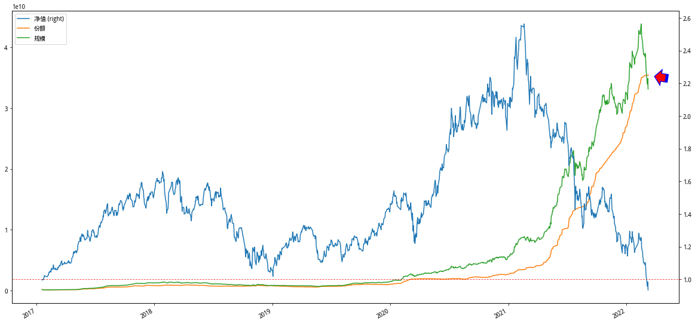

## 中概互联的溢价问题

我总是这么后知后觉，开始买中概互联都已经一个多月了，现在才关注到它的溢价问题。可见身入股市六年有余，但所具有的投资基础理论实在不足。还好再意识到这个问题之后，赶紧想着去把这个问题弄清楚。以下就是我这几天的一些学习笔记。

要弄清楚ETF溢价交易的问题，第一步必须要搞清楚ETF背后的运转机制。这一步搞得我够呛，因为国内的网络文章很多对此有清晰和详细的介绍。而境外其他证券市场在ETF的运作上存在差异性，这种差异性容易让初学者迷糊。

比如，境外其他证券市场讲解ETF必然会介绍AP（特许经营商）和Market Maker（做市商），但在A股市场的ETF却没有AP，同时对于做市商的概念也比较淡化。为了让这篇笔记更简单，尤其对于初入市场的投资者更具有参考价值，这里仅重点叙述国内的ETF运转机制。

## ETF的运转市场

ETF的运行涉及到两级市场：一级市场（primary market）和二级市场（secondary market），两者的区别大致如下：

- 一级市场，直接与ETF发行方（基金公司）打交道的地方，投资者可以基金公司申购或者赎回ETF份额，申购或者赎回份额有最基本的资格要求。比如最低申购份额为1000000，这也意味着每次交易的量级在百万级别，所以主要参与者是一些专业投资机构或者做市商。
- 二级市场，普通投资者执行ETF买卖的交易所，在这里投资者买入或者卖出已有的ETF份额，买入或者卖出的价格和股票买卖一样，价格会实时变化。二级市场的参与者主要是投资者，但因为保证ETF的交易具有一定的流动性，所以当前场内的ETF交易引入了做市商的机制。

做市商的概念简单来讲就是一些获得了做市商资格的券商为了保证二级市场ETF交易的流动性，跑到二级市场来一起参与买卖。所以，我们在打开券商APP交易的时候应该知道我买卖的对象除了其他普通的散户之外还有做市商。做市商参与ETF的交易已经很普遍，《2020 年度上交所基金做市商发展报告》里面提到2020年底，上交所共有260只ETF，其中做市商参与其中的208只，占比达80%。

ETF的交易因为涉及到两个不同的市场，会涉及到价格的同步问题。比如，一级市场的申购和赎回每天的报价只有一次，但二级市场的交易价格是实时变动的。当两个市场的交易价格相差较大时就会触发套利，这种套利会反过来将两个市场的价格保持一定的平衡。而本篇笔记要讨论中概互联的溢价问题就是中概互联在二级市场的交易价格比一级市场更高的问题。

不过先别急，继续往下看。

## ETF的运转机制

了解了一级市场和二级市场概念之后，我们可以进一步来看看ETF在交易过程中的一些行为。在查阅了一些资料并结合自己的理解，画了一幅图。当然，毕竟不是老鸟，不保证全对。

结合上面这幅图来捋一捋ETF的交易过程：

- ETF在募集之初，会和股票一样有个认购过程，投资者可以在网上和网下参与认购，这里的“网”指的是“交易所”，也就是是否在上交所或者深交所的交易时段进行申购。
- ETF在发行之后，交易的主场在二级市场，也就是ETF投资者之间的买卖活动。ETF二级市场的交易引入了做市商，所以这里交易对象是除了的投资者还有做市商。也就是你的每次买入要么是从其他普通投资者手里要么是从做市商（具有做市资格券商）手里买过来。卖出也是同样。
- 不同于一家上市公司的股票份额在特定时间内是固定不变的情况，ETF的份额可以随着需求的增加而增加，随着需求的减少而减少。这个二级市场需求的变化会传到到一级市场，这种传导的源动力就是两个市场之间价格不同的套利机制。

举个例子。某个交易日ETF在一级市场的报价为100元，但是在二级市场的交易价格却一直处在高于100元的位置（溢价交易），那么就会有投资者在一级市场从ETF发行人那里申购新的ETF份额在二级市场卖出来获利。这个“大批量卖出”的操作会促使二级市场高于100元的交易价格向100元靠齐。

同理，某个交易日ETF在一级市场的报价为100元，但是在二级市场的交易价格却一直处在低于100元的位置（折价交易），那么就会有投资者将二级市场较低价买来的ETF份额卖给一级市场的ETF发行方（赎回过程）来获利。这个在二级市场“大批量买入”的操作会促使二级市场低于100元的交易价格向100元回升。

怎样在二级市场买卖大家都很熟悉了，那怎样在一级市场申购和赎回呢？我打开华泰证券app截了一副图，并且标注如下：

在一级市场和二级市场交易的时候对应的ETF代码是不一样的，比如对于中概互联来说在二级市场的基金代码为513050，而在一级市场的申购赎回代码为513051。是不是有点想摩拳擦掌去实战一番了？且慢，因为一级市场的交易门槛比较高。交易所每天都会给公布ETF公告申购赎回清单，在其中会指定基本要求，比如最小申购、赎回单位为1000000份，也就是每次申购和赎回至少在百万元级别：

所以，想要套利也不是那么容易。当然，套利真正不容易在交易门槛上是一方面，还有其他方面的原因。咱们继续。

## 净值、基金份额参考净值和交易价格

既然ETF的交易涉及到两个市场，那么同样一份ETF的价格就不止一个，实际上是有三个：净值、基金份额参考净值和交易价格。

一级市场的价格是每个交易日会根据ETF对应的一揽子股票去计算一次，这个价格就是所谓的“净值”，它是一个比较温顺的变量，不闹腾。

二级市场的价格是每个交易日各路投资者在交易时段内努力拼搏奋斗的表现，就像你买卖股票时那样，是那个每时每刻都在变化的价格，俗称“交易价格”。

上面这两个价格最常见，基本所有的券商和网站上都会显示。但还有一个价格，即“基金份额参考净值（IOPV，Indicative Optimized Portfolio Value）”。

ETF的净值是每个交易日收盘之后公布一次，所以尽管ETF对应的股票价格已经在不断的变化，当前交易日结束之前这个净值却一直停留在上一个交易日。所以，为了让当前市场的交易能够参考到ETF在当下的实际情况，交易所根据基金管理人提供的计算方法和证券组合清单，在盘中最新对应证券的成交价格实时计算并公布的基金份额净值估计值（每15秒更新一次）。这个IOPV可以简单用下面这个公式来计算：

  基金份额参考净值 = 昨天净值 + 今天成分股的整体涨跌幅

也就是说，这个IOPV可以说是最接近当前ETF份额的净值了，因此二级市场上的溢价交易还是折价交易就是根据“交易价格”和“基金份额参考净值”来计算的。当“交易价格”大于“基金份额参考净值”时处于溢价交易状态，反之则处于折价交易状态。我下面截取的3月9日收盘后中概互联的行情图：

可见中概互联在当天的溢价率高达10.27%，上交所为此专门发布了风险提示公告。当然万得app上面对于“折价”、“溢价”的展示方式和我们常规的理解刚好相反，不知道什么原因。

那为什么中概互联会有这么高的溢价？笔记最开始的时候我们讲了ETF的一级市场、二级市场，也讲了套利机制如何平衡这两个市场之间的价格差。按理论上讲，既然有套利机制存在，就不应该存在这么高的溢价率，难道哪些手握重金的投资者都傻了？

## 中概互联的高溢价

1）难以准确估值促成了常规溢价

第一个原因在于中概互联是一直投资于国际市场的ETF，查看它跟踪的中概互联50指数可以知道它对应的股票分别是在港股和美股市场上市公司发行的股票。然而，港股和美股分别处于不同的时区交易，这给中概互联ETF的基金的IOPV的计算也造成了麻烦，港股开市的时候美股闭市，更何况中概互联还是在A股市场交易的ETF，所以也没有办法每15秒更新一次净值数据了。

既然无法掌握ETF的实时净值，那在交易上就会有更大的波动。比如有的投资者会看好隔夜美股市场的股票表现那么就会出高价去买，当买入需求增加的时候自然也就让整体的交易趋势走向了溢价。

2）外汇额度不够导致套利机制失灵

然而，当前中概互联10点左右的溢价率最为主要的原因在于外汇额度的限制，我们可以在外管局网站上找到各个基金公司的外汇额度。比如管理中概互联ETF（513050)的易方达基金管理有限公司去年末的外汇额度是73.5亿美元，差不多470亿人民币。

470亿人民币是公司总的外汇额度，我虽然不知道中概互联ETF占用了易方达基金公司具体多少的外汇额度，但从当前近400亿的净值规模去推算，其实已经很多了。其实我们看到中概互联尽管最近一周下跌很多，但份额的增长已经快停止了：

二级市场在以高达10个点左右的溢价进行交易清晰的告诉我们份额的增长并不是因为买入需求减少所导致，而是因为外汇额度受限。

这个过程是这样的：当二级市场出现高溢价时，理论上高溢价会触发套利机制，将会有更多的ETF份额从一级市场购入来平衡溢价。但因为基金公司的外汇额度紧张，无法申购得到新的ETF份额，所以投资者只能够在二级市场内以高价去买另外一些投资者手里已有的份额（和股票交易无疑）。

## 投资者的选择

弄清楚中概互联当前的高溢价之后，投资者首先应该意识到这其中可能存在的风险。也就是就如股票一样，由预期建立起来的溢价也可能因为预期不成立而迅速消失。

如果一定看好中概互联，那么有两种方法以更低的成本参与其中：第一、自己去购买成分股，当然也会有外汇额度的问题；第二、去买其他公司发行的中概互联ETF，毕竟易方达的外汇额度快用完了，其他基金公司的未必。第三、可以购买投资于中概互联ETF的联接基金，也会有限额的情况。

或者先等着：我只看看，不说话。

## 参考

- [Understanding Exchange Traded Funds Premiums and Discounts](https://www.mackenzieinvestments.com/content/dam/final/corporate/mackenzie/docs/etfs/mm-premiums-discounts-en.pdf)
- [Understanding Premiums And Discounts](https://www.etf.com/etf-education-center/etf-basics/understanding-premiums-and-discounts)
- [中概互联场内基金的折溢价问题](https://zhuanlan.zhihu.com/p/411877945)
- [中概互联溢价 8％，买了就是被割韭菜？](https://new.qq.com/omn/20211208/20211208A016BW00.html)
- [中概互联究竟能不能套利](https://xueqiu.com/9896517675/200050583)
- [ETF公告申购赎回清单](http://www.sse.com.cn/disclosure/fund/etflist/)
- [易方达中证海外中国互联网 50 交易型开放式指数证券投资基金溢价风险提示公告](http://www.sse.com.cn//disclosure/fund/announcement/c/new/2022-03-10/513050_20220310_1_8xi0AYSf.pdf)
- [关于中概互联，你想知道的一切](https://www.anewsday.com/post/209614.html)
- [合格境内机构投资者（QDII）投资额度审批情况表](http://www.safe.gov.cn/safe/2018/0425/16849.html)
