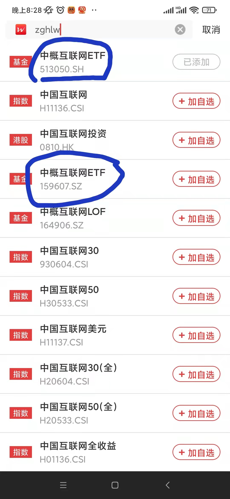
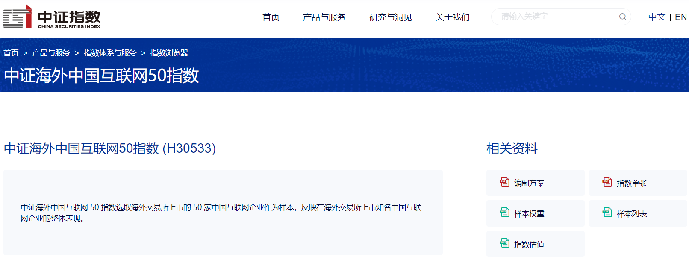
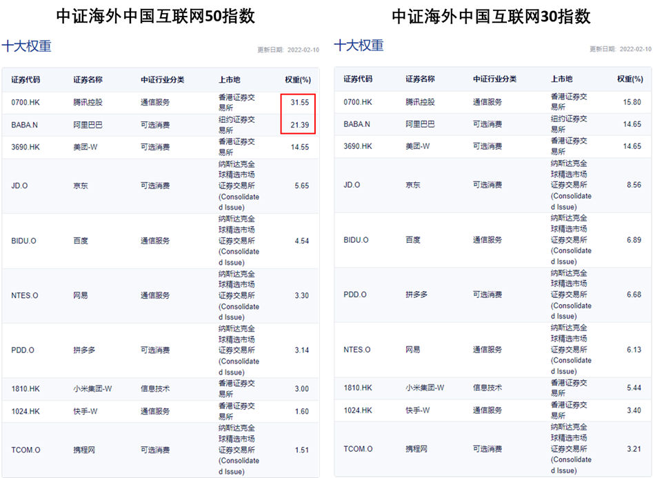
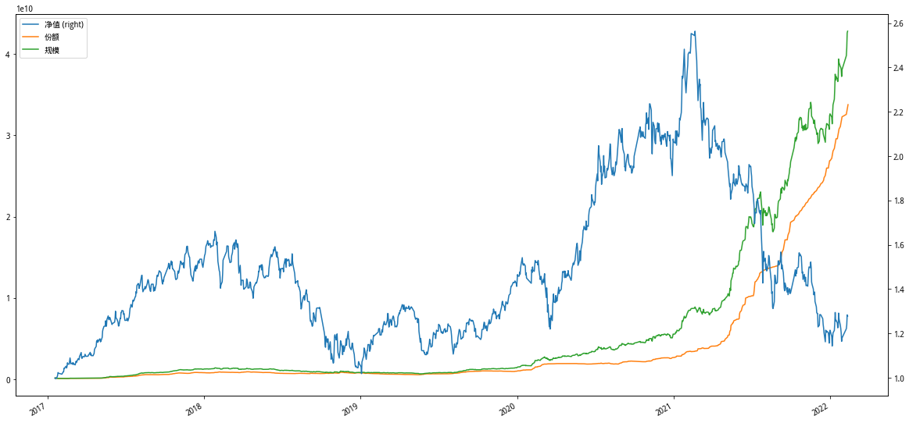

“中概互联”这个词能时常耳闻，但不一定每个人都清楚它到底是什么？特别对于涉市场未深的投资小白而言。所以，今天特意来扒一扒它的背景。

## 什么是中概互联？

首先是自我介绍，“中概互联”实际上指的是“中概互联网ETF”。全称里的“中概互联网”指代的是在国内A股之外的证券市场上市的那些互联网公司，比如在香港上市的腾讯，在美国上市的美团等等。全称里的“ETF”的“Exchange-Trade Fund”的缩写，中文名“交易所交易基金”，可以简单理解为它是具有和股票一样可以在交易所自由买卖属性的基金。

简单点说，“中概互联”就是投资于中概互联网公司的基金。有人或许会好奇为什么这些互联网企业不在A股市场上市呢？那是因为A股上市的要求很高，一些互联网企业初创时还没有盈利，达不到上市的标准，所以只好跑到其他地区的交易所去融资。当然，国内也在做出改变，比如新推出的科创板就是为了方便一些初创的科技类型的公司上市募集资金的，这个扯远了。

最近中概互联比较闻名的是它在2021年下跌幅度过半，笔者当前比较关注下跌较多的ETF，还搞了一个ETF倒数排行榜，最近中概互联ETF稳居第一，自然也就开始注意到它。

## 中概互联网指数

想要弄清楚中概互联网ETF背后到底是买了那些公司的股票，那就不得不去查看ETF背后所跟踪的指数。我们在查找过程中很容易就会发现重名的现象，比如我在Wind应用上搜索就能够发现两个“中概互联网ETF”：

这是一种很常见的情况，你经常可以看到由不同基金公司发行的跟踪相同指数的ETF。不过这里两个中概互联网ETF尽管它们的名字一样，但其实跟踪的指数也是不同的。

1）513050

易方达基金管理有限公司发行的用来跟踪中证海外中国互联网50指数
的ETF，该基金于2017-01-04发行，2017-01-18上市。

2）159607

嘉实基金管理有限公司发行的用来跟踪中证海外中国互联网30指数
的ETF，该基金于2021-11-24发行，2021-12-02上市。

“中概互联”这个称谓通常指的是前者（513050），毕竟这个称谓早已有之，但后面的这只ETF才去年底才发行。

513050和159607尽管都是中概互联网ETF，但是实际上它们是不同的，除了管理公司不同，发行日期不同之外，背后跟踪的公司也是不同，公司不同其实就是“中证海外中国互联网50指数”和“中证海外中国互联网30指数”的不同。

为了了解这两个指数的差异，我们跑到中证指数官方网站（https://www.csindex.com.cn/index.html#/）上面去看看它们到底有什么不同。

首先，在网站上搜索两个指数，可以看到有关它们的详细信息，比如这个指数是怎么编制的（“编制方案”），指数里面各个样本股的权重（“样本权重”）等等。

为了快速的比较，我们只需要对比这两个指数的十大权重股，其实可以发现50和30的十大权重股是一样的，但是在指数50里面腾讯控股和阿里巴巴的权重占到了52.94%。

对，两款ETF背后购买的成分股的持仓比例不同，这就是这两者之间的最大区别。

了解到它们之间的区别之后，你大概也知道自己到底偏向哪一款，如果非常看好腾讯和阿里，那么购买跟踪50的513050毫无疑问是更好的选择。

## 为什么关注到它？

说真的，因为自己一直不喜欢追热点，所以之前一直没有关注过市场闻名的中概互联。今年年初发布《有关ETF交易策略调整的说明》，准备尝试一种ETF低位策略后，开始每周关注近两年行情处在最低位的ETF之后才发现了它，因为它最近排到了第一（也就是近两年走势最差）。

所以自然就注意到它，再开始买入的同时顺便多了解了一下，原来它曾经风光无限，却在去年确遭受了这么强烈的冲击。不过，我们可以看到投资者还是相当看好它的：

从图中可以看到2021年以来，尽管净值不断下跌，但是投资者的买入热情却开始高涨，买入份额和规模连续创下历史新高，在最近的一个交易日规模已达428亿。

当然，我们当前无法保证中概互联此时已经是最低价，但根据成立以来的历史数据，当前的净值已经相当具有吸引力。同时，该指数对应的估值也处在相对低位。对于定投来说，毫无疑问已经是不错的好时机。只是不知道这个好时机会有多长。
