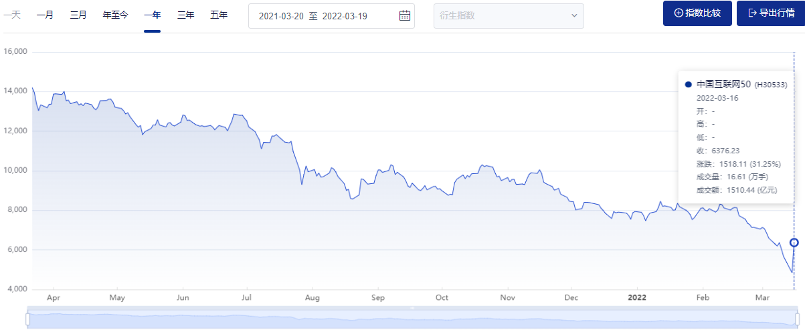
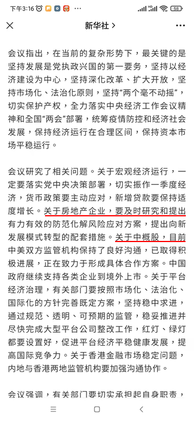
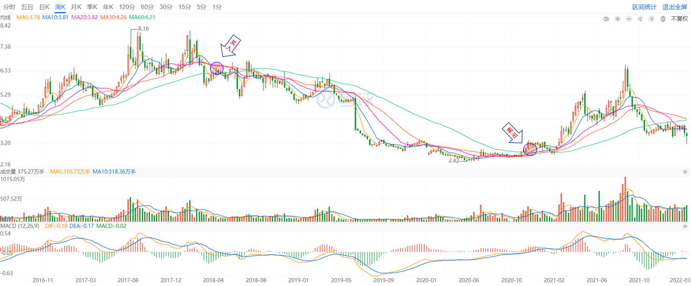
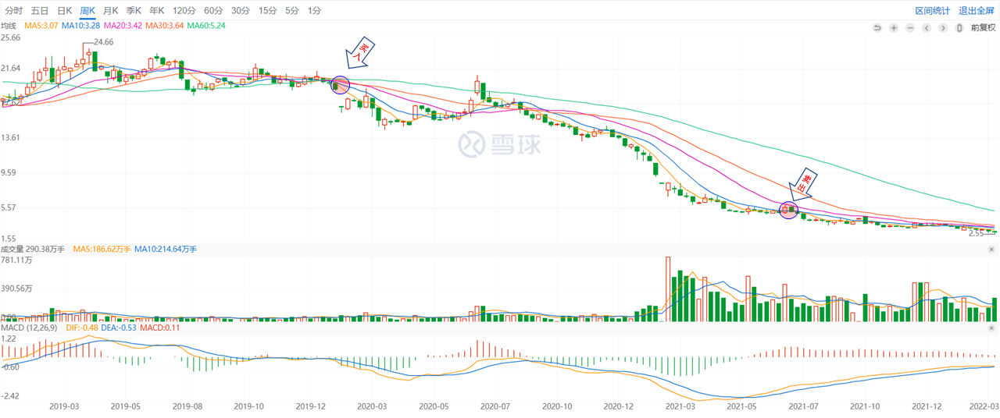

## 投资过程中无法忽视的主题——预测

上周发生了一件让我印象深刻的事情，也就是中概互联50指数在将近一年的持续下跌中，在3月16日这一个交易日突然一下上涨了31.25%：

这个上涨的触发的原因在于当天下午国务院金融委会议对于当前房地产和中概股发布的一些声明。其中体现了官方的关注：

这条新闻发布后中概股集体飙涨35%，有的股票比如房多多当日在盘中甚至直接上涨了100%。一个官方会议上释放的消息能够有这么大的影响？是的，就是这么简单。因为这里面涉及到了投资过程中的一个本质性问题：对于未来收益的预测。

## 我曾经是不相信的

政策对于股市的影响力，我曾经是不相信的，或者更准确地说是我不太在乎。对于去把握一些当下最新的政策、经济形式，我从来没有提起过兴趣。我很骄傲地决定要做一个不搞预测，不关注市场预期的大隐于市的高级投资者。这种盲目的认识，让我交了不少学费。

1）第一个例子

投资的风格似乎和个性有关，我从2015年最高点入市开始，一直不喜欢去追热点，尽管这并没有让我在2015年随后的下跌中损失了超过一半的资金。刚入市的当时，从小道消息入门，跟着不知道哪里听来或者看到的消息胡买一通，比如铁岭新城、上海电力、信邦制药...

这样一直糊涂到2018年，机缘巧合参加了湛泸出版社主持的线上《证券分析》精读活动，为我打开了价值投资广阔的天空。那个时候的阅读让我对于投资有了与之前完全不一样的认识，原来投资并不是听小道消息，而是有着严谨的定义、理念和方法的。我还记得本杰明·格雷厄姆和戴维·多德对于投资的定义如下：

> 投资是根据深入的分析，承诺本金安全以及回报率令人满意的操作。

这个定义告诉读者：投资的实质是在深入分析的基础上确保安全边际，并获取令人满意的回报。它以过去的数据为基础并慎重考虑未来的风险。而投机则建立在对未来条件改善的预期之上，对于冒险的期望要强于风险的考虑。

我还是太嫩了，本以为本杰明·格雷厄姆书中所列举的烟蒂法是复合我个性的完美投资方法，因为我恰好不太喜欢强调未来的预期，去预测未来会怎么样。深信只要去购买价格低于价值的破净股，并且长期持有，就一定能够等到有收获的那一天。所以，2018年的时候我相中了鞍钢股份，因为那个时候它是破净股，并且市盈率非常低。

凭着这种盲目的乐观，我不断加仓曾将其加到第一重仓股。结果，等待我的是长达两年的下跌，后面因为要用钱不得不热痛割爱。在这个亏钱的过程中，我反省到两点：第一、沉迷于破净股是我对于内在价值的最大误解。第二、“价值投资”并不是简单认为的“长期投资”。

2）第二个例子

吃一堑长一智，本以为我经过鞍钢股份上投资破净股的亏损，已经扭转了我对于价值投资全面的误解。2020年末，我开始关注到房地产行业，并且被华夏幸福的宏伟蓝图所打动。这一次我没有按照鞍钢股份那样从净资产的角度去选择，而是学着使用成长股分析从现金流折现的角度去估值。

为此写了好几篇分析笔记(《华夏幸福分析：生意篇》、《华夏幸福分析：财务篇》和《华夏幸福分析：投资篇》)，自以为这次胜券在握。后续尽管陆续有关于房地产行业的监管政策密集出台，我并没有去关注可能的影响，我的原因是企业在的经营过程中遭遇波动是完全正常的事，政策只能是一时的影响，华夏幸福有高负债但是一直在持续的布局，长期依然看好。

所以，等待我的又是长达两年的下跌，而我这次的表现在意识上相比上次鞍钢股份中的好一点，便是我无法再忽略政策对于市场的直接影响，于是在2021年7月份忍痛割爱。然而，这次的亏损实际上相比鞍钢股份的那一次有过之而无不及。

我到底错在了哪里？

## 投资中的本质问题

万维钢在2019年出过一本书，书名叫《你有你的计划，世界另有计划》，我把这个书名套用过来，就是“你有你的看法，但市场另有看法”。本杰明·格雷厄姆在《证券分析》里定义了喜怒无常的市场先生，我误以为这个市场先生的表现都是错的，可以不理它。然而，这个市场先生有些时候的喜怒无常是有道理的，比如监管政策对于房地产、互联网行业的影响。因为这里面涉及到了投资过程中的本质问题：“预测”。很明显，我的看法和市场的看法太多时候都是不一致的。

参与市场的投资者不管怎样，基本都是抱有最基本的预期的，而这种预期建立在针对未来的预测之上，尽管很多时候这种预测存在于一种盲目乐观的不经意间。比如，当我初接触价值投资而深深埋头于破净股或者成长股那种毫无理由的自信。

去年下半年我阅读到李录编写的《文明、现代化、价值投资与中国》,他在书中提到

> 投资的本质是对未来进行预测，而预测得到的结果不可能百分之百准确，只能是从零到接近一百。

之后，我才第一次将“针对未来的预测”提到了更加明显的位置，也才反省到我在理解价值投资过程中过于忽视“预测”的不足。其实，就算是本杰明·格雷厄姆基于有形资产价值的估值方法也是基于对未来最差形式的预测，这种预测能够成立的前提在于哪怕公司破产也能够通过变卖公司有形资产来获取到回报。

## 投资到底是在做什么

投资，可以简单地理解为是为当前的资金所做的长远规划，它的目标是在尽可能小的风险下，获取到高的收益。不管是从控制风险的角度，还是获取收益的角度，因为它们两者都会反省出对于未来的假设，因此本质上就是针对未来所做的“预测”。只不过有些预测做得有些想当然，而有些预测则相对更有根据。

回到开篇提到的中概互联50指数下跌了一整年，以及在一个交易日上涨30%+的故事，本身也是市场参与者对于未来预测上的博弈结果。既然是预测，那么不同的对象会有不同的结论，作为体现最终结果的市场本身的行为也将变得更加难以预测。不能忽视预测，但又难以准确去预测，我想这也是为啥总有人会提醒要敬畏市场的原因吧。
