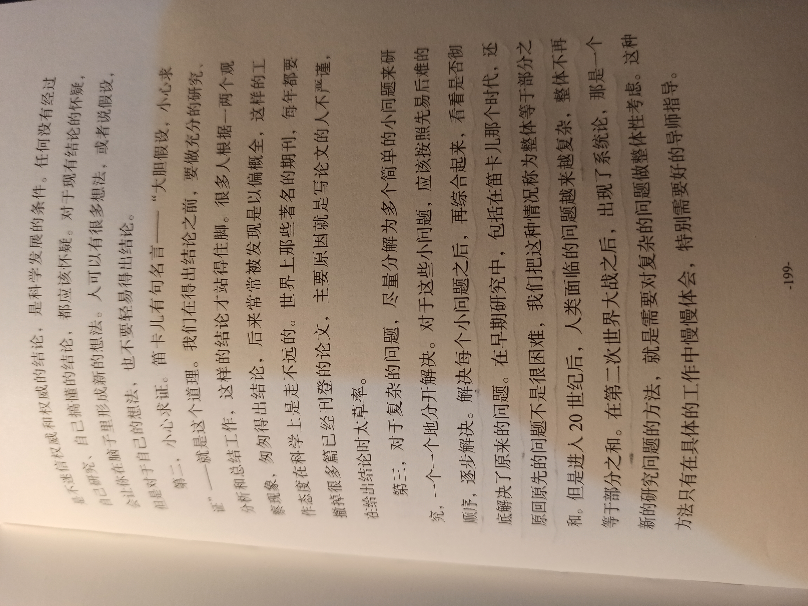

## 第五章 有效学习

page 192 - 第27封信 上帝喜欢笨人

你知道我每个周末都会花时间手工整理投资信息，而不是用计算机上面的各种工具自动生成报表。为什么我要用这个笨方法呢？主要原因有两个。首先，如果使用计算机整理，虽然看似省时间，但是我就不会去思考。做任何共作，都需要总结、反思，才能进步，手工工作的过程，就是一边整理，一边思考的过程。其次，你可能想不到，手工处理信息，由于花时间，使得我不能过分频繁地投资，这可以让我关注少数重要的投资，以及把目光放长远。

page 195

在我读书的时候，也和很多人一样，不喜欢吃亏，总要显得比别人聪明，好像这样才能把事情做成、做好。但是在做生意时，我发现生意场上从来就不缺乏所谓的聪明人，但是大家想尽办法，绞尽脑汁，也未必能做成生意，做不成生意自然不可能挣钱。倒是有些傻傻的人，经常有生意可以做。后来我想，这个道理也很简单。比如我问你：“你是喜欢和聪明人做生意，还是和傻子做生意呢？”你恐怕会告诉我是后者，因为你觉得傻子的钱好挣。如果很多人都这么想，那么笨人做成生意的机会就多了。从那以后，我恪守一个原则，不论对方挣多少钱，我只挣自己那一份就好，不要贪图对方的任何一点儿利益。这样一来，生意就能持久。你和小朋友交往时，也不必怕吃亏，和小朋友换东西时，多一点儿少一点儿也没有关系，因为如果每一次都是你占了便宜，时间一长，小朋友就不愿意再和你打交道了。通常，别人觉得你老实，就很放心地和你做朋友，觉得你太聪明了，就会害怕和你来往。

page 198 - 第28封信 证伪比证实更重要

page 202

为什么证伪比证实更重要呢？因为对于一个现象，我们总可以找到一个能自洽的理论解释它。类似地，对于几乎任何一个结论，我们都很容易找到几个例子来佐证。如果有人说比重轻的物体会先落地，这个结论并不正确，但是他可以举出一堆例子证实。也就是说，仅仅证实是不够的。很多时候，我们自认为的那些自洽的、被证实的理论，或者自认为找到的原因，可能不过仅仅是一种可能合理的解释而已。随着我们得到更多的数据，有了更深入的了解，就会发现我们的理论是漏洞百出的。

page208 - 做理性的怀疑者

今天我和你谈谈我对科学的看法。

首先，科学不代表正确。

什么是科学？从广义上讲，人类任何一种能够自洽的知识体系都可以被看成科学。按照这个定义，数学、历史学，都可以算是科学。从狭义上讲，科学是指源于古希腊，建立在严格逻辑推理之上，后来在近代西方科学方法基础上发展起来的，可以证实和证伪的完整体系。按照这个定义，数学并不是科学，因为它是建立在假设前提基础上的，而历史学也不是，因为它无法证伪。但不管是广义上的科学，还是狭义上的科学，它们都注重一点，就是看重方法和过程，而不是结论。

为什么过程和方法比结论重要呢？因为得到一个正确的结论很容易，很多事情蒙一下还有一半对的可能性。因此，仅有结论是不行的，需要一套方法能够不断地发展科学，才是王道。在科学上，我们强调坚持实证精神，强调实验结果的可重复性和可验证性，强调要不断推翻过去的权威这种思想，因为有这样知识的积累才能叠加，人们才能在前人的基础上不断进步。

人们通常对科学的一个误解就是把它等同于正确，把正确等同于有用。很显然，正确不等于有用。如果你说明天要么下雨，要么不下雨，这当然正确，但是毫无用途。类似地，正确和科学也不能划等号。牛顿的万有引力定律在宇宙的尺度上并不正确，或者说不准确，但这并不能否定它的科学性。类似地，一个巫医通过烧香治好一个绝症患者的病，并非他的做法就有科学性。科学是方法和过程，相信你对于这一点的体会会越来越深。

其次，科学是不断发展的，没有绝对正确和绝对真理。

既然科学是一个人认识世界的过程，随着我们对世界认识的加深，就会发现之前的一些认识可能是肤浅的。因此，真正有学识的科学家总是对世界和世界的规律充满敬畏，而不会说他们代表正确，只有宗教人士才会说他们手里握有绝对真理。

如果你认可了这个道理，我们再往前走一步，就能得到这样一个结论：科学家并不高人一等，也并不比别人更接近真理，因为真理是客观存在的，一个人并不会因为学历高、职位高就能更接近真理。

年轻人对科学有时会产生一种宗教式的狂热，这有它的好处，因为很多重大的科学发明就是这么做出来的。但是，我想提醒你的是，人的认识是一个非常漫长的过程，而科学家也经常犯错误。

科学家犯错误的原因，有主观原因，也有客观原因。主观原因除了自己的学识有限之外，还常常会被利益绑架，毕竟科学家也是人，他们的工作和银行职员、公司雇员、律师，甚至商人没有什么两样。此外，很多时候，事情远比想象的复杂，以至于在短时间里我们难以对它们有非常全面的认识。

page 214

最后，我想和你说的是，千万不要把科学当成宗教。你可能会说：“它们怎么可能被混淆呢？它们完全不同啊！”事实上，很多半瓶子醋的科技工作者和学生对待科学的态度和教徒对待宗教没有什么不同。宗教的三个特点在他们身上都能看到。一是盲从，对科学结论的盲从。二是道德优越感，觉得自己是搞科学的就看不起别人。三是喜欢相信书本上的教条和权威人士给出的结论。这些是教徒的习惯，但是你肯定能在一些自诩为搞科学的人身上看到，这偏离了科学的根本。希望你不要染上类似的习气，做一个理性的怀疑者，一个对未知的探索者。
