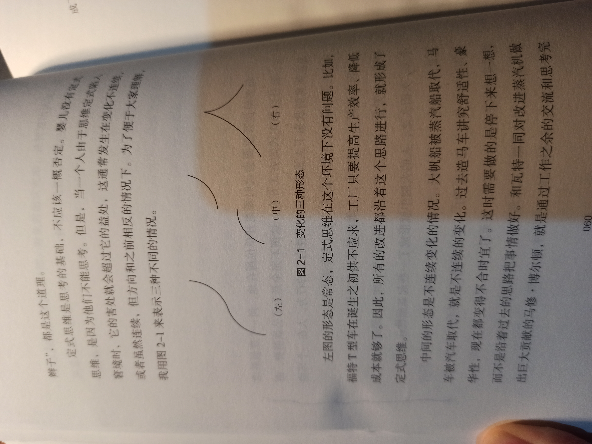

## 2 命运的力量

> 可能有人会觉得，认命太消极、太迷信。恰恰相反，不认命才是迷信！所谓不认命，就是以为世界上所有事情自己都能控制，这是一种妄念，是对自己的迷信。事实上，不确定性是我们这个世界固有的特征，世界上有很多我们自己甚至整个人类都无法控制的力量。承认这一点，才是唯物主义的态度。

page 034 - 尽人事，仍需听天命

为什么要听天命呢？因为世界上稍微难点儿的事情都非常复杂，超出我们的有限认知，更超出我们的控制能力。我们付出努力，无非解决了一些维度上的问题，但是还有很多维度的因素不是我们能控制的。当然，如果不尽人事，能把握的那些维度也会把握不住，自然一事无成。

page 037 - 看清能力的边界

美国人做事有一个奇怪的逻辑，就是在市场上保留第二名。像英特尔、微软或思科这样具有垄断实力的企业，挤垮或者收购那些规模不大的竞争对手是一件很容易的事，但是它们并不这么做。一方面是免除反垄断的麻烦，另一方面是让不太构成威胁的对手不断倒逼自己创新，这便是见识。我父亲生前总和我讲：“秦有六国，兢兢以强；六国既除，訑訑乃亡。”这个道理和英特尔等大公司保留竞争对手是一样的。在这种见识的背后，是对很多不确定性或者说命运的敬畏。很多时候，我们从能力到主动性都是有限的，在一个舒适的环境下必然懒惰，在一个没有对手的环境中必然自大，然后会一步步走向毁灭。明白自己能力的边界，对世界有一种诚惶诚恐的态度，才会有长远的发展。

page 039

著名哲学家康德最赞同和敬畏两种东西，一是头顶上的星空，二是心中的道德律。星空是我们不能支配的客观力量，而道德律则是我们能支配的。

这些智慧和心得并非来自某一个人，而是我在接触到大量同学、同事、师长、朋友后学到的。我在反思它们后，发现中国古代的智者不乏这样的智慧，说明世界的大道是相通的。

page 050 - 怎样做事才能获得好运气

做事情有专业的做法和不太专业的做法，莱特兄弟从风洞试验开始，一步步地系统验证自己的构想，这就是专业的做法。同样的条件，同样的时机，有的人把事情做成了，有的人错失良机，可见专业态度起到了决定性作用。

当然，有人觉得如果采取鼓励的方法，或许有些人能成为莱特兄弟。但我认为，他们永远成不了，因为他们不专业。有哪个造飞机的民间科学家进行了风洞试验，又有哪个想发明飞机的人系统研究了相关理论？业余的水平再高也是业余的。

很多人问我怎样才能做好投资，我认为关键是要专业。业余的人可能会投资成功几次，但是不能系统地保证稳定的回报。但凡做事都应该专业，否则，“命”就好不了。

page 054 - 舍得止损，才能斩断厄运

在生活中，我们会看到很多人像伯奇尔那样不断地犯错误，而且为了弥补一个小的损失，造成了更大的损失。有的人早上起晚了，为了赶上早晨的会议，超速开车，被警察拦下，既被罚款扣分，还耽误了更多的时间。一些人考试时为了死抠一道做不出来的题，把整个考试搞砸了。就这样，原本只是局部的小问题，引发了一个个接踵而至的厄运，形成了一个厄运链。伯奇尔有四五次斩断坏运气的机会，但是他不懂得止损，总想补救，结果窟窿越补越大。

怎样才能斩断厄运链呢？方法很简单，只要记住“止损”和“认命”这4个字就可以了。

page 056 - 对命运要常怀敬畏之心

遇到任何倒霉的事情，一定要认命，不要总想着挽回损失，这样损失就会被限制在局部。很多人总是抱着“堤内损失堤外补”的心理，最后损失得越来越多。

比如，有的人不小心买了一只下跌的股票，这个损失原本是有限的。但是很多人想：我再多么买点儿，把平均成本降下来，将来稍微一涨，不就把损失全捞回来了吗？可是接下来，股价可能进一步下跌，这些人的钱就都被套进去了。但他们依然想着弥补损失，就加杠杆继续购买，最后被清仓出场，一辈子的积蓄全部付之东流，甚至背上一屁股债。我们只要环顾周围，这种人并不少见。

page 057

很多人不肯认命，不肯止损，其实是因为骨子里太高估自己——不仅高估自己的能力，而且高估自己的地位和作用。高估自己的能力，才会觉得有翻盘的可能；高估自己的地位和作用，才觉得什么都该是自己的，什么都不能少。

如果认识到自己只是一个普通人，自己的那点儿所得不过是上天的恩赐，得到了固然可喜，得不到也在情理之中，就愿意割舍，也就不会造成更大的损失。

人不会总有好运气，也不会永远走背运，但是不好的心态会让背运不断被放大。很多时候，心态决定命运。遇到背运时不慌乱，把损失限制在局部，避免雪崩式灾难，是智慧的体现。而愿意止损、愿意认命的背后，体现的是我们对自己的自知，对命运的敬畏。

page 059 - 如何跳出定式思维

很多单位开重要会议时要离开单位所在地，到一个度假胜地去，而且以非正式的方式开会。这倒不完全是为了公款消费，而是在休息的状态下大家容易重新审视自己的行为。人在一个环境中待久了，难免产生思维定式。为什么会这样呢？

因为在同一个环境中，人类的活动具有连续性，昨天发生的事情和今天发生的差不了太多，因此前天、昨天的经验可以用于今天。久而久之，人的大脑中就形成了一些起基础性作用的认知要素和方法论，包括知识、经验、观念、做事方法。由于它们的作用时效比较长，作用范围广，因此即使每天遇到的事情不同，思维定式也不那么容易摆脱。甚至对一些人而言，外界环境完全变化了，他们的思维定式依然存在。

