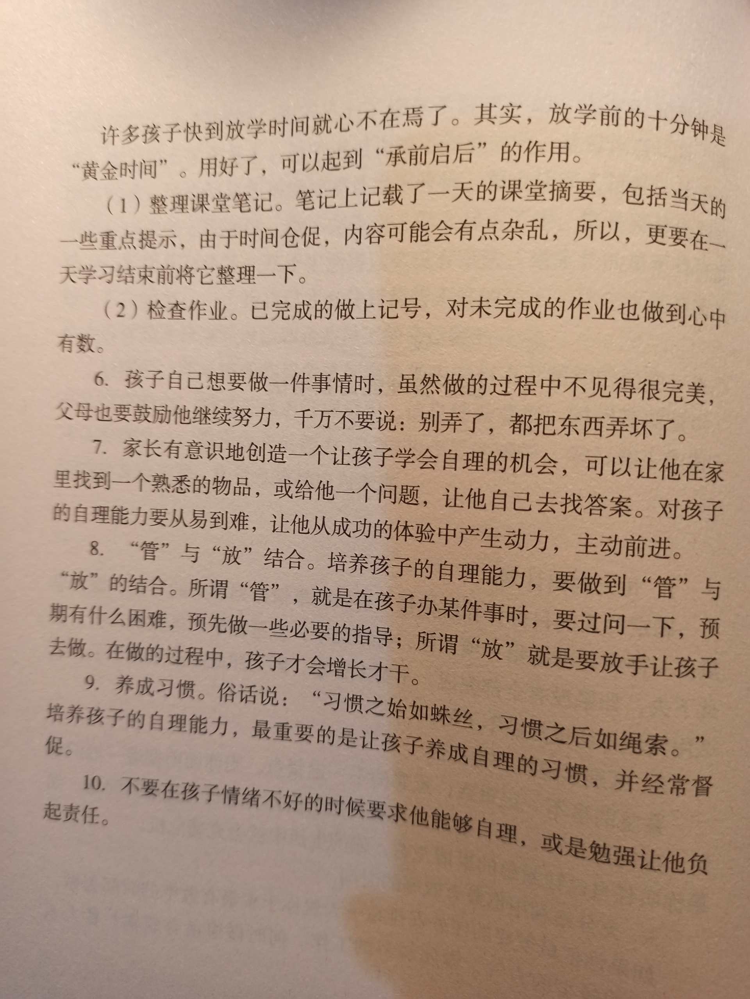

## 二、在有常生活机制中爱孩子

page 48

这个算式并不是说犹太人不尊重知识，相反，对每个犹太家庭来说，没有比家庭中有一个或几个博士更为荣耀的了。在犹太人中产生的诺贝尔奖获得者、学科领域的代表人物以及各类专业人才很多，占人口的比例很高，这是其他民族望尘莫及的。但是，犹太人更看重对知识的运用——智慧和能力。他们把有知识而没有智慧和能力的人视为“驮书的毛驴”。对犹太父母来说，他们爱孩子，愿意支持孩子读博士、博士后，但目的不是为了孩子拿到一纸文凭，而是帮助孩子拥有实现美好人生的能力和素质。在犹太人最尊敬的《塔木德》上，曾记载说：“没有比既能做事又能做学问更好的了。没有劳动的学问结不出果实，相反可能导致罪恶。”

正因如此，犹太人非常重视从小培养孩子的生存能力，从小给孩子灌输“不劳无获”的法则。以色列家庭教育有句口号：要花钱，自己挣！当孩子想要父母满足他们的愿望时，犹太父母会告诉他的孩子，你必须通过自己的努力，才能换得你想要的东西。初到以色列时，我以为这种情况一般发生在经济条件不是特别好的家庭，后来我在一个很富有的家庭做工时才发现，富有的犹太父母更重视孩子的生存教育。我做工的那个家庭有一个读小学的男孩子，虽然家里有很多名车，但是基本不用来送这个孩子上下学。无论刮风下雨，男孩子都是自己坐公交车回家。如果他想要一双向往已久的球鞋，他的父母会建议他每天晚上洗一次碗筷，用自己的劳动来换取。

page 53

犹太人对子女的理财教育有一套独特的方法，他们从孩子三四岁开始就开设家庭理财课，这也是犹太民族的惯例。

三岁：辨认钱币，认识币值、纸币和硬币。
四岁：知道无法把商品买光，因此必须作出选择。
五岁：明白钱是劳动得到的报酬，并正确进行钱货交换活动。
六岁：能数较大数目的钱，开始学习攒钱，培养理财意识。
七岁；能观看商品价格标签，并和自己的钱比较，确认自己有无购买能力。
八岁：懂得在银行开户存钱，并想办法自己挣零花钱。
九岁：可制订自己的用钱计划，能和商店讨价还价，学会买卖交易。
十岁：懂得平时节约一点钱，以便自己有较大开销时使用，如买溜冰鞋、滑板车等。
十一岁：学习辨识商业广告，并有打折、优惠的观念。
十二岁：懂得珍惜钱，知道其来之不易，有节约观念。
十二岁以后：完全可以参与成人社会的商业活动和理财活动。

page 69

数千年来，犹太人一直把生存教育作为教育的宗旨，这不仅是由于犹太民族特殊的成长经历，更来自于人生五种主要活动的排序。根据这五种主要活动的主次关系，犹太人把生存教育列在第一位，他们认为顺其自然是最完备最严密。这五种主要活动排序如下：

- 维持与自己生存有直接关系的活动。
- 为获得生活的必需，维持与自己生存有间接关系的活动。
- 以教育后代为目的的活动。
- 维持正常社会和政治关系的活动。
- 以满足爱好和情感的一切活动。

page 79

以色列家长尤其重视培养孩子的沟通能力、交际能力。在家长们的呼吁和建议下，小学二年级开始就设立公共演讲课，培养孩子的表达能力，让他们长大后习惯于勇敢地表达自己。我女儿读高中的时候，学校邀请了一家跨国公司的总裁做讲座，他的话让我女儿一直记忆犹新：“从我的经历来讲，关于你到什么大学去念书并不重要，关键看你自己的实战能力和交流能力。即使你毕业于哈佛，但是你连基本的交流能力都没有，毕业以后怎么能成功呢？”

我刚到以色列时，感觉很多成功的犹太人，对成功要素的理解和我们普通人是不同的。我们不妨探讨一下他们的解释，他们常常认为是人际关系奇迹般地发挥杠杆效应，由此，取得了超越个人能力多倍的成就。犹太人相信，成功人士不是因为他们比平常人更加勤奋，才有今天的成就。虽然勤奋也曾经是他们努力的部分，但并不是他们能够成功的根本原因，因为一个人即使再勤奋，也担当不了多少工作量。

犹太父母把孩子社交能力的培养视为生存质量的重要评估指标，不仅因为社交能力关于一个人理想的实现，更在于它关乎孩子个性的发展和幸福程度。人际关系状况影响着一个人的生活质量，一个人如果拥有融洽和谐的人际氛围，他就会是幸福的，他的个性也会得到健康发展；而如果一个人生活在紧张的人际关系中，他的幸福感会下降绪多，伴随他更多的将是孤独、寂寞、自卑和疑虑。

page 100

在锻炼孩子们的财商前，犹太家长首先会给孩子们上第一堂投资客，投资时间！

他们会告诉孩子，如果你想获得财富，就必须投资于比金钱更有价值的东西，那就是时间。世界上大多数人都想变得富有，但很多人不愿意首先投资时间。他们会说，我没有时间，我太忙了，我要做这样那样的事情。这些常见的观点和借口，就是为什么只有少数人能抵达充满财富的世界的原因。

时间管理是犹太孩子从父母那里学会的第一项投资本领。很多中国家长抱怨说孩子的自我管理能力太差，总是输在自己的惰性上。其实，孩子的自我管理能力本质上是一种时间管理能力，它关系到一个孩子做事情的效率乃至事业的成败。

page 103 孩子管理能力栽培法

page 106

以前在上海时，辉辉上课就不爱发问，会与不会的问题都得过且过，不会刨根问底。来到以色列后，班上的同学都把跟老师沟通当成是一种享受，这让辉辉也有点坐不住了。他想问，但总是有点怯懦开不了口。我就和辉辉制定了一个可量化、很实际的目标：他每天上课一定要提问，一天能做到举两次手就行，如果坚持一个星期就有奖励。后来达到了这个目标，我又和辉辉制定了下一个目标，每堂课都举至少一次手。两个月后，他的老师跟我说，辉辉的课堂积极性提高了。而辉辉也跟我说：“原来，把不懂的问题弄懂了是这么快乐的事情。”

page 113

国内近年来流行“素质教育”，可惜的是，没有主心骨的家长把音乐、美术、武术、书法错当成素质教育的主要内容。他们完全忽视了孩子的为人处事、价值坐标的建立，孩子的品格，孩子对知识与职业关系的理解，孩子的人生理想以及付诸实践的能力，这些才是“素质教育”的内涵，才是一个孩子走向社会舞台的必要素质。这种素质名牌学校、高级辅导班都没有精力和义务去培养，只有那双推动摇篮的父母之手，才能给孩子这份成长的礼物。
