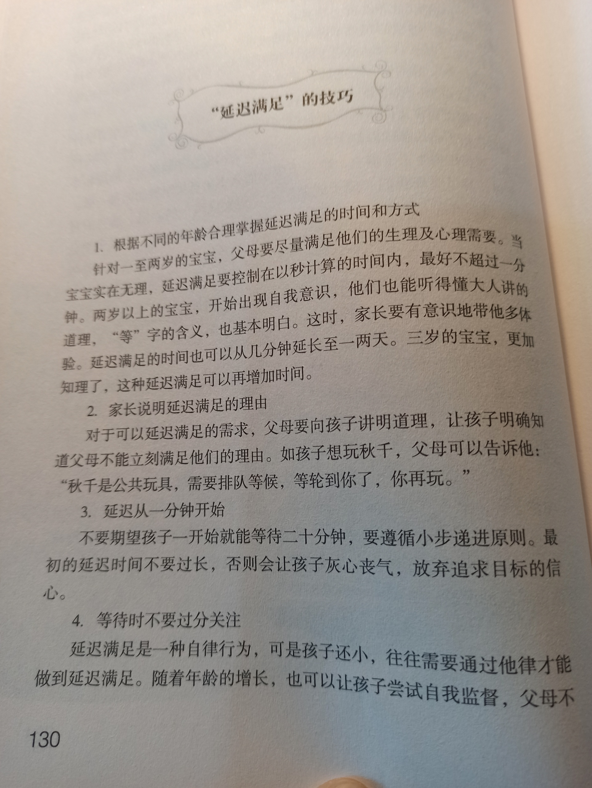
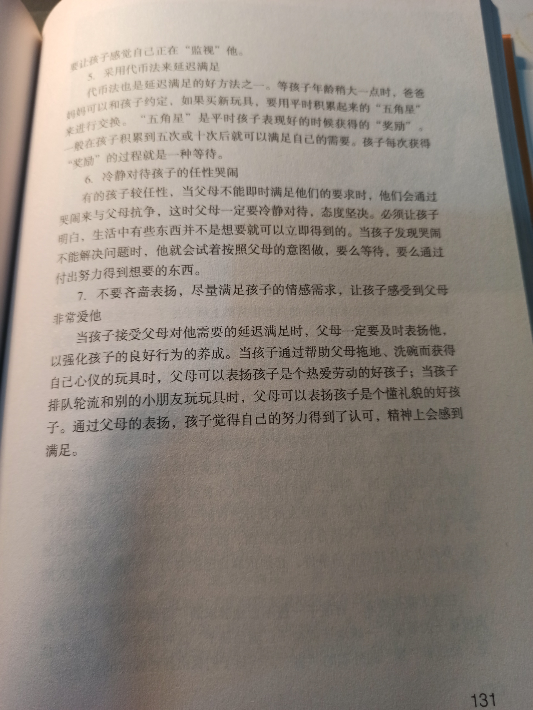
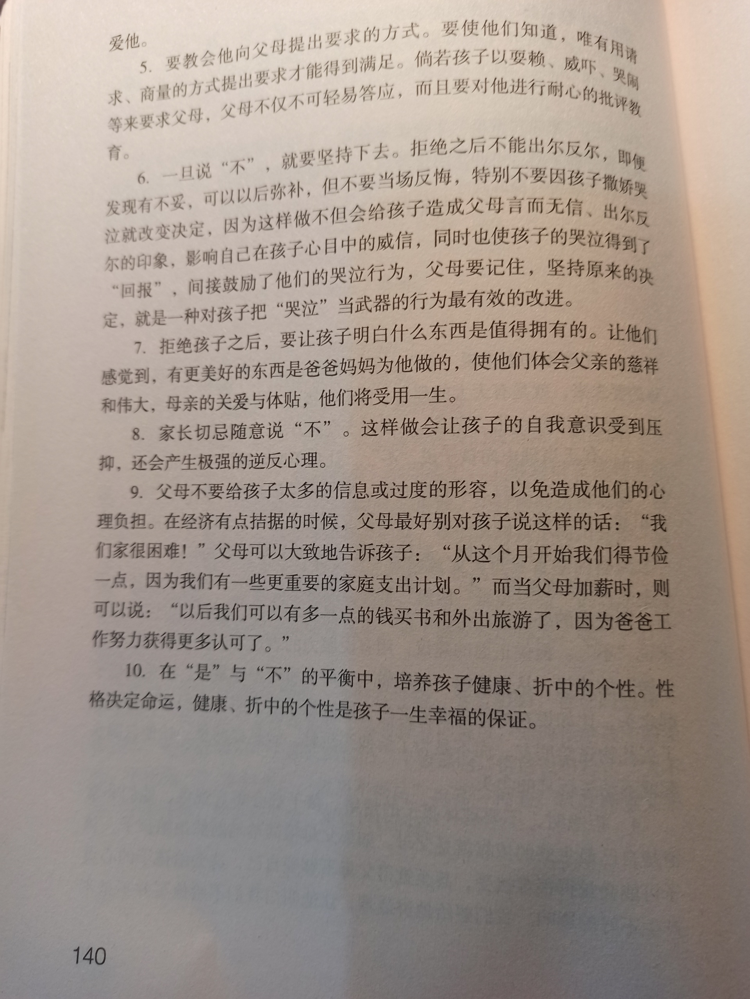
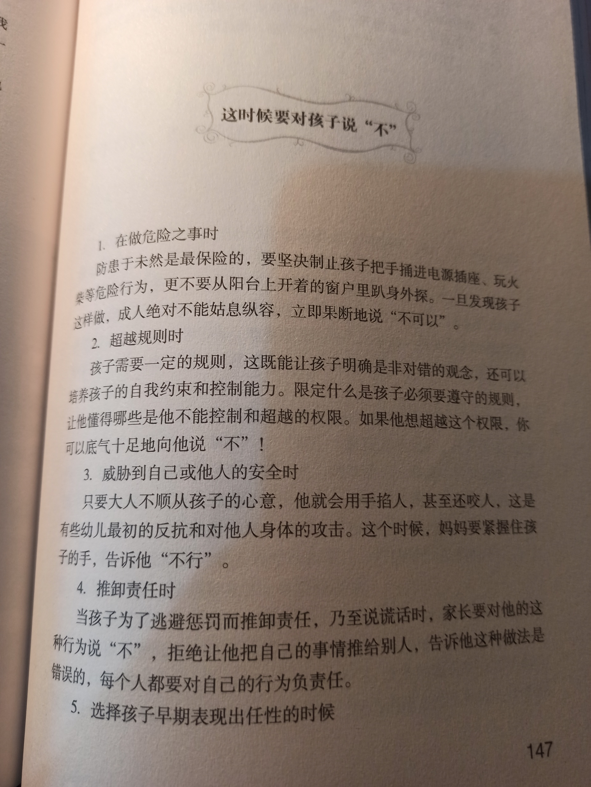
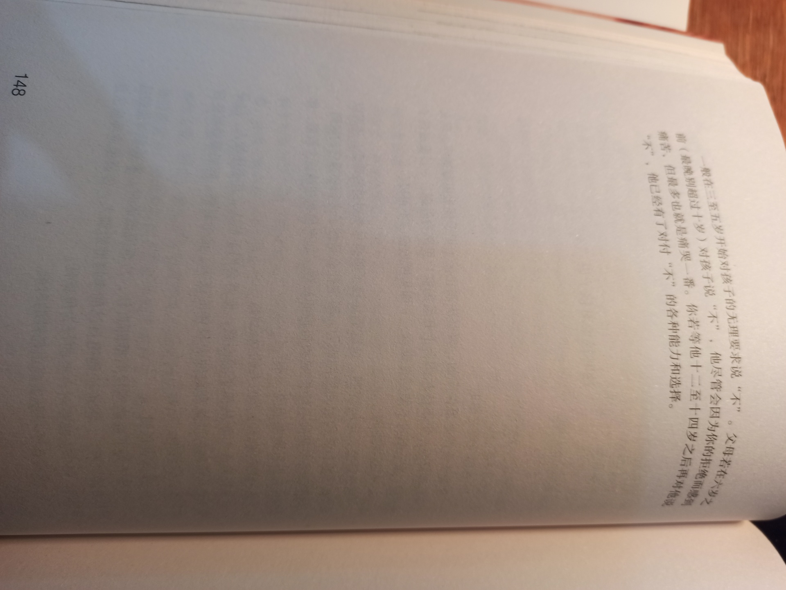
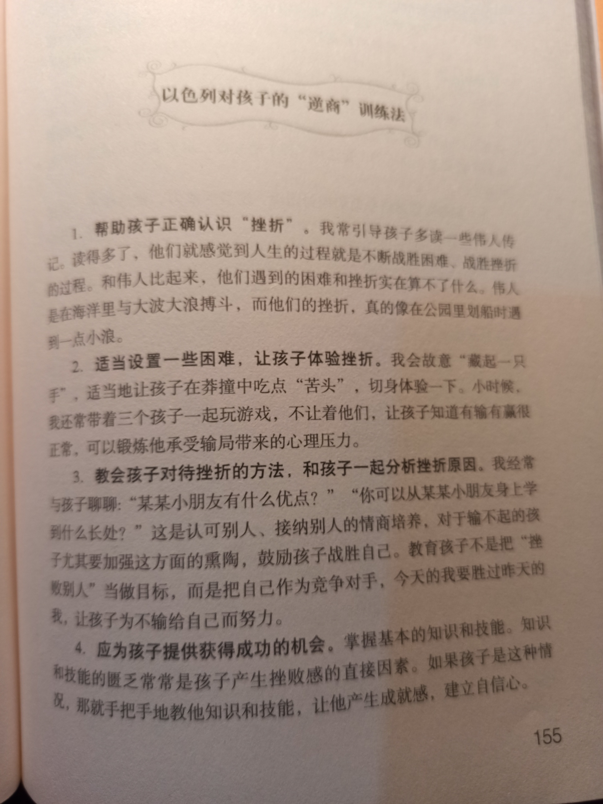
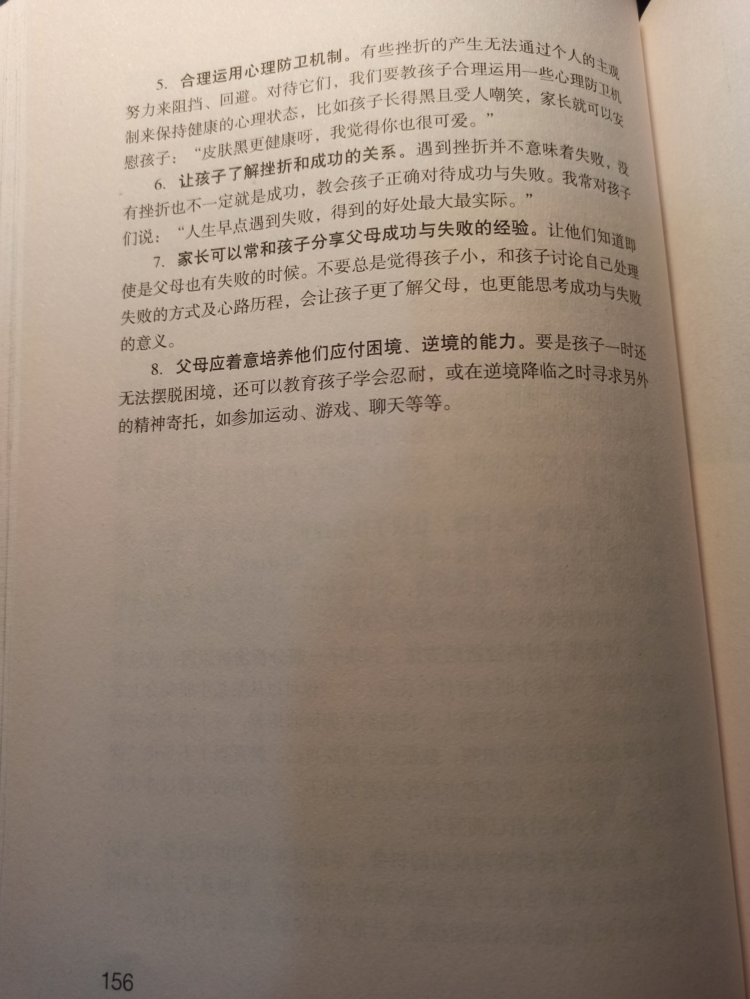
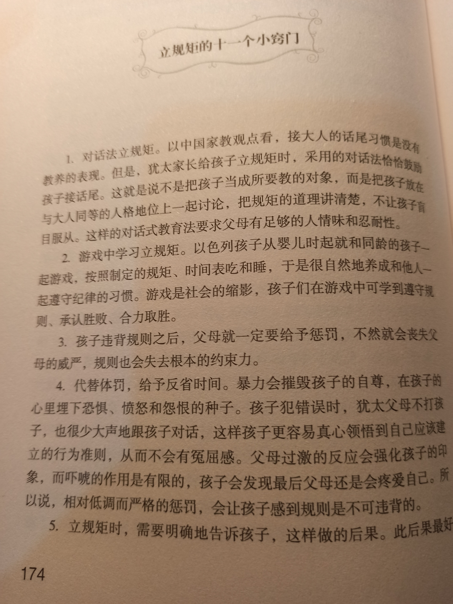
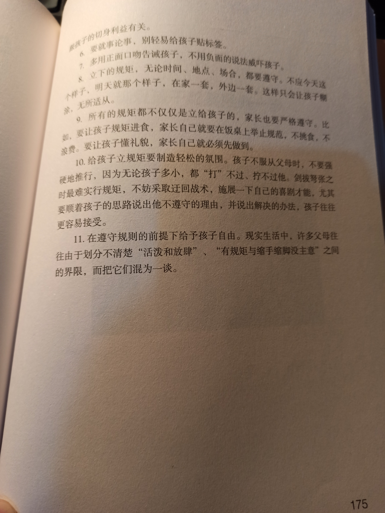

## 三 以爱的名义延迟满足

page 117

有一句话这样点评中国的家长们：他们太爱孩子了，但又太不会爱孩子了。最典型的表现是，很多家长在家庭教育中都处于一种被动的局面，对孩子付出一片爱心却收效甚微。为什么家长越理解孩子，越体恤孩子，越满足孩子，孩子反而更不理解家长，更不体恤家长，甚至是折磨家长呢？

中国孩子为什么不理解家长呢？因为中国家长没有给孩子这样的机会。我国生活水平的提高，为父母满足、迁就孩子提供了保障和支撑。这种环境中培养出来的孩子虽然拥有高智力、高自信等优点，但也有很多弱点。当代中国父母是最坚持“儿童本位”的父母，是最理解孩子意愿的父母，完全按照孩子的意愿去爱孩子。表现方式就是：你喜欢什么，给你什么；爱吃什么，给你吃什么；爱穿什么，给你穿什么。要钱给钱，要物给物。给得越多，表明我爱得越深。这就造成了孩子没有机会切身体会父母劳作的艰辛，没有机会感受父母提供的幸福来之不易，没有机会滋养出对父母和社会的感恩，缺乏责任感和义务感。

page 123

这些有着脍炙人口发家史的犹太富豪，让下一代谨记“万丈高楼平地起”，坚决不让小孩过养尊处优的日子。他们为此想出很多办法，帮助孩子杜绝过早的享受，比如说非常有名的“参观爸爸妈妈的一天”活动，就是犹太父母对孩子进行的“延迟满足”教育。

犹太父母们跟老师沟通说：“让孩子理解‘延迟满足’不能光讲道理，还需要深入实践中去体验生活，两者结合才最有效果。”

page 124

我儿子有个关系很好的初中同学叫约翰，他爸爸是我们所在地特拉维夫的一个知名富商。这个爸爸很有趣，有好多辆名车。可是，他每个周末都坚持带着儿子去坐公交车，让儿子看看外面社会的艰辛。还要一次，约翰和我儿子一起背着大背囊，骑着自行车去送外卖。那一天正下着雨，他们远远地看见一辆车从他们前边驶过来。巧的是，正好是约翰爸爸的车，可是他还是照样去送外卖，他爸爸也照样去办自己的事。如果他想要一双向往已久的球鞋，他爸爸会建议他每天晚上洗一次碗筷或者同意其他的奖励机制，用自己的劳动一点儿一点儿来换取。他的父母说：如果想要的东西得到太容易，你就会被宠坏，因为这会让你认为自己得到的一切都是应该的。

page 125

以色列家长常跟孩子沟通、对话，他们听孩子谈谈对延迟享受的理解，他们告诉孩子：如果你喜欢玩，就必须去赚取自由时间，但这需要你获得良好的学校教育和优秀的学业成绩。此后，你可以找到很好的工作，赚到钱。等赚到钱以后，你就可以玩更长的时间，玩更昂贵的玩具。但是，如果你搞错了顺序，整个系统就不会正常工作，那你就只能玩很短的时间，最后只能拥有一些最终会坏掉的便宜玩具，然后一辈子就得更努力地工作，没有玩具，没有快乐。

page 130

page 132

犹太人认为人的欲望也是无限的，但能满足的只有很少，许多欲望是永远无法满足的。因此，他们要孩子从小就懂得：每个人的享乐范围是有限的，花出一块钱，就要发挥百分之百的一块钱的功效。即使钱再多，也不买不必要、不适合自己的东西。而且，要想满足更加奢侈的愿望，获得更为优越的生活条件，必须依靠自己的努力，不能借由他人的手。

page 139

page 147

page 150

以色列家长很重视从小培养孩子的逆商，甚至有些教育机构还专门提供你上测验，一般考查以下四个关键因素——控制（control）、归属（ownership）、延伸（reach）和忍耐（endurance）。

没有一个人会是永远的赢家。作为家长，应该在日常教育中尽可能让孩子体验成功，建立自信，但同时一定要让孩子明白，生活中失败也是不可避免的，遇到失败要学会勇敢地去面对。犹太人把逆商看成是需要付出最高代价的商品。他们把每个人的命运形容成湍急的河流上的一叶扁舟，而逆商是每个人手中的浆，它可以使你抵达光辉的彼岸，也可以使你随波逐流。

page 155

page 157

“没有条件，创造条件也要上”，我们一般把这句话用在克服困境上。没想到，到犹太父母这里，他们指的是眼前没有了艰苦的生活环境，但即使创造条件，也要让孩子明白什么是苦难，什么是汗水，什么是生活的真谛。

page 172

这位犹太爸爸的循循善诱就是典型的犹太家教风格。犹太家长特别喜欢讲小故事，然后用小故事引出大智慧，给孩子留出自我反省、咀嚼的空间。

page 174 立规矩的十一个小窍门

