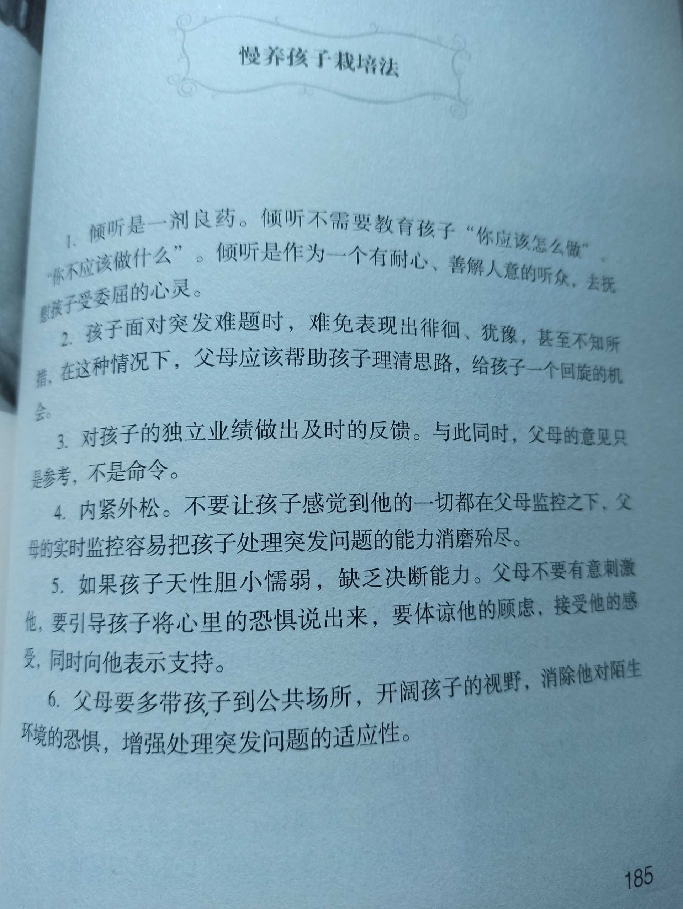
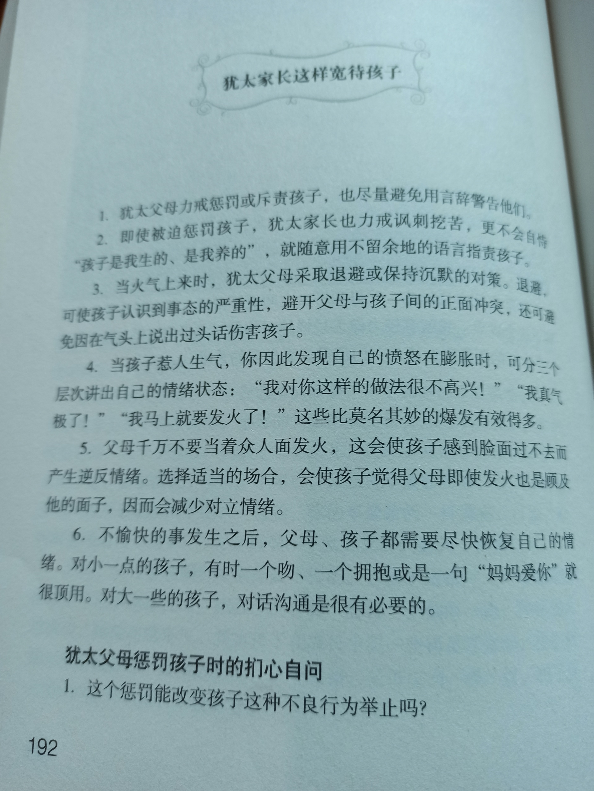
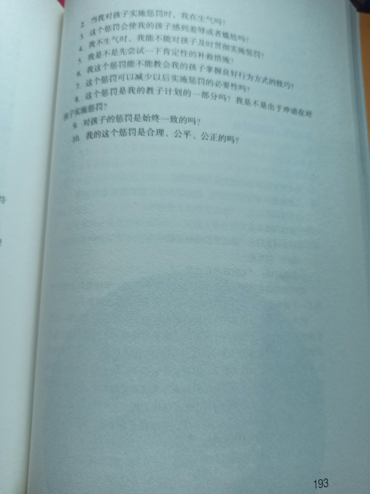
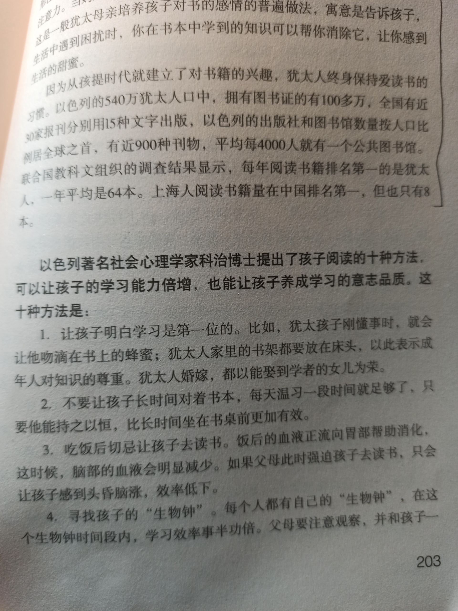
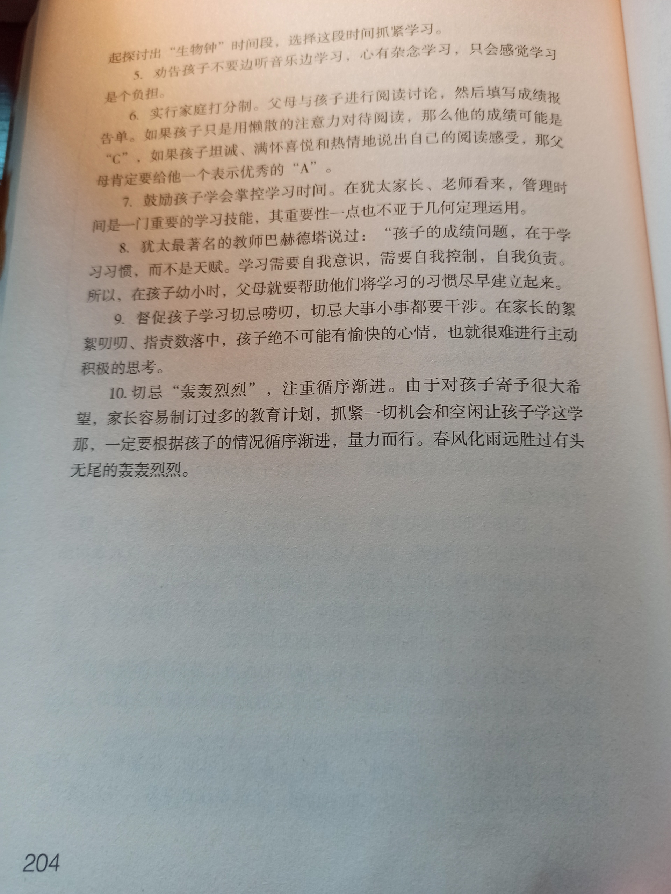
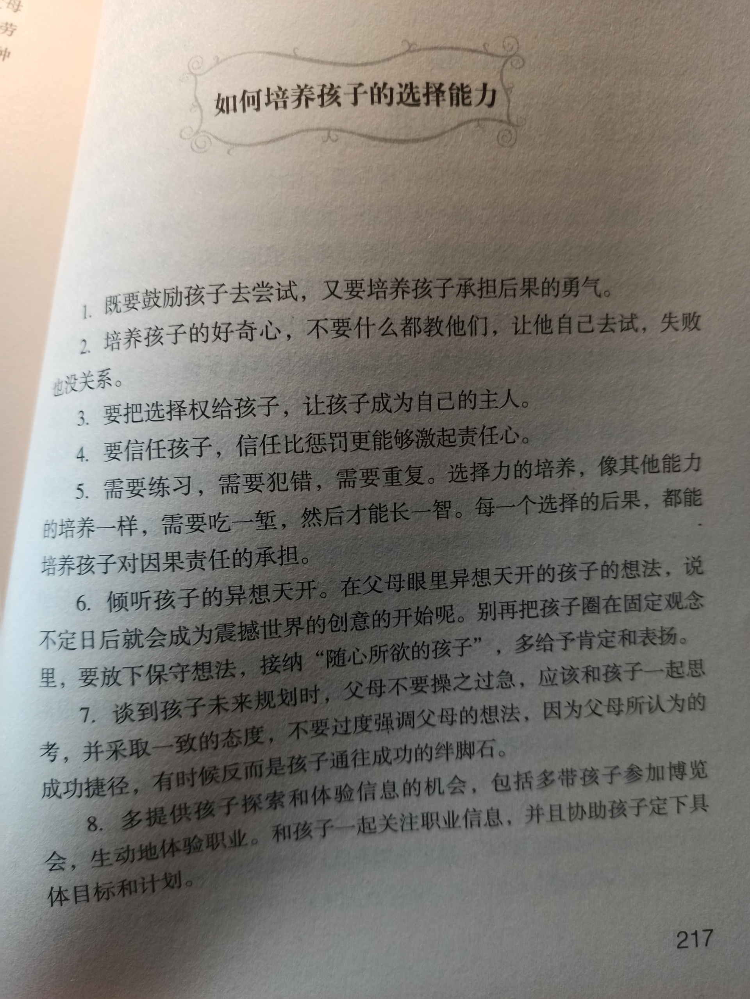

## 四 越爱孩子越要后退一步

page 179

“直升机父母”看起来劳苦功高，但他们的过度抚养是不是功效显著呢？让“直升机父母”常常焦虑的是：他们牺牲掉自己的休息时间带孩子上各种辅导班，却全然不知孩子早已厌倦或者另有所爱，几百块钱一节课的辅导班就像是打水漂，家长白花钱，孩子干遭罪；他们不惜花费重金缴纳赞助费，让孩子挤进名牌学校，看到孩子学习成绩无起色就仿佛世界末日到来；他们给孩子未来定下各种职业规划，不做医师就做教师要不然就做艺术大师，即使口头没表现出望子成龙的心情，潜意识还较着劲儿一定要把孩子培养成精英。眼见着孩子距离精英仍是长路漫漫，家长站在起跑线前忧心如焚：他为什么这么不懂事？为什么不用功、不上进、不优秀？

“直升机父母”不断地叩问：我的孩子到底怎么了？为什么教育孩子那么难？在所有与孩子有关的事情上，“直升机父母”很少从自身找原因，他们始终坚信自己所做的一切都是为孩子好，都是出于对孩子的爱，全然不知道他们的爱正慢慢变得沉重、偏执、模糊乃至迷茫。

page 185

page 186

经常看到很多父母以爱的名义对孩子进行不留余地的控制与管束，父母给孩子所能够给予的一切，这种神圣宝贵的爱，是无私的奉献，而不是支配，不是垄断。随着孩子年龄的增长，父母需要进行一种爱的方式的转化，这就是把对孩子的过多照顾、保护、支配，转化为一种宽容心，一种有境界的距离。在更广阔的天地里，孩子才能体会到父母更多的爱，才能更幸福地成长、成才。然而，在家庭教育中，父母对孩子爱过了头，从而陷入没有距离地支配爱、控制爱，这种现象也是很普遍的。而且，其危害还在于父母根本不自知。

page 192 犹太家长这样宽待孩子

page 202

所以，任何中国家长要想彻底解决好孩子的学习问题，必须先了解自己的孩子。如果不找到问题发生的原因，即使用了很多方法，也是有局限性的，但是如果我们找到了孩子学习问题存在的症结，然后再选择比较合适的方法去解决孩子的问题，就比较好办。

在以色列，父母非常注重培养孩子的读书兴趣、习惯和欲望。孩子一两岁的时候，他们就会为孩子准备一些色彩鲜艳的图画书或者带有奇形怪状符号的书，一有空闲，就把这些书摆在孩子们面前，吸引孩子的注意力。当妈妈的会将一滴蜂蜜滴到书上，让孩子明白读书是甜蜜的，这是一般犹太母亲培养孩子对书的感情的普遍做法，寓意是告诉孩子，生活中遇到困扰时，你在书本中学到的知识可以帮你消除它，让你感到生活的甜蜜。

因为从孩提时代就建立了对书籍的兴趣，犹太人终身保持爱读书的习惯。以色列的540万犹太人口中，拥有图书证的有100多万，全国有近30家报刊分别用15种文字出版，以色列的出版社和图书馆数量按人口比例居全球之首，有近900种刊物，平均每4000人就有一个公共图书馆。联合国教科文组织的调查结果显示，每年阅读书籍排名第一的是犹太人，一年平均是64本。上海人阅读书籍量在中国排名第一，但也只有8本。

page 203 孩子阅读的十种方法

page 206

我偶然翻阅过被誉为“历史上最伟大CEO”的通用电气公司副总裁韦尔奇的自传，他在这本自传中写道：他九岁时就在父亲的劝导下去高尔夫球场当球童。他父亲不是让他当童工去赚取那高额的酬劳，父亲事后跟他解释说，希望他在那个各界成功人士常常关顾的休闲场所，通过观察他们的言行受到激励，从而找到人生的坐标和榜样，寻找到自己也想成为的人。

我观察过很多中国家庭，家长们对自己的孩子步步紧逼，强行给他们上重轭。还有一些家长的行为用“强迫症”来描述一点不为过。这样的家长，下班回家马上看孩子是不是坐在桌子旁写作业，孩子一看电视就催促快去做功课。如果看到孩子不及时服从做作业的命令，就会大发雷霆，直到孩子拿起作业本为止。如果孩子很快做到桌子前，他们又会心情舒展，内心充满希望。很多家长不了解，这种反复、过度的不良刺激会使孩子形成不良条件反射，降低学习效率，即父母一张口，孩子最直接的反应就是不想听、心烦，有些还会产生逆反心理。

这些家长也许从来没有想过“退居二线”一下，让孩子们切身去体会，真实感受一下学习与家庭、与自我未来之间的重要联系。我觉得无论孩子年龄多大，家长都有必要让孩子感受到自己是家庭的一份子，感受一下自己的命运与自己现在努力的点点滴滴紧密相连。其实，这就是培养孩子对自我人生的一份责任感。如果有机会，父母可以陪伴孩子，在他们有兴趣的领域里寻找德才兼备的优秀人士，让孩子去效仿。当然，我们不要把成功的概念定义得太狭隘，我们周围就有许多优秀的人可以作为孩子的坐标和榜样。

page 211

与此相比，以色列家庭的育儿观有很大不同，他们的着眼点在于放手培养孩子的独立思考能力。思考是由怀疑和答案组成的，思考是学习的基础。他们教育孩子学习是打开智慧大门的钥匙，而思考能让你推开大门走进更广阔的天地。出于这样的教育观念，犹太人非常注重父母和孩子之间的思想与感情交流，父母经常与孩子对话和探讨，并常常对孩子加以引导，诱导孩子进行思考。因此，犹太人也拥有了雄辩的口才和判断能力。

page 217 - 如何培养孩子的选择能力

page 218

路人说：“这样说来，你的错误就很明显了。你只传授给了他们技术，却没传授给他们教训，对于才能来说，没有教训与没有经验一样，都不能使人成大器。”
