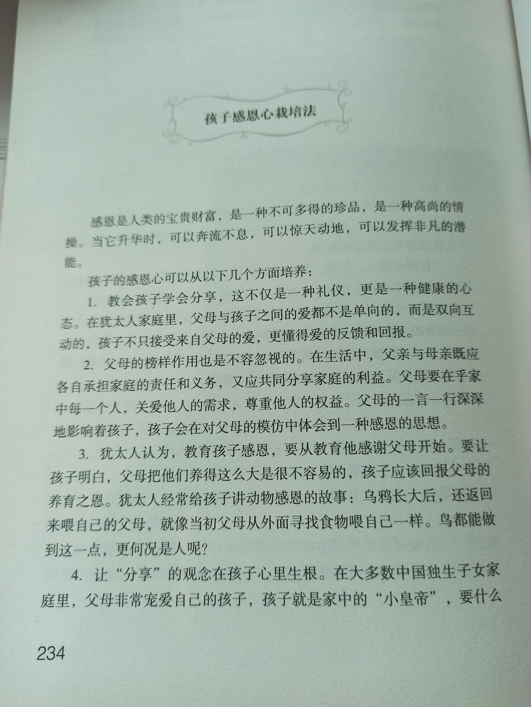
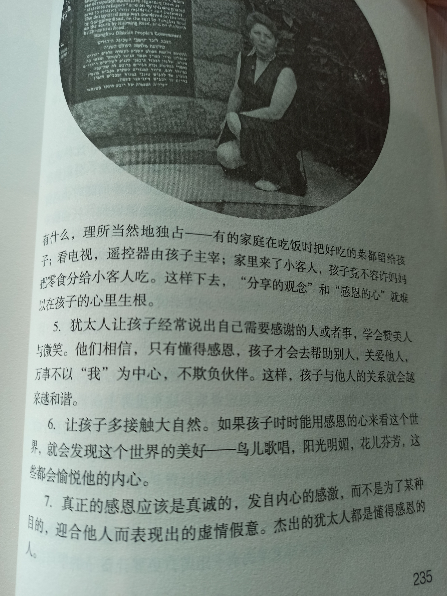
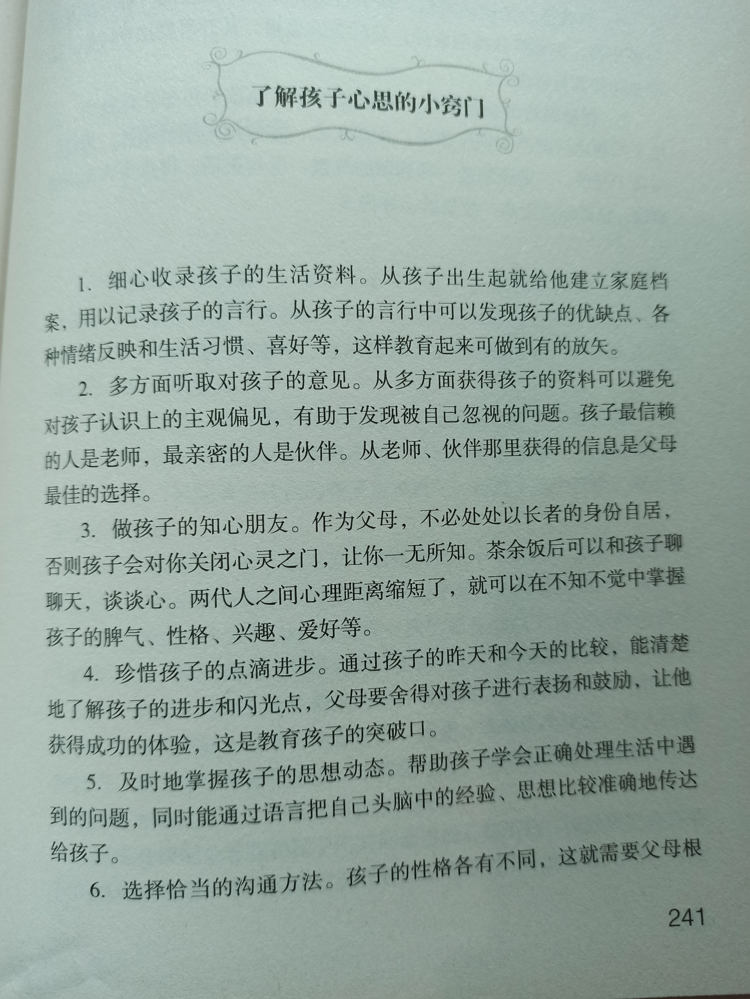
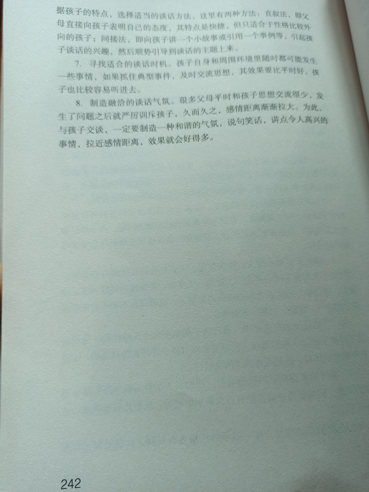
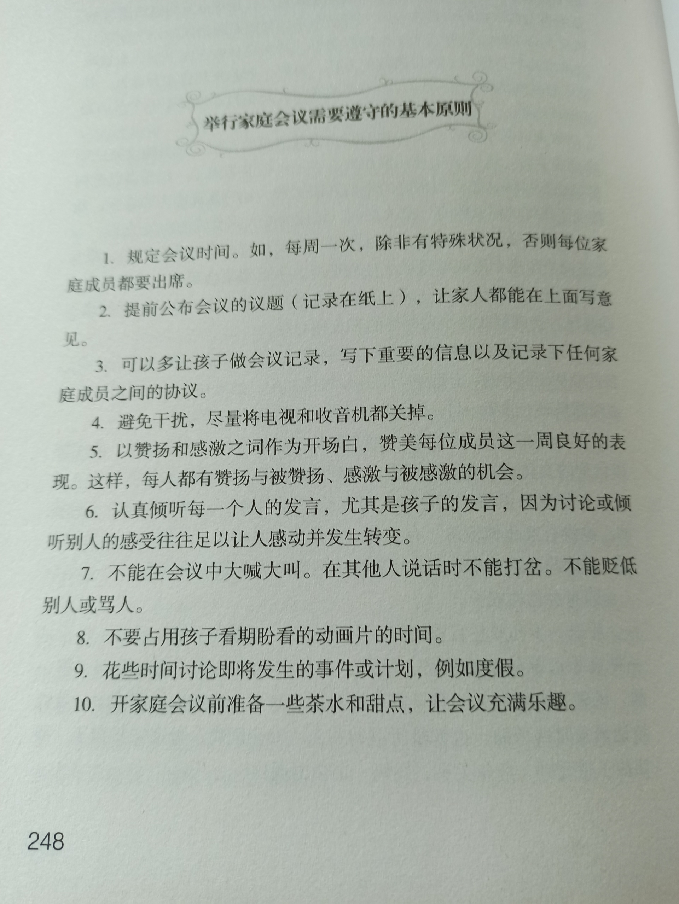
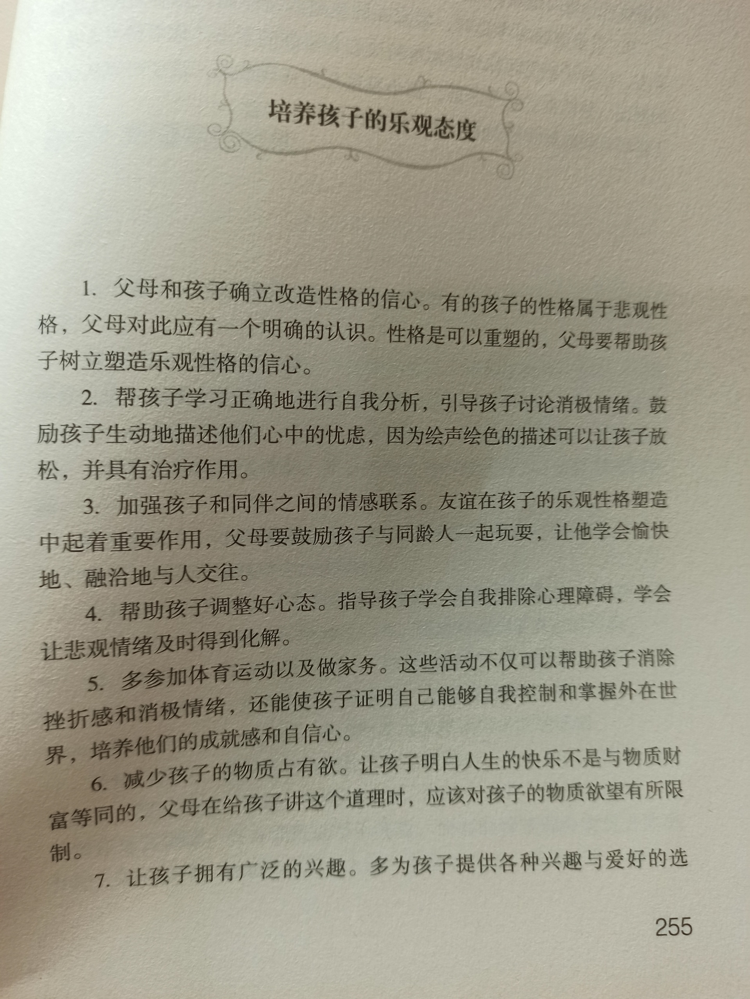
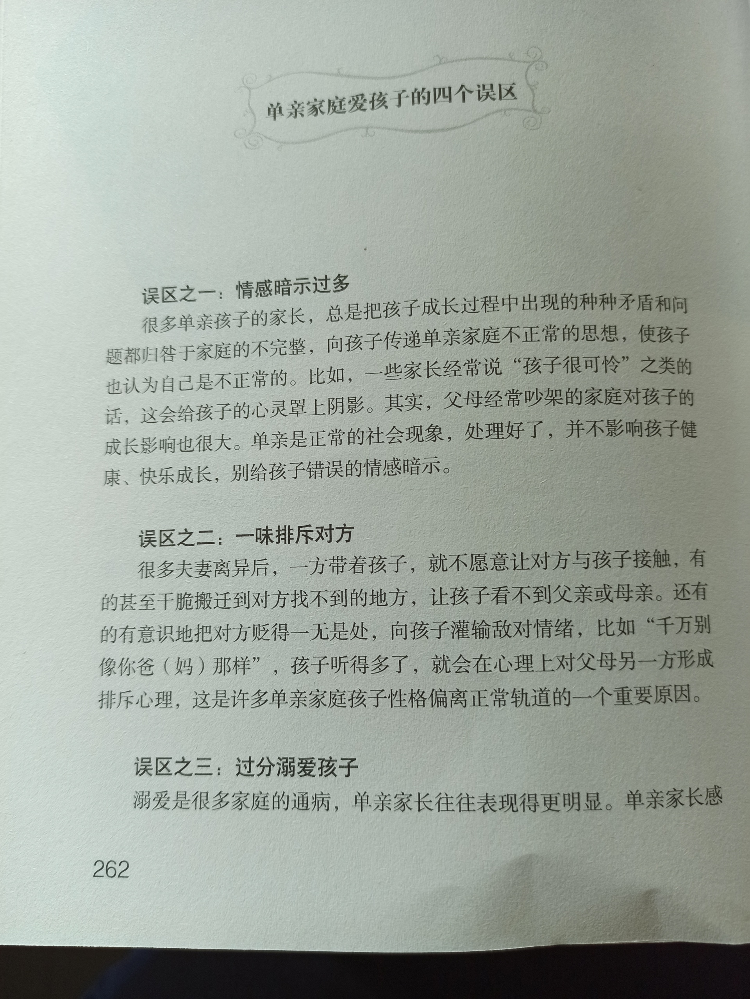
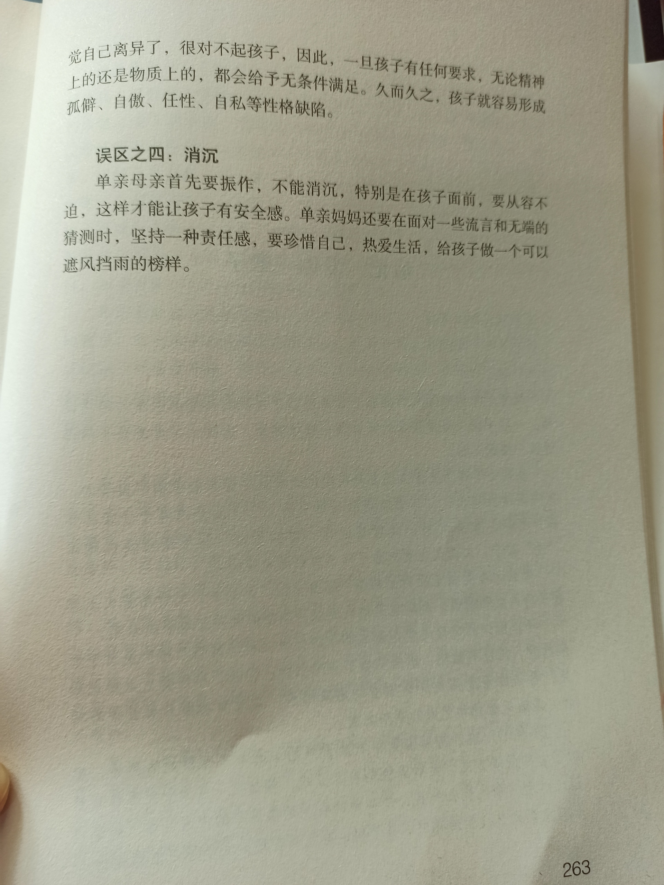

## 五 狠下父母心，深深爱

page 227

有的家长说：“有偿生活机制会不会破坏我和孩子们之间的感情啊，那不是得不偿失了？”

其实，这种想法没理解犹太家教中有偿生活机制的精髓。让孩子学做家务事，从小培养孩子的财商，激发他们的生存技能，点然他们的理想和追求，不是要做一个狠心的周扒皮妈妈。因为真正有智慧的父母，会通过爱，让孩子感受到“这是爸爸妈妈为我的明天做的”点点滴滴，可以体会到父爱的浑厚与深沉，母爱的绵长与体贴。

page 230

一个家庭不是随便就能运转好的，它需要精心经营。我常说，“爱”不只是一个名词，更是一个动词，爱孩子是需要经营的。

page 232

上文我们说，犹太家庭教育和我们中国古代家训如出一辙，强调爱与教结合，不患不慈，就患爱而不知教。爱与教结合，但爱和教都要有度，光强调教，孩子就成了教育的靶子，他感受不到爱，他和父母之间的爱也就不会流动。

page 234 - 孩子感恩心栽培法

page 236

犹太人有一句极为睿智的格言：人类有三个朋友，分别是小孩、财富与善行。只有一个长时期在血与火的急流中跋涉而随时会遇到苦难的民族，才能构思出如此格言。犹太民族清晰地意识到，社会的未来和希望都寄托在孩子身上，孩子几乎接近神圣。

page 241 - 了解孩子心思的小窍门

page 243

"特别狠心特别爱"建议真正为子女幸福着想的父母后退一步，别做始终盘旋在儿女头顶的直升机，因为那是对儿女心灵的侵犯，也是对孩子成长需求的一种忽略，会降低孩子自身的免疫力、自理能力、适应能力和社会竞争力。

但是，后退一步不等于放任自流，不是真的把孩子马放南山。在以色列，尽管每个家庭的具体情况不同，但每个家长都有一个最低的行为原则，就是“我能放手让我的孩子走多远”，超过了这个原则，家长就不会放任自流。

你若问我后退一步、放手又不放任自流有什么经验，我首先想到的便是我们家的家庭会议了。以色列几乎每个家庭每周都定期召开家庭会议。以色列教育专家认为：在每周一次的家庭会议上讨论或解决孩子（四岁以上）的问题可让父母省却许多麻烦。许多问题都能通过家庭会议解决，但这不过是它给你带来的额外收获而已。它更主要的好处在于孩子可以通过家庭会议学会生存智慧，比如，掌握解决问题、与人沟通的技巧，懂得合作并互相尊重，培养创造力，知道怎样进行集体讨论、承担责任和表达感受，知道如何让家人快乐。

page 248 - 举行家庭会议需要遵守的基本原则

page 255 - 培养孩子的乐观态度

page 262 - 单亲家庭爱孩子的四个误区

