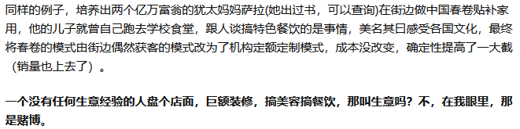

## 《特别狠心特别爱》

接力出版社 2010年10月第1版 2015年4月第22次印刷

之所以会阅读一本书，起自于知乎上的一篇问答“[三十岁了才明白，开始发奋读书。想改变自己的命运和家庭的生活。还能来得及吗？](https://www.zhihu.com/question/359652140/answer/2144947563)”。当时作者@一蓑烟雨行回答了这个问题，因为她的答案很具有启发意义，因此对于回答里面提到“沙拉的故事”也有了兴趣，便在多抓鱼上买回了沙拉写的两本书书，《特别狠心特别爱》是其中一本。

刚刚读完后再回看当时@一蓑烟雨行的回答，发现我关注的焦点竟然和她的不一样，我对萨拉书中叙述的教育理念印象深刻，而@一蓑烟雨行在问答中的运用则是提到了萨拉的儿子在商业思维上的亮点。想来，这和每个人本身的知识领域散发的磁场是有一定的关系的。

读完本书的一个感觉是，通过阅读真人故事相比单纯的教育理论、研究类的书籍更能够给我带来不一样的感受。我觉得，这是因为真人的故事往往能够在脑中形成鲜活的印象，更能够打动我，所以印象也会更深刻。一旦现实生活中碰到了类似的场景，也可以方便借鉴，而这又反过来加深了理解。

心理学家埃里克·弗洛姆说过，“爱”就同我们掌握其他艺术一样，是需要学习才能掌握的。这是作者沙拉带给读者们的礼物，因为她分享的经历为我们展开了不一样的教育视角，也让提醒各位读者爱并不是天赋，而是需要学习并练习的技能，怎么学？书中有不少经验上的指导。

书中的观点，敲掉在爱孩子的过程中应提倡“爱与教结合”，父母应该藏起一半爱去教会孩子延迟满足，让孩子一步一步学会独立。不过，在阅读过程中最让我触动的是犹太教育里面把生存教育放在首位的教育理念，并因此看重财商、情商以及逆商的教育方法。因为，我发现我对于这三种技能都是不合格的，但确实已经认识到了它们的重要性。

读完之后，我对于自己需要所做的改变有这么一些设想：去见识更优秀的人，学会与他们之间的交流，并且不怕失败的去逐步尝试。但具体能够做得怎么样，其实是个未知数，不能做理论的巨人、行动的矮子，所以读完后我先相比以往多做一步，那就是写篇简单的阅读总结。
