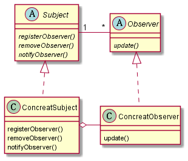

## 观察者模式

> 观察者模式定义了对象之间的一对多依赖，这样一来，当一个对象改变状态时，它的所有依赖者都会收到通知并自动更新。

观察者模式所定义的是基于接口的松耦合涉及，因此在改变观察者或者主题任一方的时候只需要遵循已经订立的接口而不用改动整个框架。

使用观察者模式的时候，可以从被观察者哪里推（push）或者拉（pull）数据，两者的区别其实是前者选择特定的数据送给每位观察者，而后者则是提供数据对象让观察者根据需要进行获取，体现在接口上的不同。
