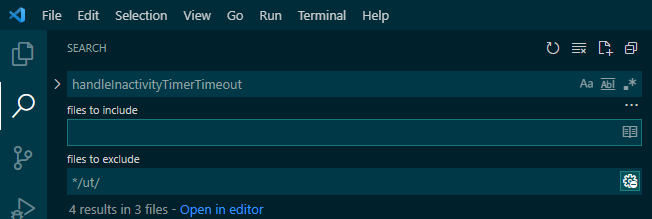

## VSCODE

## 搜索

搜索函数的时候可能将所有文件的匹配项都显示出来，不过有些时候我们需要过滤掉一些搜索路径，这个时候该如何处理？

`ctrl + shift + f`打开侧边的搜索框，点击右侧的“...”展开“Search details”便可以看到指定搜索的路径或者过滤的路径，分别填写即可。比如下面我在“files to exclude”填写的"*/ut/"便是过滤掉所有ut相关的路径：

## 快捷键

代码阅读：

- `ctrl + left`: 定义跳转
- `shift + f12`：搜索reference
- `ctrl + t`：全局符号搜索
- `ctrl + shift + o`: 本文件符号搜索
- `ctrl + p`：搜索文件
- `ctrl + shift + F`: 全局搜索字符串

- `alt + left`：后退
- `alt + right`：前进

参考：

- [Search features in Visual Studio Code](https://dev.to/codevault/search-features-in-visual-studio-code-2a0c)
