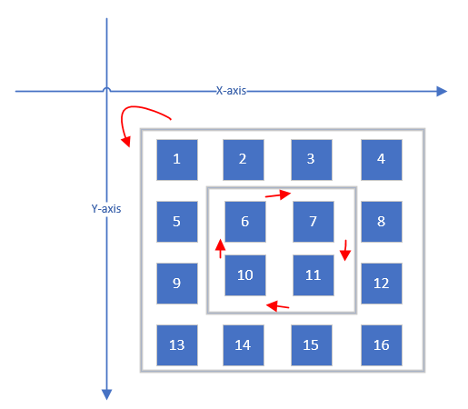

给定一幅由NxN矩阵表示的图像，其中每个像素的大小为4字节，编写一个方法，将图像旋转90度。不占用额外内存空间能否做到？

首先审题竟然发现一时读不懂题目，后来想想，每个像素大小为4个字节无非就是将4个字节的结构作
为矩阵的基本单元。之后在本子上自己画一画发现90度的旋转算法为：

```
x[i][j] -> x[j][N-1-i]
```

测试之后发现并不正确，因为没有考虑所有的元素都需要一步移动到位。原来的思路是每个元素都需
要移动一次，而实际上仅需要移动 N次，每一次移动N个元素。

再次编程测试之后发现这种方式也是错误的，主要体现在两个方面：

- 代码中的数组与我们实际的矩阵展示方式有所不同，在进行旋转的时候极易出错。
- 由于行列相接，在移动的时候实际移动的测试不是N次，而是 N-1 次（仅考虑最外层）。
- 整体的移动不仅仅需要针对最外层，还需要针对其余的 N-1 层。

如下是仅仅针对最外层的移动算法：

```
rotateMatrix(int matrix[][MAX_MATRIX_SIZE], int n)
{
  int first = 0;
	int last = n - 1;

	for (int i = 0; i < last; ++i)
	{
		int offset = i - first;
		// top    = matrix[first][offset];
		// right  = matrix[offset][last];
		// bottom = matrix[last][last-offset];
		// left   = matrix[last-offset][first];

		int left = matrix[last - offset][first];
		// top --> left
		matrix[last - offset][first] = matrix[first][offset];
		// right --> top
		matrix[first][offset] = matrix[offset][last];
		// bottom ---> right
		matrix[offset][last] = matrix[last][last-offset];
		//left -> bottom
		matrix[last][last-offset] = left;
	}
}

```

将矩阵的层级考虑进去，再经过新一轮的调试，可以得到如下算法：

```
for (int layer = 0; layer < n/2; ++layer)
{
	int first = layer;
	int last = n - 1 - layer;

	for (int i = first; i < last; ++i)
	{
		int offset = i - first;
		// top    = matrix[first][i];
		// right  = matrix[i][last];
		// bottom = matrix[last][last-offset];
		// left   = matrix[last-offset][first];

		int left = matrix[last - offset][first];
		// top --> left
		matrix[last - offset][first] = matrix[first][i];
		// right --> top
		matrix[first][i] = matrix[i][last];
		// bottom ---> right
		matrix[i][last] = matrix[last][last-offset];
		//left -> bottom
		matrix[last][last-offset] = left;
	}
}
```

这个过程中最费力的是对各个元素的理解，以及元素的索引。比如，当前整个矩阵左转90度的时候对
于不同行不同列元素的索引是有很大不同的。



依据如上图示，将旋转算法解释如下：

- 旋转针对不同的层级分别进行旋转，设定层级为 `layer = [0, N/2)``。
- 对于每个层级：
  - 定义索引来指示某行/列内要进行旋转的元素，行/列需要操作的元素个数相比该行/列元素总个数
     少1，所以`i = [layer, N-layer-1]`。
  - 定义层级内的相对索引来帮助索引逆序操作的“左列”和“底行”：`offset = i - layer`
- 因此可得：
  - top   行 = matrix[first][i];
  - right 列 = matrix[i][last];
  - bottom行 = matrix[last][last-offset];
  - left  列 = matrix[last-offset][first];

这道题目看起来异常简单，但解题的时候涉及到很多细节，这是不经常玩算法练习精准计算的我最头
痛的，不过花些时间也还是能够将它想清楚。
