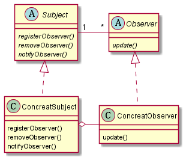
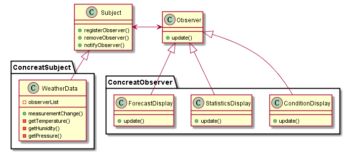

## 观察者模式

> 观察者模式定义了对象之间的一对多依赖，这样一来，当一个对象改变状态时，它的所有依赖者都会收到通知并自动更新。

观察者模式所定义的是基于接口的松耦合设计，因此在改变观察者或者主题任一方的时候只需要遵循已经订立的接口而不用改动整个框架。

使用观察者模式的时候，可以从被观察者哪里推（push）或者拉（pull）数据，两者的区别其实是前者选择特定的数据送给每位观察者，而后者则是提供数据对象让观察者根据需要进行获取，体现在接口上的不同。

## 气象站的需求

建立一个应用，利用`WeatherData`对象取得数据，并更新三个布告板：目前状况、气象统计和天气预报。

最简单的实现便是为三个布告板单独定义类并且创建各自的对象来完成数据的更新，我们称之为耦合版本:

耦合版本针对具体实现进行编程，对于之后的新的需求不甚友好，比如我们需要增加或者删除布告板的时候必须改动`WeatherData`。为此我们可以对“WeatherData对外部的依赖解耦”，将其依赖的`ConditionDisplay`、`StatisticsDisplay`和`ForecastDisplay`抽离出来让`WeatherData`仅仅依赖其三者的抽象类型/接口，这样便不再受之后增删新的布告板的影响。

其实，如上的设计里面可以仅仅让`Subject`单向依赖于`Observer`，只不过这样`Observer`不管是在将自己添加进观察者列表还是从中移除都需要“第三方”来完成。
