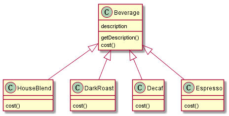
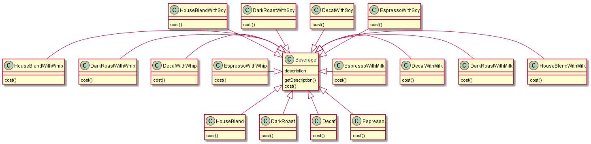
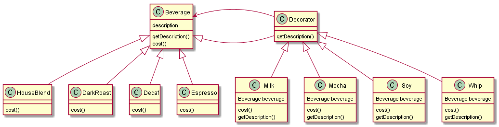

## 装饰者模式

> 装饰者模式动态地将责任附加到对象上。若要扩展功能，装饰者提供了比继承更有弹性的替代方案。

装饰者模式可以说是“组合”方式的一种绝妙应用。我们将装饰者和被装饰者都继承自相同的类，以便装饰者可以在扩充被装饰者行为的同时还能够拥有与被装饰者一样的“类型”。这样就达到了在没有修改原有类的基础之上扩展了它的功能。

## 饮料便利店的收费系统

饮料便利店的收费系统最初的设计如下，即采用单一的继承方式，不同的饮料分别继承`Beverage`并重写计价的方法`cost()`。

这里有四种基础饮料，然而，当需要在这几种饮料之上添加调味料时，这种单一继承的方式将会导致类膨胀的问题，即需要构建非常多的类。

## 以组合的方式应对新的需求

继承的子类的行为会在编译时静态决定，并且不同子类里面继承到的行为都相同。而组合的方式，能够在运行时对类的行为进行动态扩展。

之前提到的有关组合方式的应用是策略模式，它将一些易变动的算法抽离出来支持按需组合，会创建更多的算法类型，不适用于当前问题。因此需要引入一种新的组合方案：装饰者模式。

上图是使用装饰者模式的设计，其中的基础饮料(`HouseBlend`, `DarkRoast`, `Decaf`, `Espresso`)和调料（`Milk`, `Mocha`, `Soy`, `Whip`）都具有公共的抽象类，因此能够非常方便进行组合和替换。

- 要1杯{HouseBlend}
  - 创建`HouseBlend`对象进行处理即可。
- 要1杯{HouseBlend + Milk}
  - 先创建`HouseBlend`对象；
  - 再创建`Milk`对象；
  - 将针对`HouseBlend`对象的引用组合（Wrap）到`Milk`，所有的处理由`Milk`对象进行。
- 要1杯{HouseBlend + Milk + Mocha}
  - 先创建`HouseBlend`对象；
  - 再创建`Milk`对象；
  - 将针对`HouseBlend`对象的引用组合（Wrap）到`Milk`;
  - 再将对`Milk`对象的引用组合（Wrap）到`Mocha`，剩下的事情交由`Mocha` 完成。
