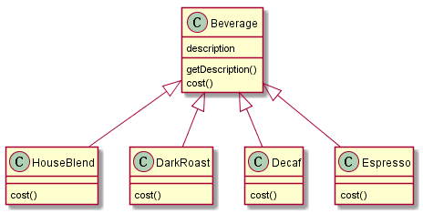
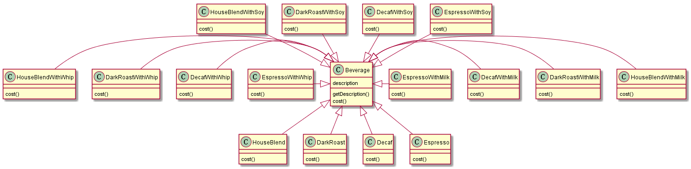
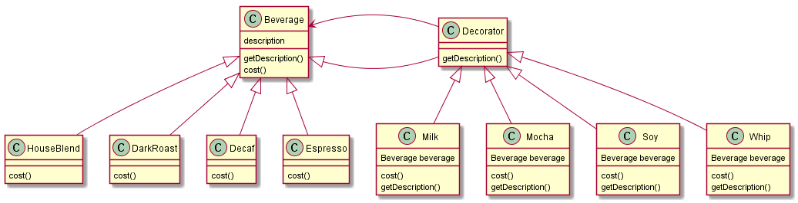

之前曾提到“少用继承，多用组合”，但有些时候组合的方式也无法很好地解决问题。

## 饮料便利店的收费系统

饮料便利店的收费系统最初的设计如下，即采用单一的继承方式，不同的饮料分别继承`Beverage`
并重写计价的方法`cost()`。

这里有四种基础饮料，然而，当需要在这几种饮料之上添加调味料时，这种单一继承的方式将会导致
类膨胀的问题，即需要构建非常多的类。

## 以组合的方式应对新的需求

继承的子类的行为会在编译时静态决定，并且不同子类里面继承到的行为都相同。而组合的方式，能
够在运行时对类的行为进行动态扩展。

之前提到的有关组合方式的应用是策略模式，它将一些易变动的算法抽离出来支持按需组合，会创建
更多的算法类型，不适用于当前问题。因此需要引入一种新的组合方案：装饰者模式。

上图是使用装饰者模式的设计，其中的基础饮料(`HouseBlend`, `DarkRoast`, `Decaf`, `Espresso`)
和调料（`Milk`, `Mocha`, `Soy`, `Whip`）都具有公共的抽象类，因此能够非常方便进行组合和
替换。

- 要1杯{HouseBlend}
  - 创建`HouseBlend`对象进行处理即可。
- 要1杯{HouseBlend + Milk}
  - 先创建`HouseBlend`对象；
  - 再创建`Milk`对象；
  - 将针对`HouseBlend`对象的引用组合（Wrap）到`Milk`，所有的处理由`Milk`对象进行。
- 要1杯{HouseBlend + Milk + Mocha}
  - 先创建`HouseBlend`对象；
  - 再创建`Milk`对象；
  - 将针对`HouseBlend`对象的引用组合（Wrap）到`Milk`;
  - 再将对`Milk`对象的引用组合（Wrap）到`Mocha`，剩下的事情交由`Mocha` 完成。
