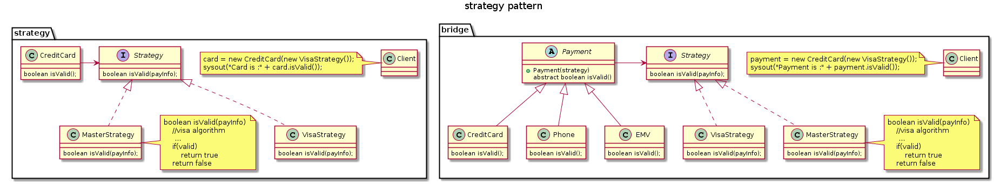

## 桥接模式

将抽象与其实现分离开来，以便每个抽象都可以变化。

桥接模式和策略模式的类图类似，不同在于策略模式

##

- [What is the difference between the bridge pattern and the strategy pattern?](https://stackoverflow.com/questions/464524/what-is-the-difference-between-the-bridge-pattern-and-the-strategy-pattern)
- [Strategy vs. Bridge Patterns](https://stackoverflow.com/questions/5863530/strategy-vs-bridge-patterns/29545680)
