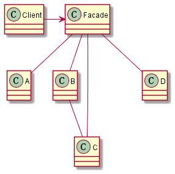

## 外观模式

> 外观模式提供了一个统一的接口，用来访问子系统中的一群接口。外观定义了一个高层接口，让子系统更容易使用。

和适配器模式类似，外观模式也是一种改变接口的模式，只不过它的作用是为了简化接口，而不是像适配器那样适配接口。

外观模式理解起来，其实就是在你需要操作较多的类的时候，专门创建对应的FACADE类用来提供统一的、更便捷的操作接口。使用这些接口来抽象更为常用的功能，然后FACADE里面通过调用哪些众多的类来实现每种功能，大大节省了客户亲自调用众多功能花费的时间和精力。简单理解，它就是一种协议栈里面的分层设计。

## 类图

## 要点

1）外观模式在提供简化的接口的同时，依然需要将系统完整的功能暴露出来（子系统）供需要的客户使用。

2）适配器模式将一个或多个类接口变成客户期望的一个接口。外观模式也可以对一个或多个类接口提供简化的接口。它们之间的主要区别在于它们的意图：

- 适配器模式的意图是“改变”接口来符合客户的期望。
- 外观模式的意图是提供子系统的一个简化接口。
