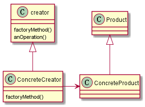

## 工厂方法模式

> 工厂方法模式定义了一个创建对象的接口，但由子类决定要实例化的类是哪一个。工厂方法让类把实例化推迟到子类。

类图如下：

工厂方法模式相当于运用多态特性将简单工厂升级为可以支持多种场合的“复杂工厂”，原来对象的创建仅仅在一个类里面完成，而现在隶属于相同继承体系的多个类里面完成，而创建对象的部分则变换为一个存放在父类的方法，由不同子类进行实现，所以说是工厂“方法”模式。
