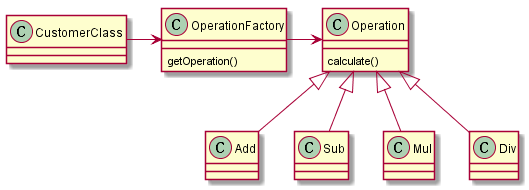

## 简单工厂

从一个简单的例子开始，编写支持加减乘除四项运算的程序。通常我们依照 C语言中的方式会按照如下方式编写代码（具体参考`calculator_c_version`）。

```
std::cout <<"Input number A: " <<std::endl;
std::cin >>numberA;
std::cout <<"Input operator: (only support +-*/)" <<std::endl;
std::cin >>opera;
std::cout <<"Input number B: " <<std::endl;
std::cin >>numberB;

double result = 0.0;

switch (opera)
{
  case '+':
  {
    result = numberA + numberB;
    break;
  }
  case '-':
  {
    result = numberA - numberB;
    break;
  }
  case '*':
  {
    result = numberA * numberB;
    break;
  }
  case '/':
  {
    static const double EPSINON = 0.00001f;
    if (fabs(numberB) < 1e6)
    {
      std::cout <<"The divisor can't be zero." <<std::endl;
    }
    else
    {
      result = numberA / numberB;
    }
    break;
  }
  default:
  {
    std::cout <<"Invalid operator:" <<opera <<std::endl;
    break;
  }
}

std::cout <<numberA <<opera <<numberB <<" = " <<result <<std::endl;
```

## 分隔业务

将如上代码当中的“计算部分”和“显示部分”分隔开来，在面向过程的C语言中我们可以提取函数，使用面向对象我们此时需要使用类来进行组织。所以我提取了一个类：

```
class Operation
{
public:

  static double calculate(double numberA, char opera, double numberB)
  {
    double result = 0.0;

    switch (opera)
    {
      case '+':
      {
        result = numberA + numberB;
        break;
      }
      case '-':
      {
        result = numberA - numberB;
        break;
      }
      case '*':
      {
        result = numberA * numberB;
        break;
      }
      case '/':
      {
        static const double EPSINON = 0.00001f;
        if (fabs(numberB) < 1e6)
        {
          std::cout <<"The divisor can't be zero." <<std::endl;
        }
        else
        {
          result = numberA / numberB;
        }
        break;
      }
      default:
      {
        std::cout <<"Invalid operator:" <<opera <<std::endl;
        break;
      }
    }
    return result;
  }
};
```

然而，这个版本将对应的运算逻辑封装到类中，在代码层面上变得更加清晰。然而，它在应对之后的需求变更（比如说支持其他种类的运算）的时候需要针对“Operation”进行修改。换句话说当前的解耦粒度不够细，为了将“需求变更”引起的修改限制在合理的范围，我们可以再进一步。

## 进一步解耦

如下将“Operation”细分，即为每一种运算单独提取出来。对比之前代码量多了不少，这也是我最初比较反感随便应用设计模式的原因之一。但想通其好处之后便知道认识上的不足了。

```
class Operation
{
public:
  Operation(){}
  ~Operation(){}

  virtual double calculate() { return 0.0; }
  double getNumberA() { return numberA; }
  double getNumberB() { return numberB; }

  double setNumberA(double f) { numberA = f; }
  double setNumberB(double f) { numberB = f; }

protected:
  double numberA;
  double numberB;
};

class Add : public Operation
{
public:
  double calculate()
  {
    return (numberA + numberB);
  }
};

class Sub : public Operation
{
public:
  double calculate()
  {
    return (numberA - numberB);
  }
};

class Mul : public Operation
{
public:
  double calculate()
  {
    return (numberA * numberB);
  }
};

class Div : public Operation
{
public:
  double calculate()
  {
    static const double EPSINON = 0.00001f;
    if (fabs(numberB) < 1e6)
    {
      std::cout <<"The divisor can't be zero." <<std::endl;
      return 0.0;
    }
    else
    {
      return (numberA / numberB);
    }
  }
};

class OperationFactory
{
public:

  static Operation* getOperation(char opera)
  {
    Operation *opertion = NULL;

    switch (opera)
    {
      case '+':
      {
        opertion = new Add();
        break;
      }
      case '-':
      {
        opertion = new Sub();
        break;
      }
      case '*':
      {
        opertion = new Mul();
        break;
      }
      case '/':
      {
        opertion = new Div();
        break;
      }
      default:
      {
        std::cout <<"Invalid operator:" <<opera <<std::endl;
        break;
      }
    }

    return opertion;
  }
};
```

这就是简单工厂的实现方式。从上面这种实现可以看出，简单工厂有些像是一种将变化较大的部分封装起来的不错的编程习惯。

类图如下：


