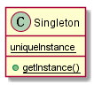

## 单件模式

单间模式确保程序中一个类最多只有一个实例，并且提供该实例的全局点。

### 类图



### 实现

```
public class Singleton{
  private static Singleton uniqueInstance;
  private Singleton(){}

public static Singleton getInstance() {
    if (uniqueInstance == nullptr) {
      uniqueInstance = new Singleton();
    }
    return uniqueInstance;
  }
}
```

### 要点

应用单线程模式的时候需要特别考虑多线程环境，因为这可能导致创建出多个实例，从而破坏了最初想要达到的目标。有两个方法可以用来避免这种情况。

1）将`getInstance()`变更为同步方法

该种方法在Java里面按照如下进行，C++中不确定是否支持该特性。该种方法因为每次调用`getInstance()`的时候均会进行同步的处理，所以对性能的影响最大。

```
public static synchronized Singleton getInstance() {
  ...
}
```

2）用“急切实例创建”替代“延迟实例创建”

也就是在初始化类静态成员的时候直接创建，这样也能够保证之后多线程的时候仅拥有一个实例。

```
static Singleton uniqueInstance = new Singleton();

public:
  public staTIC Singleton getInstance() {  
    return uniqueInstance;
  }
```

3) 双重加锁

```
private volatile static Singleton uniqueInstance;

public static Singleton getInstance() {
  if (uniqueInstance == null) {
    synchronized (Singleton.class) {
      if (uniqueInstance == null) {
        uniqueInstance = new Singleton();
      }
    }
  }
    return uniqueInstance;
  }
```

上面的特性大部分是Java里面才有的，所以都使用了Java实例。在其他编程语言里面需要变通，不过Singleton在多线程模式下如何保证线程安全是需要留意的。
