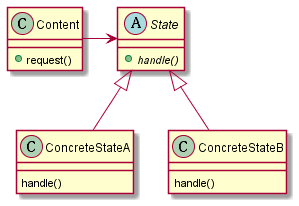

## 状态模式

> 状态模式允许对象在内部状态改变时改变它的行为，对象看起来好像修改了它的类。

状态模式将状态封装成独立的类，并将动作委托到代表当前状态的对象，如此行为就会随着内部状态的改变而变化。从客户的角度看，使用的对象能够完全改变它的行为，那么这个对象看起来就像是从别的类实例化而来的。

## 类图

## 实现

## 要点

1）状态模式和策略模式的类图是相同的，不过“意图”不同。

2）状态模式是通过在context内改变状态来改变context的行为，策略模式是通过组合不同的对象来改变行为。
